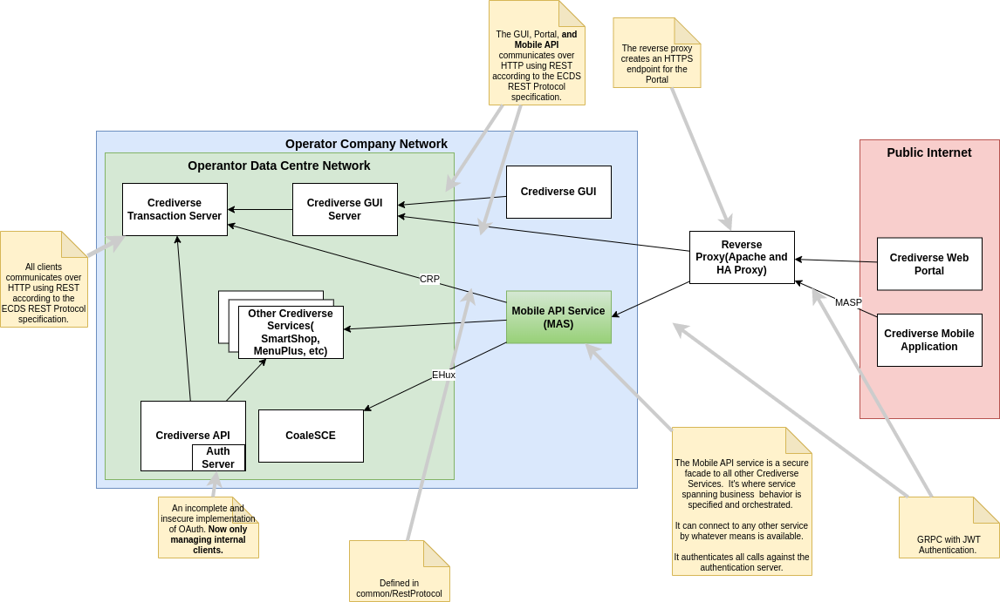

#  Crediverse Mobile Architecture Document

## Architecture

### Architectural Context

## Component Architecture 

--- 
## Context
A secure mobile application developed in Kotlin enabling agents registered on Crediverse as mobile agents to sell airtime and bundles to subscribers.

--- 
## Components

### Crediverse 
Credit distribution and sales service.  

Addressed through REST

#### Responsible For 
 - agent authentication and authorization
 - supply agent user information
 - supply agent financial information
 - supply transaction information
 - affect the sale of airtime
 - affect the sale of bundles 

### CoaleSCE
Service creation environment

Address through eHUX

#### Used For 
 - supply bundle information
 
### Crediverse Mobile App 
Mobile android application developed in Kotlin and deployed to agent mobile phones.

Agents will install it themselves from the Google App store.

It will access the Mobile API service over the public internet on a predefined
publicly accessible URL through HTTPS.

### Mobile API Service 
Orchestration service for the Crediverse Mobile App. 

Communicates with Crediverse Mobile App using GRPC over HTTPS

Communicates with CoaleSCE over eHUX

Communicates with Crediverse via the Crediverse RestProtocol over HTTP

#### API methods
- Authenticate
- getAccountInfo
- getTransactions
- getBundles
- sellAirtime
- sellBundle 

---
## Interfaces 

### Crediverse Rest Inteface
#### Used by: 
Mobile API Service

#### Used for: 
- Authentication 
- Authorization
- Getting agent information
- Getting agent balances 
- Getting agent transactions
- Selling airtime
- Selling bundles 

### CoaleSCE eHUX Interface
#### Used by: 
Mobile API Service

#### Used for:
- Getting bundles information

### Mobile API Service Interface
#### Used by:
Crediverse Mobile Application

#### Used for:
- allowing agents to log in to Crediverse
- retrieving agent information 
- retrieving agent balances 
- retrieving agent transactions 
- retrieving bundles to sell 
- allowing agents to sell airtime 
- allowing agents to sell bundles 

