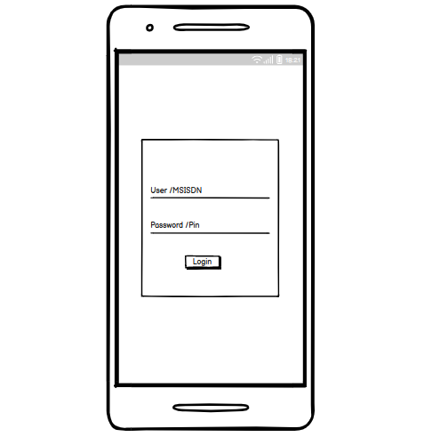
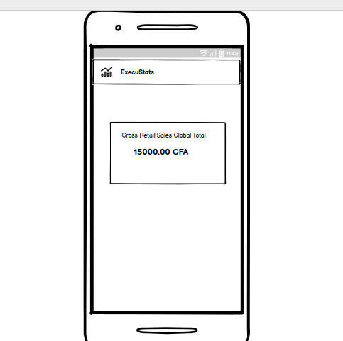

# ExecuStats SmartApp MVP

## Overview

The ExecuStats project aims to deliver executive-level statistics to the operator's C-level management and other authorized parties.
For the first iteration, the only statistic to be shown is the total sales amount for the day, calculated by summing up the gross retail value for all successful **Sell**, **Self Top-Up** and **Non-airtime Debit** transactions for the day.

### Web User vs Agent User

Crediverse has multiple types of users, namely **Web User**, **Agents**, **Agent Users** and **C4U Users**.  
Agents operate within the context of their own account, Agent Users operate within the context of the Agent they belong to, while Web Users operate within the context of the entire system, not limited to a particular agent.  
Authenticating Agents is done via MSISDN and PIN, while authenticating a Web Users is done via username and password. Both types of users require OTP for added security.  


## Web User Authentication

Current implementation of MAS supports authentication for **Agents**, via **MSISDN** and **PIN**, but it doesn't support authentication for **Web Users**, via **username** and **password**. Changes are required to add support for Web User autihentication.

### MAS API Changes

A new enumerated field shall be introduced in the **login**'s API method **LoginRequest** parameter, named **userType**, with two possible values: **AGENT** and **WEBUSER**.
When **AGENT** is being authenticated, the MSISDN and PIN shall be supplied in the request (this is an existing functionality), while when **WEBUSER** is being authenticated, the username and password shall be supplied in the request.
The **LoginRequest** structure already has a username and password fields included, but they are unused at present.  


### MAS Changes

Enhance the **login** implementation, using the **Crediverse TS** as the authentication service, to handle **WEBUSER** login in addition to **AGENT** login requests.

## Dashboard Stats

### GUI Changes

The first screenshot shows a mockup of how the login screen shall change. The input fields shall be adjusted to accommodate **username** and **password** in addition to **MSISDN** and **PIN**.  
The second screenshot shows a mockup of how the sales summary shall be displayed on the page after successful login.




### MAS API Changes

Implement a new **getGlobalSalesSummary** API call.  
The call shall not take any parameters.  
The call shall return a single value containing the total gross retail sales value, as calculated.  


### MAS Implementation

Implemnt the **getGlobalSalesSummary** by querying the OLTP query slave database.  

The query to fetch the data is as follows:  

```
SELECT 
    COUNT(*) transaction_count, 
    SUM(T1.amount) total_amount, 
    SUM(T1.gross_sales_amount) total_sales_amount
FROM ec_transact T1
LEFT JOIN ec_transact T2 ON (
        T2.reversed_id  T1.id
    AND T2.type  'NR'
    AND T2.ret_code  'SUCCESS')
WHERE T1.ended > '2023-06-01 00:00:00'
  AND T1.type IN ('SL', 'ST', 'ND')
  AND T1.ret_code  'SUCCESS'
  AND T2.id IS NULL
```

The date in the query must be replaced by today's date, zero hour.  

The value of the `total_sales_amount` field is the total gross retail sales amount, to be sent back to the caller.  

