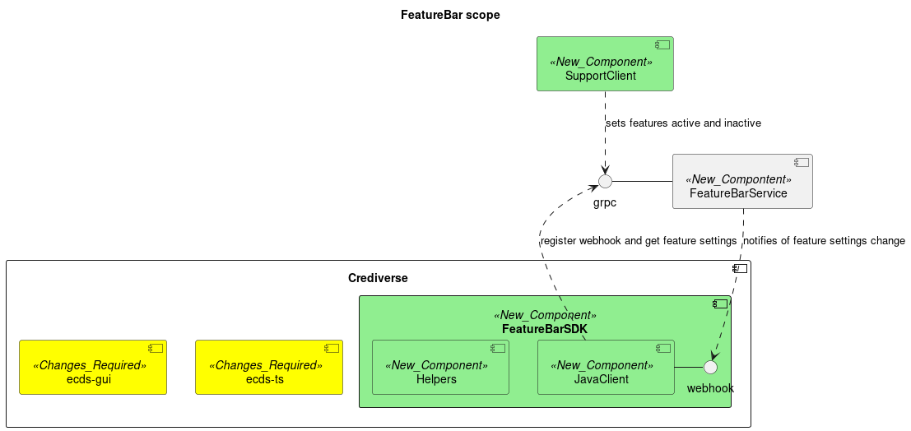

# Feature Bar Progress
The Concurrent Feature Bar is from where we configure our applications to make
features available to our customers based on which features they have bought. 

[Support Operating Instructions](support-operating-instructions.md)

## Current state  
The feature bar client's `isFeautureAvailable` method works and can be used as per the unit tests.  

Populating the feature database is still managed by updating etcd manually. 

There is currently no security mechanisms implemented. 

## Dev Process
To run the unit tests it is required that the server docker image is started
and that it's populated with some data required by the tests.

### Start the etcd server
starting from the crediverse base directory: 
```
cd commom/featureBar/server
docker-compose up
```
this will run the ecds server on the local machine in a docker containter.

### Populating the etcd server with test data
run the following commands in the featureBar root directory, where the `tls` subdirectory is.

```
etcdctl --key=./tls/client.key --cert=./tls/client.crt --cacert=./tls/concurrent_ca.crt put crediverse.show_the_app true
etcdctl --key=./tls/client.key --cert=./tls/client.crt --cacert=./tls/concurrent_ca.crt put crediverse.do_not_show_the_app false
etcdctl --key=./tls/client.key --cert=./tls/client.crt --cacert=./tls/concurrent_ca.crt put crediverse.yes_is_not_true yes
```

### Building the FeatureBar Client
starting from the crediverse base directory: 

```
cd common/featureBar
./gradlew build
``` 


### Next steps
- [ ] Create client for support. Or furnish them with instructions to use etcdcontrol.


# Feature Bar Description 

## Feature Bar Clients

Right now the need for the service is felt most in terms of new *Crediverse*
functionality that should not be available at all customer sites. The
Crediverse GUI and the Crediverse TS will be the first clients of the
Feature Bar service. 

## Use cases

### Development adds a new feature to be controlled

#### Context

A developer created a new feature to be controlled via the Feature Bar.  

#### Description

- The developer needs to include the Feature Bar artefacts (Feature Bar Client
  and helper functions) for the platform he is working on in his build
  environment. 
- The developer needs to use the Feature Bar artefacts 
	- to create a feature guard around the entry point , and other
	  implementation sites (as per the feature use case),  of the protected
	  feature 
	- to name the protected feature. 
- The developer needs to register the name of the new feature with the feature
  bar so that it will be available in all new deployments. 


### A Concurrent Service requests whether to serve a feature 

#### Context 

A client of the Feature Bar Service will encounter feature guards around
certain code blocks, it would need to lookup the feature name to determine
whether or not to run the code.  

#### Description
- If a Feature Bar client encounters a feature guard it will make a **is
  feature available** call to it's Feature Bar client component. 
- The Feature Bar client will get the features available from the Feature Bar
  Service at startup, cache them, and register to get updates. If a feature is
  changed on the Feature Bar service it will notify registered clients of the
  change. 


## Scope


## Realization

### Technology choices

#### DB 

[ectd](https://etcd.io/)

#### Security

The relationship between Clients and the Feature Bar Service should be managed through TLS. 

See the [README](./tls/README.md) for how to create the files required for a TLS relationship between a client and a server.

### Artefacts

#### Feature Bar Service

An [etcd](https://etcd.io) server instance. 

The Feature Bar Service is a [etcd](https://etcd.io) instance. It's deployed in a docker container. 

#### Feature Bar clients 

Feature Bar cliens are created to access the Feature Bar [etcd](https://etcd.io) instance from different platforms.

##### Java Client

The Java Client is for Crediverse to access the Feature Bar feature rendering.
It will manage the relationship with the Feature Bar [etcd](https://etcd.io)
instance so that Crediverse components will only have to configure it once at
startup and have access to the current state of the Feature Bar server after
that.  

The usage of the JavaClient is shown in it's unit tests. 

The Java Client should also contain a helper library to create feature guards
with the minimum of fuss.


##### Support Client

The Support client is to be used by the Concurrent Support team to switch features on at customer sites.

