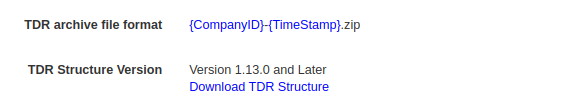
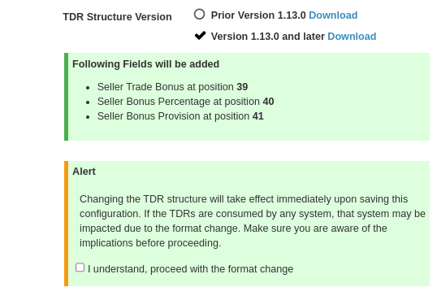

# Adopt new TDR Structure 
## 1. Introduction
This document describe the changes required in ecds-gui and ecds-ts to adopt new format/structure in TDRs.
By default old structure will be applied, new structure will only be applied when explicitly configured by the admin.

## 2. GUI Changes
### 2.1 TDR Format Configuration
In ecds-gui under Configurations/Transaction a new option in the configuration will be added so that admin can select the desired TDR format and download the corresponding TDR structure for the selected format in CSV format. There are two new configuration options added. 

#### 2.1.1 Latest TDR Format
The option is added, so that admin can download the TDR and inspect the new field added and their position within the structure

Figure 1: Download TDR Structure

#### 2.1.2 TDR Structure Version
As shown in Figure 1, there is option to show the structure version, TDR Structure Version is derived from the version of the Crediverse, e.g Version 1.13.0.

### 2.2 Edit Transaction Configuration Screen
A new field `TDR Structure Version` is added, admin can set the value to the Prior Version 1.13.0 or Version 1.13.0 and later.

Figure 2: Enable Latest TDR Structure Version

When `Version 1.13.0 and later` is selected, then a message will be dipslayed, explaining the version and position of the new field added, as shown in Figure 2.
If admin select `Prior Version 1.13.0` then TDRs will be written without new fields that were introduced in Crediverse 1.13.0. 
There is another `Alert` box where the information is displayed about the impact of the change as in Figure 2. User have to check the checkbox `I understand, proceed with the format change` and then upon pressing save c TDRs will be written immidiatly in latest structure version i.e `Version 1.13.0 and later`. If user doesn't check the checkbox and `Version 1.13.0 and later` is selected, then a message will be displayed to user saying `Confirm TDRs Structure Change`. 

### 2.2 ECDS-TS Changes
There will be changes in the backend to handle the configuration changes for the TDRs. 
If admin chooses the option to use the latest Structure version of TDRs, then file rotation will occur - file rotation to save the older TDRs in the different file and newer ones in the new file.
And if admin chooses the option to use the older version of TDRs, then again file rotation will occur and new TDRs will be written in older format.