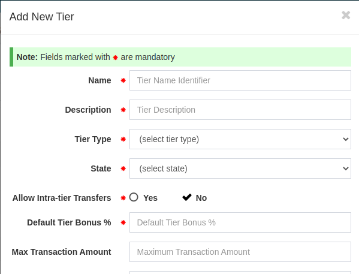
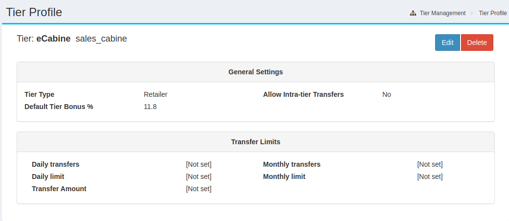
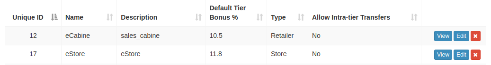

# Add Default Tier Bonus Percentage
## 1. Introduction
The purpose of this document is to detail the necessary modifications that need to be made to the Crediverse GUI and backend to add default tier bonus percentage.

## 2. GUI Changes
### 1. Add new Tier
While adding a new Tier, a new field is introduced where user can enter Default Tier Bonus Percentage. The field is mandatory and user can add a percentage value inside this field. See Figure 1

Figure 1: Add new Tier

### 2. Update new Tier
While updating the existing tier, user will be able to edit Default Tier Bonus Percentage and field will look like the same as in Figure 1.
There is a slight problem, as the existing tiers can have the empty Default Tier Bonus Percentage but if they will try to save the tier, the system will not allow them to save empty Default Tier Bonus Percentage, so they need to add the value to be able to save the tier.

### 3. View Tier
In the Tier View, the new field is added where user can see the Default Tier Bonus Percentage as in Figure 2

Figure 2: View Tier

### 4. Tiers List
Inside the tiers list, the new field is added as in Figure 3

Figure 2: Tiers List

