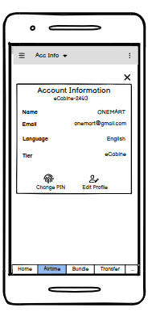
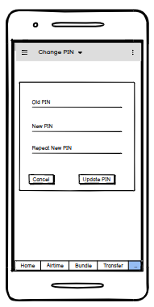

# Update Agent Profile via the SmartApp
## 1. Introduction
The purpose of this document is to detail the necessary modifications that need to be made to the SmartApp and MAS in order to update an agent's profile.

## 2. SmartApp Changes
### 2.1 Update Profile
The SmartApp already displays the agent account information through a popup. Two new icons have been added to the bottom of this popup - one for editing the profile and the other for changing the pin. This can be seen in Figure 1.

Figure 1: Agent Account Information

After the user clicks on the "Update Profile" button or its associated icon, a new screen will appear that contains editable fields for the account information. As shown in Figure 2

Figure 2: Edit Agent's Profile

The user has the option to either modify any field and update their profile or cancel gracefully without making any changes. Upon saving the changes, the account information popup will be displayed.

### 2.2 Change PIN

After the user clicks on the "Change PIN" button or its associated icon, a new screen will appear that includes fields to input the old pin and two fields for adding and confirming the new pin. This is demonstrated in Figure 3

Figure 3: Change PIN 

The user has the option to either modify pin or cancel gracefully without making any changes. Upon saving the changes, the account information popup will be displayed.

## 3. MAS changes
### 3.1 Update agent profile

### 3.2 Change PIN
SmartApp will use the `changePin` rpc that is defined in the proto file. It requires only one parameter i.e. `newPin`. The response will contain a response code and a response message. The response code can either be "SUCCESS" or any other error code in case the pin change fails. The response message will contain a description of the error message.
To change the pin, the `/ecds/transactions/change_pin` endpoint on Crediverse is used. 
