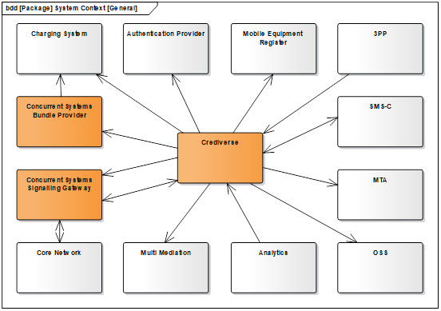
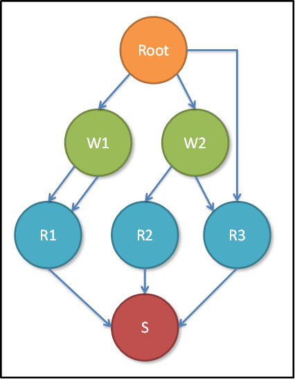
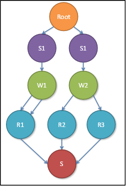
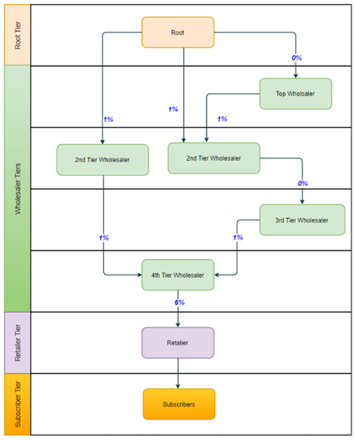

Electronic Credit Distribution System (ECDS) :document-subtitle: Product
Description :header-title: Crediverse: Electronic Credit Distribution
System (ECDS) + \\ :document-date: 2019-06-12 :toclevels: 3 Concurrent
Systems Revision 1.2, 2019-06-12

/|1.2

Related Documents
=================

<table>
<colgroup>
<col style="width: 66%" />
<col style="width: 33%" />
</colgroup>
<thead>
<tr class="header">
<th>Document name</th>
<th>Author</th>
</tr>
</thead>
<tbody>
<tr class="odd">
<td>
ecds-web-application-user-guide (V1.3)
</td>
<td>
Concurrent Systems
</td>
</tr>
<tr class="even">
<td>
Hardware Requirements 3.1
</td>
<td>
Concurrent Systems
</td>
</tr>
</tbody>
</table>

Scope
=====

Identification
--------------

This document contains the **Product Description (PD)** for the
**Concurrent Systems’ Crediverse Electronic Credit Distribution System**
(hereafter referred to as “Crediverse”).

Executive Summary
-----------------

Crediverse is a complete airtime credit distribution and sales system
for Mobile Network Operators (MNOs) that allows them to optimize the
distribution of airtime credit seamlessly across their hierarchical
network of agent resellers. This highly reliable, secure and performant
product enables operators to monitor and manage all aspects of their
credit distribution network so as to efficiently distribute airtime and
sell bundles, whilst reducing operational cost. Crediverse provides
operators the ability to increase revenue and grow market share with a
very low capital expenditure and cost of ownership.

### Reduction in Operational Costs

#### Reduction of Scratch Card Design and Printing Costs

The cost of designing and printing expensive paper based scratch cards
will be reduced with the deployment of a voucherless system, as scratch
cards are quickly phased out as the market adjusts to the concept of
voucherless recharge.

#### Reduction of Logistics, Transportation, Storage and Inventory Management Costs

The related cost of logistics, transportation, storage and inventory
management will also reduce as scratch cards fall away.

#### Reduction of Security Costs

Security costs are reduced, as security measures around production of
scratch cards, and keeping them secure from theft or fraud once
produced, are no longer relevant.

#### Reduction of Terminal Management Costs

In the case of electronic voucher distribution (EVD) the number of point
of sale (POS) terminals will diminish with the introduction of
Crediverse, as agents now use their mobile phones to sell airtime credit
and promotional bundles. This translates into a reduction in terminal
management and maintenance costs.

### Reduction in Capex Spend

#### Reduction of Capex Spend for POS Terminals and Integration

As Crediverse negates the need for POS devices there will be a reduction
in terms of capex spend related to the purchase of new kiosks,POS
terminals.

### Revenue Gain and Improved Market Share

#### Increase Revenue by Agents Selling Promotional Bundles Directly to Subscribers

Crediverse is fully integrated with Concurrent Systems’ Promotion
Creation Centre (PCC) and enables agents in the field to market and sell
promotional bundles directly to end subscribers. Operators have more
flexibility and control in terms of their marketing strategy and can
drive up sales of certain promotions by incentivizing agents on the
ground to promote specific bundles. By giving agents the ability to sell
bundles directly to subscribers this overcomes any sales impediment as a
result of subscriber illiteracy, or ignorance with regards to the
available bundle offerings.

#### Increase Revenue & Market Share by Targeting New Subscribers

Operators can target new subscribers in untapped or remote areas that
were previously impractical or unfeasible to reach from a transportation
or logistical cost perspective. This expands the operator’s subscriber
base, thus increasing airtime revenues and improving market share.

#### Increase ARPU with Flexible Denominations of Airtime Credit

With Crediverse being voucherless, subscribers are not constrained by
predetermined voucher amounts. Any denomination of airtime can be sold
according to the subscriber’s cash-on-hand at the time of sale. This
ensures that funds earmarked for communication are not squandered
elsewhere if the subscriber does not happen to have enough funds on him
to buy an airtime voucher at a predetermined amount. Also agents usually
tend to keep smaller denominations of scratch cards on-hand for fear of
being stolen. With Crediverse both these factors are no longer a concern
and subscribers can access any amount of airtime they desire, thus
increasing ARPU.

#### Increase Revenue by Growing the Size of Agent Distribution Network

In Africa access to power can pose a challenge and often limits the
number of terminals in use, which means fewer agents. ith Crediverse all
a potential agent needs to start earning money is access to a cell phone
and funds to buy airtime Crediverse creates new jobs, increasing the
size of the agent distribution base. More operator agents in the field
equates to increased sales.  

#### Increase Revenue by High Availability of Airtime Credit

With electronic pinless/voucherless airtime distribution, the transfer
of airtime to wholesalers and retailers via Crediverse happens in an
instant and airtime credit is accessible 24 hours a day. Agents are thus
assured that they will never run out of stock, as is possible with
scratch cards. Furthermore they don’t need to be constrained by using
POS terminals in locations that may only be open during certain business
hours. Another factor to consider is that agents face a significant risk
of theft when carrying large amounts of scratch card vouchers. With
Crediverse being totally virtual this risk is no longer relevant.
Guaranteed availability and 24/7 access of airtime credit means
increased revenues.

#### Increase Revenue by Using Near Real-time Data to Boost Promotional Campaigns

Unlike the scratch cards that have no automated mechanism for monitoring
airtime sales, Crediverse includes Business Activity Monitoring (BAM)
which is essentially a dashboard with visual representations of key
performance indicators. This allows the marketing team to fine-tune
promotional campaigns on-the-fly and incentivize agents using near
real-time sales data to improve uptake.

#### Increase Market Share through improved Recharge User Experience

Crediverse affords subscribers the convenience to top-up their accounts
with any amount of credit, at any time, through a recognized
distribution network of agents who are conveniently located. This
convenience in conjunction with fewer subscriber transaction steps
improves overall user experience and drives customer loyalty, which in
turn secures the operator’s market share.

System Context
--------------

### Integration with External Systems

Crediverse interfaces with various external systems to realize its
functionality as depicted in
[figure\_title](#figure-external_system_integration):

This diagram illustrates how Crediverse integrates with the following
external systems:

1.  **Bundle Provider**

    This network element is realized by the Concurrent Systems’ PCC
    product and provides a means of selling composite bundles of
    benefits instead of airtime only.

2.  **Signalling Gateway**

    This network element is realized by Concurrent Systems’ SGW product
    and provides a means for Crediverse to communicate with the core
    network for the purpose of sending and receiving of USSD and
    performing MAP queries.

3.  **Core Network**

    The Core Network represents a group of network operator furnished
    network elements which implements and gives access to USSD and MAP
    interrogation.

4.  **Multi Mediation**

    Multi Mediation is responsible for the re-distribution of file
    artefacts generated by Crediverse, including Transaction Logs, Audit
    Logs, Account Dumps, Technical Logs and Backups.

5.  **Analytics**

    Crediverse provides an interface for the interrogation of its OLAP
    database for the purpose of performing advanced BI and Analytics by
    the Operator

6.  **OSS**

    Crediverse uses SNMP to convey its status and alarms to up to 4 NMS
    / OSS.

7.  **MTA**

    Crediverse can be configured to send management reports periodically
    to one or more e-mail recipients using SMTP protocol towards one or
    more MTAs.

8.  **SMS-C**

    SMPP protocol to/from one or more SMS-Cs is used to send
    notifications and alerts to agents and subscribers (MT) as well as
    to receive commands from Agents (MO).

    The Concurrent Systems SGW can also be used as an SMS-C.

9.  **3PP**

    Crediverse exposes a comprehensive secure interface which can be
    used by 3PPs to interact with Crediverse to manage master data and
    perform transactions.

10. **Mobile Equipment Register**

    A mobile Equipment Register is interrogated by Crediverse to obtain
    IMEI numbers for Agents for security purposes.

11. **Authentication Provider**

    Crediverse interfaces to an external authentication server to
    authenticate its Users and optionally Agents as part of its login
    process.

12. **Charging System**

    Crediverse interacts with the operator’s Online Charging System for
    the purpose of provisioning subscribers with the airtime they bought
    or the bundles they bought via the bundle provider.

    Crediverse also interacts with the Online Charging System (OCS) for
    the purpose of acquiring a subscriber’s preferred language and for
    the reversal of erroneous sales.

### Example: Integration with Ericsson ecosystem

The following network elements and protocols are used when Crediverse is
deployed into an Ericsson ecosystem:

1.  **Core Network**

    Crediverse converses with the Ericsson core network via SS7.

2.  **Multi Mediation**

    Crediverse sends Transaction Logs (TDRs), Audit Logs, Account Dumps,
    Technical Logs and Backups to external mediation servers using SFTP
    protocol.

3.  **Analytics**

    Crediverse provides an interface for the interrogation of its OLAP
    database for the purpose of performing advanced BI and Analytics by
    the Operator

4.  **Mobile Equipment Register**

    CAI and other protocols are used by Crediverse towards the the
    Mobile Equipment Register to retrieve IMEI numbers from Agents for
    security purposes.

5.  **Online Charging Systems (OCS)**

    Towards Ericsson OCS, Crediverse uses the following API functions:

    -   ***Refill*** is used to provision Subscribers with the Airtime
        or Bundles they bought.

    -   ***GetAccountDetails*** calls are used to ascertain the language
        preference of Subscribers.

    -   ***UpdateBalanceAndDate*** calls are used to reverse erroneous
        sales.

Theory of Operation
===================

Overview
--------

Suitably authorized Web Users (operatorPersonnel) create and manage all
aspects of the Agent network, including Agent Master Data, Agent
segmentation (Types, Tiers, Groups, Service Classes) and Agent
permissions.

Designated and duly authorized personnel then replenish the balance of
available credit to be distributed and sold through the network.

Wholesaler Agents sell credit to other wholesalers and retailers using
credit transfer transactions via USSD, SMS, Smart Phones or an Agent Web
Portal, subject to business rules defined by the operator.

Retailer Agents sell Airtime or Bundles using USSD, SMS or Smart Phone
to subscribers or to themselves (Self-Topup).

Operator personnel monitor the operation via OSS, Reports and OLAP
exports and adjust the business rules and parameters to optimize revenue
as required.

Distribution Network
--------------------

In Crediverse, a distribution network with its associated rules is
defined to govern the flow of credit from a single Root to the point
where it reaches individual Subscribers.

The Crediverse can be understood in terms of a directed graph as
depicted in [figure\_title](#figure-distribution_network):

In this graph:

1.  Vertices represent the various Tiers through which credit flows
    before it reaches Subscribers.

2.  Directional arrows represent the actual flow of credit as governed
    by Transfer Rules.

    The topmost Tier is referred to as the Root Tier. When credit is
    replenished by the Operator, it is placed in a single Root Account
    within this Tier.

    Credit is then transferred (sold) Agents belonging to other tiers
    subject to Transfer Rules.

    In the final instance, Agents belonging to a Retailer Tier, sell
    credit or bundles to subscribers who all implicitly belong the
    Subscriber Tier.

> **Note**
>
> 1.  Crediverse allows agents belonging to the same Tier to transfer
>     credit (intra-tier) freely to each other.
>
> 2.  The distribution network is directed, but doesn’t have to be
>     strictly hierarchical. For instance, in the diagram above, the
>     Root Tier is able to transfer to a Wholesaler Tier (W2) or bypass
>     the Wholesaler Tier and transfer from Root to Retailer Tier (R3).
>
> 3.  It is possible to define more than one Transfer Rule between Tiers
>     which will apply under different circumstances.
>
Transactions
------------

The following transactions are facilitated by Crediverse:

### Replenish

This is the action causing new credit to be created in the root tier for
ultimate distribution via the agent network to subscribers. Replenish
transactions can only be performed by duly authorized Web Users
(operator employees) using the Web User Interface (WUI).

The amount to be added to the Root account for distribution and sales is
specified, together with the amount required to pay Agent trade bonuses
and incentives.

> **Note**
>
> For security, this transaction will require co-authorization form
> another duly authorized Web User before it is committed.

### Transfer

Credit transfers allow the operator to move credit from the root account
to other in-house accounts or to wholesaler Agents using the Web User
Interface. For security, this transaction will require co-authorization
form another duly authorized Web User before it is committed.

Wholesalers use Transfer transactions via USSD, SMS, Smartphone or the
Agent Portal to transfer credit to other wholesalers and retailers
subject to strict Transfer Rules defined by the operator.

These Transfer Rules also determine how much Trade Bonus a Wholesaler
earns for the transaction.

### Sell

Retailers sell credit to Subscribers via SMS, Smartphone or USSD subject
to operator defined transfer rules.

### Sell Bundle

Retailers can also sell bundles consisting of pre-defined benefits, e.g.
Airtime, Data, SMS and MMS to Subscribers via SMS, Smartphone or USSD
subject to operator defined Transfer Rules.

### Self-Topup

Wholesalers and Retailers are allowed to “Sell” Airtime to themselves
via USSD, SMS, Smartphone or Agent Portal using a Self-Topup
transaction. The net effect of this transaction is to move credit from
the Agent’s Crediverse account to his subscriber account on the Onlinea
Charging System.

> **Note**
>
> Agents will not earn any commissions for Self-Topup.

### Adjustment

At the discretion of the operator, the Crediverse balance of an Agent
may be adjusted up or down using the Crediverse Web UI or a batch
process.

The net effect of the Adjustment transaction is to debit the Agent’s
balance and credit the Root account balance or vice versa.

> **Note**
>
> For security, this transaction will require co-authorization from
> another duly authorized Web User before it is committed.

### PIN Registration

When enabled by the operator, a new Agent will first receive a temporary
PIN via SMS which he must use to register a chosen PIN before he can
perform any other transactions.

The operatorwill also be able to perform a PIN reset for an Agent after
which he must register a new PIN again.

This transaction is available via SMS, Smartphone or USSD.

### PIN Change

An Agent will at any time be able to change his PIN with a PIN Change
transaction, by supplying both his old and new PINs. This transaction is
available via SMS, Smartphone or USSD.

### Reversal

Sales, Transfer and Self Topup transactions can be reversed by a
suitably authorized Web User using the Crediverse Web UI.

Reversal Transactions will credit the seller (source) agent and debit
the buyer (recipient) with the full amount of the original transaction.

> **Note**
>
> For security, this transaction will require co-authorization from
> another duly authorized Web User before it is committed.

### Partial Reversal

In the case where a Reversal cannot be performed due to the recipient
having insufficient credit/airtime, a Partial Reversal can be performed
for an amount which is less than the original transaction amount.

> **Note**
>
> For security, this transaction will require co-authorization from
> another duly authorized Web User before it is committed.

### Adjudication

In the unlikely event that the outcome of a provisioning operation on
the Online Charging System (OCS) cannot be determined, the corresponding
Crediverse transaction is marked for Follow-Up.

A suitably authorized Web-User can use Adjudication Transactions to
assert whether the indeterminate transaction actually succeeded or not.

If it is asserted that the indeterminate did fail, the Agent’s funds are
returned to his account.

> **Note**
>
> For security, this transaction will require co-authorization from
> another duly authorized Web User before it is committed.

### Reward

Reward Transactions are not executed explicitly by Web Users or Agents.

Reward Transactions are generated periodically by Crediverse when it is
determined that an Agent has fulfilled the eligibility criteria for a
Bonus incentive.

The net effect of this transaction is that the Root Account is debited
and the Agent’s account credited with the reward amount.

Queries
-------

Crediverse allows Agents to track their accounts and activities using
the following queries via webportal, USSD, Smartphone and SMS:

### Balance Enquiry

View the Agent’s available Crediverse account balance.

### Transaction Status Query

View the status of an historic transaction performed by an Agent.

### Last Transaction Query

View the details of the last transaction performed by an Agent.

### Sales Query

View a summary of Sales performed by an Agent since midnight.

### Deposits Query

View a list of transfers into the Agent’s Crediverse account since
midnight.

Master Data
-----------

Crediverse Master Data is defined and maintained by suitably authorized
Web Users using the Web UI. In most instances, Master Data can also be
uploaded and downloaded using a batch processing facility.

The following categories of Master Data are provided for by Crediverse:

### Security

Security and loss control are key concerns in Crediverse. In the context
of Master Data Maintenance, the following security aspects can be
defined and maintained by suitably authorized Web Users:

#### Permissions

Each business process and some individual actions within Crediverse
processes are protected by permissions.

In particular, the creation, modification and deletion of each category
of Master Data are protected by a permission which the initiator of the
process must hold for the action to be allowed.

#### Roles

Each Agent and Web User is linked to a Role.

Roles are collections of permissions which an Agent or Web User will
inherit as a result of his role membership.

#### Audit Entries

When any Master Data record is Created, Amended or Deleted, a
corresponding Audit Log entry is created.

These entries can be viewed to reveal the old/new state of the affected
records, as well as by whom, when and from where the Master Data was
amended.

#### Anti-Money Laundering (AML)

Various entities in Crediverse can be associated with Anti Money
Laundering limits to detect and prevent possible fraud or money
laundering.

When an Agent performs a Crediverse transaction, all of these limits
will be verified before the transaction is allowed to proceed.

The following limits are associated with Anti Money Laundering:

-   Maximum Transaction Amount.

-   Maximum number of transactions per day.

-   Maximum total value of transactions performed per day.

-   Maximum number of transactions per month.

-   Maximum total value of transactions performed per month.

#### Tamper Detection

Crediverse implements a tamper detection mechanism which will detect if
any sensitive data has been tampered with, e.g. when account balances
are manipulated directly in the database.

#### IMSI and IMEI Tracking

Crediverse can be configured to retrieve and record IMSI and IMEI
numbers of Agents during transactions.

In the case of IMSI, Crediverse can detect SIM swap and temporary block
an Agent from trading until the legality of the SIM swap is confirmed.

#### Geo Location

When enabled, Crediverse will record the CellID from where an Agent
performed a transaction for the purposes of security and business
development.

#### Account Dumps

Crediverse can be configured to periodically dump the state of Agent
Accounts to a file for analysis by revenue management teams in order to
reconcile transactions and account balances.

### Crediverse Users

#### Web Users

Web Users are typically operator employees who need to interact with the
Crediverse system.

Web Users are created by previously defined Web Users who are suitably
authorized to do so.

Contact, demographic and Role membership information is amongst the
information kept on record for each Web User.

Web Users can be authenticated against an external security provider,
e.g. a Kerberos server (operator supplied) or using the ECDS internal
Authentication method.

A highly privileged Administrator Web User is pre-configured in
Crediverse when it is installed.

> **Note**
>
> For security purposes, the administrator is not able to perform any
> transactions in Crediverse. The Administrator User is intended for the
> initial boot up of master data, after which his access should be
> constrained.

#### Departments

Various departments can be defined and linked to Web Users to partition
large numbers of Web Users.

### Agents/Accounts

#### Agents

Agents interact with the Crediverse system for the purpose of
transferring credit to other agents or selling Airtime and Bundles to
Subscribers.

Agents are typically not operatoremployees, but Crediverse allows for
the creation of ‘Internal Agents’ as well.

Contact, demographic, Anti Money Laundering Limits (AML) and Role
membership information is amongst the information kept on record for
each Agent.

Agents can optionally be authenticated against an external security
provider, e.g. a Kerberos server (operator supplied), but typically they
will be authenticated using a chosen PIN and an OTP.

A special Root Account is pre-configured in Crediverse when it is
installed. All credit will initially be loaded into this account, before
it is distributed or sold to other Agents or subscribers.

Agent accounts are stored separately from their personal information in
a secured table within the database. Agent accounts have a secure
signature which is used to detect any tampering by a third party.

#### Agent Users

Agent Users are people employed by Agents to interact with Crediverse on
their behalf.

A typical scenario is where a big Agent appoints administrative
personnel in his office to assist him.

Agent Users will generally be granted a sub-set of the permissions held
by the Agent, i.e. Agents Users will be restricted to perform only some
of the actions his Agent is allowed to do.

It is also important to note that an Agent User doesn’t have his own
account – if allowed to do so, he will trade with his Agent’s account.

Contact, demographic and Role membership information is amongst the
information kept on record for each User Agent.

User Agents can optionally be authenticated against an external security
provider, e.g. a Kerberos server (operator supplied), but typically they
will be authenticated using a chosen PIN and an OTP.

#### Tiers

Tiers serve to stratify the agent network into layers for the purpose of
assigning common attributes and business rules to their member Agents.

Each Agent belongs to one and only one Tier.

The following Tier types are defined:

-   Root – The top-most tier type from where all credit is distributed

-   Store – A tier type designated to tiers of internal operator Agents
    or virtual agents.

-   Wholesalers – A tier type designated to tiers of external Agents who
    don’t sell to the public directly.

-   Resellers – A tier type designated to tiers of external Agents who
    do sell Airtime to the public directly.

Tiers can also be associated with Anti Money Laundering Limits.

#### Groups

Agents may optionally be associated with a Group inside a Tier for the
purpose of applying more granular business rules to Agents within a
group.

Groups can also be associated with Anti Money Laundering Limits.

#### Service Classes

Service Classes is yet another mechanism Crediverse provides to segment
Agents across Tiers for the purpose of applying finer grain business
rules to its members.

Service Class membership for Agents is optional.

Service Classes can also be associated with Anti Money Laundering
Limits.

### Trading

#### Location

In order to use Location Based Crediverse business rules, GSM Cells and
Areas need to be defined.

Cells are defined in terms of their MCC, MNC, LAC and CellID and may
also be associated with a geographical coordinate (Latitude and
Longitude) for spatial analysis.

Areas define groupings of sub-Areas and Cells.

Business rules linked to a specific area will apply to all its contained
Cells and Areas.

The location of an Agent is retrieved when:

-   If he is ring-fenced to trade in a specific area

-   If a Transfer Rule is area-specific

-   If the operatorchooses to always retrieve the Agent’s location for a
    specific type of transaction

-   If a transaction may qualify him for an Area-specific promotion

The location of an Agent is retrieved from the HLR with an MAP ATI
request via the Signaling Gateway.

Agent locations are cached by Crediverse for a configurable period of
time to reduce loading on HLRs.

#### Bundles

In Crediverse, Agents have the option to sell Bundles of benefits, e.g.
pre-defined combinations of Voice minutes, Data, SMS and MMS to
subscribers instead of Airtime.

For this purpose, Bundles in Crediverse correspond to how they are
defined by a Bundle Provider sub-system which provisions the Bundle on a
Charging System.

#### Transfer Rules

Transfer Rules govern under which circumstances transactions are
allowed, and what Trade Bonus to award to the Agent as a result of the
transaction.

Transfer Rules are defined in terms of source and target tiers, e.g.
there will be one or more rules governing the sales of Airtime and
Bundles from street vendors to the public.

Note: Crediverse does allow intra-tier transfers between Agents
belonging to the same tier, which is not subject to Transfer Rules or
any Trade Bonuses.

Transfer Rules can be predicated on any combination of the following
parameters:

-   Geographical Area

-   Source and Target Group

-   Source and Target Service Class

-   Minimum or Maximum amounts

-   Days of the Week

-   Time of Day

In [figure\_title](#figure-example-tiers_and_transfer_rules), Transfer
Rules are depicted as edges and Tiers as vertices:

#### Promotions

Promotions allow the operatorto further incentivize Agents by rewarding
them with additional Credit if they achieve a sales target for a
specific set of circumstances and period of time.

Promotions can be defined in terms of

-   Start and End Time

-   Applicable Transfer Rule

-   Geographical Area

-   Agent Service Class

-   Bundle Type

-   Target Amount

-   Target Period (e.g. per day, week or month)

All qualifying Agent transactions are evaluated periodically, and when
an Agent qualifies for a particular promotion, his account will be
credited with the defined reward amount or percentage.

### Business Intelligence

Suitably authorized Web Users have the ability to define reports and to
schedule them to be automatically forwarded or mailed to the designated
recipient(s).

Reports can be filtered, sorted and grouped as required by its
recipients.

Physical Deployment
===================

Crediverse is hosted on a scalable array of server computers, the size
of which determined by the performance and reliability parameters
required by an Operator.

The following servers are required to host Crediverse:

Transaction Servers
-------------------

Transaction Servers execute all business processes including
transactions and Master Data amendments and update the state of its
databases accordingly.

When more than one Transaction Server is deployed (recommended), the
processing load will be shared dynamically between them.

The servers are co-located and dimensioned in such a way, that in case
of a single machine failure, the remaining transaction servers will be
able to handle the load comfortably.

Refer to the Concurrent Systems Hardware Specification Ref \[1\] for a
definition and an example of a High Performance Server.

Concurrent Systems also strongly recommends the deployment of one or
more offsite transaction servers for disaster recovery. These DR servers
will be kept in sync with the state of the primary transaction servers
and manually activated in the case of a multi-server failure in the
primary cluster.

A suitable backup mechanism needs to be provided by the Operator, e.g.
Tape Backup Devices (not recommended) or offsite/cloud mass storage
(recommended).

Web Servers
-----------

The Crediverse Web Server is hosted on one or more separate general
purpose medium performance servers, depending on the Operator’s
performance and reliability requirements.

In the event of a single Web Server failure, the operatorwill be able to
route all traffic to the remaining Web Servers.

Refer to the Concurrent Systems Hardware Specification Ref\[1\] for a
definition and an example of a High Performance Server.

It is recommended to have two Load Balancer / Reverse Proxy Servers,
which improve security. Refer to the Concurrent Systems Hardware
Specification Ref \[1\] for a definition and an example of a Medium
Performance Server.

It is also expected from the operatorto procure TLS certificates for
end-to-end encryption of web traffic.

SGW Server
----------

Signalling Gateway servers serve as a gateway between Crediverse
Transaction Servers and the operator’s network for the purpose of
implementing USSD, SMS and MAP Queries.

Concurrent Systems recommends the deployment SGW on two or more
computers depending on the Operator’s performance and reliability
requirements.

Refer to the Concurrent Systems Hardware Specification Ref \[1\] for a
definition and an example of a Medium Performance Server.

Integrations
------------

Crediverse integrates with the following intelligent network elements to
realize its capabilities:

-   Charging System for the provisioning of Airtime.

-   A Bundle provider, e.g. PCC for provisioning of Bundles.

-   An SMS-C to send notifications or initiate transactions.

-   An SS7 gateway which facilitates USSD and MAP Queries.

-   One or more MTAs for the purpose of sending eMail reports.

-   An OSS for alarm monitoring.

-   A data warehouse for analysis and business intelligence.

-   A Domain Controller for the authentication of Web Users and
    optionally for Agents.

-   Multi Mediation for dissemination of information generated by
    Crediverse.

-   Optional 3PP integrations.

The following diagram depicts these integrations:

Definitions, Acronyms and Abbreviations
=======================================

Acronyms and Abbreviations
--------------------------

[table\_title](#table-acronyms_and_abbreviations) describes the acronyms
and abbreviations used in this document.

<table>
<caption>Acronyms and Abbreviations</caption>
<colgroup>
<col style="width: 25%" />
<col style="width: 74%" />
</colgroup>
<thead>
<tr class="header">
<th>Acronym/ Abbreviation</th>
<th>Description</th>
</tr>
</thead>
<tbody>
<tr class="odd">
<td>
<strong>3PP</strong>
</td>
<td>
Third Party Provider (an external system)
</td>
</tr>
<tr class="even">
<td>
<strong>AIR</strong>
</td>
<td>
Online Charging System, the term AIR may be interchangeable depending on the OCS supplier
</td>
</tr>
<tr class="odd">
<td>
<strong>AML</strong>
</td>
<td>
Anti-Money Laundering
</td>
</tr>
<tr class="even">
<td>
<strong>ECDS</strong>
</td>
<td>
Electronic Credit Distribution
</td>
</tr>
<tr class="odd">
<td>
<strong>IMEI</strong>
</td>
<td>
International Mobile Equipment Identity
</td>
</tr>
<tr class="even">
<td>
<strong>IMSI</strong>
</td>
<td>
International Mobile Subscriber Identity
</td>
</tr>
<tr class="odd">
<td>
<strong>LAC</strong>
</td>
<td>
Local Area Code
</td>
</tr>
<tr class="even">
<td>
<strong>MAP</strong>
</td>
<td>
Mobile Application Part
</td>
</tr>
<tr class="odd">
<td>
<strong>MCC</strong>
</td>
<td>
Mobile Country Code
</td>
</tr>
<tr class="even">
<td>
<strong>MMS</strong>
</td>
<td>
Multimedia Messaging (Service)
</td>
</tr>
<tr class="odd">
<td>
<strong>MNC</strong>
</td>
<td>
Mobile Network Code
</td>
</tr>
<tr class="even">
<td>
<strong>MTA</strong>
</td>
<td>
Mail Transfer Agent
</td>
</tr>
<tr class="odd">
<td>
<strong>MT</strong>
</td>
<td>
Mobile Originating
</td>
</tr>
<tr class="even">
<td>
<strong>MT</strong>
</td>
<td>
Mobile Terminating
</td>
</tr>
<tr class="odd">
<td>
<strong>NMS</strong>
</td>
<td>
Network Management System
</td>
</tr>
<tr class="even">
<td>
<strong>PCC</strong>
</td>
<td>
Promotion Creation Centre
</td>
</tr>
<tr class="odd">
<td>
<strong>OCS</strong>
</td>
<td>
Online Charging System
</td>
</tr>
<tr class="even">
<td>
<strong>OLAP</strong>
</td>
<td>
Online Analytical Processing
</td>
</tr>
<tr class="odd">
<td>
<strong>OLTP</strong>
</td>
<td>
Online Transaction Processing
</td>
</tr>
<tr class="even">
<td>
<strong>OSS</strong>
</td>
<td>
Operational Support System
</td>
</tr>
<tr class="odd">
<td>
<strong>OTP</strong>
</td>
<td>
One time PIN
</td>
</tr>
<tr class="even">
<td>
<strong>PD</strong>
</td>
<td>
Product Description
</td>
</tr>
<tr class="odd">
<td>
<strong>PIN</strong>
</td>
<td>
Personal Identification Number
</td>
</tr>
<tr class="even">
<td>
<strong>SGW</strong>
</td>
<td>
Signalling Gateway
</td>
</tr>
<tr class="odd">
<td>
<strong>SIM</strong>
</td>
<td>
Subscriber Identity Module
</td>
</tr>
<tr class="even">
<td>
<strong>SMS</strong>
</td>
<td>
Short Message (Service)
</td>
</tr>
<tr class="odd">
<td>
<strong>SNMP</strong>
</td>
<td>
Simple Network Management Protocol
</td>
</tr>
<tr class="even">
<td>
<strong>USSD</strong>
</td>
<td>
Unstructured Supplementary Service Data
</td>
</tr>
</tbody>
</table>

Term Definitions
----------------

[table\_title](#table-terms) defines the meaning of frequently used
terms used in this document.

<table>
<caption>terms</caption>
<colgroup>
<col style="width: 33%" />
<col style="width: 66%" />
</colgroup>
<thead>
<tr class="header">
<th>Term</th>
<th>Definition</th>
</tr>
</thead>
<tbody>
<tr class="odd">
<td>
<strong>Account Holder</strong>
</td>
<td>
A registered active, on-net, pre-paid subscriber for whom a Crediverse Account has been created.
</td>
</tr>
<tr class="even">
<td>
<strong>Agent</strong>
</td>
<td>
A registered Account Holder who can Transfer Credit or Sell Airtime /Bundles
</td>
</tr>
<tr class="odd">
<td>
<strong>Bundle</strong>
</td>
<td>
A set of quantities of Data, SMS, MMS and/or Voice benefits
</td>
</tr>
<tr class="even">
<td>
<strong>Business Processes</strong>
</td>
<td>
i.e. Master Data amendments, Transactions, Queries and Reports
</td>
</tr>
<tr class="odd">
<td>
<strong>Customer</strong>
</td>
<td>
An active, on-net, pre-paid subscriber who is not also an Agent
</td>
</tr>
<tr class="even">
<td>
<strong>Retailer Account</strong>
</td>
<td>
An Account of which the holder can only sell to Customers (including himself)
</td>
</tr>
<tr class="odd">
<td>
<strong>Root Account</strong>
</td>
<td>
The single Account into which Credit is replenished for distribution
</td>
</tr>
<tr class="even">
<td>
<strong>Sales Transaction</strong>
</td>
<td>
Selling of Airtime from a Retailer Agent to a Subscriber
</td>
</tr>
<tr class="odd">
<td>
<strong>SFTP</strong>
</td>
<td>
Secure File Transfer Protocol
</td>
</tr>
<tr class="even">
<td>
<strong>Suitably Authorized Web-User</strong>
</td>
<td>
A registered, active Web-User who has the required permissions as implied by his Role to perform a particular business process
</td>
</tr>
<tr class="odd">
<td>
<strong>Tier</strong>
</td>
<td>
A logical node of the distribution model directed
</td>
</tr>
<tr class="even">
<td>
<strong>Trade Bonus</strong>
</td>
<td>
An additional amount of Credit given to an Agent as an incentive when he buys Credit from another Agent
</td>
</tr>
<tr class="odd">
<td>
<strong>Transfer Rule</strong>
</td>
<td>
A set of business rules governing the Sales (or Transfer) of Credit form an Account belonging to one Tier to a recipient belonging to another Tier.
</td>
</tr>
<tr class="even">
<td>
<strong>Sub-Agent</strong>
</td>
<td>
An Agent is a sub-agent of another agent if a direct or indirect supplier relationship exists between them.
</td>
</tr>
<tr class="odd">
<td>
<strong>Wholesaler Account</strong>
</td>
<td>
An Account of which the holder can only sell Credit to other Agents
</td>
</tr>
</tbody>
</table>
