Revision 1.1, 2018-12-28

  

Revision History
================

<table>
<colgroup>
<col style="width: 12%" />
<col style="width: 16%" />
<col style="width: 12%" />
<col style="width: 60%" />
</colgroup>
<thead>
<tr class="header">
<th><strong>Version</strong></th>
<th><strong>Date</strong></th>
<th><strong>Author</strong></th>
<th><strong>Description</strong></th>
</tr>
</thead>
<tbody>
<tr class="odd">
<td>
1
</td>
<td>
2018-12-28
</td>
<td>
Concurrent Systems
</td>
<td>
Crediverse 1 release
</td>
</tr>
</tbody>
</table>

Related Documents
=================

<table>
<colgroup>
<col style="width: 66%" />
<col style="width: 33%" />
</colgroup>
<thead>
<tr class="header">
<th>Document name</th>
<th>Author</th>
</tr>
</thead>
<tbody>
<tr class="odd">
<td>
Crediverse ECDS Product Description
</td>
<td>
Concurrent Systems
</td>
</tr>
</tbody>
</table>

Document Information
====================

Purpose
-------

This document describes how to use the **Electronic Credit Distribution
System (ECDS) Web-based application** to setup and manage users of the
web application, ECDS master data and perform administrative level
transactions, including root account replenish, transfer to wholesalers,
adjustments, reversals and other account related transactions.

Target Audience
---------------

This document is intended for the following mobile phone operator
personnel, managers and administrators who need to know how to:

-   Define the people who are allowed to use the Web application and
    manage these users

-   Manage ECDS master data, including Tiers, Groups, Areas, Cells,
    Agent Accounts and Service Classes

-   Perform transactions, including:

    -   Replenish the Root Account

    -   Transfers between Root Account and Wholesalers

    -   PIN Resets

    -   Adjustments

    -   Transaction Reversals

    -   Transaction Adjudication

    -   Account and Transaction enquiries

-   Extract data and reports

-   Query and view transaction information

-   Query and view audit logs

What is the Crediverse ECDS?
============================

This chapter provides a brief summary of the **Crediverse - Electronic
Credit Distribution Service** (ECDS) and the Web application to manage
it. It also describes how to log in and out of the Web application.  
See the following sections:

-   The ECDS and its Web Application in a Nutshell

-   Logging In

-   Logging Out

Crediverse ECDS and its Web Application in a Nutshell
-----------------------------------------------------

The **Crediverse - Electronic Credit Distribution Service** is an
affordable alternative to a paper-based voucher systems, providing a
secure and efficient virtual way to distribute credit to resellers and
end users. As ECDS is virtual it is highly flexible by nature and is
able to service complex distribution channels, while still being easy to
configure around an operator’s business rules. ECDS affords subscribers
the convenience to top up their accounts from anywhere, with any value,
at any time, through a recognised distribution network.  

With the ever increasing trend of on-demand access to services and
products from any location, rivalry within the credit distribution
ecosystem is on the increase and Mobile Network Operators are seeking
new ways to remain competitive and ensure their future sustainability
through the consolidation of their wholesale distribution channels. Thus
there are an increasing number of operators now looking to convert their
legacy physical scratch card distribution channels to electronic
platforms. However they are faced with a number of barriers when
entering the electronic prepaid distribution space. These include access
to flexible and efficient electronic distribution platforms, while
remaining cost effective when compared to traditional scratch card based
systems  

The **ECDS Web application** has an easy-to-use interface to allow the
operator to create agent accounts at both wholesaler and reseller levels
(known as Tiers) and then define **Transfer Rules** to govern how
transactions between agents may take place. For example, it may be
possible to set up a business rule, to award a 10% trade bonus when
agents linked to a Wholesaler Tier, transfer airtime to agents linked to
a Reseller Tier.  

The **ECDS Web application** also provides the features the operator
needs to manage the distribution of airtime to first level wholesalers
and report on the further distribution of that airtime to resellers.  

The user interface lets you manage and schedule various reports, manage
users and assist wholesalers and resellers with certain operations, such
as PIN resets, transaction adjustments or even reversals.

Logging In
----------

Use this procedure to log in to the ECDS Web application.  
**Note**: The system administrator must define web users before they can
login to the system. For more information, see the [Adding a Web
User](#_adding_a_web_user) section.  

Open the Web application’s **Login Page** URL. **Note**: Obtain this URL
from your network administrator.  

The Login page appears:  

In the

text box, type your user name.  

**Note**: Your username is the same username which is configured on your
Domain Controller or the one assigned to you by the Network
Administrator.  

In the

text box, type your password, which is set up on the Domain Controller
or is the one assigned to you by the Network Administrator.  

It appears as dots in the Password text box. The password is case
sensitive, and will comply to your internal Domain Controller password
requirements or is the one assigned to you by the Network
Administrator.  

Click
.
A page will appear requesting you to enter a one-time PIN which will be
sent to you as an SMS on the mobile phone number that was recorded in
your User profile.  

   

If for some reason you erased the SMS and cannot remember the PIN, click
on

which will result in a new one-time PIN SMS to be sent to your mobile
phone. Enter the PIN and click on

to log on.  

Alternatively, should you realise at this stage that you should have
used a different username, click on

which will take you back to the login page.

If the PIN validation is successful, the main ECDS page appears with a
menu of options down the left hand side, your user name and the Agent
Accounts page:

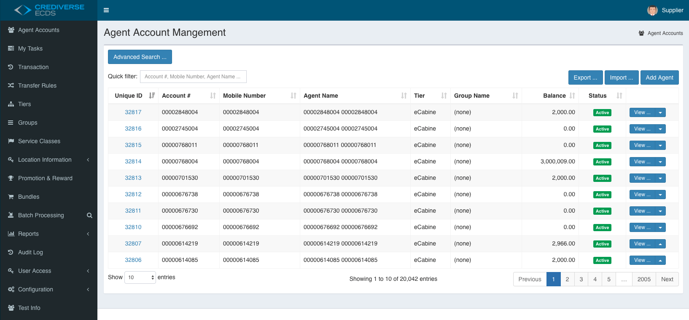

The path to the current screen is displayed directly below the user
name.

Logging Out
-----------

Always log out of the application after you have finished using it. This
will ensure that the ECDS remains secure and stops an unauthorized
person using the application.  

Near the upper right corner of any page, the current logged in user name
will appear, clicking on this Username will display a drop down menu:

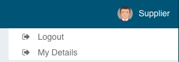

Click on

to log out of ECDS. This will return you to the login page.  
The Web application will not ask you to confirm your intention to log
out. Should you wish to remain logged in, click on the Username again
and the

will disappear.

Menu & Breadcrumbs
==================

The Main menu is ordered in priority of usage, with menu options for
common actions, such as Agent Account lookups or Transaction information
lookups placed at the top.  
Where a sub menu exists an &lt; is shown to the right of the menu item.
Clicking on the &lt; will expand the sub menu giving you further
options.  

Note that the menu items displayed will depend on the logged in users
role, which has been assigned. Some users may not see all menu options
if they do not have the required permission in their assigned role.  
For example, the Configuration Menu item, will only be displayed to
users with administrative permissions which allow them to manage and
change configuration settings in ECDS.  

At the bottom of the menu is an image which can be changed to repesent
your organisation. Please discuss this with the CrediVerse installer, to
change the image.

The ECDS menu bar displayed at the left of the page can be contracted to
show only icons and no words by clicking on the

icon near the top left of the page. Click on the same icon while the
menu bar is hidden to expand the menu bar.  

Breadcrumbs
-----------

Near the upper right of the page below the name of the currently logged
in User, “breadcrumbs” are shown to indicate the page currently being
displayed as well as the path followed to get to the current page. This
is one example:

These breadcrumbs will change for every page displayed and typically
show the menu navigation path used.  
Clicking on any word shown in the “breadcrumb” line will navigate to
that page.  

On the next page is a table indicating what each of the menu items is
for.

Main Menu item descriptions
---------------------------

<table>
<colgroup>
<col style="width: 50%" />
<col style="width: 50%" />
</colgroup>
<tbody>
<tr class="odd">
<td>
<strong>Menu item</strong>
</td>
<td>
<strong>Purpose</strong>
</td>
</tr>
<tr class="even">
<td>
Agent Accounts
</td>
<td>
To Search and Manage Agent Account master data
</td>
</tr>
<tr class="odd">
<td>
My Tasks
</td>
<td>
To view your own and assigned workflow tasks
</td>
</tr>
<tr class="even">
<td>
Transactions
</td>
<td>
To Search for and view Transactions information
</td>
</tr>
<tr class="odd">
<td>
Transfer Rules
</td>
<td>
To Search, View and Maintain Transfer Rule master data
</td>
</tr>
<tr class="even">
<td>
Tiers
</td>
<td>
To Search, View and Maintain Tier master data
</td>
</tr>
<tr class="odd">
<td>
Groups
</td>
<td>
To Search, View and Maintain Group master data
</td>
</tr>
<tr class="even">
<td>
Service Classes
</td>
<td>
To Search, View and Maintain Service Class master data
</td>
</tr>
<tr class="odd">
<td>
Location Information
</td>
<td>
To Search, View and Maintain Area, Cell and Location grouping master data
</td>
</tr>
<tr class="even">
<td>
Promotions &amp; Rewards
</td>
<td>
To Search, View and Maintain Promotions and Rewards
</td>
</tr>
<tr class="odd">
<td>
Bundles
</td>
<td>
To Search, View and Maintain Optional Bundle master data
</td>
</tr>
<tr class="even">
<td>
Batch Processing
</td>
<td>
To upload Batch files for bulk loading of master data
</td>
</tr>
<tr class="odd">
<td>
Reports
</td>
<td>
To create and schedule reports
</td>
</tr>
<tr class="even">
<td>
Audit Log
</td>
<td>
To view all master data changes performed by a web user
</td>
</tr>
<tr class="odd">
<td>
User Access
</td>
<td>
To Search, View and Maintain Web Users and Roles master data
</td>
</tr>
<tr class="even">
<td>
Configuration
</td>
<td>
To configure various business parameters, technical settings and Message texts.
</td>
</tr>
</tbody>
</table>

Agent Accounts
==============

An Agent is someone who is authorised to transfer or sell credit via
ECDS. Agents are either wholesalers who buy directly from the Root
account or other wholesalers, or Retailers who buy from Wholesalers and
sell to mobile phone subscribers. This chapter describes how to create
and manage Agent Accounts.

Creating a New Agent Account
----------------------------

Using the Menu bar on the left hand side, click on
.
The Agent Accounts page appears:

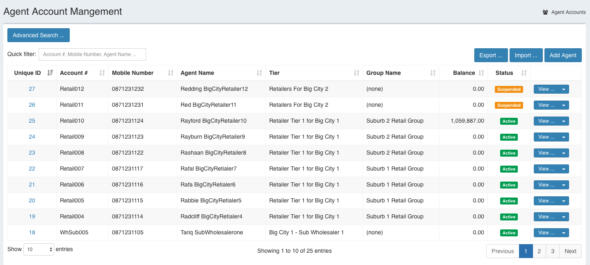

This screen lists agent accounts which are currently loaded in the
system. To add a new agent, click

close to the top right hand corner. The Add New Agent Account pop-up
window appears:

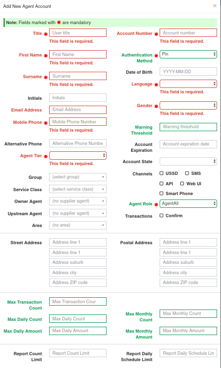

Below is a table indicating what each of the fields should contain as
well as an indicator as to which information is required:

<table>
<colgroup>
<col style="width: 25%" />
<col style="width: 25%" />
<col style="width: 25%" />
<col style="width: 25%" />
</colgroup>
<tbody>
<tr class="odd">
<td>
<strong>Field</strong>
</td>
<td>
<strong>Description</strong>
</td>
<td>
<strong>Constraints</strong>
</td>
<td>
<strong>Required</strong>
</td>
</tr>
<tr class="even">
<td>
Title
</td>
<td>
Title of Account Holder, e.g. ‘Professor’
</td>
<td>
Not more than 10 characters
</td>
<td>
Yes
</td>
</tr>
<tr class="odd">
<td>
First Name
</td>
<td>
First name of the Account Holder
</td>
<td>
Not More than 30 characters
</td>
<td>
Yes
</td>
</tr>
<tr class="even">
<td>
Surname
</td>
<td>
Surname of the Account Holder
</td>
<td>
Not more than 30 characters
</td>
<td>
Yes
</td>
</tr>
<tr class="odd">
<td>
Initials
</td>
<td>
Initials of the Account Holder
</td>
<td>
Not more than 10 characters
</td>
<td>
No
</td>
</tr>
<tr class="even">
<td>
Email
</td>
<td>
your email address. Note that passwords for accessing the Agent Portal are sent to this email address
</td>
<td>
Not more than 30 characters
</td>
<td>
Yes
</td>
</tr>
<tr class="odd">
<td>
Mobile Phone
</td>
<td>
The Account Holder’s Cell number
</td>
<td>
Not more than 30 characters
</td>
<td>
Yes
</td>
</tr>
<tr class="even">
<td>
Alternative Phone
</td>
<td>
Alternative Phone Number for the Account Holder
</td>
<td>
Not more than 30 characters
</td>
<td>
No
</td>
</tr>
<tr class="odd">
<td>
Agent Tier
</td>
<td>
The Tier the Account belongs to.
</td>
<td>
Non Customer Tiers only
</td>
<td>
Yes
</td>
</tr>
<tr class="even">
<td>
Service Class
</td>
<td>
The Account Holder’s Service Class
</td>
<td></td>
<td>
No
</td>
</tr>
<tr class="odd">
<td>
Group
</td>
<td>
Optional Group the Account belongs To
</td>
<td></td>
<td>
No
</td>
</tr>
<tr class="even">
<td>
Owner Agent
</td>
<td>
The agent under which management of this agent falls. Owner Agents can see all Agents in the Agent Portal, where they are defined as the Owner Agent
</td>
<td></td>
<td>
No
</td>
</tr>
<tr class="odd">
<td>
Upstream Agent
</td>
<td>
When "Only from Upstream Agent" is selected indicated in the Transfer rule, this agent may only receive transfers from whom this Upstream Agent
</td>
<td>
Constraint only applied if specified in Transfer Rule
</td>
<td>
No
</td>
</tr>
<tr class="even">
<td>
Area
</td>
<td>
Optional Area of the Agent. Note when Strict Area is enabled in the Transfer Rule, the Agent will be restricted to trade only in this Area
</td>
<td>
Constraint only applies if Strict Area is enabled in the Transfer Rule
</td>
<td>
No
</td>
</tr>
<tr class="odd">
<td>
Account Number
</td>
<td>
A unique Account Number which can be assigned. This can be an ERP or CRM system account number, to allow cross reference in reporting
</td>
<td>
Not more than 20 characters
</td>
<td>
Yes
</td>
</tr>
<tr class="even">
<td>
Authentication Method
</td>
<td>
Indicates the Agent authentication method used when logging into the Agent Portal (Web UI)
</td>
<td>
Either Domain Account or PIN
</td>
<td>
No
</td>
</tr>
<tr class="odd">
<td>
Domain Account Name
</td>
<td>
The Domain Account name of the Agent on the Domain Controller, used for Agent Portal Login Authentication.
</td>
<td>
Only shown if Domain Account Authentication method is selected
</td>
<td>
No
</td>
</tr>
<tr class="even">
<td>
Date of Birth
</td>
<td>
Birthdate of the Account Holder
</td>
<td></td>
<td>
No
</td>
</tr>
<tr class="odd">
<td>
Language
</td>
<td>
Language Preference
</td>
<td>
i.e FR or EN
</td>
<td>
Yes
</td>
</tr>
<tr class="even">
<td>
Gender
</td>
<td>
Gender of the Account Holder
</td>
<td>
Male, Female or Other
</td>
<td>
Yes
</td>
</tr>
<tr class="odd">
<td>
Warning Threshold
</td>
<td>
When an Agent’s Monetary balance drops below this value, he and his Owner Agent shall receive a warning SMS.
</td>
<td></td>
<td>
No
</td>
</tr>
<tr class="even">
<td>
Account Expiration
</td>
<td>
The future date that the account will expire and the account status set to inactive
</td>
<td></td>
<td>
No
</td>
</tr>
<tr class="odd">
<td>
Status
</td>
<td>
The Status of the Account
</td>
<td>
Pending, Active, Suspended or Inactive
</td>
<td>
No
</td>
</tr>
<tr class="even">
<td>
Allowed Channels
</td>
<td>
The Access Channel(s) the Agent is allowed to use
</td>
<td>
USSD, SMS, APP, API, WUI
</td>
<td>
Yes
</td>
</tr>
<tr class="odd">
<td>
Agent Role
</td>
<td>
The access Role (Permissions) which is assigned to the Agent when they login to the Agent Portal
</td>
<td>
Only applicable if Agent has access to Agent Portal (WebUI Bearer)
</td>
<td>
Yes
</td>
</tr>
<tr class="even">
<td>
Confirm
</td>
<td>
This toggles USSD transaction confirmation message on or off for the Agent
</td>
<td>
Defaults to off
</td>
<td>
No
</td>
</tr>
<tr class="odd">
<td>
Street Address Line 1
</td>
<td>
First Street Address Line
</td>
<td>
Not more than 50 characters
</td>
<td>
No
</td>
</tr>
<tr class="even">
<td>
Street Address Line 2
</td>
<td>
Second Street Address Line
</td>
<td>
Not more than 50 characters
</td>
<td>
No
</td>
</tr>
<tr class="odd">
<td>
Street Address Suburb
</td>
<td>
Street Address Suburb
</td>
<td>
Not more than 30 characters
</td>
<td>
No
</td>
</tr>
<tr class="even">
<td>
Street Address City
</td>
<td>
Street Address City
</td>
<td>
Not more than 30 characters
</td>
<td>
No
</td>
</tr>
<tr class="odd">
<td>
Street Address Zip Code
</td>
<td>
Street Address Zip Code
</td>
<td>
Not more than 10 characters
</td>
<td>
No
</td>
</tr>
<tr class="even">
<td>
Postal Address Line 1
</td>
<td>
First Postal Address Line
</td>
<td>
Not more than 50 characters
</td>
<td>
No
</td>
</tr>
<tr class="odd">
<td>
Postal Address Line 2
</td>
<td>
Second Postal Address Line
</td>
<td>
Not more than 50 characters
</td>
<td>
No
</td>
</tr>
<tr class="even">
<td>
Postal Address Suburb
</td>
<td>
Postal Address Suburb
</td>
<td>
Not more than 30 characters
</td>
<td>
No
</td>
</tr>
<tr class="odd">
<td>
Postal Address City
</td>
<td>
Postal Address City
</td>
<td>
Not more than 30 characters
</td>
<td>
No
</td>
</tr>
<tr class="even">
<td>
Postal Address Zip Code
</td>
<td>
Postal Address Zip Code
</td>
<td>
Not more than 10 characters
</td>
<td>
No
</td>
</tr>
<tr class="odd">
<td>
Max Amount
</td>
<td>
Maximum Transaction Amount
</td>
<td></td>
<td>
No
</td>
</tr>
<tr class="even">
<td>
Max Daily Count
</td>
<td>
Maximum number of transactions allowed per day
</td>
<td></td>
<td>
No
</td>
</tr>
<tr class="odd">
<td>
Max Daily Amount
</td>
<td>
Maximum total amount allowed per day
</td>
<td></td>
<td>
No
</td>
</tr>
<tr class="even">
<td>
Max Monthly Count
</td>
<td>
Maximum number of transactions allowed per month
</td>
<td></td>
<td>
No
</td>
</tr>
<tr class="odd">
<td>
Max Monthly Amount
</td>
<td>
Maximum total amount allowed per month
</td>
<td></td>
<td>
No
</td>
</tr>
<tr class="even">
<td>
Report Count Limit
</td>
<td>
The number of Reports the Agent May define in the Agent Portal
</td>
<td>
Only specified if the default limit is to be overwridden for this agent
</td>
<td>
No
</td>
</tr>
<tr class="odd">
<td>
Report Daily Schedule Limit
</td>
<td>
The number of Reports the Agent May Schedule to run on a Daily basis
</td>
<td>
Only specified if the default limit is to be overwridden for this agent
</td>
<td>
No
</td>
</tr>
</tbody>
</table>

Once all details are inserted, click
  

This will result in the Agent details being stored by ECDS and an SMS
being sent to the mobile phone specified for the Agent account with the
Agent’s the Default PIN. Where no Default PIN is configured (See Agent
Configuration), an SMS with a temporary OTP is sent to the Agent,
requesting the Agent to register their own PIN (Private Identification
Number), which they will use for all future USSD or SMS transactions.  
Alternatively click
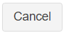
to abandon the registration of the new Agent.

Search for and View an Agent Account
------------------------------------

In the ECDS Web Application, there are various ways to search for and
view an Agent account. When you click on

in the menu bar on the left, a screen such as the one below shall appear
showing a list of Agent accounts:  

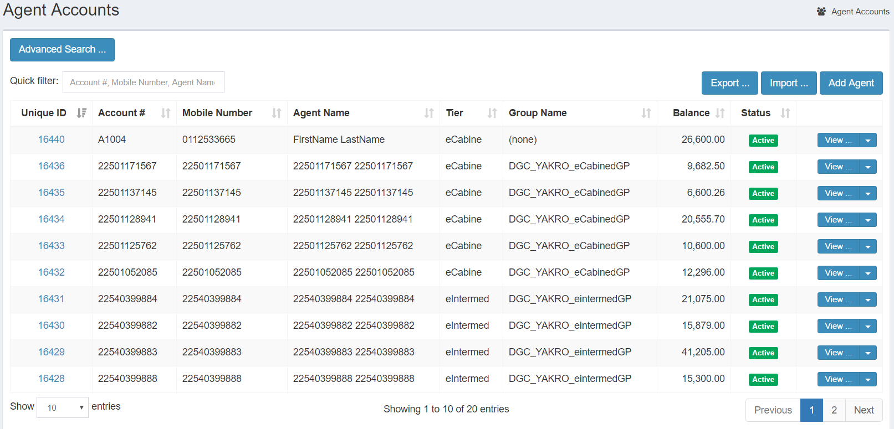

In this screen, it is possible to move sequentially up and down between
pages of results, or to a specific page using the
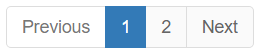
buttons in the bottom right corner of the screen. It is also possible to
change the number of records displayed in the list, by picking a
different value from the drop-down list for the box next to

in the bottom left of the Agent Accounts list screen.  
Alternatively, to filter the results of the account list, enter an
Agent’s account number, mobile number or name in the
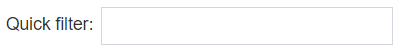
text box, near the top left of the page.  
Finally, it is possible to do an Advanced Search, by clicking
.
This will reveal additional fields that may be used in searching for a
particular Agent or a group of Agents:  

In the Agent search fields enter the known criteria to optimise your
search result set. For example, if the Last name of the Agent is known,
insert the Last name and click on

This will return a list of Agent Accounts where the Last name matches
the Last name that you entered. The more fields entered in the search
criteria, the more precise the result set.  
To erase all entered search criteria click on
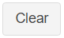.
To hide the advanced search fields, click on
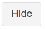  

Once you have located the Agent Account you wish to view, click the

button (not the down arrow) on the right hand side of the Agent Account
record displayed or click on the unique ID of the Agent displayed in the

column. This will result in a detailed agent account display where you
can see all Agent Account information.

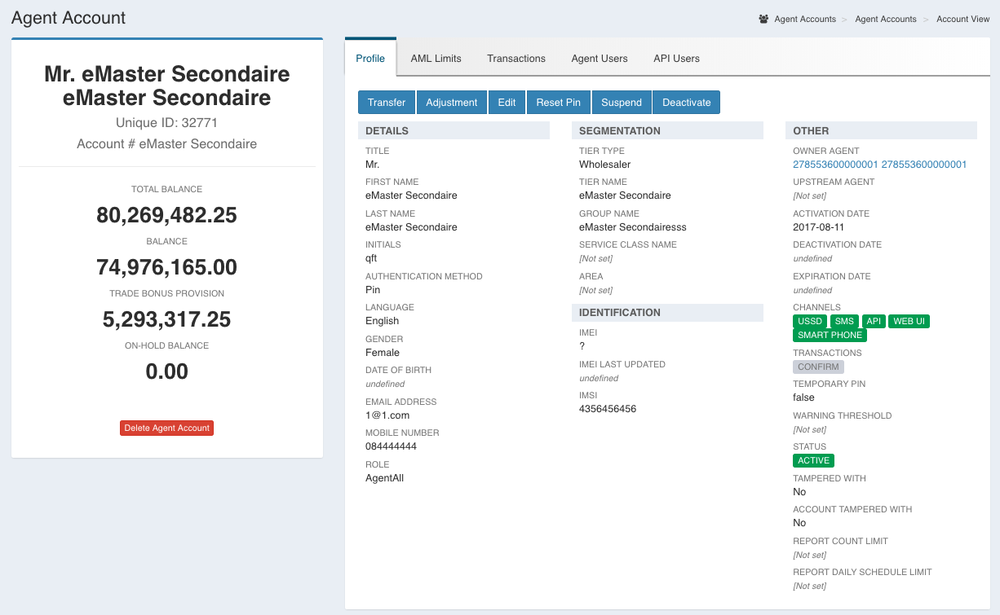

The Agent Account information is displayed in two blocks, on the left,
the Agent’s name and account number is displayed, along with their
current balance.  
On the right hand side, more detailed Agent Account information is
displayed in several tab sheets, including the information for the
fields as described in the table near the top of this [Creating a New
Agent Account](#_creating_a_new_agent_account) section, transaction
data, AML Limits, Agent and API User information.

### Agent AML limits

AML or Anti-Money-Laundering-Limits may be setup to limit the number and
value of transactions an agent performs in a day or month. To view the
AML limits for the currently selected agent select the

tab on the view agent screen and you will see something similar to the
following:

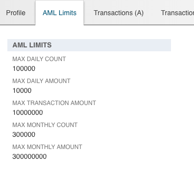

To change any of the AML Limits for the Agent, please see
[???](#_Editing_An_Agent_).

### Agent transactions

Within the Agent View screen, it is possible to see a sequential list of
the most recent transactions related to the Agent. This includes both
inbound transactions, where the agent may have received a transfer from
another agent as well as transactions that the agent has made
themselves.  
To see the Agent Transactions, select the
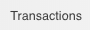
tab and you will be presented with agent transaction search criteria as
follows:

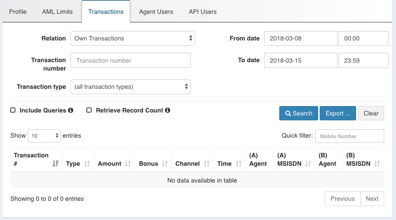

The following search criteria may be used to filter the result set:

<table>
<colgroup>
<col style="width: 50%" />
<col style="width: 50%" />
</colgroup>
<tbody>
<tr class="odd">
<td>
<strong>Filter Criteria</strong>
</td>
<td>
<strong>Definition</strong>
</td>
</tr>
<tr class="even">
<td>
Relation
</td>
<td>
This indicates the relationship of the transactions to the Agent in focus. Please see the transaction relationship table below for explanation of each relationship type
</td>
</tr>
<tr class="odd">
<td>
Date and time range
</td>
<td>
This is the from and to date range, which by default is set to the past 7 days
</td>
</tr>
<tr class="even">
<td>
Transaction Number
</td>
<td>
This fields allows the user to specify a specific transaction number if a single transaction is to be retrieved
</td>
</tr>
<tr class="odd">
<td>
Transaction types
</td>
<td>
This indicates the Transaction type to search for, for example, Airtime Sale, Bundle Sale, Transfer, Reversal, Adjudication etc.
</td>
</tr>
<tr class="even">
<td>
Include queries
</td>
<td>
By default, sales and deposit query transactions are excluded from the result set, these can be included by selecting this check box
</td>
</tr>
<tr class="odd">
<td>
Retrieve record counted
</td>
<td>
By default, record count is not included to optimise the speed of the query. A record count takes time, to count through the entire database to see how many records match the search criteria, so should only be used if this information is required
</td>
</tr>
</tbody>
</table>

> **Important**
>
> Filters where Queries and Record counts are included will take longer
> to execute

The table below explains the differences between the various Relation
Filters which may be applied to the search:

<table>
<colgroup>
<col style="width: 50%" />
<col style="width: 50%" />
</colgroup>
<tbody>
<tr class="odd">
<td>
<strong>Relation Filter</strong>
</td>
<td>
<strong>Definition</strong>
</td>
</tr>
<tr class="even">
<td>
Own Transactions
</td>
<td>
This filter will show transactions where the Agent in focus is either the A or B party in the transaction
</td>
</tr>
<tr class="odd">
<td>
Own Outbound Transactions
</td>
<td>
This shows only transactions where the Agent in focus is the A party, i.e. transactions which the Agent initiated
</td>
</tr>
<tr class="even">
<td>
Own Inbound Transactions
</td>
<td>
This shows only transactions where the Agent in focus is the B party, i.e. transactions in which the Agent was on the receiving end
</td>
</tr>
<tr class="odd">
<td>
Owner of A side
</td>
<td>
This shows transactions for sub-agents, where the Agent in focus is the owner of the A party
</td>
</tr>
<tr class="even">
<td>
Owner of B side
</td>
<td>
This shows transactions for sub-agents, where the Agent in focus is the owner of the B party
</td>
</tr>
<tr class="odd">
<td>
All transactions
</td>
<td>
This shows all transactions, including the Agents Own and all transactions of sub Agents where the Agent in focus is owner of the A or B party
</td>
</tr>
</tbody>
</table>

> **Important**
>
> Use at least one filter criteria, the more filter criteria the quicker
> a result is returned

After entering all desired search criteria, click

which will cause all transactions satisfying the search criteria to be
displayed. To enter new search criteria, click on

and all previously entered criteria will be erased, ready to enter new
criteria. When searching is complete.

The results will be displayed similar to the following:

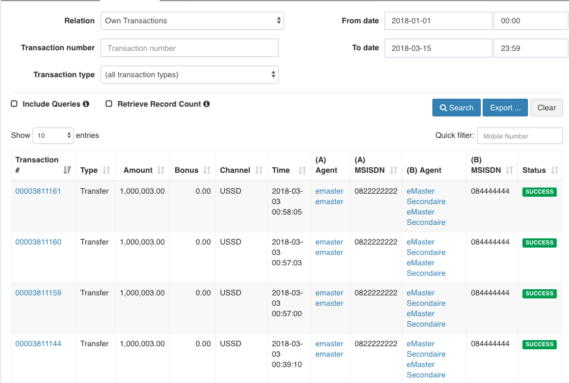

It is possible to drill into a single transaction by selecting the
Transaction Number, which in turn will provide a detailed Transaction
view. See [Viewing Transactions](#_viewing_transactions) for details of
what is shown.  
ECDS offers the facility to export this Transaction detail to a CSV file
in the identical format and using the naming convention as described in
the [Batch Processing](#_batch_import) section below. The file will be
exported to the download location defined in the settings of the web
browser you are using. To accomplish the export, click on the

button and inspect the configured download location.

### Agent Users

Agent Users are Web Users of the Agent Portal. Where certain Agents have
been granted access to the WebUI [???](#_Bearer_Channels_), the Agent
may assign Agent Users, with specific Roles and Permissions, which would
allow the agents to perform front office or call centre functions using
the Agent Portal. To view a list of existing Agent Users which have been
linked to the currently selected Agent, click on the
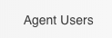
tab, and you will be presented with a list of linked Agent Users, as
follows:

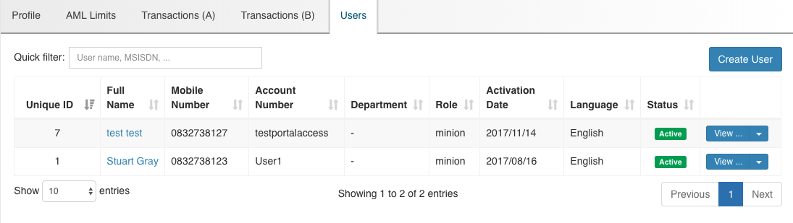

> **Note**
>
> Agent users may transact on behalf of the Agent, depending on the
> permissions given.

There is one predefined permanent Agent User role, namely ‘Agent All’
which provides all possible permissions an Agent User could have. To
setup more restrictive Agent User roles, please refer to
[???](#_Associating_Permissions_with_A_Role_)

Each Agent User is linked to one and only one Role.

#### Adding an Agent User \[\[*Adding\_an\_agent\_user*\]\]

To add a new Agent User, click the

button near the top right of the page. The Add New Agent User pop-up
window appears:

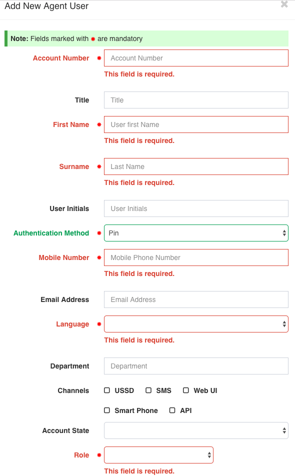

Information to be supplied to create a new Agent User is as follows:

<table>
<colgroup>
<col style="width: 25%" />
<col style="width: 25%" />
<col style="width: 25%" />
<col style="width: 25%" />
</colgroup>
<tbody>
<tr class="odd">
<td>
<strong>Field</strong>
</td>
<td>
<strong>Definition</strong>
</td>
<td>
<strong>Constraints</strong>
</td>
<td>
<strong>Required</strong>
</td>
</tr>
<tr class="even">
<td>
Account Number
</td>
<td>
A unique Account Number, which can be assigned to the user, this may correlate to a username in CRM or other external reference e.g. Personnel Number.
</td>
<td>
Not more than 20 characters
</td>
<td>
Yes
</td>
</tr>
<tr class="odd">
<td>
Title
</td>
<td>
Title of Web User, e.g. ‘Professor’, selected from a drop-down list
</td>
<td>
Not more than 20 characters
</td>
<td>
Yes
</td>
</tr>
<tr class="even">
<td>
First Name
</td>
<td>
First name of the Web User
</td>
<td>
Not More than 30 characters
</td>
<td>
Yes
</td>
</tr>
<tr class="odd">
<td>
Surname
</td>
<td>
Surname of the Web User
</td>
<td>
Not more than 30 characters
</td>
<td>
Yes
</td>
</tr>
<tr class="even">
<td>
Initials
</td>
<td>
Initials of the Web User
</td>
<td>
Not more than 10 characters
</td>
<td>
Yes
</td>
</tr>
<tr class="odd">
<td>
Authentication Method
</td>
<td>
For Agent Users this can be Domain Account or PIN. Use Domain Account where User exists on internal LDAP, or PIN for ECDS Authentication using the Agent User MSISDN and PIN
</td>
<td>
Select from drop down list
</td>
<td>
Yes
</td>
</tr>
<tr class="even">
<td>
Domain Account
</td>
<td>
This is the LDAP Domain Account of the Agent User Holder
</td>
<td>
Not more than 40 characters, Not required if authentication method is PIN
</td>
<td>
Yes
</td>
</tr>
<tr class="odd">
<td>
Mobile phone number
</td>
<td>
Mobile Number in National or International format.
</td>
<td>
Not more than 30 characters
</td>
<td>
Yes
</td>
</tr>
<tr class="even">
<td>
Email
</td>
<td>
Email Address
</td>
<td>
Not more than 60 characters
</td>
<td>
No
</td>
</tr>
<tr class="odd">
<td>
Language
</td>
<td>
Language Preference selected from a drop-down list
</td>
<td>
i.e FR or EN
</td>
<td>
Yes
</td>
</tr>
<tr class="even">
<td>
Department
</td>
<td>
The Department the Web User belongs to.
</td>
<td>
Select from Dropdown list (See <a href="#Departments">???</a> )
</td>
<td>
Yes
</td>
</tr>
<tr class="odd">
<td>
Channels
</td>
<td>
Select the access channels the Agent User is allowed to use, these can include WebUI (Agent Portal), USSD and SMS
</td>
<td></td>
<td>
Yes
</td>
</tr>
<tr class="even">
<td>
Account State
</td>
<td>
The Status of the Web User, e.g. Active - selected from a drop-down list.
</td>
<td>
Active or Inactive
</td>
<td>
Yes
</td>
</tr>
<tr class="odd">
<td>
Role
</td>
<td>
The Role the Web User has, e.g. ‘Sales-Exec’ selected from a drop-down list
</td>
<td>
One and only one
</td>
<td>
Yes
</td>
</tr>
</tbody>
</table>

Once all information required to define the new Agent User has been
entered, click

to create the new Agent User, or click

to abandon the process. If all fields are valid, the pop-up window
disappears, the new Agent User is saved and the Agent Users list is
displayed showing the newly created Agent User.

#### Viewing and Searching Agent Users \[\[*viewing\_and\_searching\_Agent\_Users*\]\]

For each defined Agent User, the Agent Users list page shows the
following in a single row:

-   Unique ID

-   Full Name

-   Mobile Number

-   Account Number

-   Department

-   Role

-   Activation Date

-   Language

-   Status

The sequence in which the Agent Users are listed may be changed by
clicking on any column heading. This will cause the Agent Users to be
sorted based on the content of the selected column in either ascending
or descending order, indicated by

(ascending) or

(descending) icons next to the column header.

Should there be more than one page of Agent Users, the

buttons will allow you to navigate to the previous, next or specific
page.

It is possible to change the number of Agent Users displayed on a page
by selecting a different value from the drop-down list displayed when
clicking on

near the left top corner of the Agent Users page.

Entering any text in the

text box shown at the top right of the page will result in only showing
those Agent Users containing the entered text in any field defining the
Agent User, including in numerical fields.

Clicking on a Agent User Name results in all detail for that Agent User
to be shown as below:

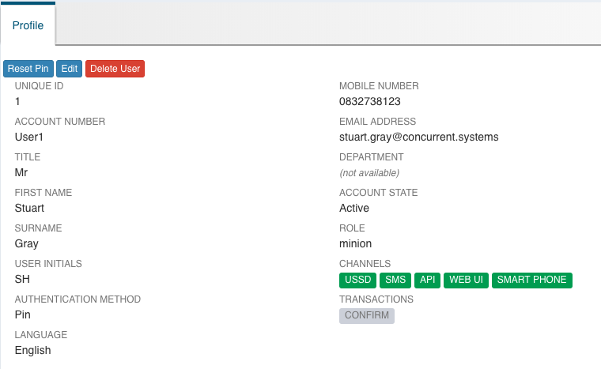

#### Editing an Agent User

To change any detail of an existing Agent User, first locate the Agent
User as described in [???](#_viewing_and_searching_Agent_Users_) above.
Once the Agent User is visible on the Agent Users page, click the

button in the row in which the Agent User to be edited is displayed. The
Edit Agent User pop-up window appears:

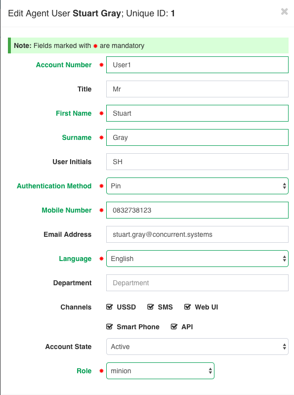

This pop-up window contains all the information detailed in
[???](#_Adding_an_agent_user_) above and any field may be changed. When
all changes have been entered, click

to store the changed Agent User or click

to abandon the process.

#### Deleting an Agent User

To delete an existing Agent User, first locate the Agent User as
described in [???](#_viewing_and_searching_Agent_Users_) above. Once the
Agent User is visible on the Web Users page, click the

button in the row in which the Agent User to be deleted is displayed. A
deletion confirmation window pops up:

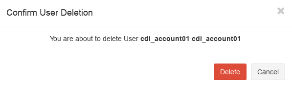

Click

to permanently delete the selected Agent User or click

to retain the Agent User.

#### Performing a PIN Reset for an Agent User

For additional security reasons or where an Agent User forgot a PIN,
suitably authorised Web Application Users may reset an Agent User’s PIN.

To reset an Agent User’s PIN, do the following: First find the agent
detail as described in [???](#_viewing_and_searching_Agent_Users_) above
and then click on the down arrow

next to the

button on the same line.

The following drop-down menu appears:

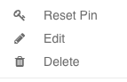

Click on
.
A Pin Reset confirmation pop-up window will appear:

Clicking the

button will result in a One-Time-PIN be sent to the Agent User via an
SMS with an instruction to change his PIN. The Agent User will not be
able to use his old PIN or the One-Time-PIN to access the Agent Portal
or perform transactions.

Clicking the
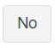
button will exit the process without resetting the PIN.

### API Users

API Users are associated with an Agent’s Crediverse account in ECDS and
allows the Agent to connect to the ECDS Transaction Server using the
ECDS REST API. The API User is created and associated with the Agent
Account, in the Agent View Screen. Roles for API Users are setup and
managed in [???](#_Associating_Permissions_with_A_Role_) and then a Role
with specific permissions may be assigned to an API User. The API User
is only permitted to access ECDS using the API
[???](#_Bearer_Channels_).

To view a list of existing API Users which have been linked to the
currently selected Agent, click on the

tab, and you will be presented with a list of linked API Users, as
follows:

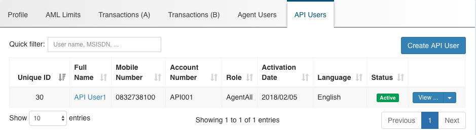

> **Note**
>
> API users may transact on behalf of the Agent, depending on the Roles
> and Permissions assigned to the user.

There is one predefined permanent Agent User role, namely ‘AgentAll’
which provides all possible permissions an Agent, Agent Usr or API User
could have. To setup more restrictive Agent User roles, please refer to
[???](#_Associating_Permissions_with_A_Role_)

Each API User is linked to one and only one Role.

#### Adding an API User \[\[*Adding\_an\_api\_user*\]\]

To add a new API User, click the

button near the top right of the page. The Add New API User pop-up
window appears:

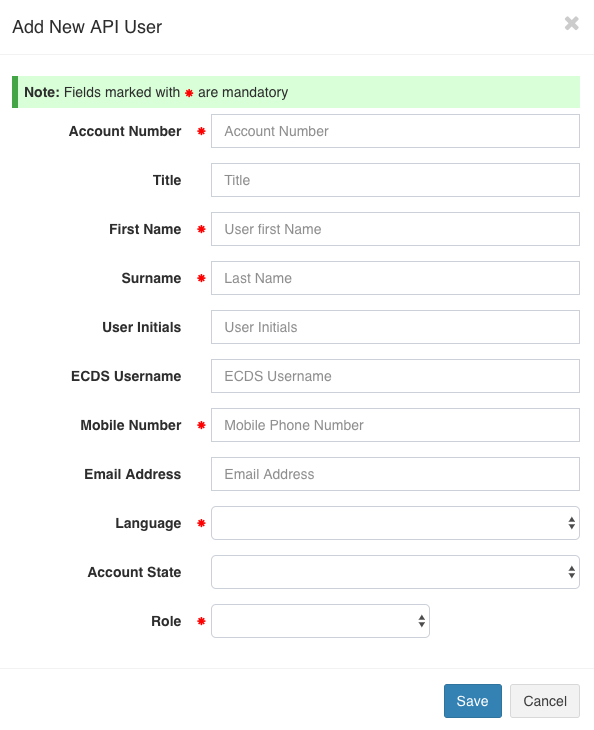

Information to be supplied to create a new API User is as follows:

<table>
<colgroup>
<col style="width: 25%" />
<col style="width: 25%" />
<col style="width: 25%" />
<col style="width: 25%" />
</colgroup>
<tbody>
<tr class="odd">
<td>
<strong>Field</strong>
</td>
<td>
<strong>Definition</strong>
</td>
<td>
<strong>Constraints</strong>
</td>
<td>
<strong>Required</strong>
</td>
</tr>
<tr class="even">
<td>
Account Number
</td>
<td>
A unique Account Number, which can be assigned to the user, this may correlate to a username in CRM or other external reference e.g. Personnel Number.
</td>
<td>
Not more than 20 characters
</td>
<td>
Yes
</td>
</tr>
<tr class="odd">
<td>
Title
</td>
<td>
Title of API User, e.g. ‘Professor’, selected from a drop-down list
</td>
<td>
Not more than 20 characters
</td>
<td>
Yes
</td>
</tr>
<tr class="even">
<td>
First Name
</td>
<td>
First name of the API User
</td>
<td>
Not More than 30 characters
</td>
<td>
Yes
</td>
</tr>
<tr class="odd">
<td>
Surname
</td>
<td>
Surname of the API User
</td>
<td>
Not more than 30 characters
</td>
<td>
Yes
</td>
</tr>
<tr class="even">
<td>
Initials
</td>
<td>
Initials of the API User
</td>
<td>
Not more than 10 characters
</td>
<td>
Yes
</td>
</tr>
<tr class="odd">
<td>
ECDS Username
</td>
<td>
This is the ECDS User Name (must be unique for each API User)
</td>
<td>
Not more than 40 characters
</td>
<td>
Yes
</td>
</tr>
<tr class="even">
<td>
Mobile phone number
</td>
<td>
Mobile Number in National or International format.
</td>
<td>
Not more than 30 characters
</td>
<td>
Yes
</td>
</tr>
<tr class="odd">
<td>
Email
</td>
<td>
Email Address
</td>
<td>
Not more than 60 characters
</td>
<td>
No
</td>
</tr>
<tr class="even">
<td>
Language
</td>
<td>
Language Preference selected from a drop-down list
</td>
<td>
i.e FR or EN
</td>
<td>
Yes
</td>
</tr>
<tr class="odd">
<td>
Account State
</td>
<td>
The Status of the API User, e.g. Active - selected from a drop-down list.
</td>
<td>
Active or Inactive
</td>
<td>
Yes
</td>
</tr>
<tr class="even">
<td>
Role
</td>
<td>
The Role the API User has, e.g. ‘Sales-Exec’ selected from a drop-down list
</td>
<td>
One and only one
</td>
<td>
Yes
</td>
</tr>
</tbody>
</table>

Once all information required to define the new API User has been
entered, click

to create the new API User, or click

to abandon the process. If all fields are valid, the pop-up window
disappears, the new API User is saved and the API Users list.

#### Viewing and Searching API Users \[\[*viewing\_and\_searching\_API\_Users*\]\]

For each defined API User, the API Users list page shows the following
in a single row:

-   Unique ID

-   Full Name

-   Mobile Number

-   Account Number

-   Role

-   Activation Date

-   Language

-   Status

The sequence in which the API Users are listed may be changed by
clicking on any column heading. This will cause the API Users to be
sorted based on the content of the selected column in either ascending
or descending order, indicated by

(ascending) or

(descending) icons next to the column header.

Should there be more than one page of API Users, the

buttons will allow you to navigate to the previous, next or specific
page.

It is possible to change the number of API Users displayed on a page by
selecting a different value from the drop-down list displayed when
clicking on

near the left top corner of the API Users page.

Entering any text in the

text box shown at the top right of the page will result in only showing
those Agent Users containing the entered text in any field defining the
API User, including in numerical fields.

Clicking on a API User Name results in all detail for that API User to
be shown as below:

#### Editing an API User

To change any detail of an existing Agent User, first locate the API
User as described in [???](#_viewing_and_searching_API_Users_) above.
Once the API User is visible on the API Users page, click the

button in the row in which the API User to be edited is displayed. The
Edit API User pop-up window appears:

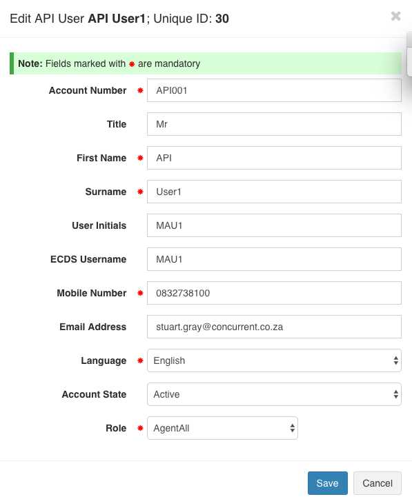

This pop-up window contains all the information detailed in
[???](#_Adding_an_api_user_) above and any field may be changed. When
all changes have been entered, click

to store the changed API User or click

to abandon the process.

#### Deleting an API User

To delete an existing API User, first locate the API User as described
in [???](#_viewing_and_searching_API_Users_) above. Once the API User is
visible on the Web Users page, click the

button in the row in which the API User to be deleted is displayed. A
deletion confirmation window pops up:

Click

to permanently delete the selected API User or click

to retain the API User.

#### Performing a PASSWORD Reset for an API User

For additional security reasons or where an API User forgot a PASSWORD,
suitably authorised Web Application Users may reset an Agent User’s
PASSWORD.

To reset an API User’s PASSWORD, do the following: First find the API
User detail as described in [???](#_viewing_and_searching_API_Users_)
above and then click on the down arrow

next to the

button on the same line.

The following drop-down menu appears:

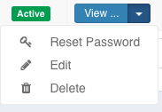

Click on
.
A Password Reset confirmation pop-up window will appear:  

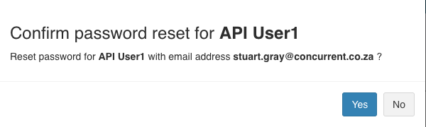

Clicking the

button will result in a New PASSWORD being sent to the API User via an
SMS with an instruction to change his PASSWORD. The API User will not be
able to use his old Password or the temporary password to access the
Agent Portal or perform transactions.

Clicking the

button will exit the process without resetting the PASSWORD.

Editing an Agent Account \[\[*Editing\_An\_Agent*\]\]
-----------------------------------------------------

Should any of an Agent’s details change, these could be updated by
editing an agent’s account information. This is done by finding the
agent detail as described above and then clicking on the down arrow

next to the

button on the same line in which the agent to be updated is displayed
and this drop-down menu appears:  

Click on
.
The Edit Agent Account will appear:

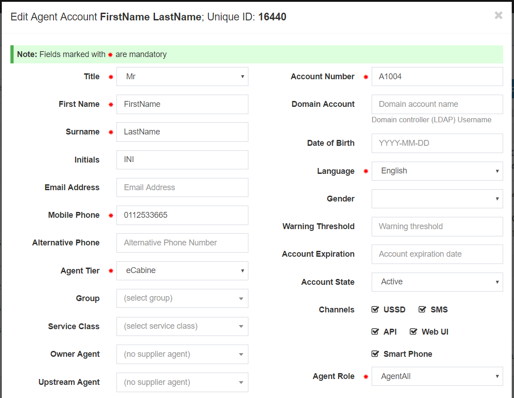

This screen is identical to the Create Agent screen and any changes to
information relating to the agent can be updated on this screen. The
same constraints as described in [Creating a New Agent
Account](#_creating_a_new_agent_account) applies. Once all the changed
agent information is entered, click the

button to record the changed information permanently, alternatively
click on the

button to discard any changes.

Performing an Agent Adjustment
------------------------------

Where an Agent’s balance has become incorrect for whatever reason, it is
possible to correct the balance by using an adjustment. Such an
adjustment has to be performed by a suitably authorised Web Application
user and co-authorised by a second suitably authorised Web Application
user. It is mandatory to record a reason for every adjustment made.

> **Important**
>
> Both the Agent balance as well as the Root balance are adjusted in
> opposite directions.

> **Note**
>
> When an adjustment is performed using the ECDS Admin UI, the
> Adjustment is a Bonus Exclusive Adjustment, meaning that the Amount
> entered EXCLUDES the bonus provision amount, the bonus provision
> amount is calculated by the system according to the amount stipulated
> and the transfer rules in place between the Root Account and the Agent
> Account and the Agent Balance and Bonus Provision Balance are adjusted
> accordingly.

> **Tip**
>
> The Root Account cannot be adjusted. To create additional credit in
> the Root Account, see [Replenish Root](#_replenish_root) below.

To make an adjustment to an Agent balance, do the following: First find
the agent detail as described in [Search for and View an Agent
Account](#_search_for_and_view_an_agent_account_) above and then click
on the down arrow

next to the

button on the same line in which the agent whose balance is to be
adjusted is displayed. The following drop-down menu appears:

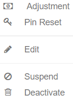

Click on
.
An Adjustment pop-up window will appear:

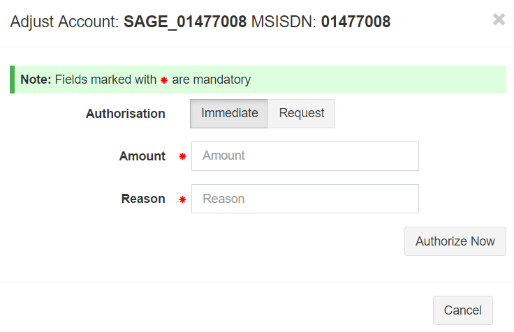

Authorisation by a co-authoriser may be immediate or may be Requested as
a workflow request for another user to approve at a later time on
another computer. For immediate co-authorisation, click on
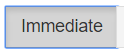.
To request a workflow item to be sent to authorising web users, click on
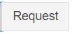.
This will cause an authorisation workflow task to be sent to all web
users with the necessary permissions to co-authorise the request at a
later time or from another computer. See [Tasks](#_tasks) below.  

The credit amount may be adjusted by entering the adjusted new balance.
Entering a reason for the adjustment is mandatory. When the information
is entered, click the button
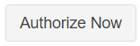.
If a request for authorisation was selected, the pop-up screen
disappears and a workflow task is sent to all users with the necessary
permissions to co-authorise the request. If immediate authorisation was
requested, the screen changes to:

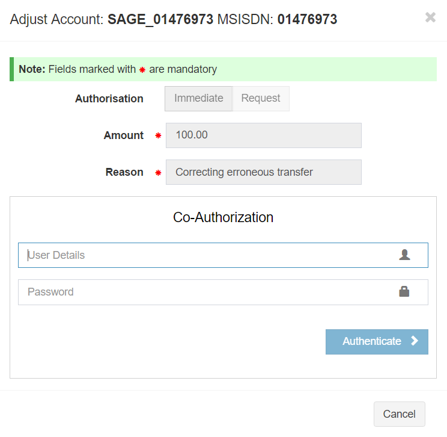

The co-authoriser who is a suitably authorised Web Application user
enters login name in the User Details text box and password in the
Password text box, and then clicks
.
The screen changes to:

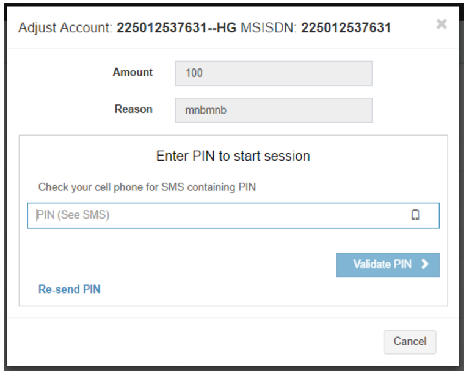

The co-authoriser will receive a One-Time-Password on the mobile phone
number registered in their User profile. This OTP must then be entered
correctly and the

button clicked for the adjustment to be made. The pop-up window will
disappear as soon as the adjustment is successfully made. The Agent will
receive an SMS informing him/her of the adjustment details.

Should the PIN sent to the co-authorising User be forgotten or lost
before entering it, then clicking on

will send a new one-time PIN.  
The adjustment could at any time during the process be abandoned by
clicking the

button.

> **Note**
>
> Where a co-authorisation was requested. All Web Users, with the
> necessary permissions to co-authorise the request, will receive an SMS
> with details of the request. Any of these users may then login to the
> ECDS Administration Portal and approve or decline the request from the
> My Tasks Menu item. For more information, See [Tasks](#_tasks) below.

Performing a PIN Reset
----------------------

For additional security reasons or where an Agent forgot a PIN, suitably
authorised Web Application Users may reset an Agent’s PIN.

To reset an Agent’s PIN, do the following: First find the agent detail
as described in [Search for and View an Agent
Account](#_search_for_and_view_an_agent_account_) above and then click
on the down arrow

next to the

button on the same line. The following drop-down menu appears:

Click on
.
A Pin Reset confirmation pop-up window will appear:

Clicking the

button will result in a One-Time-PIN be sent to the Agent via an SMS
with an instruction to change his PIN. The Agent will not be able to use
his old PIN or the One-Time-PIN to trade.

Clicking the

button will exit the process without resetting the PIN.

Suspending an Agent Account
---------------------------

An agent may for any of a number of reasons be prevented from
transacting by suspension. The Root account cannot be suspended. To
suspend an agent first find the agent detail as described in [Search for
and View an Agent Account](#_search_for_and_view_an_agent_account_)
above and then click on the down arrow

next to the

button on the same line in which the agent to be suspended is displayed.
The following drop-down menu appears:

Click on
.
A confirmation pop-up window will display.

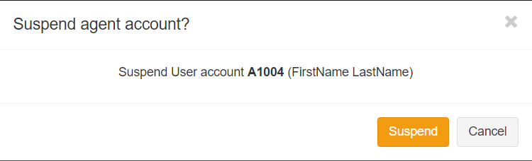

Click on

to suspend the Agent, alternatively click on

to abandon the suspension. A suspended Agent’s displayed status will
change from

to

and the Agent will be unable to transact. Suspended Agent details are
not removed from ECDS to save re-entering the information should such an
Agent be reinstated in future.

Reinstating an Agent Account
----------------------------

Suspended Agent accounts may be reinstated when the reason for
suspension is not applicable or valid any longer. To reinstate an agent
first find the suspended agent’s detail as described in [Search for and
View an Agent Account](#_search_for_and_view_an_agent_account_) above
and then click on the down arrow

next to the

button on the same line in which the agent to be suspended is displayed.
The following drop-down menu appears:

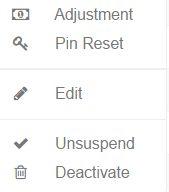

Click on
.
A confirmation pop-up window will appear.

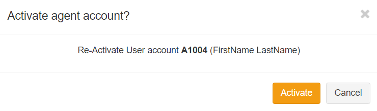

Click on

to reinstate the Agent, alternatively click on

to leave the Agent in a suspended state. A reinstated Agent’s displayed
status will change from

to

and the Agent will be able to transact again.

Deactivating an Agent Account
-----------------------------

An agent may for any of a number of reasons be be deactivated. Although
a deactivated agent’s detail will not disappear from ECDS, the agent
will not be able to transact and special procedures are needed to
reactivate such an agent. To deactivate an agent first find the agent
detail as described in 3.2 above and then click on the down arrow

next to the

button on the same line in which the agent to be deactivated is
displayed. The following drop-down menu appears:

Click on
.
A verification pop-up window appears:

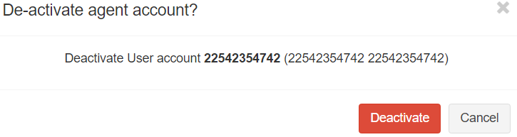

Click on

to deactivate the agent account or alternatively click

to abandon the deactivation.

The Root Account cannot be deactivated.

Replenish Root
--------------

A replenish transaction is the manner in which new credit is created in
the Root account.

To replenish the Root account, first locate it on the Agent Accounts
page as described in [Search for and View an Agent
Account](#_search_for_and_view_an_agent_account_) above and then click
on the down arrow

next to the

button on the same line in which the Root account is displayed. The
following drop-down menu appears:

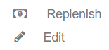

Click on
.
The Replenish Root Account pop-up window appears:

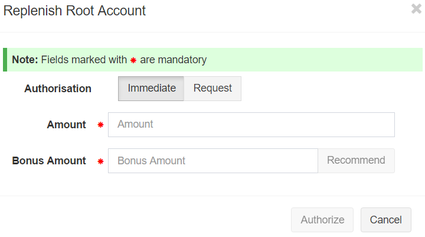

In the

text box, enter the amount of new credit to be added to the current Root
account balance. A recommended bonus replenishment amount will appear in
the

text box. The recommended Bonus Amount, is calculated by taking the
cummulative bonus required to provide bonuses to all tiers from Root to
Subscriber.

This recommendation can be overridden by entering your own amount in the

text box. Should you want to revert to the recommended amount, click on
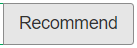.
To proceed with the creation of new credit, click on
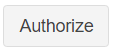.
If you chose
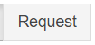
next to
,
a task will be sent to a co-authoriser to authorise the replenishment at
a later time and the Replenish Root Account pop-up window will
disappear. If how ever you chose
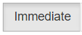
authorisation, The pop-up window expands to the following:

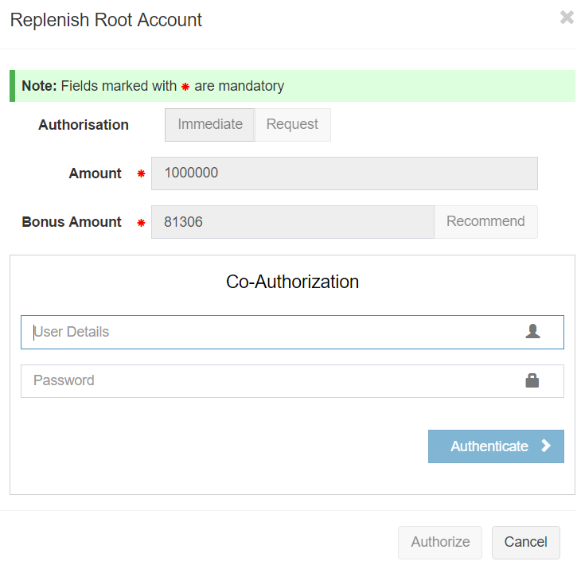

A second suitably authorised Web Application User must now enter his/her
UserID and password. The replenishment can still be abandoned at this
stage by clicking
.
To proceed with the replenishment, the co-authoriser should click on
.
If the co-authoriser entered the correct UserID/password combination and
is suitably authorised to perform replenishment of the Root account, the
pop-up window changes to include the following:

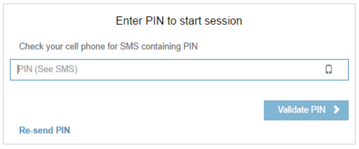

The co-authoriser will receive a one-time PIN on the mobile phone
registered on his/her ECDS User profile, This one-time PIN must then be
entered in the
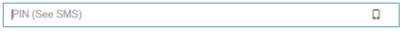
text box. If the PIN is lost or forgotten before entering it, click on

to receive a new PIN. The replenishment can still be abandoned by
clicking
.
To proceed with the replenishment, enter the correct PIN and click
.
The pop-up window disappears and the Agent Account page reappears,
showing the Root account with an updated balance.

Importing Agents
----------------

It is possible to define Agents in a batch file and import these
predefined Agents in a batch instead of entering each one individually
using the Web Application. Clicking the

button near the top right of the Agent Management page will initiate
this process which is fully described in the [Batch
Processing](#_batch_import) section below.

Exporting Agents
----------------

ECDS offers the facility to export Agent detail to a CSV file in the
identical format and using the naming convention as described in the
[Batch Processing](#_batch_import) section below, but with the Verb set
to “verify” The file will be exported to the download location defined
in the settings of the web browser you are using. To accomplish the
export, click on the

button and inspect the configured download location.

My Tasks
========

Certain actions performed by the users of the web application require a
second suitably authorised user to co-authorise an action, such as a
root account Replenish, or a Transaction Reversal. This co-authorisation
could happen immediately at the time the transaction is performed,
provided the co-authorising person, is present at the computer of the
person requesting the transaction. Alternatively, the person originating
the transaction can request co-authorisation, to be completed at a later
time or on another computer by another user which has the required
permissions. In cases where co-authorisation is requested, clicking on

will display the status of any items requested for co-authorisation by
the currently logged in user, as shown below:

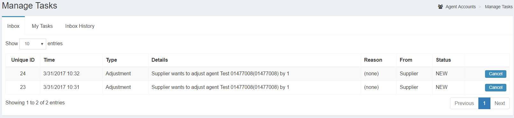

As soon as a Requested co-authorisation is initiated, a task is sent to
all suitably authorised web application users' inboxes and all are
notified of the request by SMS. The first user to process the request
will at the same time cause the request to be removed from all the other
suitably qualified users' inboxes and all notified web users shall also
receive an SMS to indicate that the request has been processed and what
the outcome was.

Three tabs are shown. Clicking on

shows any tasks that the logged in web application user can take actions
on. The actions possible for the user’s own Requested co-authorisations
is limited to

which will remove the approval request from any co-authoriser’s inbox.
If the web application user has permissions to co-authorise a request,
clicking on either "approve" or "decline" will cause a one-time PIN to
be sent to that user’s mobile phone. This PIN must then be entered to
complete the approval/decline action. All other notified users, will be
updated with the outcome of the action.

Clicking on the

tab will display a list of only those actions that someone else should
approve for the web application user.  

Click on

to see a list of co-authorisations that have already been processed:

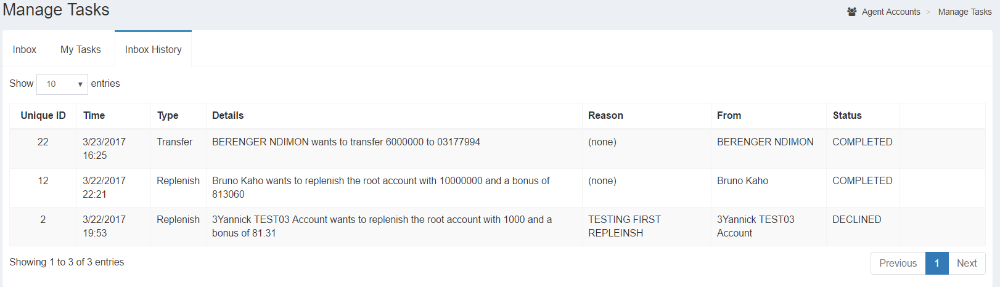

This screen shows whether a Requested co-authorisation has been approved
or rejected, identifying the user that took the action and the reason
given by that user for the action.

Transactions
============

The ECDS Web Application provides the means to inspect any transaction
that was processed by the system.

Viewing Transactions
--------------------

To obtain a list of transactions, click on

in the menu bar on the left of the screen. This will result in the
Transaction History screen being displayed.

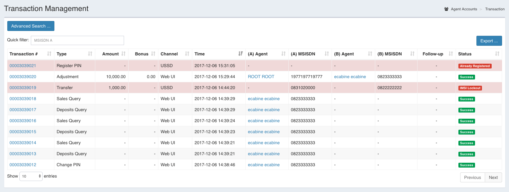

This screen shows the following information:

<table>
<colgroup>
<col style="width: 50%" />
<col style="width: 50%" />
</colgroup>
<tbody>
<tr class="odd">
<td>
<strong>Column Heading</strong>
</td>
<td>
<strong>Content</strong>
</td>
</tr>
<tr class="even">
<td>
Transaction #
</td>
<td>
A unique number identifying each transaction processed by ECDS.
</td>
</tr>
<tr class="odd">
<td>
Type
</td>
<td>
The type of transaction. Possible types are Replenish, Transfer, Airtime Sales, Bundle Sales, Self-Top-Up, PIN Registration, PIN Change, Balance Enquiry, Transaction Status Query, Last Transaction Query, Sales Query and Deposit Query
</td>
</tr>
<tr class="even">
<td>
Amount
</td>
<td>
Where relevant, the amount involved in the transaction
</td>
</tr>
<tr class="odd">
<td>
Bonus
</td>
<td>
Where relevant, the bonus amount involved in the transaction
</td>
</tr>
<tr class="even">
<td>
Channel
</td>
<td>
The channel through which the transaction request originated. Possible channels are USSD, SMS, APP, WUI, API, BATCH
</td>
</tr>
<tr class="odd">
<td>
Time
</td>
<td>
Date and time the transaction request was received
</td>
</tr>
<tr class="even">
<td>
(A) Agent
</td>
<td>
The agent requesting the transaction
</td>
</tr>
<tr class="odd">
<td>
(A) MSISDN
</td>
<td>
The mobile phone number of the requesting agent
</td>
</tr>
<tr class="even">
<td>
(B) Agent
</td>
<td>
Where relevant, the Agent or subscriber receiving credit
</td>
</tr>
<tr class="odd">
<td>
(B) MSISDN
</td>
<td>
Where relevant, the mobile phone number receiving credit
</td>
</tr>
<tr class="even">
<td>
Follow-Up
</td>
<td>
This indicates whether a transaction was flagged for follow up investigation. This typically occurs if there was no response from the Online Charging System.
</td>
</tr>
<tr class="odd">
<td>
Status
</td>
<td>
An indicator to show whether the transaction was successful, or if not, the reason for its failure.
</td>
</tr>
</tbody>
</table>

To change the sequence in which transactions are displayed, simply click
on a column heading. This will cause the transaction list to be
displayed in a sequence determined by the column content. Click again on
the same column heading to reverse the sequence. Sorting on Agent
columns is not available. The column on which sequence is based has a

icon adjacent to the column heading, indicating an ascending sequence,
or a

icon indicating descending sequence.

It is possible to change the number of transactions displayed on a page
by selecting a different value from the drop-down list displayed when
clicking on

below the

column. Use the

buttons displayed at bottom right to display the next or previous page
of transactions.

Clicking on the transaction number in the

column results in a detailed view of the transaction in question as
partially shown below:

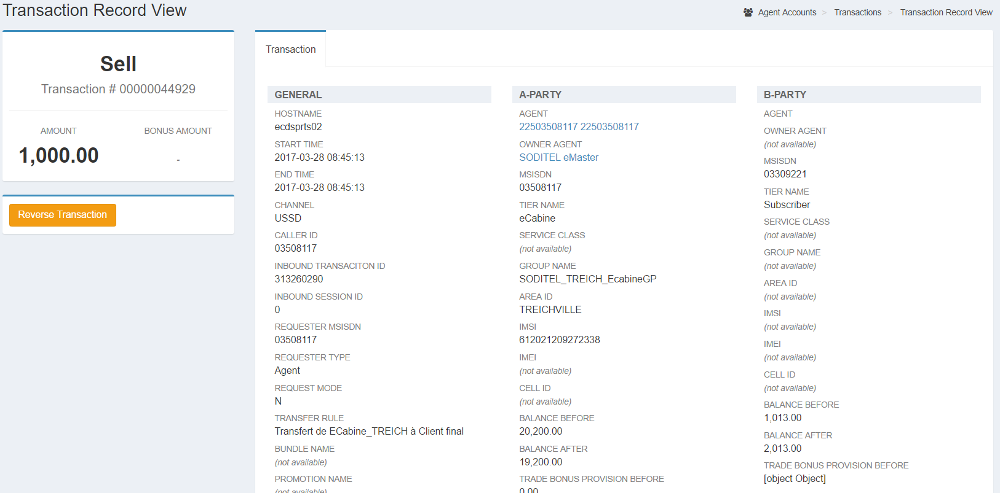

Searching for a Transaction
---------------------------

If the transaction number or the mobile phone number of any party to the
transaction is known, it can be entered in the

to find the transaction or the list of transactions relating to the
search criteria.  

Search criteria can be refined by clicking on the

button at the top of the page. This action results in additional search
criteria being displayed:

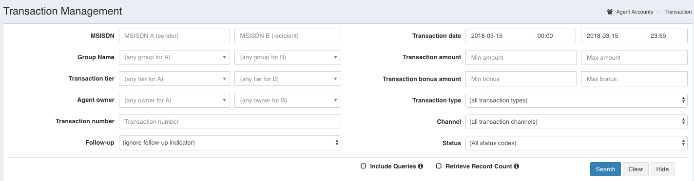

Transaction records can be found based on any one or a combination of
the search criteria shown. The more criteria you enter, the finer
grained your search results. After entering all desired search criteria,
click

which will cause all transactions satisfying the search criteria to be
displayed. To enter new search criteria, click on

and all previously entered criteria will be erased, ready to enter new
criteria. When searching is complete, click on

to cause the search text boxes to disappear.

> **Tip**
>
> There is a checkbox for *Retrieving Record Count*, which by default is
> not checked. This is to optimise the search result being displayed. If
> you explicitly want to know *how many* transactions meet your search
> criteria, check the "Retrieve Record Count" checkbox before searching.

> **Note**
>
> By default Query type transactions are excluded, these are
> transactions like balance query, sales and deposit queries which the
> agent has executed. To include these, select the include Queries
> checkbox.

Reversing a Transaction
-----------------------

It is possible to reverse sales, transfers and self top-up transactions.
Should a transaction happen in error for any reason, it could be
reversed, i.e. the status restored as if the transaction never took
place. If the amount of a transaction was incorrectly entered, a
transaction could also be partially reversed. Such reversals are only
possible if the Web Application user is suitably authorised and requires
co-authorisation by a second suitably authorised Web Application user.  
To reverse a transaction first locate the transaction by viewing the
**details** for that transaction as shown in the [Viewing
Transactions](#_viewing_transactions) section above. On the transaction
detail page, click the

button. A reversal pop-up window appears:

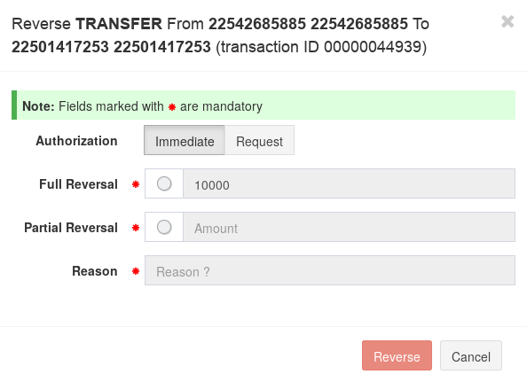

Authorisation by a co-authoriser may be immediate or may be Requested as
a workflow item. For immediate co-authorisation, click on
.
For authorisation Request, click on
.
This will cause an authorisation task to be sent to all users with the
neccessary permissions to co-authorise the transaction at a later time
or on another computer. See [Tasks](#_tasks) below.  

Click on the radio button next to

if the total amount of the transaction should be reversed. If this is
only a partial reversal, click the radio button next to

and enter the amount to be reversed. The reason for the reversal must be
entered. Click on the

button to continue, or click on the

button to abandon the reversal. If delayed authorisation was requested,
the pop-up screen disappears and a task is sent to a co-authoriser. If
immediate authorisation was requested, the screen changes to:

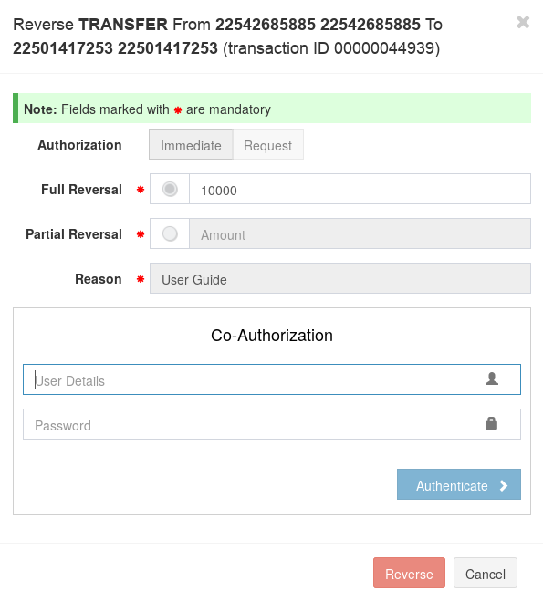

The co-authoriser now enters his/her username and password, then clicks
on the

button or click on the

button to abandon the reversal. If the user is a valid and authorised
user, the following is displayed:

The co-authoriser enters their pin and clicks on the

button to the right of the Pin text box to continue, or clicks on the

button to abandon the reversal. Continuing results in the pop-up window
closing, and the **Transaction Record View** changing to include the
successful **Reversal** view as in the following example:

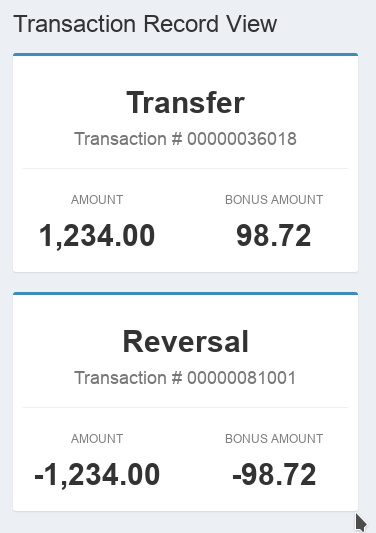

Adjudication of a Transaction marked for Follow up \[\[*Adjudicatin\_of\_a\_transaction\_marked\_for\_follow\_up*\]\]
---------------------------------------------------------------------------------------------------------------------

In the event that an Airtime Sales transaction did not receive a known
successful or failure response from the Online Charging Systems (OCS),
ECDS marks that transaction for Follow Up.  
All transactions marked for follow-up should be manually investigated
and then Adjudicated to mark the transaction as a Success or Failure.  

> **Note**
>
> At the time of the transaction, the transaction amount is debited from
> the Agents balance and placed into a Hold Account for the Agent,
> pending an investigation.

### Searching for Transactions marked for Follow up

It is possible to search for transactions which are **Pending
Adjudication** or **ALL**, by selecting the follow-up filter Criteria in
the Transaction Advanced Search screen as follows:

One of the following filter conditions can be selected:

<table>
<colgroup>
<col style="width: 50%" />
<col style="width: 50%" />
</colgroup>
<tbody>
<tr class="odd">
<td>
<strong>Follow-Up filter</strong>
</td>
<td>
<strong>Definition</strong>
</td>
</tr>
<tr class="even">
<td>
ignore follow up indicator
</td>
<td>
This ignores follow up indicators in the search criteria
</td>
</tr>
<tr class="odd">
<td>
ALL
</td>
<td>
Returns all Transactions which were marked for Follow-Up, including both adjudicated and non-adjudicated transactions
</td>
</tr>
<tr class="even">
<td>
Pending Adjudication
</td>
<td>
Returns only those transactions which are Pending Adjudication, i.e. those transactions requiring some action
</td>
</tr>
</tbody>
</table>

### The Adjudication Process

From the search result, select a transaction to adjudicate, by clicking
on the transaction number, and you will be presented with the
transaction detail view, similar to the example below:  

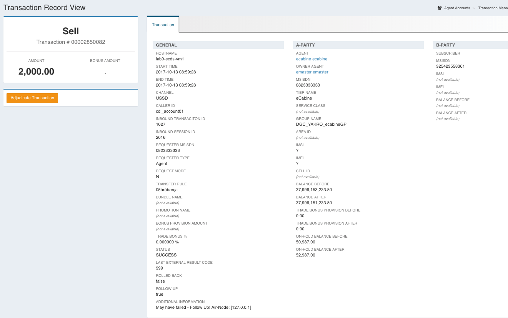

At the bottom of the transaction detail view, check the following
information to assist with investigation:  

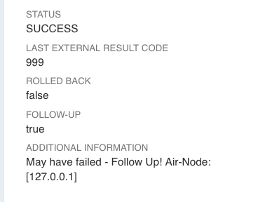

This information has the following Relevance to the investigation:

<table>
<colgroup>
<col style="width: 50%" />
<col style="width: 50%" />
</colgroup>
<tbody>
<tr class="odd">
<td>
<strong>Field name</strong>
</td>
<td>
<strong>Relevance</strong>
</td>
</tr>
<tr class="even">
<td>
Status
</td>
<td>
This indicates the transaction result.
</td>
</tr>
<tr class="odd">
<td>
Last External Result Code
</td>
<td>
Where available, this indicates the return code provided by the external system
</td>
</tr>
<tr class="even">
<td>
Rolled Back
</td>
<td>
This indicates if the transaction has been adjudicated and rolled back, i.e. marked as Failure
</td>
</tr>
<tr class="odd">
<td>
Follow-Up
</td>
<td>
The follow up indicator is set by the ECDS system, whenever a transaction receives an unclear result or timeouts towards an external system during the transaction.
</td>
</tr>
<tr class="even">
<td>
Additional Information
</td>
<td>
This indicates any additional information which may assist in investigation, in the example above, the IP address of the OCS node which returned error code 999 is provided
</td>
</tr>
</tbody>
</table>

Using the above and other relevant transaction information, investigate
the transaction on the OCS to determine whether the transaction
completed successfully or not.

To Adjudicate the transaction, on the transaction detail page, click the

button. The Adjudicate Transaction pop-up window appears:

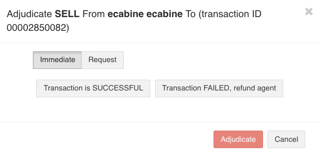

Select the desired outcome as either

or
.  
Authorisation by a co-authoriser may be immediate or may be Requested as
a workflow item. For immediate co-authorisation, click on
.
For authorisation Request, click on
.
This will cause an authorisation task to be sent to all users with the
neccessary permissions to co-authorise the transaction at a later time
or on another computer. See [Tasks](#_tasks) below.  

#### Adjudicate as Successful

In the event that the transaction is Adjudicated as Successful, the
transaction Amount is removed from the Hold account.

#### Adjudicate as Failure

In the event that a transaction is Adjudicated as Failure, the
transaction Amount is removed from the Hold account and Credited back to
the Agents Balance and the Rolled Back indicator in the transaction is
marked as Rolled Back.

Transfer Rules
==============

A Transfer Rule is a business rule governing the sales or transfer of
credit from an Account belonging to one Tier to a recipient belonging to
another Tier (see also the section on [Tiers](#_tiers)). To inspect,
change or add transfer rules, click on

in the ECDS menu bar. The Transfer Rules Management page displays:

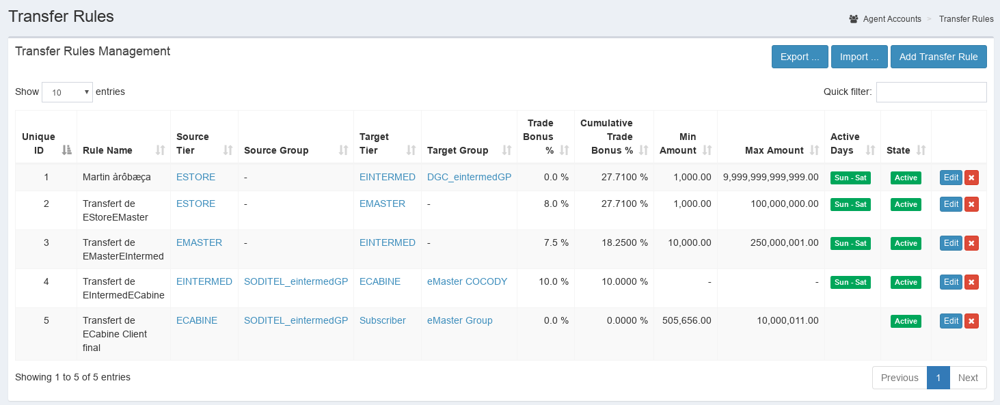

> **Note**
>
> It is not necessary to define Transfer Rules between Agent in the same
> Tier. By default, agents in the same Tier are permitted to transfer
> amongst themselves, however no bonuses or commissions shall apply for
> intra-tier transfers and these transactions are not counted towards
> Promotion Rewards or incentives.

Adding a Transfer Rule
----------------------

To add a new transfer rule click the

button located near the top right corner of the Transfer Rules
Management page. The Add Transfer Rule pop-up window appears:

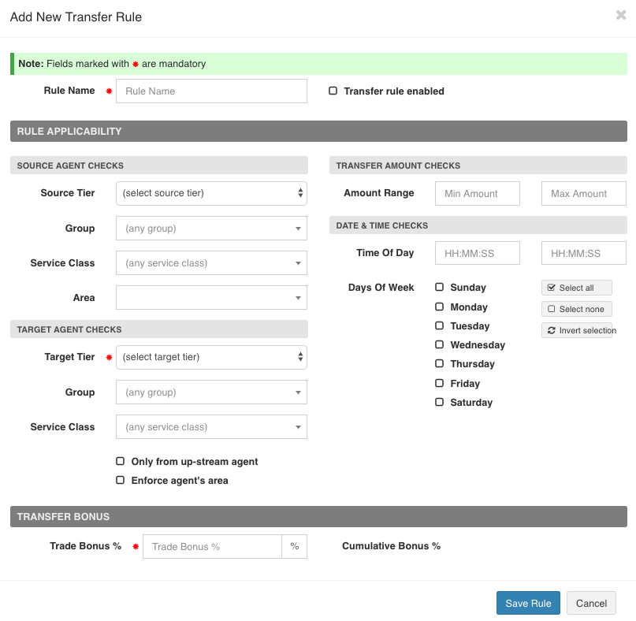

The fields defining the rule are as follows:

<table>
<colgroup>
<col style="width: 25%" />
<col style="width: 25%" />
<col style="width: 25%" />
<col style="width: 25%" />
</colgroup>
<tbody>
<tr class="odd">
<td>
<strong>Field</strong>
</td>
<td>
<strong>Definition</strong>
</td>
<td>
<strong>Constraints</strong>
</td>
<td>
<strong>Required</strong>
</td>
</tr>
<tr class="even">
<td>
Name
</td>
<td>
Name of the Transfer Rule
</td>
<td>
Not more than 25 characters
</td>
<td>
Yes
</td>
</tr>
<tr class="odd">
<td>
Source Tier
</td>
<td>
The Source Tier of the Transfer/Sale selected from the drop-down list.
</td>
<td>
Not a Subscriber Tier
</td>
<td>
Yes
</td>
</tr>
<tr class="even">
<td>
Target Tier
</td>
<td>
The Target Tier of the Transfer/Sale selected from the drop-down list
</td>
<td>
Not the Root Tier
</td>
<td>
Yes
</td>
</tr>
<tr class="odd">
<td>
Trade Bonus percent
</td>
<td>
The percentage Trade Bonus given to the Recipient Account, e.g. <em>1%</em>
</td>
<td>
Excludes cumulative Trade Bonuses for downstream transfers
</td>
<td>
No
</td>
</tr>
<tr class="even">
<td>
Area
</td>
<td>
Optional Area in which the transfer/sale is allowed
</td>
<td></td>
<td>
No
</td>
</tr>
<tr class="odd">
<td>
Group
</td>
<td>
Optional Group which the Source Account must belong to, selected from the drop-down list.
</td>
<td></td>
<td>
No
</td>
</tr>
<tr class="even">
<td>
Service Class
</td>
<td>
Optional Service Class the Source Account must belong to, selected from the drop-down list
</td>
<td>
As defined on the Charging System.
</td>
<td>
No
</td>
</tr>
<tr class="odd">
<td>
Minimum Amount
</td>
<td>
The minimum amount which may be transferred/sold
</td>
<td></td>
<td>
No
</td>
</tr>
<tr class="even">
<td>
Maximum Amount
</td>
<td>
The maximum amount which may be transferred/sold
</td>
<td></td>
<td>
No
</td>
</tr>
<tr class="odd">
<td>
Day of Week
</td>
<td>
Days of week the transfer/sale will be allowed
</td>
<td></td>
<td>
No
</td>
</tr>
<tr class="even">
<td>
Time of Day
</td>
<td>
Time of Day the transfer/sale will be allowed
</td>
<td></td>
<td>
No
</td>
</tr>
<tr class="odd">
<td>
Only from upstream agent
</td>
<td>
When ticked, Agents will only be able to receive transfers from the up-stream agent, defined in their Agent Profile
</td>
<td></td>
<td>
No
</td>
</tr>
<tr class="even">
<td>
Enforce Agents Area
</td>
<td>
When ticked, Agents will only be able to transfer/sell when they are in their defined area.
</td>
<td></td>
<td>
No
</td>
</tr>
<tr class="odd">
<td>
Rule Enabled
</td>
<td>
Status of the Transfer Rule
</td>
<td>
Active when ticked or Inactive when not ticked.
</td>
<td>
No
</td>
</tr>
</tbody>
</table>

Once all information defining the rule is entered, click

to store the rule or click

to abandon this unsaved rule.

Viewing and Searching Transfer Rules
------------------------------------

For each defined Transfer Rule, the Transfer Rules Management Page shows
the following in a single row:

-   Rule name

-   Source Tier

-   Target Tier

-   Bonus percentage

-   Minimum amount

-   Maximum amount

-   Allowed time

-   Allowed day of the week

-   Whether rule is enabled or not

The sequence in which the rules are listed may be changed by clicking on
any column heading. This will cause the rules to be sorted based on the
content of the selected column in either ascending or descending order,
indicated by

(ascending) or

(descending) icons next to the column header.

Should there be more than one page of Transfer Rules, the

buttons and text box will allow you to navigate to the previous, next or
specific page.

It is possible to change the number of Transfer Rules displayed on a
page by selecting a different value from the drop-down list displayed
when clicking on

near the left top corner of the Transfer Rules Management page.

Entering any text in the

text box shown at the top right of the page will result in only showing
those Transfer Rules containing the entered text in any field of the
Transfer Rule, including in numerical fields.

Clicking on either the Source Tier or the Target Tier in any of the rows
displaying a rule results in a comprehensive display of that Tier and
Transfer Rules governing incoming and outgoing transfers.

Editing Transfer Rules
----------------------

To change an existing transfer rule, first locate the rule as described
in [Viewing and Searching Transfer
Rules](#_viewing_and_searching_transfer_rules) above. Once the rule is
visible on the Transfer Rules Management page, click the

button in the row in which the rule to be edited is displayed. The Edit
Transfer Rule pop-up window appears:

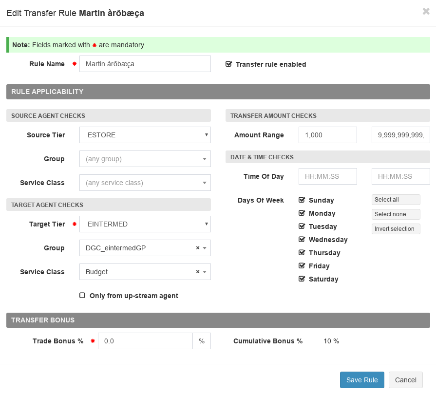

This window shows all the values entered for the rule (also see [Adding
a Transfer Rule](#_adding_a_transfer_rule) above for an explanation of
the information). Any displayed field can now be changed. To make the
changes permanent, click
,
alternatively click

to abandon the changes.

Deleting Transfer Rules
-----------------------

To delete an existing Transfer Rule, first locate the rule as described
in [Viewing and Searching Transfer
Rules](#_viewing_and_searching_transfer_rules) above. Once the rule is
visible on the Transfer Rules Management page, click the

button in the row in which the rule to be deleted is displayed. A
deletion confirmation window pops up:

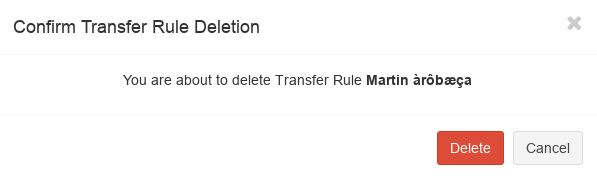

Click

to permanently delete the selected Transfer Rule or click

to retain the Transfer Rule.

> **Note**
>
> If a Transfer Rule has been used in a transaction, the system will not
> allow the user to delete the Transfer Rule. Only after transaction
> records have been archived out of the database, can historical
> Transfer Rules be deleted.

Importing Transfer Rules
------------------------

It is possible to define Transfer Rules in a batch file and import these
predefined Transfer Rules in a batch instead of entering each one
individually using the Web Application. Clicking the

button near the top right of the Transfer Rule Management page will
initiate this process which is fully described in the [Batch
Processing](#_batch_import) section below.

Exporting Transfer Rules
------------------------

ECDS offers the facility to export Transfer Rules detail to a CSV file
in the identical format and using the naming convention as described in
the [Batch Processing](#_batch_import) section below, but with the Verb
set to “verify” The file will be exported to the download location
defined in the settings of the web browser you are using. To accomplish
the export, click on the

button and inspect the configured download location.

Tiers
=====

Tiers represent the logical nodes of the distribution chain, from the
Root through one or more Wholesalers to Retailers and finally to
subscribers.  
Wholesaler Tiers are not hierarchical. Transfer Rules define how Credit
can be transferred between Wholesalers.  
The Root Tier and the Subscriber Tier are predefined and cannot be
deleted or edited. The Root Tier has no incoming Transfer Rules and the
Subscriber Tier has no outgoing Transfer Rules.

Adding a Tier
-------------

To define a new Tier click on

in the ECDS menu bar which causes the display of the Tiers Management
page:

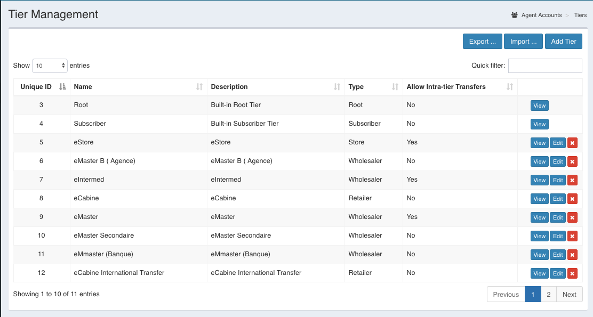

Click on

near the top right of the page. The Add New Tier pop-up window appears:

Information to be supplied to create a new Tier is as follows:

<table>
<colgroup>
<col style="width: 25%" />
<col style="width: 25%" />
<col style="width: 25%" />
<col style="width: 25%" />
</colgroup>
<tbody>
<tr class="odd">
<td>
<strong>Field</strong>
</td>
<td>
<strong>Definition</strong>
</td>
<td>
<strong>Constraints</strong>
</td>
<td>
<strong>Required</strong>
</td>
</tr>
<tr class="even">
<td>
Name
</td>
<td>
Name of the Tier, e.g. ‘eStore’
</td>
<td>
Not more than 20 characters
</td>
<td>
Yes
</td>
</tr>
<tr class="odd">
<td>
Description
</td>
<td>
Description of the Tier
</td>
<td>
Not more than 50 characters
</td>
<td>
Yes
</td>
</tr>
<tr class="even">
<td>
Tier Type
</td>
<td>
Type of Tier selected from a dropdown list, being either STORE, WHOLESALER or RETAILER
</td>
<td>
Wholesaler or Retailer
</td>
<td>
Yes
</td>
</tr>
<tr class="odd">
<td>
State
</td>
<td>
Status of the Tier selected from a dropdown list
</td>
<td>
Active or Inactive
</td>
<td>
Yes
</td>
</tr>
<tr class="even">
<td>
Allow intra-tier transfers
</td>
<td>
Select "Yes" if transfers within the same tier are permitted (Commissions are not applied on intra-tier transfers) or select "No" to disallow intra-tier transfers
</td>
<td>
Yes
</td>
<td>
Max Transaction Amount
</td>
</tr>
<tr class="odd">
<td>
The maximum amount members of this Tier can transfer in a single transaction
</td>
<td>
Numeric value
</td>
<td>
No
</td>
<td>
Max Daily Count
</td>
</tr>
<tr class="even">
<td>
The maximum number of transfers per day permitted for members of this Tier
</td>
<td>
Numeric value
</td>
<td>
No
</td>
<td>
Max Daily Amount
</td>
</tr>
<tr class="odd">
<td>
The sum of the amounts of all transfers done in a day may not exceed this amount for a member of this Tier
</td>
<td>
Numeric Value
</td>
<td>
No
</td>
<td>
Max Monthly Count
</td>
</tr>
<tr class="even">
<td>
The maximum number of transfers per month permitted for members of this Tier
</td>
<td>
Numeric Value
</td>
<td>
No
</td>
<td>
Max Monthly Amount
</td>
</tr>
</tbody>
</table>

> **Note**
>
> Intra-Tier transfers can be allowed or disallowed, when allowed, an
> agent may transfer funds to another agent which is on the exact same
> tier. Because both agents are on the same Tier, no commissions or
> bonusses are awarded and these transactions do not qualify for any
> rewards.

Once all information required to define the new Tier has been entered,
click

to create the new Tier, or click

to abandon the process. If all fields are valid, the pop-up window
disappears, the new Tier is saved and the Tiers page is displayed
showing the newly created Tier.

Viewing and Searching Tiers
---------------------------

For each defined Tier, the Tiers Management Page shows the following in
a single row:

-   Name

-   Description

-   Type

The sequence in which the Tiers are listed may be changed by clicking on
any column heading. This will cause the Tiers to be sorted based on the
content of the selected column in either ascending or descending order,
indicated by

(ascending) or

(descending) icons next to the column header.

Should there be more than one page of Tiers, the

buttons will allow you to navigate to the previous, next or specific
page.

It is possible to change the number of Tiers displayed on a page by
selecting a different value from the drop-down list displayed when
clicking on

near the left top corner of the Tiers page.

Entering any text in the

text box shown at the top right of the page will result in only showing
those Tiers containing the entered text in any field defining the tier,
including in numerical fields.

ECDS provides the ability to obtain a comprehensive view of a defined
Tier which includes the Transfer Rules governing transfers to the
selected Tier, as well as Transfer Rules governing transfer from the
selected Tier. Clicking the

button in the row in which the Tier in question is displayed results in
the following:

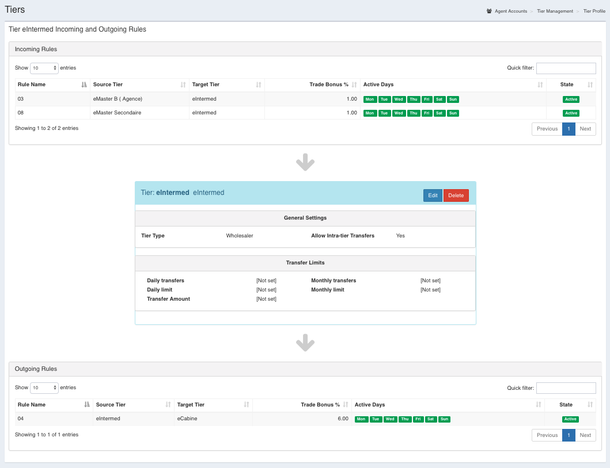

The page is divided into three parts: the top part displaying Transfer
Rule(s) governing transfer to the Tier; the middle section displaying
details regarding the Tier itself; and the bottom section displaying
Transfer Rule(s) governing transfer from this Tier. If there are more
than only one Transfer Rule, the

buttons and text field can be used to navigate to the next, previous or
specific Transfer Rule.

Editing Tiers
-------------

To change any detail of an existing Tier, first locate the Tier as
described in [Viewing and Searching
Tiers](#_viewing_and_searching_tiers) above. Once the Tier is visible on
the Tiers page, click the

button in the row in which the Tier to be edited is displayed. The Edit
Tier pop-up window appears:

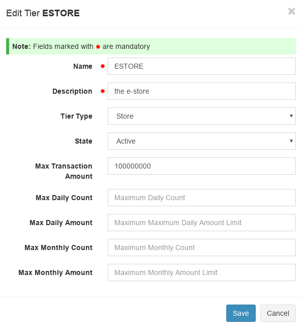

This pop-up window contains all the information detailed in [Adding a
Tier](#_adding_a_tier) above and any field may be changed. When all
changes have been entered, click

to store the changed Tier or click

to abandon the process.

Deleting a Tier
---------------

To delete an existing Tier, first locate the Tier as described in
[Viewing and Searching Tiers](#_viewing_and_searching_tiers) above. Once
the Tier is visible on the Tiers page, click the

button in the row in which the Tier to be deleted is displayed. A
deletion confirmation window pops up:

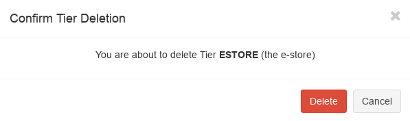

Click

to permanently delete the selected Tier or click

to retain the Tier.

> **Note**
>
> If a Tier has been used in a transaction, the system will not allow
> the user to delete. Only after transaction records have been archived
> out of the database, can historical Tiers be deleted.

Importing Tiers
---------------

It is possible to define Tiers in a batch file and import these
predefined Tiers in a batch instead of entering each one individually
using the Web Application. Clicking the

button near the top right of the Tiers page will initiate this process
which is fully described in the [Batch Processing](#_batch_import)
section below.

Exporting Tiers
---------------

ECDS offers the facility to export Tier detail to a CSV file in the
identical format and naming convention as described in the [Batch
Processing](#_batch_import) section below, but with the Verb set to
“verify” The file will be exported to the download location defined in
the settings of the web browser you are using. To accomplish the export,
click on the

button and inspect the configured download location.

Groups
======

Groups are arbitrary groupings of Agents for whom the same transfer or
promotion business rules may apply. A Group may only include Agents from
the same Tier and is used further segment Tiers for reporting purposes
or to impose fine-grained transfer limitations on Agents.

Adding a Group
--------------

To define a new group, first click on

in the ECDS menu bar displayed on the left of the page. The Group
Management page appears:

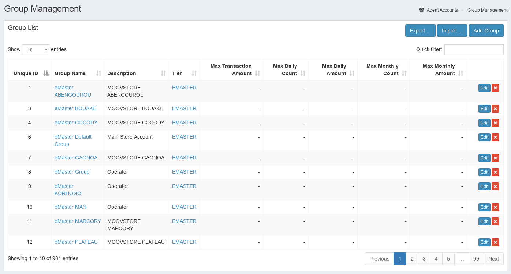

Click the

button near the top right of the page. The Add Group pop-up window
appears:

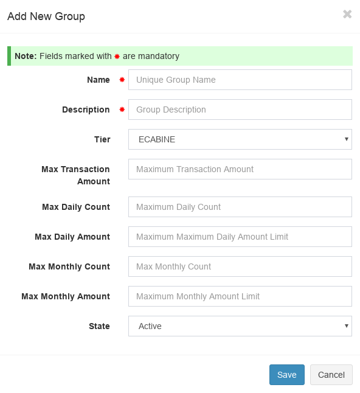

Information to be supplied to create a new Group is as follows:

<table>
<colgroup>
<col style="width: 25%" />
<col style="width: 25%" />
<col style="width: 25%" />
<col style="width: 25%" />
</colgroup>
<tbody>
<tr class="odd">
<td>
<strong>Field</strong>
</td>
<td>
<strong>Definition</strong>
</td>
<td>
<strong>Constraints</strong>
</td>
<td>
<strong>Required</strong>
</td>
</tr>
<tr class="even">
<td>
Name
</td>
<td>
Name of the Group
</td>
<td>
Not more than 30 characters
</td>
<td>
Yes
</td>
</tr>
<tr class="odd">
<td>
Description
</td>
<td>
Description of the Group
</td>
<td>
Not more than 50 characters
</td>
<td>
Yes
</td>
</tr>
<tr class="even">
<td>
Tier
</td>
<td>
Tier selected from a dropdown list
</td>
<td></td>
<td>
Yes
</td>
</tr>
<tr class="odd">
<td>
Max Transaction Amount
</td>
<td>
The maximum amount members of this Group can transfer in a single transaction
</td>
<td>
Numeric value
</td>
<td>
No
</td>
</tr>
<tr class="even">
<td>
Max Daily Count
</td>
<td>
The maximum number of transfers per day permitted for members of this Group
</td>
<td>
Numeric value
</td>
<td>
No
</td>
</tr>
<tr class="odd">
<td>
Max Daily Amount
</td>
<td>
The sum of the amounts of all transfers done in a day may not exceed this amount for a member of this Group
</td>
<td>
Numeric Value
</td>
<td>
No
</td>
</tr>
<tr class="even">
<td>
Max Monthly Count
</td>
<td>
The maximum number of transfers per month permitted for members of this Group
</td>
<td>
Numeric Value
</td>
<td>
No
</td>
</tr>
<tr class="odd">
<td>
Max Monthly Amount
</td>
<td>
The sum of the amounts of all transfers done in a month may not exceed this amount for ant member of this Group
</td>
<td>
Numeric Value
</td>
<td>
No
</td>
</tr>
<tr class="even">
<td>
State
</td>
<td>
Status of the Group selected from a dropdown list
</td>
<td>
Active or Deactivated
</td>
<td>
Yes
</td>
</tr>
</tbody>
</table>

Once all information required to define the new Group has been entered,
click

to create the new Group, or click

to abandon the process. If all fields are valid, the pop-up window
disappears, the new Group is saved and the Groups page is displayed
showing the newly created Group.

Viewing and Searching Groups
----------------------------

For each defined Group, the Group Management page shows the following in
a single row:

-   Group Name

-   Group Description

-   Tier Name that the Group belongs to

-   Maximum Transaction Amount

-   Maximum Daily Count

-   Maximum Daily Amount

-   Maximum Monthly Count

-   Maximum Monthly Amount

The sequence in which the Groups are listed may be changed by clicking
on any column heading. This will cause the Groups to be sorted based on
the content of the selected column in either ascending or descending
order, indicated by

(ascending) or

(descending) icons next to the column header.

Should there be more than one page of Groups, the

buttons will allow you to navigate to the previous, next or specific
page.

It is possible to change the number of Groups displayed on a page by
selecting a different value from the drop-down list displayed when
clicking on

near the left top corner of the Group Management page.

Entering any text in the

text box shown at the top right of the page will result in only showing
those Groups containing the entered text in any field defining the tier,
including in numerical fields.

Clicking on a Group name results in a display of the Group Profile:

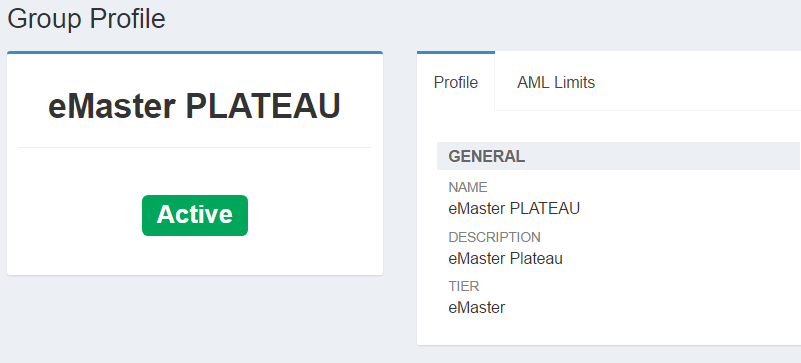

Clicking on the

tab results in Anti Money Laundering limits to be displayed:

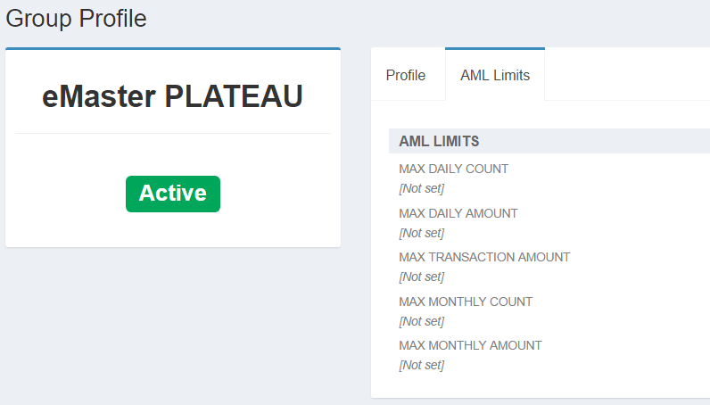

Editing a Group
---------------

To change any detail of an existing Group, first locate the Tier as
described in [Viewing and Searching
Groups](#_viewing_and_searching_groups) above. Once the Group is visible
on the Group Management page, click the

button in the row in which the Group to be edited is displayed. The Edit
Group pop-up window appears:

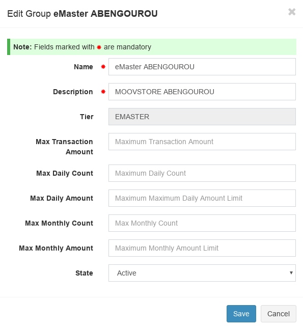

This pop-up window contains all the information detailed in [Adding a
Group](#_adding_a_group) above and any field may be changed. When all
changes have been entered, click

to store the changed Group or click

to abandon the process.

Deleting a Group
----------------

To delete an existing Group, first locate the Group as described in
[Viewing and Searching Groups](#_viewing_and_searching_groups) above.
Once the Group is visible on the Group Management page, click the

button in the row in which the Group to be deleted is displayed. A
deletion confirmation window pops up:

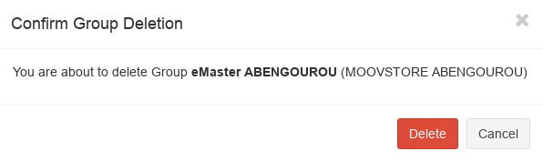

Click

to permanently delete the selected Group or click

to retain the Group.

> **Note**
>
> If a Group has been used in a transaction, the system will not allow
> the user to delete. Only after transaction records have been archived
> out of the database, can historical Groups be deleted.

Importing Groups
----------------

It is possible to define Groups in a batch file and import these
predefined Groups in a batch instead of entering each one individually
using the Web Application. Clicking the

button near the top right of the Groups Management page will initiate
this process which is fully described in the [Batch
Processing](#_batch_import) section below.

Exporting Groups
----------------

ECDS offers the facility to export Groups’ detail to a CSV file in the
identical format and using the naming convention as described in the
[Batch Processing](#_batch_import) section below, but with the Verb set
to “verify” The file will be exported to the download location defined
in the settings of the web browser you are using. To accomplish the
export, click on the

button and inspect the configured download location.

Service Classes
===============

Service Classes represent subscriber segmentation as defined on the
Changing System. Various Business Rules are dependent on the Agent’s
Service Class.

Adding a Service Class
----------------------

To define a new Service Class, first click on

in the ECDS menu bar displayed on the left of the page. The Service
Classes page appears:

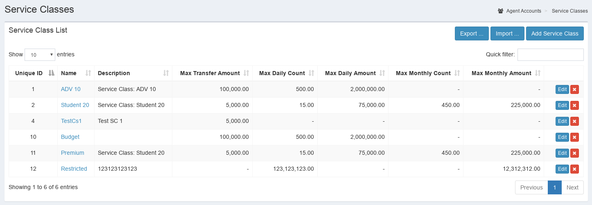

Click the

button near the top right of the page. The Add A New Service Class
pop-up window appears:

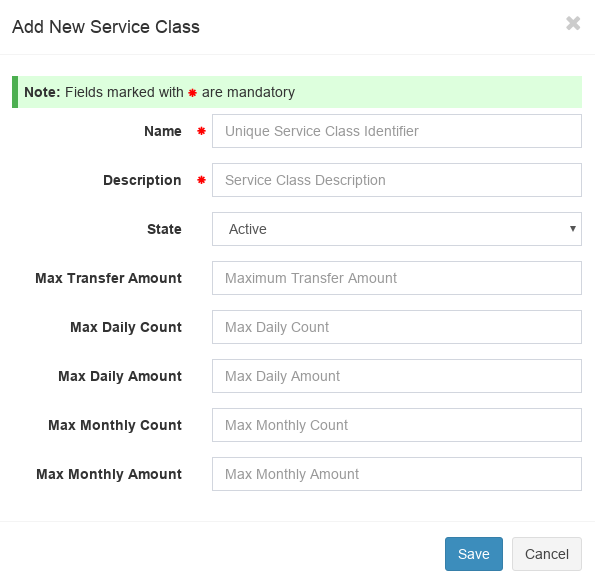

Information to be supplied to create a new Group is as follows:

<table>
<colgroup>
<col style="width: 25%" />
<col style="width: 25%" />
<col style="width: 25%" />
<col style="width: 25%" />
</colgroup>
<tbody>
<tr class="odd">
<td>
<strong>Field</strong>
</td>
<td>
<strong>Definition</strong>
</td>
<td>
<strong>Constraints</strong>
</td>
<td>
<strong>Required</strong>
</td>
</tr>
<tr class="even">
<td>
Name
</td>
<td>
Name of the Service Class
</td>
<td>
Not more than 20 characters
</td>
<td>
Yes
</td>
</tr>
<tr class="odd">
<td>
Description
</td>
<td>
Description of the Service Class
</td>
<td>
Not more than 50 characters
</td>
<td>
Yes
</td>
</tr>
<tr class="even">
<td>
State
</td>
<td>
State selected from a dropdown list
</td>
<td></td>
<td>
Yes
</td>
</tr>
<tr class="odd">
<td>
Max Transfer Amount
</td>
<td>
The maximum amount members of this Service Class can transfer in a single transaction
</td>
<td>
Numeric value
</td>
<td>
No
</td>
</tr>
<tr class="even">
<td>
Max Daily Count
</td>
<td>
The maximum number of transfers per day permitted for members of this Service Class
</td>
<td>
Numeric value
</td>
<td>
No
</td>
</tr>
<tr class="odd">
<td>
Max Daily Amount
</td>
<td>
The sum of the amounts of all transfers done in a day may not exceed this amount for a member of this Service Class
</td>
<td>
Numeric Value
</td>
<td>
No
</td>
</tr>
<tr class="even">
<td>
Max Monthly Count
</td>
<td>
The maximum number of transfers per month permitted for members of this Service Class
</td>
<td>
Numeric Value
</td>
<td>
No
</td>
</tr>
<tr class="odd">
<td>
Max Monthly Amount
</td>
<td>
The sum of the amounts of all transfers done in a month may not exceed this amount for ant member of this Service Class
</td>
<td>
Numeric Value
</td>
<td>
No
</td>
</tr>
</tbody>
</table>

Once all information required to define the new Service Class has been
entered, click

to create the new Service Class, or click

to abandon the process. If all fields are valid, the pop-up window
disappears, the new Service Class is saved and the Service Classes page
is displayed showing the newly created Service Class.

Viewing and Searching Service Classes
-------------------------------------

For each defined Service Class, the Service Classes page shows the
following in a single row:

-   Service Class Name

-   Service Class Description

-   Maximum Transaction Amount

-   Maximum Daily Count

-   Maximum Daily Amount

-   Maximum Monthly Count

-   Maximum Monthly Amount

The sequence in which the Service Classes are listed may be changed by
clicking on any column heading. This will cause the Service Classes to
be sorted based on the content of the selected column in either
ascending or descending order, indicated by

(ascending) or

(descending) icons next to the column header.

Should there be more than one page of Service Classes, the

buttons will allow you to navigate to the previous, next or specific
page.

It is possible to change the number of Service Classes displayed on a
page by selecting a different value from the drop-down list displayed
when clicking on

near the left top corner of the Service Classes page.

Entering any text in the

text box shown at the top right of the page will result in only showing
those Service Classes containing the entered text in any field defining
the Service Class, including in numerical fields.

Editing a Service Class
-----------------------

To change any detail of an existing Service Class, first locate the
Service Class as described in [Viewing and Searching Service
Classes](#_viewing_and_searching_service_classes) above. Once the
Service Class is visible on the Group Management page, click the

button in the row in which the Service Class to be edited is displayed.
The Edit Service Class pop-up window appears:

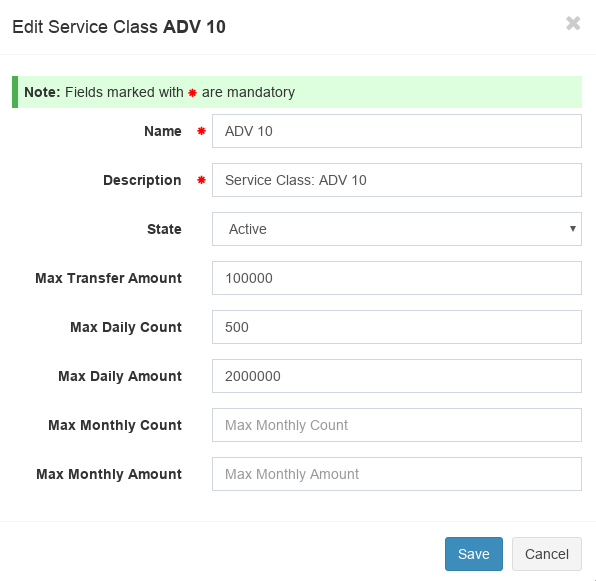

This pop-up window contains all the information detailed in [Adding a
Service Class](#_adding_a_service_class) above and any field may be
changed. When all changes have been entered, click

to store the changed Service Class or click

to abandon the process.

Deleting a Service Class
------------------------

To delete an existing Service Class, first locate the Service Class as
described in [Viewing and Searching Service
Classes](#_viewing_and_searching_service_classes) above. Once the
Service Class is visible on the Service Classes page, click the

button in the row in which the Service Class to be deleted is displayed.
A deletion confirmation window pops up:

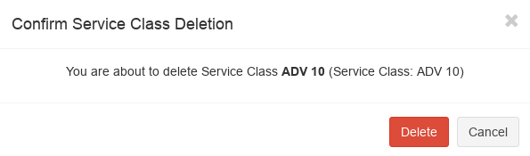

Click

to permanently delete the selected Service Class or click

to retain the Service Class.

> **Note**
>
> If a Service Class has been used in a transaction, the system will not
> allow the user to delete. Only after transaction records have been
> archived out of the database, can historical Service Class records be
> deleted.

Importing Service Classes
-------------------------

It is possible to define Service Classes in a batch file and import
these predefined Service Classes in a batch instead of entering each one
individually using the Web Application. Clicking the

button near the top right of the Service Class Management page will
initiate this process which is fully described in the [Batch
Processing](#_batch_import) section below.

Exporting Service Classes
-------------------------

ECDS offers the facility to export Service Classes’ detail to a CSV file
in the identical format and using the naming convention as described in
the [Batch Processing](#_batch_import) section below, but with the Verb
set to “verify” The file will be exported to the download location
defined in the settings of the web browser you are using. To accomplish
the export, click on the

button and inspect the configured download location.

Location Information
====================

Areas are a hierarchical collection of Cells and other Areas used to
enforce Location Based Rules. Areas and cells within those areas are
stored by ECDS.

Areas
-----

ECDS has the capacity to define and use up to 1000 Areas.

### Adding an Area

To add a new area, click on

and then on
.
A list of defined Areas is displayed:

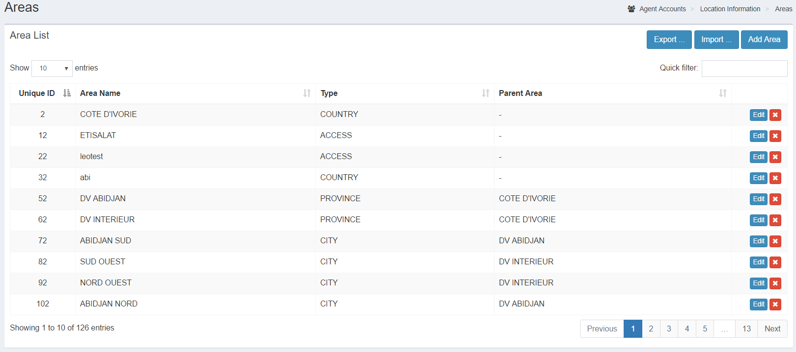

Click the

button near the top right of the page. The Add New Area pop-up window
appears:

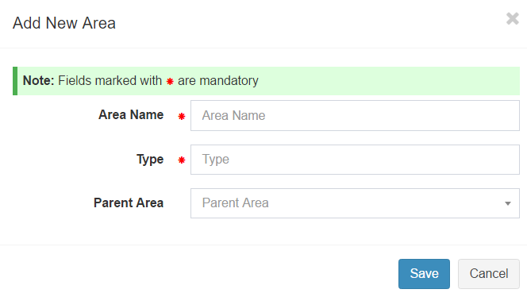

Information needed to add a new Area are as follows:

<table>
<colgroup>
<col style="width: 25%" />
<col style="width: 25%" />
<col style="width: 25%" />
<col style="width: 25%" />
</colgroup>
<tbody>
<tr class="odd">
<td>
<strong>Property</strong>
</td>
<td>
<strong>Definition</strong>
</td>
<td>
<strong>Constraints</strong>
</td>
<td>
<strong>Required</strong>
</td>
</tr>
<tr class="even">
<td>
Name
</td>
<td>
Name of the Areas
</td>
<td>
Not more than 30 characters
</td>
<td>
Yes
</td>
</tr>
<tr class="odd">
<td>
Type
</td>
<td>
Type of Area, e.g. Province
</td>
<td>
Not more than 30 characters
</td>
<td>
Yes
</td>
</tr>
<tr class="even">
<td>
Parent Area
</td>
<td>
Name of the Containing Area, if any
</td>
<td>
Not more than 30 characters
</td>
<td>
No
</td>
</tr>
</tbody>
</table>

Once all information required to define the new Area has been entered,
click

to create the new Area, or click

to abandon the process. The pop-up window disappears, the new Area is
saved and the Area List page is displayed showing the newly created
Area.

### Viewing and Searching Areas

For each defined Area, the Area List page shows the following in a
single row:

-   Area Name

-   Area type

-   Parent Area

-   Edit button

-   Delete button

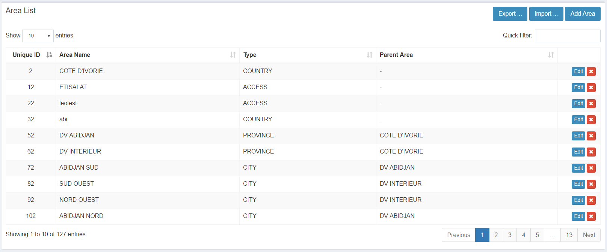

The sequence in which the Areas are listed may be changed by clicking on
any column heading. This will cause the Areas to be sorted based on the
content of the selected column in either ascending or descending order,
indicated by

(ascending) or

(descending) icons next to the column header.

Should there be more than one page of Areas, the

buttons will allow you to navigate to the previous, next or specific
page.

It is possible to change the number of Areas displayed on a page by
selecting a different value from the drop-down list displayed when
clicking on

near the left top corner of the Areas List page.

Entering any text in the

text box shown at the top right of the page will result in only showing
those Areas containing the entered text in any field defining the Area.

### Editing an Area

To change any detail of an existing Area, first locate the Area as
described above. Once the Area is visible on the Areas List page, click
the

button in the row in which the Area to be edited is displayed. The Edit
Area pop-up window appears:

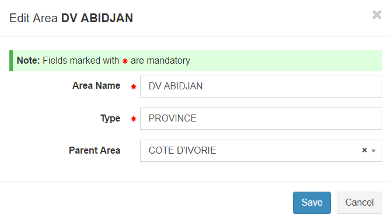

This pop-up window contains all the information detailed in **Add a New
Area** above and any field may be changed. The Parent Area text box will
present a drop-down list with all defined Areas to choose from. When all
changes have been entered, click

to store the changed Service Class or click

to abandon the process.

### Deleting an Area

To delete an Area, first locate the Area as described above. Once the
Area is visible on the Area List page, click the

button in the row in which the Area to be deleted is displayed. A
deletion confirmation window pops up:

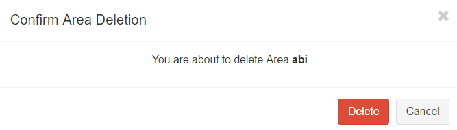

Click

to permanently delete the selected Area or click

to retain the Service Class.

> **Note**
>
> If an Area is referenced in a transaction, the system will not allow
> the user to delete that Area. Only after transaction records have been
> archived out of the database, can historical Areas be deleted.

### Importing Areas

It is possible to define Areas in a batch file and import these
predefined Areas in a batch instead of entering each one individually
using the Web Application. Clicking the

button near the top right of the Area List page will initiate this
process which described in the [Batch Processing](#_batch_import)
section below.

### Exporting Areas

ECDS offers the facility to export Areas’ detail to a CSV file in the
identical format and using the naming convention as described in the
[Batch Processing](#_batch_import) section below, with the Verb set to
“verify”. The file will be exported to the download location defined in
the settings of the web browser you are using. To accomplish the export,
click on the

button and inspect the configured download location.

Cells
-----

Cells correspond to GSM Cell IDs. Each Cell is associated with one or
more Areas. ECDS has the capability to define and use up to 20 000
Cells.

### Adding a Cell

To add a new Cell, click on

and then on
.
A list of defined Cells is displayed:

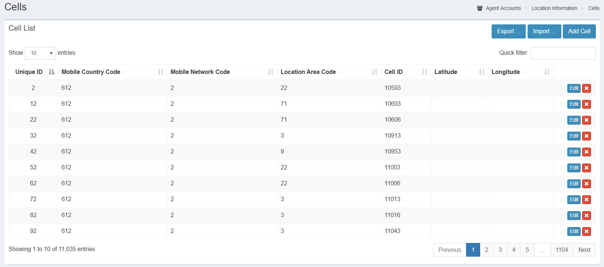

Click the

button near the top right of the page.  
The Add New Cell pop-up window appears:

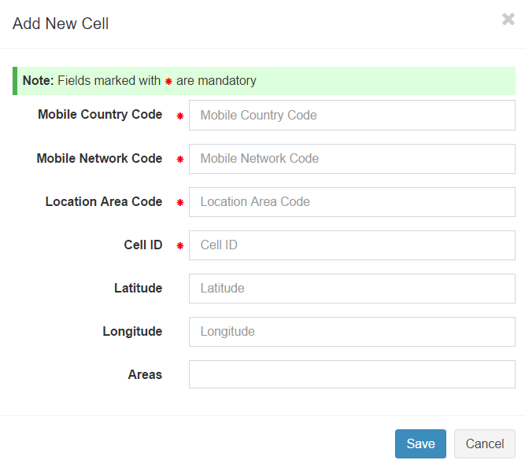

Information needed to add a new Cell are as follows:

<table>
<colgroup>
<col style="width: 25%" />
<col style="width: 25%" />
<col style="width: 25%" />
<col style="width: 25%" />
</colgroup>
<tbody>
<tr class="odd">
<td>
<strong>Property</strong>
</td>
<td>
<strong>Definition</strong>
</td>
<td>
<strong>Constraints</strong>
</td>
<td>
<strong>Required</strong>
</td>
</tr>
<tr class="even">
<td>
MCC
</td>
<td>
Mobile Country Code
</td>
<td>
612 for Côte d’Ivoire
</td>
<td>
Yes
</td>
</tr>
<tr class="odd">
<td>
MNC
</td>
<td>
Mobile Network Code
</td>
<td>
02 for Atlantique Cellulaire
</td>
<td>
Yes
</td>
</tr>
<tr class="even">
<td>
LAC
</td>
<td>
Local Area Code
</td>
<td></td>
<td>
Yes
</td>
</tr>
<tr class="odd">
<td>
CID
</td>
<td>
Cell ID
</td>
<td></td>
<td>
Yes
</td>
</tr>
<tr class="even">
<td>
Latitude
</td>
<td>
The median Latitude of the Cell
</td>
<td>
&lt; 90° and &gt; -90°
</td>
<td>
No
</td>
</tr>
<tr class="odd">
<td>
Longitude
</td>
<td>
The median Longitude of the Cell
</td>
<td>
&lt; 180° and &gt; -180°
</td>
<td>
No
</td>
</tr>
<tr class="even">
<td>
Areas
</td>
<td>
A list of Areas this cell belongs to.
</td>
<td></td>
<td>
No
</td>
</tr>
</tbody>
</table>

Once all information required to define the new Cell has been entered,
click

to create the new Cell, or click

to abandon the process. The pop-up window disappears, the new Cell is
saved and the Cells page is displayed showing the newly created Cell.

### Viewing and Searching Cells

For each defined Cell, the Cells page shows the following in a single
row:

-   Unique ID

-   Mobile Country Code

-   Mobile Network Code

-   Local area Code

-   Cell ID

-   Latitude

-   Longitude

-   An Edit button

-   A Delete button

The sequence in which the Cells are listed may be changed by clicking on
any column heading. This will cause the Cells to be sorted based on the
content of the selected column in either ascending or descending order,
indicated by

(ascending) or

(descending) icons next to the column header.

Should there be more than one page of Cells, the

buttons will allow you to navigate to the previous, next or specific
page.

It is possible to change the number of Cells displayed on a page by
selecting a different value from the drop-down list displayed when
clicking on

near the left top corner of the Cells page.

Entering any text in the

text box shown at the top right of the page will result in only showing
those Cells containing the entered text in any field defining the Cell.

Search criteria can be refined by clicking on the

button at the top of the page. This action results in additional search
criteria being displayed:

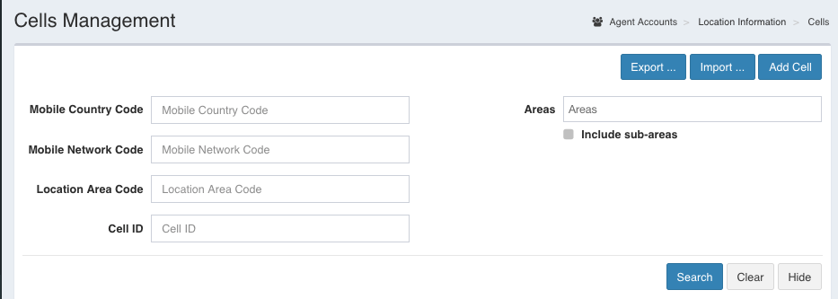

Cell records can be found based on any one or a combination of the
search criteria shown. The more criteria you enter, the finer grained
your search results. After entering all desired search criteria, click

which will cause all cells satisfying the search criteria to be
displayed. To enter new search criteria, click on

and all previously entered criteria will be erased, ready to enter new
criteria. When searching is complete, click on

to cause the search text boxes to disappear.

> **Tip**
>
> There is a checkbox for *Include Sub Areas*, which will include all
> Sub\_Areas in the search critiera.

### Editing a Cell

To change any detail of an existing Cell, first locate the Cell as
described above. Once the Cell is visible on the Cells page, click the

button in the row in which the Cell to be edited is displayed. The Edit
Cell pop-up window appears:

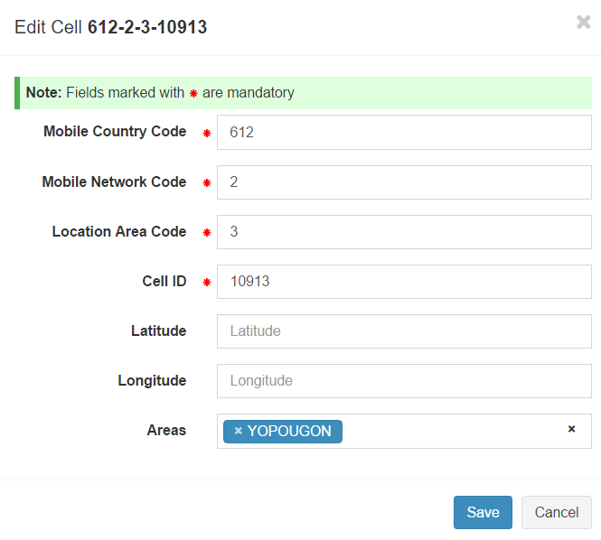

This pop-up window contains all the information detailed in **Add a New
Cell** above and any field may be changed. The Area text box will
present a drop-down list with all defined Areas to choose from. When all
changes have been entered, click

to store the changed Cell detail or click

to abandon the process.

### Deleting a Cell

To delete a Cell, first locate the Cell as described above. Once the
Cell is visible on the Cells page, click the

button in the row in which the Cell to be deleted is displayed. A
deletion confirmation window pops up:

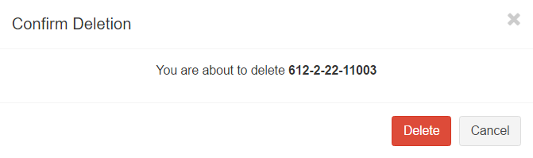

Click

to permanently delete the selected Cell or click

to retain the Cell.

> **Note**
>
> If a Cell is referenced in a transaction, the system will not allow
> the user to delete that Cell. Only after transaction records have been
> archived out of the database, can historical Cells be deleted.

### Importing Cells

It is possible to define Cells in a batch file and import these
predefined Cells in a batch instead of entering each one individually
using the Web Application. Clicking the

button near the top right of the Cells page will initiate this process
which is described in the [Batch Processing](#_batch_import) section
below.

### Exporting Cells

ECDS offers the facility to export Cells’ detail to a CSV file in the
identical format and using the naming convention as described in the
[Batch Processing](#_batch_import) section below, with the Verb set to
“verify”. The file will be exported to the download location defined in
the settings of the web browser you are using. To accomplish the export,
click on the

button and inspect the configured download location.

Promotions & Rewards
====================

Promotions allow the Operator to further incentivize Agents by rewarding
them with additional Credit if they achieve a sales target for a
specific set of circumstances and period of time. Promotions can be
defined in terms of

-   Start and End Time

-   Applicable Transfer Rule

-   Geographical Area

-   Agent Service Class

-   Bundle Type

-   Target Amount

-   Target Period (e.g. per day, week or month)

All qualifying Agent transactions are evaluated periodically, and when
an Agent qualifies for a particular promotion, his account will be
credited with the defined reward amount or percentage.

Adding a Promotion
------------------

To define a new Promotion, first click on

in the ECDS menu bar displayed on the left of the page. The Promotions
Management page appears:

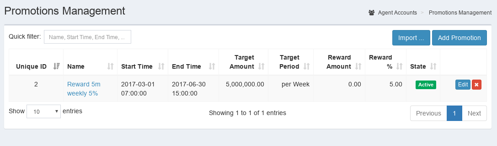

Click the

button near the top right of the page. The Add A New Promotion pop-up
window appears:

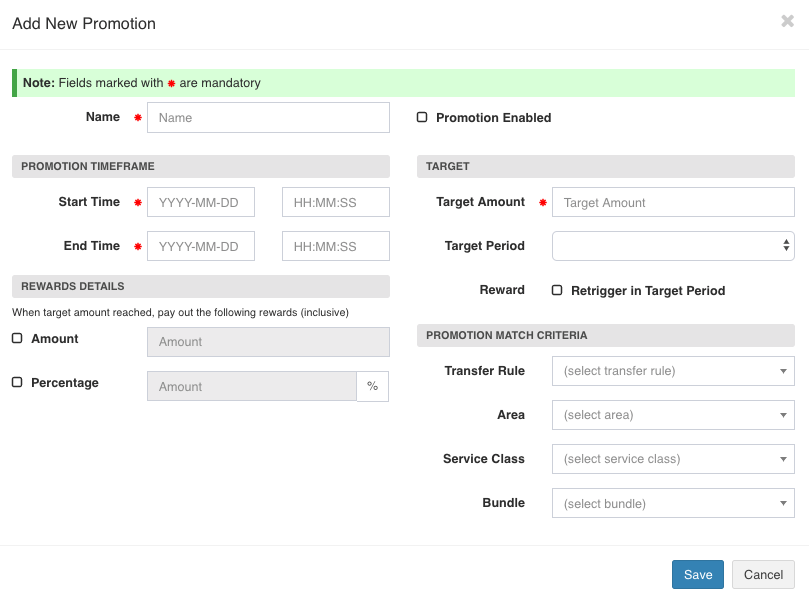

Information to be supplied to create a new Promotion is as follows:

<table>
<colgroup>
<col style="width: 25%" />
<col style="width: 25%" />
<col style="width: 25%" />
<col style="width: 25%" />
</colgroup>
<tbody>
<tr class="odd">
<td>
<strong>Field</strong>
</td>
<td>
<strong>Definition</strong>
</td>
<td>
<strong>Constraints</strong>
</td>
<td>
<strong>Required</strong>
</td>
</tr>
<tr class="even">
<td>
Name
</td>
<td>
Name of the Promotion
</td>
<td>
Not more than 20 characters
</td>
<td>
Yes
</td>
</tr>
<tr class="odd">
<td>
Promotion Enabled
</td>
<td>
Active or Inactive
</td>
<td></td>
<td>
yes
</td>
</tr>
<tr class="even">
<td>
Start Time
</td>
<td>
Date and time when the promotion starts
</td>
<td></td>
<td>
yes
</td>
</tr>
<tr class="odd">
<td>
End Time
</td>
<td>
Date and time when the promotion ends
</td>
<td></td>
<td>
yes
</td>
</tr>
<tr class="even">
<td>
Target Amount
</td>
<td>
The target amount to reach to qualify for the promotion
</td>
<td>
greater than zero
</td>
<td>
Yes
</td>
</tr>
<tr class="odd">
<td>
Target Period
</td>
<td>
The period in which the target must be achieved
</td>
<td>
perDay, perWeek, perMonth, perCalendarDay, perCalendarWeek, per CalendarMonth
</td>
<td>
Yes
</td>
</tr>
<tr class="even">
<td>
Reward Re-trigger
</td>
<td>
When selected, this will cause the Reward to trigger again within the promotion period, if the agent again achieves the target. If unchecked, the Agent can not receive more than one reward for the duration of the promotion.
</td>
<td></td>
<td>
No
</td>
</tr>
<tr class="odd">
<td>
Transfer Rule
</td>
<td>
(Optional) When selected, only transactions performed using the specified Transfer Rule will accumulate toward the target
</td>
<td></td>
<td>
No
</td>
</tr>
<tr class="even">
<td>
Area
</td>
<td>
(Optional) When selected, only transactions performed in the specified geographical area will accumulate toward the target
</td>
<td></td>
<td>
No
</td>
</tr>
<tr class="odd">
<td>
Service Class
</td>
<td>
Optional) When selected, only transactions performed in the specified Service Class will accumulate toward the target
</td>
<td></td>
<td>
No
</td>
</tr>
<tr class="even">
<td>
Bundle
</td>
<td>
(Optional) When selected, only Sales of the specified Bundle will accumulate toward the target
</td>
<td></td>
<td>
No
</td>
</tr>
<tr class="odd">
<td>
Reward Amount
</td>
<td>
The amount to be awarded as a reward if the sales target is met
</td>
<td>
Must be greater than zero
</td>
<td>
Yes
</td>
</tr>
<tr class="even">
<td>
Reward %
</td>
<td>
The percentage of the target amount that will be awarded as a reward if the sales target is met
</td>
<td>
Must be greater than zero percent. Stored in 8 decimal precision.
</td>
<td>
Yes
</td>
</tr>
</tbody>
</table>

Once all information required to define the new Promotion has been
entered, click

to create the new Promotion, or click

to abandon the process. If all fields are valid, the pop-up window
disappears, the new Promotion is saved and the Promotions page is
displayed showing the newly created Promotion.

Viewing and Searching Promotions
--------------------------------

For each defined Promotion, the Promotions Management page shows the
following in a single row:

-   Unique ID

-   Name

-   Start Time

-   End Time

-   Target Amount

-   Target Period

-   Reward Amount

-   Reward %

-   State

The sequence in which the Promotions are listed may be changed by
clicking on any column heading. This will cause the Promotions to be
sorted based on the content of the selected column in either ascending
or descending order, indicated by

(ascending) or

(descending) icons next to the column header.

Should there be more than one page of Promotions, the

buttons will allow you to navigate to the previous, next or specific
page.

It is possible to change the number of Promotions displayed on a page by
selecting a different value from the drop-down list displayed when
clicking on

near the left top corner of the Promotions page.

Entering any text in the

text box shown at the top right of the page will result in only showing
those Promotions containing the entered text in any field defining the
Promotion, including in numerical fields.

Editing a Promotion
-------------------

To change any detail of an existing Promotion, first locate the
Promotion as described in [Viewing and Searching
Promotions](#_viewing_and_searching_promotions) above. Once the
Promotion is visible on the Promotions Management page, click the

button in the row in which the Promotion to be edited is displayed. The
Edit Promotion pop-up window appears:

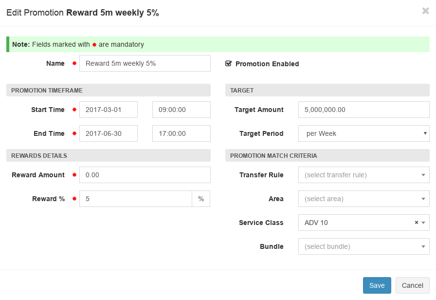

This pop-up window contains all the information detailed in [Adding a
Promotion](#_adding_a_promotion) above and any field may be changed.
When all changes have been entered, click

to store the changed Promotion or click

to abandon the process.

Deleting a Promotion
--------------------

To delete an existing Promotion, first locate the Promotion as described
in [Viewing and Searching
Promotions](#_viewing_and_searching_promotions) above. Once the
Promotion is visible on the Promotions page, click the

button in the row in which the Promotion to be deleted is displayed. A
deletion confirmation window pops up:

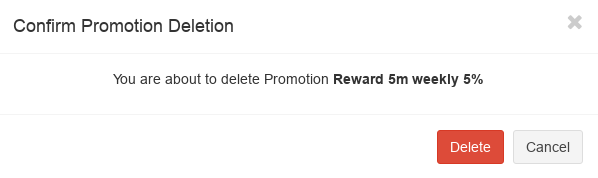

Click

to permanently delete the selected Promotion or click

to retain the Promotion.

> **Note**
>
> If a Promotion is referenced in a transaction, the system will not
> allow the user to delete that Promotion. Only after transaction
> records have been archived out of the database, can historical
> Promotions be deleted.

Importing Promotions
--------------------

It is possible to define Promotions in a batch file and import these
predefined Promotions in a batch instead of entering each one
individually using the Web Application. Clicking the

button near the top right of the Promotion Management page will initiate
this process which is fully described in the [Batch
Processing](#_batch_import) section below.

Exporting Promotions
--------------------

ECDS offers the facility to export Promotion details to a CSV file in
the identical format and using the naming convention as described in the
[Batch Processing](#_batch_import) section below, but with the Verb set
to “verify” The file will be exported to the download location defined
in the settings of the web browser you are using. To accomplish the
export, click on the

button and inspect the configured download location.

Bundle Sales \[\[*Bundle\_Sales*\]\]
====================================

In addition to selling airtime credit, Agents may also sell Bundles
consisting of a mix of airtime, SMSs and data. Bundles are defined using
the Promotion Creation Centre (PCC) with all defined business rules for
each bundle. ECDS communicates with PCC to provision a specific bundle
to subscriber.  

> **Note**
>
> All bundles are sold once-off and will therefore not be automatically
> renewed when they expire or become depleted, nor will they require any
> subscription on the part of Subscribers.

Configuring a Bundle
--------------------

To configure a new Promotion which has already been defined using PCC,
first click on

in the ECDS menu bar displayed on the left of the page. The Bundle Sales
Management page appears:

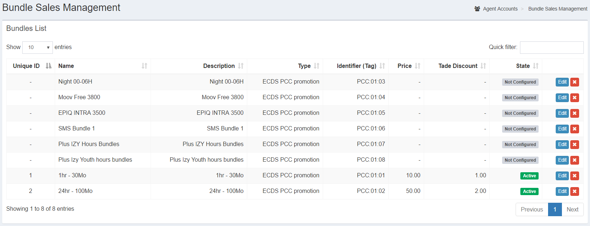

All Bundles already defined using PCC are shown. Every Bundle that shows
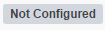
in the

column needs to be configured in order to be used. Click on
.
The Edit Bundle pop-up window appears:

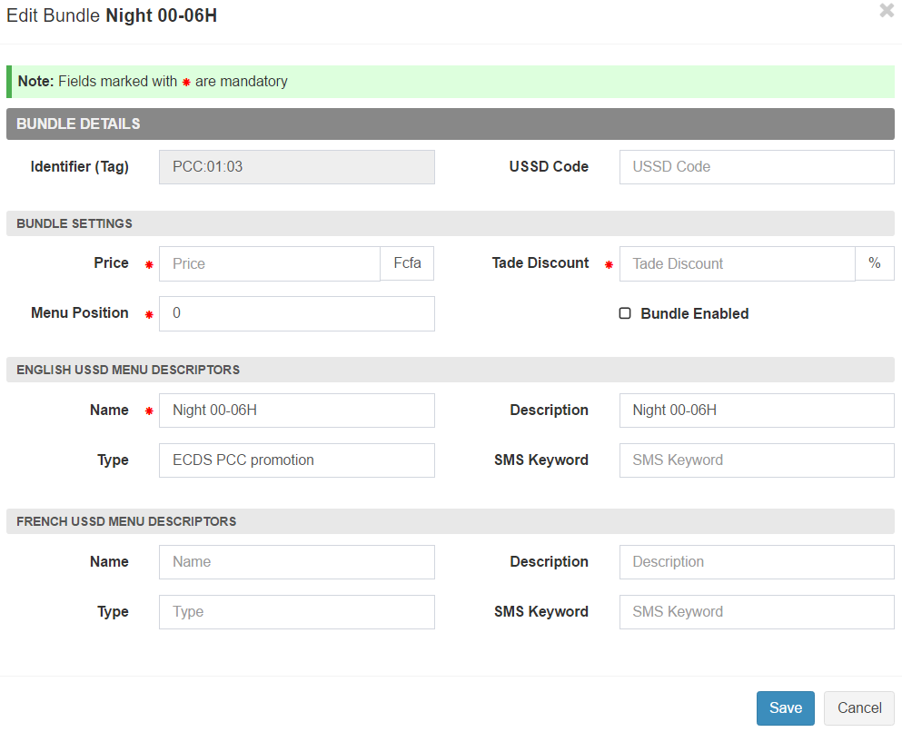

Information to be supplied to configure a new Bundle is as follows:

<table>
<colgroup>
<col style="width: 25%" />
<col style="width: 25%" />
<col style="width: 25%" />
<col style="width: 25%" />
</colgroup>
<tbody>
<tr class="odd">
<td>
<strong>Field</strong>
</td>
<td>
<strong>Definition</strong>
</td>
<td>
<strong>Constraints</strong>
</td>
<td>
<strong>Required</strong>
</td>
</tr>
<tr class="even">
<td>
Name
</td>
<td>
Name of the Bundle
</td>
<td>
Not more than 30 characters
</td>
<td>
Yes
</td>
</tr>
<tr class="odd">
<td>
Status
</td>
<td>
Status of the Bundle
</td>
<td>
Active or Inactive
</td>
<td>
Yes
</td>
</tr>
<tr class="even">
<td>
Price
</td>
<td>
Bundle Price
</td>
<td>
&gt; 0.00
</td>
<td>
Yes
</td>
</tr>
<tr class="odd">
<td>
Validity Period
</td>
<td>
Number of days before the bundle expires. Configured in PCC. Greater than 0, or none if the bundle doesn’t expire
</td>
<td></td>
<td>
No
</td>
</tr>
<tr class="even">
<td>
Data
</td>
<td>
Data Volume
</td>
<td>
≥ 0 kb. Configured in PCC
</td>
<td>
Yes
</td>
</tr>
<tr class="odd">
<td>
SMS
</td>
<td>
SMS Units
</td>
<td>
≥ 0 Units. Configured in PCC
</td>
<td>
Yes
</td>
</tr>
<tr class="even">
<td>
MMS
</td>
<td>
MMS Units
</td>
<td>
≥ 0 Units. Configured in PCC
</td>
<td>
Yes
</td>
</tr>
<tr class="odd">
<td>
Voice
</td>
<td>
Voice Minutes
</td>
<td>
≥ 0 Minutes. Configured in PCC
</td>
<td>
Yes
</td>
</tr>
<tr class="even">
<td>
Trade Discount
</td>
<td>
% Discount given to Agents
</td>
<td></td>
<td>
Yes
</td>
</tr>
<tr class="odd">
<td>
Menu Position
</td>
<td>
Position where this bundle will appear on the bundle sales menu
</td>
<td>
Not greater than number of defined bundles, &gt;0
</td>
<td>
Yes
</td>
</tr>
<tr class="even">
<td>
English Name
</td>
<td>
Name of the Bundle in English
</td>
<td></td>
<td>
Yes
</td>
</tr>
<tr class="odd">
<td>
English Description
</td>
<td>
Description of the Bundle in English
</td>
<td></td>
<td>
No
</td>
</tr>
<tr class="even">
<td>
English Type
</td>
<td>
description of the type of Bundle in English
</td>
<td></td>
<td>
No
</td>
</tr>
<tr class="odd">
<td>
English SMS keyword
</td>
<td>
Keyword to use when selling bundle via SMS
</td>
<td></td>
<td>
No
</td>
</tr>
<tr class="even">
<td>
French Name
</td>
<td>
Name of the Bundle in French
</td>
<td></td>
<td>
Yes
</td>
</tr>
<tr class="odd">
<td>
French Description
</td>
<td>
Description of the Bundle in French
</td>
<td></td>
<td>
No
</td>
</tr>
<tr class="even">
<td>
French Type
</td>
<td>
description of the type of Bundle in French
</td>
<td></td>
<td>
No
</td>
</tr>
<tr class="odd">
<td>
French SMS keyword
</td>
<td>
Keyword to use when selling bundle via SMS
</td>
<td></td>
<td>
No
</td>
</tr>
</tbody>
</table>

Once all information required to configure the Bundle has been entered,
click

to use the configured values for the Bundle, or click

to abandon the process. If all fields are valid, the pop-up window
disappears, the Bundle is saved and the Bundle Management page is
displayed showing the newly configured Bundle.

Viewing and Searching Bundles
-----------------------------

For each defined Bundle, the Bundle Sales Management page shows the
following in a single row:

-   Unique ID

-   Name

-   Description

-   Type

-   Identifier (relates to the PCC family and promotion within the
    family)

-   Price

-   Trade Discount

-   State

-   .. and the
    
    buttons

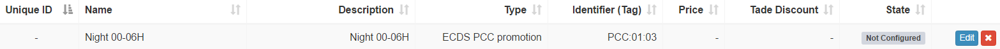

The sequence in which the Bundles are listed may be changed by clicking
on any column heading. This will cause the Bundles to be sorted based on
the content of the selected column in either ascending or descending
order, indicated by

(ascending) or

(descending) icons next to the column header.

Should there be more than one page of Bundles, the

buttons will allow you to navigate to the previous, next or specific
page.

It is possible to change the number of Bundles displayed on a page by
selecting a different value from the drop-down list displayed when
clicking on

near the left top corner of the Bundles sales management page.

Entering any text in the

text box shown at the top right of the page will result in only showing
those Bundles containing the entered text in any field defining the
Bundle, including in numerical fields.

Editing a Bundle
----------------

To change any detail of an existing Bundle, first locate the Bundle as
described in [Viewing and Searching
Bundles](#_viewing_and_searching_bundles) above. Once the Bundle is
visible on the Bundle Sales Management page, click the

button in the row in which the Bundle to be edited is displayed. The
Edit Bundle pop\_up window appears:

This pop-up window contains all the information detailed in [Configuring
a Bundle](#_configuring_a_bundle) above and any field may be changed.
When all changes have been entered, click

to store the changed Bundle or click

to abandon the process.

Deleting or Disabeling a Bundle
-------------------------------

> **Tip**
>
> Bundles pre-exist in an external system, whether this is the PCC
> (Promotion Creation Centre) or another third party system, and as such
> they can only be deactivated from ECDS. Selecting the Delete option,
> will deactivate the bundle. Bundles can then be re-enabled by Editing
> the bundle and selecting the Enable Bundle check box.

To delete (deactivate) an existing Bundle, first locate the Bundle as
described in [Viewing and Searching
Bundles](#_viewing_and_searching_bundles) above. Once the Bundle is
visible on the Bundle Management page, click the

button in the row in which the Bundle to be deleted is displayed. A
deletion confirmation window pops up:

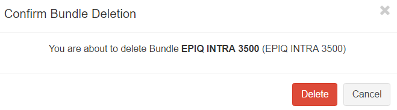

Click

to permanently delete the selected Bundle or click

to retain the Bundle.

Batch Processing
================

ECDS offers the facility to create and maintain certain classes of
information and transactions using batch file imports in the place of
manually entering information via the Web Application. The types of
information and transactions that could be imported via batch files are:
\* Web Users and Departments \* Tiers \* Service Classes \* Accounts \*
Groups \* Transfer Rules \* Adjustments (Bonus Exclusive) \* Adjustments
(Bonus Inclusive) \* Departments \* Location information, including
Areas, cells and cell groups \* Promotions  

> **Warning**
>
> **The ECDS Batch Processing facility complies with CSV standard
> RFC4180, which includes:**  
> \* Batch files have a header row containing the field names separated
> by commas  
> \* Fields are separated with commas (ASCII 44)  
> \* Lines are separated with a single NEW LINE (ASCII 10)  
> \* Text fields containing commas are encapsulated within double
> quotation marks (ASCII 34)  
> \* Quotation marks within text fields are escaped with another
> quotation mark (ASCII 34), note that this includes fields with
> multiple values, for example, when adding two areas for a cell, the
> two areas should be comma separated but within quotes, for example
> "Area1,Area2"  
> \* Each record is represented on one and only one line  
> \* Null or not applicable fields are left blank, e.g. 10,,Red  
> \* The column order is not significant as long as the header and field
> contents are aligned  

> **Tip**
>
> To obtain the latest batch file import format, select the file type
> you which to import from the Batch Processing Menu and the system will
> export an empty batch file in CSV format with the correct column
> headings.

> **Note**
>
> The system will not allow you to import the same file name more than
> once, so always change your filename before attempting to import data
> into ECDS.

> **Tip**
>
> Do not insert the id field when ADDing records by batch. The id is
> ignored in batch files for ADD records.

Special fields in Batch files
-----------------------------

Certain fields as specified in the import spec require parameterised
data, for example, for Active Status on an Agent record, an “A” is
used.  
The sections below outline Parameterised data in more detail and should
be referred to when creating batch import files, in order to avoid
import files being rejected, due to invalid data.

### Batch Verb

Verbs determine what sort of processing will be done with the data
supplied. The following verbs may be specified:

<table>
<colgroup>
<col style="width: 50%" />
<col style="width: 50%" />
</colgroup>
<tbody>
<tr class="odd">
<td>
<strong>Verb</strong>
</td>
<td>
<strong>Semantics</strong>
</td>
</tr>
<tr class="even">
<td>
add
</td>
<td>
Add the record. Fail if it already exists.
</td>
</tr>
<tr class="odd">
<td>
update
</td>
<td>
Update an existing record. Fail if it doesn’t exist.
</td>
</tr>
<tr class="even">
<td>
delete
</td>
<td>
Delete an existing record. Fail if doesn’t exist.
</td>
</tr>
<tr class="odd">
<td>
verify
</td>
<td>
Verify an existing record’s details. Fail if it doesn’t exist.
</td>
</tr>
<tr class="even">
<td>
upsert
</td>
<td>
Update an existing record. Create it when it doesn’t exist.
</td>
</tr>
</tbody>
</table>

### Status Indicators

Batch files shall only contain the Status Indicator, such as "A" for
Active.

<table>
<colgroup>
<col style="width: 33%" />
<col style="width: 33%" />
<col style="width: 33%" />
</colgroup>
<tbody>
<tr class="odd">
<td>
<strong>Indicator</strong>
</td>
<td>
<strong>Description</strong>
</td>
<td>
<strong>Types of Batch files where used</strong>
</td>
</tr>
<tr class="even">
<td>
A
</td>
<td>
Active
</td>
<td>
WebUser, Agent, Group, Service Class, Tier, TransferRule
</td>
</tr>
<tr class="odd">
<td>
I
</td>
<td>
Inactive
</td>
<td>
Tier, TransferRule
</td>
</tr>
<tr class="even">
<td>
D
</td>
<td>
Deactivated
</td>
<td>
WebUser, Agent, Group, Service Class
</td>
</tr>
<tr class="odd">
<td>
S
</td>
<td>
Suspended
</td>
<td>
WebUser , Agent
</td>
</tr>
<tr class="even">
<td>
P
</td>
<td>
Permanent
</td>
<td>
WebUser, Agent
</td>
</tr>
</tbody>
</table>

### Bearer Channels

Bearer channels are used in the Web User or Agent User imports and
denote the bearer channels, such as SMS or USSD which the Agent may use
to access the ECDS System. The Bearer channel in batch files are
calculated as a sum of the indicators for each bearer channels an Agent
can use. The value is calculated as follows: Sum of:

<table>
<colgroup>
<col style="width: 50%" />
<col style="width: 50%" />
</colgroup>
<tbody>
<tr class="odd">
<td>
<strong>Channel</strong>
</td>
<td>
<strong>Indicator</strong>
</td>
</tr>
<tr class="even">
<td>
USSD
</td>
<td>
1
</td>
</tr>
<tr class="odd">
<td>
SMS
</td>
<td>
2
</td>
</tr>
<tr class="even">
<td>
Smart App
</td>
<td>
4
</td>
</tr>
<tr class="odd">
<td>
API
</td>
<td>
8
</td>
</tr>
<tr class="even">
<td>
WUI
</td>
<td>
16
</td>
</tr>
</tbody>
</table>

For example:

-   USSD and SMS = 3 (1+2)  

-   USSD, SMS, SmartApp, WUI = 23 (1+2+4+16)  

-   USSD, SMS, SmartApp = 7 (1+2+4)  

### Language

The batch file shall only contain the two digit language indicator

<table>
<colgroup>
<col style="width: 50%" />
<col style="width: 50%" />
</colgroup>
<tbody>
<tr class="odd">
<td>
<strong>Language Indicator</strong>
</td>
<td>
<strong>Language</strong>
</td>
</tr>
<tr class="even">
<td>
en
</td>
<td>
English
</td>
</tr>
<tr class="odd">
<td>
fr
</td>
<td>
French
</td>
</tr>
</tbody>
</table>

### Gender

The batch file shall contain only the single digit indicators

<table>
<colgroup>
<col style="width: 50%" />
<col style="width: 50%" />
</colgroup>
<tbody>
<tr class="odd">
<td>
<strong>Gender Indicator</strong>
</td>
<td>
<strong>Gender</strong>
</td>
</tr>
<tr class="even">
<td>
M
</td>
<td>
Male
</td>
</tr>
<tr class="odd">
<td>
F
</td>
<td>
Female
</td>
</tr>
<tr class="even">
<td>
O
</td>
<td>
Other
</td>
</tr>
</tbody>
</table>

### Day of Week (DOW)

Similar to the bearer channels, the days of week are calculated as a sum
of indicators to denote all the Days of the Week which are permitted Sum
of:

<table>
<colgroup>
<col style="width: 50%" />
<col style="width: 50%" />
</colgroup>
<tbody>
<tr class="odd">
<td>
<strong>Day</strong>
</td>
<td>
*Day Indicator
</td>
</tr>
<tr class="even">
<td>
Sundays
</td>
<td>
1
</td>
</tr>
<tr class="odd">
<td>
Mondays
</td>
<td>
2
</td>
</tr>
<tr class="even">
<td>
Tuesdays
</td>
<td>
4
</td>
</tr>
<tr class="odd">
<td>
Wednesdays
</td>
<td>
8
</td>
</tr>
<tr class="even">
<td>
Thursdays
</td>
<td>
16
</td>
</tr>
<tr class="odd">
<td>
Fridays
</td>
<td>
32
</td>
</tr>
<tr class="even">
<td>
Saturdays
</td>
<td>
64
</td>
</tr>
</tbody>
</table>

For example:

-   Monday and Tuesday = 3 (1+2)

-   Monday to Sunday = 127 (1+2+4+8+16+32+64)

### Time of Day (Format)

Please use: T181359 for 6:13:59 pm

### Boolean indicators (e.g. strict Area/Strict Supplier)

Please use either Y, 1 or Yes for a positive answer and N, 0 or No for a
negative answer.

### Date formats:

The following date formats are acceptable: yyyyMMdd’T'HHmmss or yyyyMMdd

### Number formats:

The following Number formats are acceptable: 99999999.999

### Percentages

Percentages are between 0.0 and 999.9999

### Tier Types

<table>
<colgroup>
<col style="width: 50%" />
<col style="width: 50%" />
</colgroup>
<tbody>
<tr class="odd">
<td>
<strong>Tier</strong>
</td>
<td>
<strong>Indicator</strong>
</td>
</tr>
<tr class="even">
<td>
Root
</td>
<td>
.
</td>
</tr>
<tr class="odd">
<td>
Store
</td>
<td>
T
</td>
</tr>
<tr class="even">
<td>
Wholesaler
</td>
<td>
W
</td>
</tr>
<tr class="odd">
<td>
Retailer
</td>
<td>
R
</td>
</tr>
<tr class="even">
<td>
Subscriber
</td>
<td>
S
</td>
</tr>
</tbody>
</table>

Import Users and Departments
----------------------------

To import a batch of Users click on

in the ECDS menu bar displayed on the left of the page. The Batch
Processing page appears.  
Alternatively, click

in the ECDS menu bar displayed on the left of the page and then on
.
The Web Users page appears:

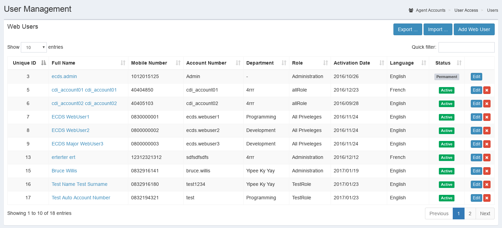

Click on
.
The Batch Processing page appears.

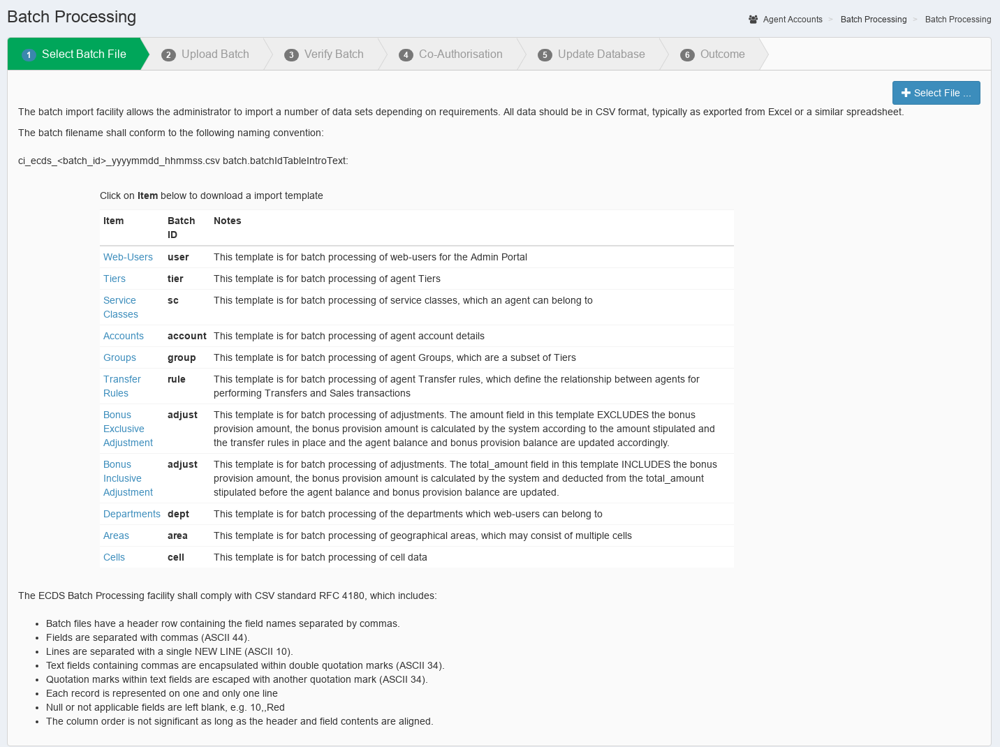

To Import Web Users, Prepare a Web User batch file named
**ci\_ecds\_user\_yyyymmdd\_hhmmss.csv**, where:

-   yyyy is the current year

-   mm is the current month

-   dd is the current day

-   hhmmss is the current time in hours, minutes and seconds.

An example of a valid User batch file name is
**ci\_ecds\_user\_20161201140500.csv**  
The first record in the User batch file must contain the header with
field names which determines the sequence in which fields are presented
in following records. Field names are:

<table>
<colgroup>
<col style="width: 50%" />
<col style="width: 50%" />
</colgroup>
<tbody>
<tr class="odd">
<td>
<strong>Field Name</strong>
</td>
<td>
<strong>Description</strong>
</td>
</tr>
<tr class="even">
<td>
verb
</td>
<td>
Determines the action to be performed. See <a href="#__batch_verb">Verbs</a>
</td>
</tr>
<tr class="odd">
<td>
surname
</td>
<td>
The User’s surname
</td>
</tr>
<tr class="even">
<td>
first_name
</td>
<td>
The User’s first name
</td>
</tr>
<tr class="odd">
<td>
initials
</td>
<td>
The User’s initials
</td>
</tr>
<tr class="even">
<td>
title
</td>
<td>
The User’s title
</td>
</tr>
<tr class="odd">
<td>
msisdn
</td>
<td>
the User’s mobile phone number
</td>
</tr>
<tr class="even">
<td>
email
</td>
<td>
The User’s email address
</td>
</tr>
<tr class="odd">
<td>
department
</td>
<td>
The department the User belongs to
</td>
</tr>
<tr class="even">
<td>
language
</td>
<td>
The User’s preferred language (EN or FR). See <a href="#__Lang_ind">Language Indicators</a>
</td>
</tr>
<tr class="odd">
<td>
role
</td>
<td>
The Role that authorises the User to perform certain actions
</td>
</tr>
<tr class="even">
<td>
account_number
</td>
<td>
The User’s Account Number
</td>
</tr>
<tr class="odd">
<td>
domain_account
</td>
<td>
The User’s Domain Account Number
</td>
</tr>
<tr class="even">
<td>
status
</td>
<td>
The User’s status. See <a href="#_status_indicators">Status Indicators</a>
</td>
</tr>
<tr class="odd">
<td>
activation_date
</td>
<td>
The date to be recorded as the date this User was activated. See <a href="#__dateformat">Date Formats</a>
</td>
</tr>
<tr class="even">
<td>
deactivation_date
</td>
<td>
The date on which the User will be deactivated. See <a href="#__dateformat">Date Formats</a>
</td>
</tr>
<tr class="odd">
<td>
expiration_date
</td>
<td>
The date on which the User’s access rights to the Web Application will expire See <a href="#__dateformat">Date Formats</a>
</td>
</tr>
<tr class="even">
<td>
id
</td>
<td>
Optional. Only used when a specific User’s details change, Obtained from an export of User detail.
</td>
</tr>
</tbody>
</table>

An example of a User import batch file with only the header and a single
data record is:  

    verb,surname,first_name,initials,title,msisdn,email,department,language,role,account_number,domain_account,status,activation_date,deactivation_date,expiration_date,id
    add,Jones,John,JJ,Mr,27721234321,john@jones.com,Marketing,EN,,123456,,active,,,,

To Import Departments, Prepare a Department batch file named
**ci\_ecds\_dept\_yyyymmdd\_hhmmss.csv**, where:

-   yyyy is the current year

-   mm is the current month

-   dd is the current day

-   hhmmss is the current time in hours, minutes and seconds.

An example of a valid Department batch file name is
**ci\_ecds\_dept\_20161201140500.csv**  
The first record in the Department batch file must contain the header
with field names which determines the sequence in which fields are
presented in following records. Field names are:

<table>
<colgroup>
<col style="width: 50%" />
<col style="width: 50%" />
</colgroup>
<tbody>
<tr class="odd">
<td>
<strong>Field Name</strong>
</td>
<td>
<strong>Description</strong>
</td>
</tr>
<tr class="even">
<td>
verb
</td>
<td>
Determines the action to be performed. See <a href="#__batch_verb">Verbs</a>
</td>
</tr>
<tr class="odd">
<td>
id
</td>
<td>
Optional. Only used when a specific department name is to change, Obtained from an export of department detail.
</td>
</tr>
<tr class="even">
<td>
name
</td>
<td>
The Department Name
</td>
</tr>
</tbody>
</table>

An example of a Department import batch file with only the header and a
single data record is:  

    verb,id,name
    add,,call centre

Once the batch file has been prepared, click the

button displayed near the top right of the Batch Processing page. The
File Navigation pop-up window appears:

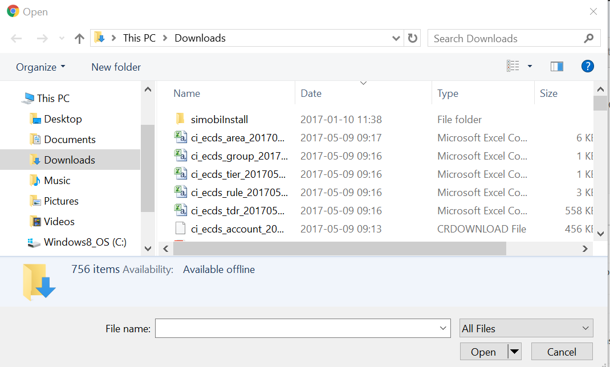

Navigate to the prepared batch file and click
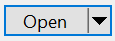.
Should there be no errors, successful importing is indicated by the
following:

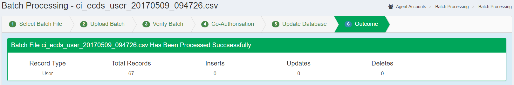

To import another batch, click on
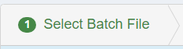
near the top left of the page. The Batch Processing page reappears and
additional batches can be imported as described above.

Import Tiers
------------

To import a batch of Tiers click on

in the ECDS menu bar displayed on the left of the page. The Batch
Processing page appears.  
Alternatively, click

in the ECDS menu bar displayed on the left of the page The Tiers page
appears:

Click on
.
The Batch Processing page appears.

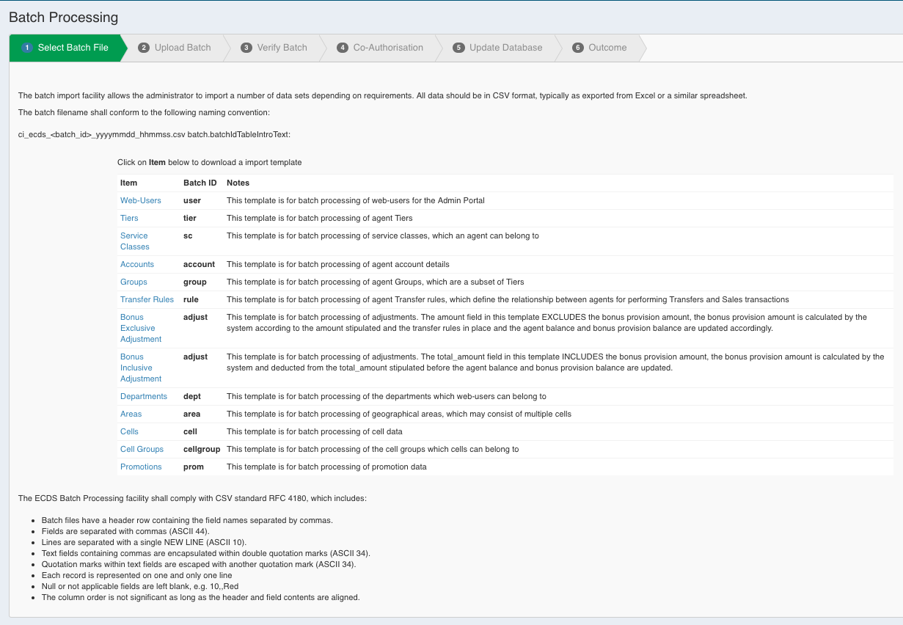

Prepare a Tier batch file named
**ci\_ecds\_tier\_yyyymmdd\_hhmmss.csv**, where:

-   yyyy is the current year

-   mm is the current month

-   dd is the current day

-   hhmmss is the current time in hours, minutes and seconds.

An example of a valid Tier batch file name is
**ci\_ecds\_tier\_20161201140500.csv**  
The first record in the Tier batch file must contain the header with
field names which determines the sequence in which fields are presented
in following records. Field names are:

<table>
<colgroup>
<col style="width: 50%" />
<col style="width: 50%" />
</colgroup>
<tbody>
<tr class="odd">
<td>
<strong>Field Name</strong>
</td>
<td>
<strong>Description</strong>
</td>
</tr>
<tr class="even">
<td>
verb
</td>
<td>
Determines the action to be performed. See <a href="#__batch_verb">Verbs</a>
</td>
</tr>
<tr class="odd">
<td>
name
</td>
<td>
The name of the Tier. Not more than 20 characters.
</td>
</tr>
<tr class="even">
<td>
description
</td>
<td>
A description of the Tier. Not more than 20 characters
</td>
</tr>
<tr class="odd">
<td>
status
</td>
<td>
Indicates status, for example A for “active”. See <a href="#_status_indicators">Status Indicators</a>
</td>
</tr>
<tr class="even">
<td>
Allow intra-tier transfers
</td>
<td>
Select "Yes" if transfers within the same tier are permitted (Commissions are not applied on intra-tier transfers) or select "No" to disallow intra-tier transfers
</td>
</tr>
<tr class="odd">
<td>
type
</td>
<td>
Indicates the Tier Type for example "W" for Wholesaler. See <a href="#__Tier_Types">Tier Types</a>
</td>
</tr>
<tr class="even">
<td>
max_amount
</td>
<td>
The maximum amount members of this Tier is allowed to transfer in any single transaction
</td>
</tr>
<tr class="odd">
<td>
max_daily_count
</td>
<td>
The maximum number of transfers allowed for members of this Tier per day
</td>
</tr>
<tr class="even">
<td>
max_daily_amount
</td>
<td>
The maximum total amount members of this tier may transfer per day
</td>
</tr>
<tr class="odd">
<td>
max_monthly_count
</td>
<td>
The maximum number of transfers allowed for members of this Tier per month
</td>
</tr>
<tr class="even">
<td>
max_monthly_amount
</td>
<td>
The maximum total amount members of this tier may transfer per month
</td>
</tr>
<tr class="odd">
<td>
service_classes
</td>
<td>
The Service Class that members of this Tier belong to
</td>
</tr>
<tr class="even">
<td>
id
</td>
<td>
Optional. Only used when the Tier’s name field is changed., Obtained from an export of Tier detail.
</td>
</tr>
</tbody>
</table>

An example of a Tier import batch file with only the header and a single
data record is:  

    verb,id,name,status,type,description,max_amount,max_daily_count,max_daily_amount,max_monthly_count,max_monthly_amount,allow_intratier_transfer
    add,Retail5,Retailer in Region,5,active,retail,50,40,150,1000,4000,25,Y

Once the batch file has been prepared, click the

button displayed near the top right of the Batch Processing page. The
File Navigation pop-up window appears:

To import another batch, click on

near the top left of the page. The Batch Processing page reappears and
additional batches can be imported as described above.

Import Service Classes
----------------------

To import a batch of Service Classes click on

in the ECDS menu bar displayed on the left of the page. The Batch
Processing page appears.  
Alternatively, click

in the ECDS menu bar displayed on the left of the page. The Service
Classes page appears:

Click on
.
The Batch Processing page appears.

Prepare a Service Class batch file named
**ci\_ecds\_sc\_yyyymmdd\_hhmmss.csv**, where:

-   yyyy is the current year

-   mm is the current month

-   dd is the current day

-   hhmmss is the current time in hours, minutes and seconds.

An example of a valid Service Class batch file name is
**ci\_ecds\_sc\_20161201140500.csv**  
The first record in the Service Class batch file must contain the header
with field names which determines the sequence in which fields are
presented in following records. Field names are:

<table>
<colgroup>
<col style="width: 50%" />
<col style="width: 50%" />
</colgroup>
<tbody>
<tr class="odd">
<td>
<strong>Field Name</strong>
</td>
<td>
<strong>Description</strong>
</td>
</tr>
<tr class="even">
<td>
verb
</td>
<td>
Determines the action to be performed. See <a href="#__batch_verb">Verbs</a>
</td>
</tr>
<tr class="odd">
<td>
name
</td>
<td>
The name of the Service Class. Not more than 20 characters.
</td>
</tr>
<tr class="even">
<td>
description
</td>
<td>
A description of the Service Class. Not more than 20 characters
</td>
</tr>
<tr class="odd">
<td>
status
</td>
<td>
Indicates status, for example A for “active”. See <a href="#_status_indicators">Status Indicators</a>
</td>
</tr>
<tr class="even">
<td>
max_amount
</td>
<td>
The maximum amount members of this Service Class is allowed to transfer in any single transaction
</td>
</tr>
<tr class="odd">
<td>
max_daily_count
</td>
<td>
The maximum number of transfers allowed for members of this Service Class per day
</td>
</tr>
<tr class="even">
<td>
max_daily_amount
</td>
<td>
The maximum total amount members of this Service Class may transfer per day
</td>
</tr>
<tr class="odd">
<td>
max_monthly_count
</td>
<td>
The maximum number of transfers allowed for members of this Service Class per month
</td>
</tr>
<tr class="even">
<td>
max_monthly_amount
</td>
<td>
The maximum total amount members of this Service Class may transfer per month
</td>
</tr>
<tr class="odd">
<td>
id
</td>
<td>
Optional. Only used when the Service Class’ name field is changed., Obtained from an export of Service Class detail.
</td>
</tr>
</tbody>
</table>

An example of a Service Class import batch file with only the header and
a single data record is:  

    verb,name,description,status,max_amount,max_daily_count,max_daily_amount,max_monthly_count,max_monthly_amount,service_classes,id
    add,Service Class name,SC Description,active,50,40,150,1000,4000,25,

Once the batch file has been prepared, click the

button displayed near the top right of the Batch Processing page. The
File Navigation pop-up window appears:

Navigate to the Service Class prepared batch file and click
.

To import another batch, click on

near the top left of the page. The Batch Processing page reappears and
additional batches can be imported as described above.

Import Agent Accounts
---------------------

To import a batch of Agent Accounts click on

in the ECDS menu bar displayed on the left of the page. The Batch
Processing page appears.  
Alternatively, click

in the ECDS menu bar displayed on the left of the page. The Agent
Accounts page appears:

Click on
.
The Batch Processing page appears.

Prepare an Agent Accounts batch file named
**ci\_ecds\_acc\_yyyymmdd\_hhmmss.csv**, where:

-   yyyy is the current year

-   mm is the current month

-   dd is the current day

-   hhmmss is the current time in hours, minutes and seconds.

An example of a valid Agent Accounts batch file name is
**ci\_ecds\_acc\_20161201140500.csv**  
The first record in the Agent Accounts batch file must contain the
header with field names which determines the sequence in which fields
are presented in following records. Field names are:

<table>
<colgroup>
<col style="width: 33%" />
<col style="width: 33%" />
<col style="width: 33%" />
</colgroup>
<tbody>
<tr class="odd">
<td>
<strong>Field Name</strong>
</td>
<td>
<strong>Description</strong>
</td>
<td>
Required or Optional
</td>
</tr>
<tr class="even">
<td>
verb
</td>
<td>
Determines the action to be performed. See <a href="#__batch_verb">Verbs</a>.
</td>
<td>
Required
</td>
</tr>
<tr class="odd">
<td>
temp_pin
</td>
<td>
Specify if Agent must use this PIN to login, but be forced to change PIN.
</td>
<td>
Optional
</td>
</tr>
<tr class="even">
<td>
warning_threshold
</td>
<td>
When an Agent’s balance drops below this amount, both the Agent and his supplier will get a warning SMS.
</td>
<td>
Optional
</td>
</tr>
<tr class="odd">
<td>
activation_date
</td>
<td>
Date on which the Agent will be able to start trading See <a href="#__dateformat">Date Formats</a>
</td>
<td>
Required.
</td>
</tr>
<tr class="even">
<td>
max_amount
</td>
<td>
The maximum amount the Agent is allowed to transfer in any single transaction.
</td>
<td>
Required.
</td>
</tr>
<tr class="odd">
<td>
max_daily_count
</td>
<td>
The maximum number of transfers allowed for the Agent per day.
</td>
<td>
Required.
</td>
</tr>
<tr class="even">
<td>
max_daily_amount
</td>
<td>
The maximum total amount the Agent may transfer per day.
</td>
<td>
Required.
</td>
</tr>
<tr class="odd">
<td>
max_monthly_count
</td>
<td>
The maximum number of transfers allowed for the Agent per month.
</td>
<td>
Required.
</td>
</tr>
<tr class="even">
<td>
max_monthly_amount
</td>
<td>
The maximum total amount the Agent may transfer per month.
</td>
<td>
Required.
</td>
</tr>
<tr class="odd">
<td>
deactivation_date
</td>
<td>
Date the account has been deactivated. Optional if never.
</td>
<td>
Optional.
</td>
</tr>
<tr class="even">
<td>
expiration_date
</td>
<td>
The date on which the Account will expire.
</td>
<td>
Required.
</td>
</tr>
<tr class="odd">
<td>
last_imsi_change
</td>
<td>
The date on which the Agent’s IMSI changed the last time.
</td>
<td>
Required if IMSI changed.
</td>
</tr>
<tr class="even">
<td>
dob
</td>
<td>
The Agent’s date of birth using format: yyyyMMdd’T'HHmmss or yyyyMMdd See <a href="#__dateformat">Date Formats</a>.
</td>
<td>
Optional.
</td>
</tr>
<tr class="odd">
<td>
title
</td>
<td>
The Agent’s title. Not more than 10 characters.
</td>
<td>
Required.
</td>
</tr>
<tr class="even">
<td>
surname
</td>
<td>
The Agent’s surname.
</td>
<td>
Required.
</td>
</tr>
<tr class="odd">
<td>
first_name
</td>
<td>
The Agent’s first name.
</td>
<td>
Required.
</td>
</tr>
<tr class="even">
<td>
initials
</td>
<td>
The Agent’s initials.
</td>
<td>
Optional.
</td>
</tr>
<tr class="odd">
<td>
language
</td>
<td>
The Agent’s preferred language. See <a href="#__Lang_ind">Language Indicator</a>
</td>
<td>
Required.
</td>
</tr>
<tr class="even">
<td>
status
</td>
<td>
Status of this agent. see <a href="#Status Indicators">???</a>
</td>
<td>
Required
</td>
</tr>
<tr class="odd">
<td>
tier
</td>
<td>
The tier that this agent belongs to.
</td>
<td>
Required.
</td>
</tr>
<tr class="even">
<td>
gender
</td>
<td>
M for Male, F for Female or O for Other.
</td>
<td>
Optional.
</td>
</tr>
<tr class="odd">
<td>
area
</td>
<td>
Optional area in which the Agent is allowed to operate.
</td>
<td>
Optional
</td>
</tr>
<tr class="even">
<td>
group
</td>
<td>
The Group the Agent belongs to.
</td>
<td>
Optional.
</td>
</tr>
<tr class="odd">
<td>
service_class
</td>
<td>
The Service Class the Agent belongs to.
</td>
<td>
Optional.
</td>
</tr>
<tr class="even">
<td>
channels
</td>
<td>
The channels that the Agent may use to access ECDS See <a href="#_Bearer_Channels_">Bearer Channels</a>
</td>
<td>
Required
</td>
</tr>
<tr class="odd">
<td>
supplier
</td>
<td>
The Agent from which this Agent may receive credit. Enforced when strict is set.
</td>
<td>
Optional.
</td>
</tr>
<tr class="even">
<td>
account_number
</td>
<td>
The Agent’s unique Account Number. Not more than 20 characters.
</td>
<td>
Required.
</td>
</tr>
<tr class="odd">
<td>
alt_phone
</td>
<td>
An alternative phone number to reach the Agent. Not more than 30 characters.
</td>
<td>
Optional.
</td>
</tr>
<tr class="even">
<td>
domain_account
</td>
<td>
The Agent’s domain controller account number.
</td>
<td>
Optional - only required if the Agent will be authenticated against a Domain Controller when they login to the Agent Portal. Not more than 40 characters.
</td>
</tr>
<tr class="odd">
<td>
msisdn
</td>
<td>
The Agent’s mobile phone number. Not more than 30 characters.
</td>
<td>
Required.
</td>
</tr>
<tr class="even">
<td>
imei
</td>
<td>
The IMEI of the Agent’s mobile phone.
</td>
<td>
Required.
</td>
</tr>
<tr class="odd">
<td>
imsi
</td>
<td>
The IMSI of the Agent’s SIM card.
</td>
<td>
Required.
</td>
</tr>
<tr class="even">
<td>
postal_line_1
</td>
<td>
First line of the Agent’s postal address. Maximum 50 characters.
</td>
<td>
Optional.
</td>
</tr>
<tr class="odd">
<td>
postal line_2
</td>
<td>
Second line of the Agent’s postal address. Maximum 50 characters.
</td>
<td>
Optional.
</td>
</tr>
<tr class="even">
<td>
postal_suburb
</td>
<td>
The suburb of the Agent’s postal address. Maximum 30 characters.
</td>
<td>
Optional.
</td>
</tr>
<tr class="odd">
<td>
postal_city
</td>
<td>
The city of the Agent’s postal address. Maximum 30 characters.
</td>
<td>
Optional.
</td>
</tr>
<tr class="even">
<td>
postal_zip
</td>
<td>
The zip or postal code of the Agent’s postal address. Maximum 10 characters.
</td>
<td>
Optional.
</td>
</tr>
<tr class="odd">
<td>
street_line_1
</td>
<td>
First line of the Agent’s street address. Maximum 50 characters.
</td>
<td>
Optional.
</td>
</tr>
<tr class="even">
<td>
street_line_2
</td>
<td>
Second line of the Agent’s street address. Maximum 50 characters.
</td>
<td>
Optional.
</td>
</tr>
<tr class="odd">
<td>
street_suburb
</td>
<td>
The suburb of the Agent’s street address. Maximum 30 characters.
</td>
<td>
Optional.
</td>
</tr>
<tr class="even">
<td>
street_city
</td>
<td>
The city of the Agent’s street address. Maximum 30 characters.
</td>
<td>
Optional.
</td>
</tr>
<tr class="odd">
<td>
street_zip
</td>
<td>
The zip or postal code of the Agent’s street address. Maximum 10 characters.
</td>
<td>
Optional.
</td>
</tr>
<tr class="even">
<td>
id
</td>
<td>
Only used when the Account Number field is changed., Obtained from an export of Agent Account detail.
</td>
<td>
Optional
</td>
</tr>
<tr class="odd">
<td>
Confirm USSD
</td>
<td>
Indicates whether the Agent will receive a USSD confirmation before proceeding with the transaction.
</td>
<td>
Optional
</td>
</tr>
</tbody>
</table>

An example of an Agent Account import batch file with only the header
and a single data record is:  

    verb,temp_pin,warning_threshold,activation_date,max_amount,max_daily_count,max_daily_amount,max_monthly_count,max_monthly_amount,deactivation_date,expiration_date,last_imsi_change,dob,title,surname,first_name,initials,language,status,tier,gender,area,group,service_class,channels,supplier,account_number,alt_phone,domain_account,msisdn,imei,imsi,postal_line_1,postal_line_2,postal_suburb,postal_city,postal_zip,street_line_1,street_line_2,street_suburb,street_city,street_zipid
    update,,80,20161129,100,50,4000,1000,40000,,20170630,,,Mr,Jones,John,,EN,active,retailer,male,,,,"USSD,SMS",,ab936831,,,27731239874,354853567,354628,,,,,,,,,,,

Once the batch file has been prepared, click the

button displayed near the top right of the Batch Processing page. The
File Navigation pop-up window appears:

Navigate to the Agent Accounts prepared batch file and click
.

To import another batch, click on

near the top left of the page. The Batch Processing page reappears and
additional batches can be imported as described above.

Import Groups
-------------

To import a batch of Groups click on

in the ECDS menu bar displayed on the left of the page. The Batch
Processing page appears.  
Alternatively, click

in the ECDS menu bar displayed on the left of the page. The Group
Management page appears:

Click on
.
The Batch Processing page appears.

Prepare a Group batch file named
**ci\_ecds\_group\_yyyymmdd\_hhmmss.csv**, where:

-   yyyy is the current year

-   mm is the current month

-   dd is the current day

-   hhmmss is the current time in hours, minutes and seconds.

An example of a valid Group batch file name is
**ci\_ecds\_group\_20161201140500.csv**  
The first record in the Group batch file must contain the header with
field names which determines the sequence in which fields are presented
in following records. Field names are:

<table>
<colgroup>
<col style="width: 50%" />
<col style="width: 50%" />
</colgroup>
<tbody>
<tr class="odd">
<td>
<strong>Field Name</strong>
</td>
<td>
<strong>Description</strong>
</td>
</tr>
<tr class="even">
<td>
verb
</td>
<td>
Determines the action to be performed. See <a href="#__batch_verb">Verbs</a>. Required
</td>
</tr>
<tr class="odd">
<td>
name
</td>
<td>
The name of the Group. Not more than 20 characters.Required.
</td>
</tr>
<tr class="even">
<td>
description
</td>
<td>
A description of the Group. Not more than 20 characters. Optional.
</td>
</tr>
<tr class="odd">
<td>
status
</td>
<td>
Indicates status, for example A for “active”. See <a href="#_status_indicators">Status Indicators</a>
</td>
</tr>
<tr class="even">
<td>
tier
</td>
<td>
The Tier that this Group belongs to. Required.
</td>
</tr>
<tr class="odd">
<td>
max_amount
</td>
<td>
The maximum amount members of this Group is allowed to transfer in any single transaction. Optional.
</td>
</tr>
<tr class="even">
<td>
max_daily_count
</td>
<td>
The maximum number of transfers allowed for members of this Group per day. Optional.
</td>
</tr>
<tr class="odd">
<td>
max_daily_amount
</td>
<td>
The maximum total amount members of this Group may transfer per day. Optional.
</td>
</tr>
<tr class="even">
<td>
max_monthly_count
</td>
<td>
The maximum number of transfers allowed for members of this Group per month. Optional.
</td>
</tr>
<tr class="odd">
<td>
max_monthly_amount
</td>
<td>
The maximum total amount members of this Group may transfer per month. Optional.
</td>
</tr>
<tr class="even">
<td>
id
</td>
<td>
Optional. Only used when the Group’s name field is changed., Obtained from an export of Group detail.
</td>
</tr>
</tbody>
</table>

An example of a Group import batch file with only the header and a
single data record is:  

    verb,name,description,status,tier,max_amount,max_daily_count,max_daily_amount,max_monthly_count,max_monthly_amount,id
    add,Spar,All Spar shops,active,retailer,400,1500,10000,40000,250000,

Once the batch file has been prepared, click the

button displayed near the top right of the Batch Processing page. The
File Navigation pop-up window appears:

Navigate to the Group prepared batch file and click
.

To import another batch, click on

near the top left of the page. The Batch Processing page reappears and
additional batches can be imported as described above.

Import Transfer Rules
---------------------

To import a batch of Transfer Rules click on

in the ECDS menu bar displayed on the left of the page. The Batch
Processing page appears.  
Alternatively, click

in the ECDS menu bar displayed on the left of the page. The Transfer
Rules Management page appears:

Click on
.
The Batch Processing page appears.

Prepare a Transfer Rules batch file named
**ci\_ecds\_rule\_yyyymmdd\_hhmmss.csv**, where:

-   yyyy is the current year

-   mm is the current month

-   dd is the current day

-   hhmmss is the current time in hours, minutes and seconds.

An example of a valid Transfer Rule batch file name is
**ci\_ecds\_rule\_20161201140500.csv**  
The first record in the Transfer Rule batch file must contain the header
with field names which determines the sequence in which fields are
presented in following records. Field names are:

<table>
<colgroup>
<col style="width: 50%" />
<col style="width: 50%" />
</colgroup>
<tbody>
<tr class="odd">
<td>
<strong>Field Name</strong>
</td>
<td>
<strong>Description</strong>
</td>
</tr>
<tr class="even">
<td>
verb
</td>
<td>
Determines the action to be performed. See <a href="#__batch_verb">Verbs</a>. Required.
</td>
</tr>
<tr class="odd">
<td>
name
</td>
<td>
The name of the Transfer Rule. Not more than 25 characters.Required.
</td>
</tr>
<tr class="even">
<td>
status
</td>
<td>
Indicates status, for example A for “active”. See <a href="#_status_indicators">Status Indicators</a>
</td>
</tr>
<tr class="odd">
<td>
source
</td>
<td>
The source Tier. Cannot be Subscriber.. Required.
</td>
</tr>
<tr class="even">
<td>
target
</td>
<td>
The target Tier.Cannot be Root. Required.
</td>
</tr>
<tr class="odd">
<td>
area
</td>
<td>
Area in which the Transfer or Sale is allowed. Optional, but required when strict_area is “yes”.
</td>
</tr>
<tr class="even">
<td>
strict_area
</td>
<td>
“yes” or “no”. When set to “yes”, Agents will only be able to transact in the stated area. Required.
</td>
</tr>
<tr class="odd">
<td>
strict_supplier
</td>
<td>
“yes” or “no”. If set to “yes” the Agent in the target Tier will only be able to receive credit from the supplier agent defined in the Agent record. Required.
</td>
</tr>
<tr class="even">
<td>
min_amount
</td>
<td>
Minimum transfer amount. Optional.
</td>
</tr>
<tr class="odd">
<td>
max_amount
</td>
<td>
Maximum transfer amount. Optional.
</td>
</tr>
<tr class="even">
<td>
trade_bonus
</td>
<td>
Trade bonus percentage. Optional.
</td>
</tr>
<tr class="odd">
<td>
start_tod
</td>
<td>
The time of day before which transfers are not allowed. Optional.
</td>
</tr>
<tr class="even">
<td>
end_tod
</td>
<td>
The time of day after which transfers are not allowed. Optional.
</td>
</tr>
<tr class="odd">
<td>
dow
</td>
<td>
The day(s) of the week during which transfers are allowed. See <a href="#__DOW">DOW Format</a>
</td>
</tr>
<tr class="even">
<td>
group
</td>
<td>
Group that the source Agent must belong to. Optional.
</td>
</tr>
<tr class="odd">
<td>
service_class
</td>
<td></td>
</tr>
<tr class="even">
<td>
id
</td>
<td>
Optional. Only used when the Group’s name field is changed., Obtained from an export of Group detail.
</td>
</tr>
</tbody>
</table>

An example of a Transfer Rules import batch file with only the header
and a single data record is:  

    verb,name,status,source,target,area,strict_area,strict_supplier,min_amount,max_amount,trade_bonus,start_tod,end_tod,dow,group,service_class,id
    add,Rule1,active,wholesaler,retailer,,no,no,50,500,5%,08:00:00,17:00:00,"mo-fr",,,

Once the batch file has been prepared, click the

button displayed near the top right of the Batch Processing page. The
File Navigation pop-up window appears:

Navigate to the Transfer Rules prepared batch file and click
.

To import another batch, click on

near the top left of the page. The Batch Processing page reappears and
additional batches can be imported as described above.

Import Bonus Exclusive Adjustments
----------------------------------

Adjustments can be performed, Where the amount supplied includes the
calculated bonus provision amount (called total\_amount in the batch
file) or where the amount excludes the bonus provision amount (called
amount in the batch file).

> **Warning**
>
> It is very important to ensure you clearly understand the difference
> between Bonus Exclusive and Bonus Inclusive Adjustments, when
> performing a batch adjustment, as the field in the batch file will
> indicate the processing behaviour.

This template is for batch processing of Bonus **Exclusive**
adjustments. The amount field in this template EXCLUDES the bonus
provision amount, the bonus provision amount is calculated by the system
according to the amount stipulated and the transfer rules in place and
the agent balance and bonus provision balance are updated accordingly.

To import a batch of Adjustments click on

in the ECDS menu bar displayed on the left of the page. The Batch
Processing page appears.

Prepare a Transfer Rules batch file named
**ci\_ecds\_adjust\_yyyymmdd\_hhmmss.csv**, where:

-   yyyy is the current year

-   mm is the current month

-   dd is the current day

-   hhmmss is the current time in hours, minutes and seconds.

An example of a valid Adjustment batch file name is
**ci\_adjust\_rule\_20161201140500.csv**  
The first record in the Adjustment batch file must contain the header
with field names which determines the sequence in which fields are
presented in following records. Field names are:

<table>
<colgroup>
<col style="width: 50%" />
<col style="width: 50%" />
</colgroup>
<tbody>
<tr class="odd">
<td>
<strong>Field Name</strong>
</td>
<td>
<strong>Description</strong>
</td>
</tr>
<tr class="even">
<td>
verb
</td>
<td>
Determines the action to be performed. See “Verbs” table below. Required.
</td>
</tr>
<tr class="odd">
<td>
msisdn
</td>
<td>
The mobile phone number of the agent whose balance will be adjusted. Required.
</td>
</tr>
<tr class="even">
<td>
amount
</td>
<td>
The amount (excluding Bonus Provision) by which the Agent’s balance should be adjusted. This amount can be positive or negative. Required.
</td>
</tr>
<tr class="odd">
<td>
reason
</td>
<td>
The reason for the adjustment. Required.
</td>
</tr>
</tbody>
</table>

> **Note**
>
> The Amount provided can be a positive amount, in which case the Agent
> balance will increase by the Amount OR the amount can be negative, in
> which case the Agent balance will reduce by the amount.

An example of an adjustment import batch file with only the header and a
single data record is:  

    verb,id,account_number,msisdn,amount,reason
    add,001,5302,27721239876,1000,Account requires positive adjustment

Once the batch file has been prepared, click the

button displayed near the top right of the Batch Processing page. The
File Navigation pop-up window appears:

Navigate to the Adjustments prepared batch file and click
.  
Confirmation for this Adjustment import will be needed from a second
suitably authorised User who will receive a PIN on his mobile phone.
This PIN will be required by ECDS before processing the batch of
Adjustments.  

To import another batch, click on

near the top left of the page. The Batch Processing page reappears and
additional batches can be imported as described above.

Import Bonus Inclusive Adjustments
----------------------------------

Adjustments can be performed, Where the amount supplied includes the
calculated bonus provision amount (called total\_amount in the batch
file) or where the amount excludes the bonus provision amount (called
amount in the batch file).

> **Warning**
>
> It is very important to ensure you clearly understand the difference
> between Bonus Exclusive and Bonus Inclusive Adjustments, when
> performing a batch adjustment, as the field in the batch file will
> indicate the processing behaviour.

This template is for batch processing of Bonus **Inclusive**
adjustments. The Total\_Amount field in this template INCLUDES the bonus
provision amount, the bonus provision amount is first calculated by the
system and deducted from the Total\_Amount stipulated in the batch file,
before the Agents balance is adjusted and the difference is allocated as
a Bonus Provision Amount.

To import a batch of Adjustments click on

in the ECDS menu bar displayed on the left of the page. The Batch
Processing page appears.

Prepare a Transfer Rules batch file named
**ci\_ecds\_adjust\_yyyymmdd\_hhmmss.csv**, where:

-   yyyy is the current year

-   mm is the current month

-   dd is the current day

-   hhmmss is the current time in hours, minutes and seconds.

An example of a valid Adjustment batch file name is
**ci\_adjust\_rule\_20161201140500.csv**  
The first record in the Adjustment batch file must contain the header
with field names which determines the sequence in which fields are
presented in following records. Field names are:

<table>
<colgroup>
<col style="width: 50%" />
<col style="width: 50%" />
</colgroup>
<tbody>
<tr class="odd">
<td>
<strong>Field Name</strong>
</td>
<td>
<strong>Description</strong>
</td>
</tr>
<tr class="even">
<td>
verb
</td>
<td>
Determines the action to be performed. See “Verbs” table below. Required.
</td>
</tr>
<tr class="odd">
<td>
msisdn
</td>
<td>
The mobile phone number of the agent whose balance will be adjusted. Required.
</td>
</tr>
<tr class="even">
<td>
total_amount
</td>
<td>
The total amount (including Bonus Provision) by which the Agent’s balances should be adjusted. This amount can be positive or negative. Required.
</td>
</tr>
<tr class="odd">
<td>
reason
</td>
<td>
The reason for the adjustment. Required.
</td>
</tr>
</tbody>
</table>

> **Note**
>
> The Amount provided can be a positive amount, in which case the Agent
> balance will increase by the Amount OR the amount can be negative, in
> which case the Agent balance will reduce by the amount.

An example of an adjustment import batch file with only the header and a
single data record is:  

    verb,id,account_number,msisdn,amount,reason
    add,001,5302,27721239876,1000,Account requires positive adjustment

Once the batch file has been prepared, click the

button displayed near the top right of the Batch Processing page. The
File Navigation pop-up window appears:

Navigate to the Adjustments prepared batch file and click
.  
Confirmation for this Adjustment import will be needed from a second
suitably authorised User who will receive a PIN on his mobile phone.
This PIN will be required by ECDS before processing the batch of
Adjustments.  

To import another batch, click on

near the top left of the page. The Batch Processing page reappears and
additional batches can be imported as described above.

Importing Areas, Cells and Cell Groups (Location Information)
-------------------------------------------------------------

### Importing Areas

To import a Location information including Areas, Cells or Cell Groups,
click on

in the ECDS menu bar displayed on the left of the page. The Batch
Processing page appears.  

To Import Areas, Prepare a Areas batch file named
**ci\_ecds\_area\_yyyymmdd\_hhmmss.csv**, where:

-   yyyy is the current year

-   mm is the current month

-   dd is the current day

-   hhmmss is the current time in hours, minutes and seconds.

An example of a valid Area batch file name is
**ci\_ecds\_area\_20161201140500.csv**  
The first record in the batch file must contain the header with field
names which determines the sequence in which fields are presented in
following records. Field names are:

<table>
<colgroup>
<col style="width: 50%" />
<col style="width: 50%" />
</colgroup>
<tbody>
<tr class="odd">
<td>
<strong>Field Name</strong>
</td>
<td>
<strong>Description</strong>
</td>
</tr>
<tr class="even">
<td>
verb
</td>
<td>
Determines the action to be performed. See <a href="#__batch_verb">Verbs</a>
</td>
</tr>
<tr class="odd">
<td>
id
</td>
<td>
Optional. Only used when a specific record is to be changed, Obtained from an export of Area detail.
</td>
</tr>
<tr class="even">
<td>
name
</td>
<td>
The Area Name to be used
</td>
</tr>
<tr class="odd">
<td>
type
</td>
<td>
The Type of Area, such as Region, Country, City, Zone
</td>
</tr>
<tr class="even">
<td>
parent
</td>
<td>
The Name of the Parent area (must exist in ECDS database)
</td>
</tr>
</tbody>
</table>

> **Tip**
>
> Import Parent Areas first and then followed by child areas, as the
> batch file will not process if a parent area defined in the batch file
> does not already exist in ECDS areas.

An example of an Area batch file with only the header and a single data
record is:  

    verb,id, name,type,parent
    Add,,SECTOR_CARREFOUR,AREA,ZONE_CARREFOUR

> **Note**
>
> Where a record is being ADDed in a batch file, the id should not be
> specified. Any specified id will be ignored.

### Importing Cells

To Import Cells, Prepare a Cells batch file named
**ci\_ecds\_cell\_yyyymmdd\_hhmmss.csv**, where:

-   yyyy is the current year

-   mm is the current month

-   dd is the current day

-   hhmmss is the current time in hours, minutes and seconds.

An example of a valid Cell group batch file name is
**ci\_ecds\_cell\_20161201140500.csv**  
The first record in the Cell group batch file must contain the header
with field names which determines the sequence in which fields are
presented in following records. Field names are:

<table>
<colgroup>
<col style="width: 50%" />
<col style="width: 50%" />
</colgroup>
<tbody>
<tr class="odd">
<td>
<strong>Field Name</strong>
</td>
<td>
<strong>Description</strong>
</td>
</tr>
<tr class="even">
<td>
verb
</td>
<td>
Determines the action to be performed. See <a href="#__batch_verb">Verbs</a>
</td>
</tr>
<tr class="odd">
<td>
id
</td>
<td>
Optional. Only used when a specific record is to be changed, Obtained from an export of Cell detail.
</td>
</tr>
<tr class="even">
<td>
MCC
</td>
<td>
Mobile Country Code
</td>
</tr>
<tr class="odd">
<td>
MNC
</td>
<td>
Mobile Network Code
</td>
</tr>
<tr class="even">
<td>
LAC
</td>
<td>
Local Area Code
</td>
</tr>
<tr class="odd">
<td>
CID
</td>
<td>
Cell ID
</td>
</tr>
<tr class="even">
<td>
Latitude
</td>
<td>
The median Latitude of the Cell in the range &lt; 90° and &gt; -90°
</td>
</tr>
<tr class="odd">
<td>
Longitude
</td>
<td>
The median Longitude of the Cell in the range &lt; 180° and &gt; -180°
</td>
</tr>
<tr class="even">
<td>
Areas
</td>
<td>
A list of Areas this cell belongs to.
</td>
</tr>
</tbody>
</table>

> **Note**
>
> Where more than one Area is associated with a Cell the batch file
> should have a list of the Areas delineated with comma and enclosed in
> quotes (ASCII 34) as per RFC4180 standard.

An example of a Cell import batch file with only the header and a single
data record is:  

    verb,id,mcc,mnc,lac,cid,latitude,longitude,area
    add,,612,2,90,11,,,"MARCORY,YOPOUGON"
    verify,622,612,2,90,11,,,MARCORY

### Importing Cell Groups

To Import Cell Groups, Prepare a Cell Groups batch file named
**ci\_ecds\_cellgroup\_yyyymmdd\_hhmmss.csv**, where:

-   yyyy is the current year

-   mm is the current month

-   dd is the current day

-   hhmmss is the current time in hours, minutes and seconds.

An example of a valid Cell group batch file name is
**ci\_ecds\_cellgroup\_20161201140500.csv**  
The first record in the Cell batch file must contain the header with
field names which determines the sequence in which fields are presented
in following records. Field names are:

<table>
<colgroup>
<col style="width: 50%" />
<col style="width: 50%" />
</colgroup>
<tbody>
<tr class="odd">
<td>
<strong>Field Name</strong>
</td>
<td>
<strong>Description</strong>
</td>
</tr>
<tr class="even">
<td>
verb
</td>
<td>
Determines the action to be performed. See <a href="#__batch_verb">Verbs</a>
</td>
</tr>
<tr class="odd">
<td>
id
</td>
<td>
Optional. Only used when a specific record is to be changed, Obtained from an export of Cell group detail.
</td>
</tr>
<tr class="even">
<td>
code
</td>
<td>
A two letter code associated with the Cell Groups
</td>
</tr>
<tr class="odd">
<td>
name
</td>
<td>
A short name to describe the Cell Group
</td>
</tr>
</tbody>
</table>

> **Note**
>
> Where more than one Cell Group is associated with a Cell the batch
> file should have a list of the Cell Groups delineated with comma and
> enclosed in quotes (ASCII 34) as per RFC4180 standard.

An example of a Cell group import batch file with only the header and a
single data record is:  

    verb,id,code,name
    verify,1,HS,high Schools
    verify,2,UC,university campuses

Once the batch file has been prepared, click the

button displayed near the top right of the Batch Processing page. The
File Navigation pop-up window appears:

Navigate to the prepared batch file and click
.
Should there be no errors, successful importing is indicated by the
following:

To import another batch, click on

near the top left of the page. The Batch Processing page reappears and
additional batches can be imported as described above.

Import Promotions
-----------------

To import a batch of Promotions click on

in the ECDS menu bar displayed on the left of the page. The Batch
Processing page appears.  
Alternatively, click

in the ECDS menu bar displayed on the left of the page. The Promotion
Management page appears:

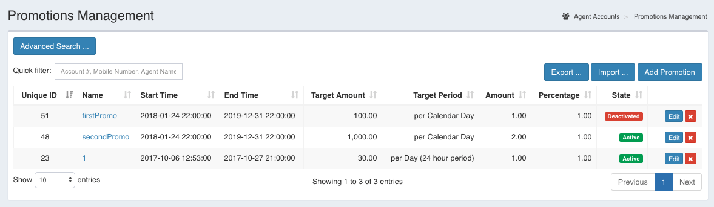

Click on
.
The Batch Processing page appears.

Prepare a Group batch file named
**ci\_ecds\_prom\_yyyymmdd\_hhmmss.csv**, where:

-   yyyy is the current year

-   mm is the current month

-   dd is the current day

-   hhmmss is the current time in hours, minutes and seconds.

An example of a valid Promotion batch file name is
**ci\_ecds\_prom\_20161201140500.csv**  
The first record in the Promotion batch file must contain the header
with field names which determines the sequence in which fields are
presented in following records. Field names are:

<table>
<colgroup>
<col style="width: 50%" />
<col style="width: 50%" />
</colgroup>
<tbody>
<tr class="odd">
<td>
<strong>Field Name</strong>
</td>
<td>
<strong>Description</strong>
</td>
</tr>
<tr class="even">
<td>
verb
</td>
<td>
Determines the action to be performed. See <a href="#__batch_verb">Verbs</a>. Required
</td>
</tr>
<tr class="odd">
<td>
id
</td>
<td>
Optional. Only used when the Promotions name field is changed., Obtained from an export of Group detail
</td>
</tr>
<tr class="even">
<td>
name
</td>
<td>
The name of the Promotion. Not more than 20 characters.Required.
</td>
</tr>
<tr class="odd">
<td>
status
</td>
<td>
Indicates status, for example A for “active”. See <a href="#_status_indicators">Status Indicators</a>
</td>
</tr>
<tr class="even">
<td>
start_time
</td>
<td>
The time when the Promotion period starts. Required.
</td>
</tr>
<tr class="odd">
<td>
end_time
</td>
<td>
The time when the Promotion period ends. Required.
</td>
</tr>
<tr class="even">
<td>
transfer_rule
</td>
<td>
The Transfer rule to which the Promotion may apply. Optional
</td>
</tr>
<tr class="odd">
<td>
area
</td>
<td>
The geographical area in which the Promotion will be active. Optional
</td>
</tr>
<tr class="even">
<td>
service_class
</td>
<td>
The Service Class of Agents, which will qualify for the Promotion. Optional
</td>
</tr>
<tr class="odd">
<td>
bundle
</td>
<td>
The Bundle (Data/SMS etc) to which the Promotion will apply. Optional
</td>
</tr>
<tr class="even">
<td>
target_amount
</td>
<td>
The Target amount in value of the sales to be achieved in order to receive the reward. Optional
</td>
</tr>
<tr class="odd">
<td>
target_period
</td>
<td>
The Period in which the Target must be achieved, for example, Week, Month, day. Optional
</td>
</tr>
<tr class="even">
<td>
reward_percentage
</td>
<td>
The Reward as a percentage of the Target achieved. Optional
</td>
</tr>
<tr class="odd">
<td>
reward_amount
</td>
<td>
The Reward amount as a fixed value, once the Target is achieved. Optional
</td>
</tr>
<tr class="even">
<td>
retriggers
</td>
<td>
Indicates whether or not the Reward can be triggered multiple times during the promotion period, or only once. Optional
</td>
</tr>
</tbody>
</table>

An example of a Promotion import batch file with only the header and a
single data record is:  

    verb,id,name,status,start_time,end_time,transfer_rule,area,service_class,bundle,target_amount,target_period,reward_percentage,reward_amount,retriggers

Once the batch file has been prepared, click the

button displayed near the top right of the Batch Processing page. The
File Navigation pop-up window appears:

Navigate to the Promotion prepared batch file and click
.

To import another batch, click on

near the top left of the page. The Batch Processing page reappears and
additional batches can be imported as described above.

Analytics
=========

Analytics Overview
------------------

The Crediverse ECDS provides for various statistical Analytics, which
can be viewed in near real time within the ECDS Administrative GUI by
suitably authorised Web Users. These Analytics are intended to provide a
visual representation of Key performance Indicators pertaining to
Airtime Sales and Distribution over the past 30 days, in order to
provide sales performance insights. To view the ECDS Analytics, click
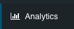
in the menu bar on the left of the page and you will see the Analytics
Page as follows:

In the centre of the page, you will find a grid, showing time (in days)
along the X-Axis and Count going up the Y-AXIS. This represents the
daily statistics for the period chosen (Either last 7 or last 30 days)

The following Analytical data is presently available in the Analytics
screen:

-   Number of Unique Agents - This graph shows the total count of unique
    agents transacting each day

-   Number of Retail Sales - This graph shows the count of Retail Sales
    per day

-   Number of Transfers - This graph shows the count of transfers
    performed by agents per day

-   Value of Retail Sales - This graph shows the Value of Retail Sales
    performed through ECDS for the day

-   value of Transfers - This graph shows the Value of Transfers
    performed through ECDS for the day

-   Value of Replenishes - - This graph shows the Value of Replenishes
    performed in ECDS for the day

Data for Analytics is rolled up on a daily basis to ensure statistical
data is readily available for the Analytical data graphs.

Reports
=======

Reports Overview
----------------

The Crediverse ECDS provides for various statistical and performance
reports, which may be distributed either by SMS or Email. These reports
are intended to be used as regular management reports, to provides sales
performance insights and analytical data across wholesalers and
retailers distributing and selling airtime and bundles. To create, view
and schedule reports, click

on in the menu bar at the left of the page and you will see a list of
Report Types as follows:

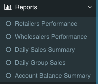

From this sub menu, the following Report Types are available:

-   Retailers Performance - Provides transactional information
    pertaining to retailers

-   Wholesalers Performance - Provides transactional information
    pertaining to wholesalers

-   Daily Sales Summary - Provides an SMS report which includes various
    key performance indicators for the day

-   Daily Group Sales - Provides sales transactional information by
    group

-   Monthly Sales performance - Provides summarised sales information
    per agent for the current or previous month

-   Account Balance Summary - Provides Account information for Agents

Report Scheduling \[\[*Report\_Scheduling*\]\]
----------------------------------------------

All Report Types in CrediVerse ECDS may be executed immediately and the
output written to a comma separated values (CSV) file format for import
into a spreadsheet tool such as Excel or the reports may be scheduled to
be generated and sent to specific web user recipients at a particular
time and frequency.

The scheduling interface is similar for all Reports Types. When
selecting a Report Type, from the menu on the left, you will be
presented with the Report List Screen, which lists all the Saved Reports
of the type selected, along with all the Schedules which have been setup
for each Saved Report. The Report List Screen, appears similar to the
following for each of the different Report Types:

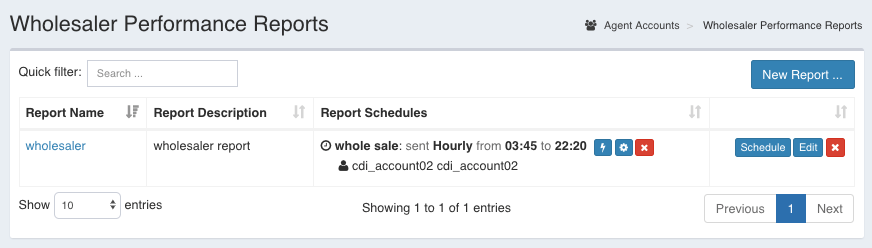

This report list screen shows all saved reports along with the report
schedules, which have been created for the report selected.  
The information on the Report List screen includes:

<table>
<colgroup>
<col style="width: 50%" />
<col style="width: 50%" />
</colgroup>
<tbody>
<tr class="odd">
<td>
<strong>Column name</strong>
</td>
<td>
<strong>Description</strong>
</td>
</tr>
<tr class="even">
<td>
Report name
</td>
<td>
The Name used when the report was saved
</td>
</tr>
<tr class="odd">
<td>
Report Description
</td>
<td>
The Description used when the report was saved
</td>
</tr>
<tr class="even">
<td>
Report Schedules
</td>
<td>
There may be one or more schedules for each report
</td>
</tr>
<tr class="odd">
<td>
Action Buttons for Schedule, Edit, delete
</td>
<td>
These buttons are used for either Scheduling a Report, Editing or Deleting the Report
</td>
</tr>
</tbody>
</table>

Report Schedules may be Created, Edited, Deleted or Force Executed.

### Creating a New Report Schedule

To create a new Report Schedule, click on the

button on the Report List Screen. You will be presented with the Add
Schedule pop-up box as follows:

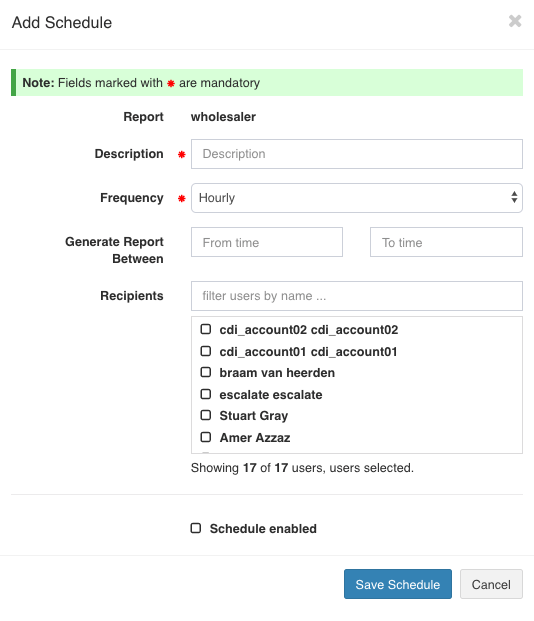

In the Add Schedule pop-up screen, the following parameters may be
configured and saved to create a new Report Schedule for the selected
report.

<table>
<colgroup>
<col style="width: 50%" />
<col style="width: 50%" />
</colgroup>
<tbody>
<tr class="odd">
<td>
<strong>Parameter</strong>
</td>
<td>
<strong>Description</strong>
</td>
</tr>
<tr class="even">
<td>
Name
</td>
<td>
This indicates the name of the report which the schedule is being created for. This field is not editable
</td>
</tr>
<tr class="odd">
<td>
Description
</td>
<td>
This is the scheduling description, for example, "Monthly wholesaler management report"
</td>
</tr>
<tr class="even">
<td>
Frequency
</td>
<td>
This allows the user to select whether the report will be generated hourly, daily, weekly or monthly
</td>
</tr>
<tr class="odd">
<td>
Generate Report Between (From time &amp; To time) - shown only for Hourly reports
</td>
<td>
This is the time window during the day to sent hourly reports, for example from 08:00 to 22:00, means reports will not send between 23:00 and 07:00.
</td>
</tr>
<tr class="even">
<td>
Time of Day - shown for all reports other than hourly
</td>
<td>
This is the time in the day, when the report will be generated and emailed / SMS’d to the recipient. For example, if reports are to be sent daily at 08:00
</td>
</tr>
<tr class="odd">
<td>
Recipients
</td>
<td>
A list of available Web Users which can receive the report. Use the filter to find recipients and check the tick box to select recipients which should receive the report.
</td>
</tr>
<tr class="even">
<td>
Schedule enabled
</td>
<td>
This switch may be toggled on or off to indicate whether this particular schedule is to be enabled or disabled
</td>
</tr>
</tbody>
</table>

> **Note**
>
> With regards to frequency, Weekly reports are generated on Mondays for
> the prior week and monthly reports are generated on the first of the
> month, for the prior month

### Editing an existing Report Schedule

To Edit an existing Report Schedule, click on the

button on the Report List Screen, next to the schedule item you wish to
update. You will be presented with the Update Schedule pop-up box as
follows:

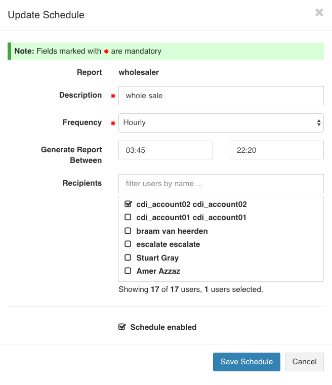

The fields presented are the same as those listed above for Adding a
Schedule. Adjust whichever parameters you want and remember to click the

button to save the changes or click the

to discard changes.

> **Note**
>
> To email reports to Web Users, ensure that the Email recorded for the
> Web User is correct and also that Email Server size restrictions do
> not block large attachments.

### Deleting an existing Report Schedule

If you want to permanently delete a Report Schedule which has been
previously created, click the

next to the schedule item you wish to delete. You will be presented with
a confirmation pop-up similar to the following:

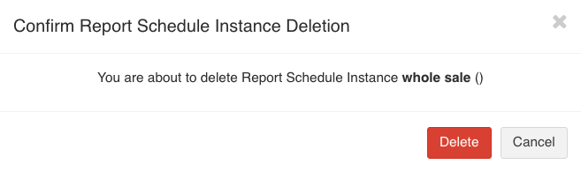

Click on

to confirm the deletion of the Report Schedule indicated in the
confirmation dialogue or click

to discard your changes.

> **Note**
>
> Reports can be Disabled in the Update Reports Screen, should you want
> to temporarily disable a Report Schedule.

> **Tip**
>
> To reduce the size of Report attachments in Emails, you can configure
> the compression type used for reports in [Report
> Configuration](#_Report_configuration_)

### Force executing a Report

Sometimes it is possible to test a report without waiting for the
scheduled time to arrive. To do this, click on the

and you are presented with the execute report pop-up window which looks
like the following:

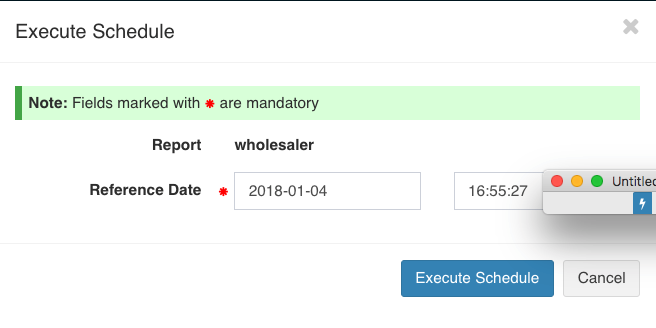

Select the date and time from where you want the report to execute and
select the

to execute the report.

> **Note**
>
> In some instances the report will not execute immediately as some
> reports, such as hourly reports only generate after the hour has
> completed.

The next sections looks at each of the available reports.

Retailers Performance Reports
-----------------------------

The Retailer Performance Report provides transactional information
pertaining to Agents on the Retailer Tiers. To view the list of
available Retailer Performance Reports click on

in the Reports Sub Menu on the left hand Menu Bar.  
The Report List Screen will appear as follows:

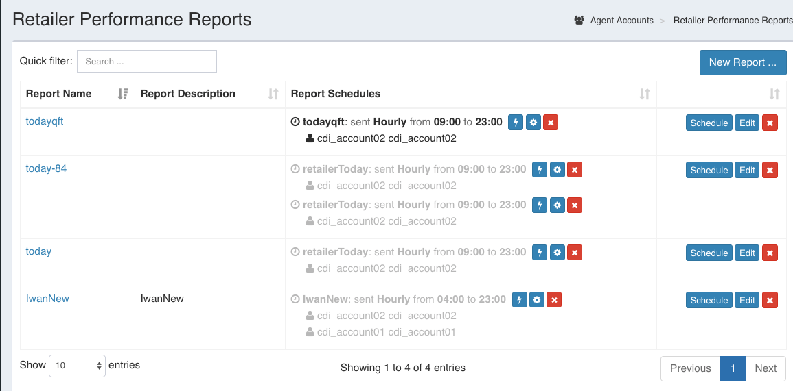

### Creating or Editing an existing Retailer Performance Report

To create a New Retailer Performance Report, select the

in the top right of the Report List Screen, or alternatively, if you
wish to Edit an existing report, select the

button next to the report you wish to change.

Both Create and Edit present the same filter criteria screen as follows
for you to create or change the filter criteria for the report:

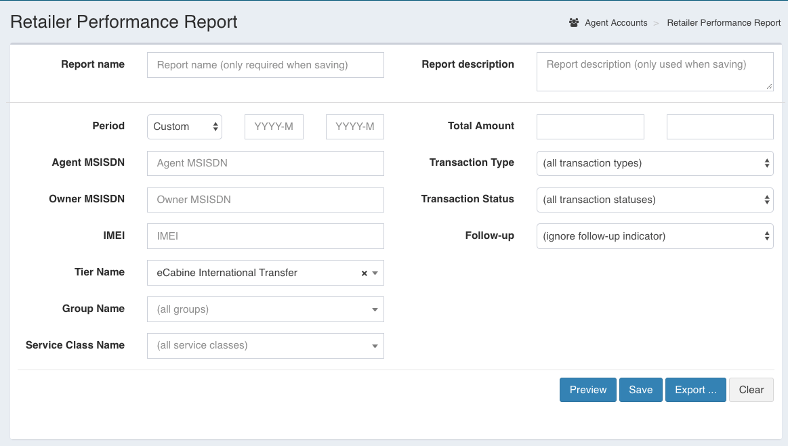

From this screen, the following filter criteria may be selected to
create a new report filter:

<table>
<colgroup>
<col style="width: 50%" />
<col style="width: 50%" />
</colgroup>
<tbody>
<tr class="odd">
<td>
<strong>Filter</strong>
</td>
<td>
<strong>Description</strong>
</td>
</tr>
<tr class="even">
<td>
Report name (only required when saving)
</td>
<td>
This is the Name you want to give to the Report - This is ONLY required if you intend to Save the Report. Reports Cannot be Saved without a Report Name.
</td>
</tr>
<tr class="odd">
<td>
Report description (only used when saving)
</td>
<td>
This is the Description you want to give to the Report - This is ONLY required if you intend to Save the Report.
</td>
</tr>
<tr class="even">
<td>
Period
</td>
<td>
Select the relative time period for the report from: Last 30days, Last Week, Last Month, Last Year, This Month, This Week, This Year, Today, Yesterday OR Custom fixed dates
</td>
</tr>
<tr class="odd">
<td>
Agent MSISDN
</td>
<td>
Mobile Number of the Agent to filter by
</td>
</tr>
<tr class="even">
<td>
Owner MSISDN
</td>
<td>
Mobile Number of the Owner to filter by, this will then include all Agents which have the same common Owner
</td>
</tr>
<tr class="odd">
<td>
IMEI
</td>
<td>
Insert to filter reports for specific devices being used, identified by IMEI
</td>
</tr>
<tr class="even">
<td>
Tier Name
</td>
<td>
Filter for Tier
</td>
</tr>
<tr class="odd">
<td>
Group Name
</td>
<td>
Filter for Group
</td>
</tr>
<tr class="even">
<td>
Service Class Name
</td>
<td>
Filter for Service Class
</td>
</tr>
<tr class="odd">
<td>
Total Amount
</td>
<td>
Filter for Transaction Amount Range (from - to)
</td>
</tr>
<tr class="even">
<td>
Transaction Type
</td>
<td>
Filter for various types of Transactions, such as Airtime Sale, Bundle Sale, Reversal, Adjustment
</td>
</tr>
<tr class="odd">
<td>
Transaction Status
</td>
<td>
Filter for final transaction status, which could be success of failure
</td>
</tr>
<tr class="even">
<td>
Follow-up
</td>
<td>
Filter specifically for transactions requiring follow up action and Adjudication. See <a href="#_Adjudicatin_of_a_transaction_marked_for_follow_up_">???</a>
</td>
</tr>
</tbody>
</table>

Once all Filter Criteria has been selected, click on
,
you will be presented with a report preview similar to the following:

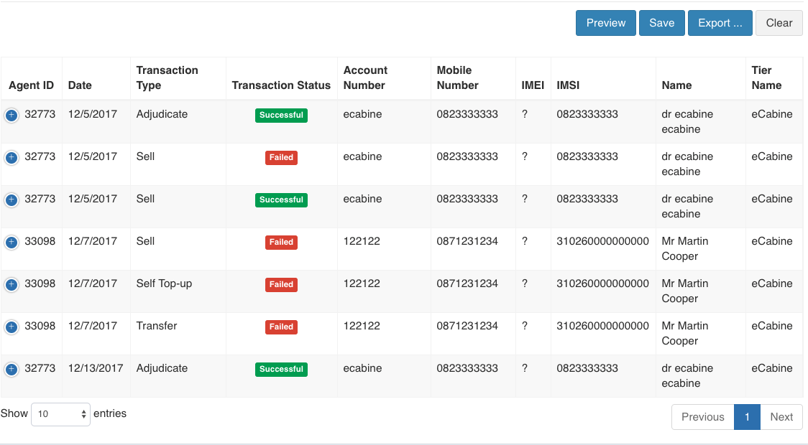

It is possible to drill down and see more information pertaining to each
transaction, by clicking on the

to the left of the transaction and you will see a drop down with more
information similar to the following:

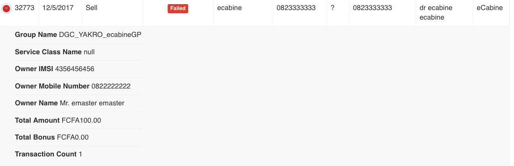

If you would like to export your results for further analysis (with or
without saving the report), click on

and a CSV export will be created and downloaded to your computer.

> **Note**
>
> Depending on the size of the result set, the Report Export may take
> several minutes to complete. Do not click the
> 
> button again, as this will start a second export.

To clear all Filter Criteria and start again, click on
.

Once you are happy with the Report Filter Criteria, and you have
provided a Report Name and Report Description at the top of the Filter
Criteria Screen, click on

button to save the Report.  
The report will now display in the Report List Screen, where you can
setup a Schedule for the report. See [???](#_Report_Scheduling_)

> **Tip**
>
> You cannot save a report without specifying a Report Name.

### Deleting an Existing Report

To delete an existing report, select the

on the Report List Screen, next to the report you wish to delete. You
will be presented with a Delete Confirmation Pop-Up similar to the
following:

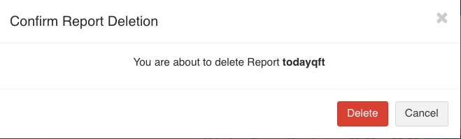

Click on

to confirm the deletion of the Report indicated in the confirmation
dialogue or click

to discard your changes.

Wholesalers Performance
-----------------------

The Wholesaler Performance Report provides transactional information
pertaining to Agents on the Wholesaler Tiers. To view the list of
available Wholesaler Performance Reports click on

in the Reports Sub Menu on the left hand Menu Bar.  
The Report List Screen will appear as follows:

### Creating or Editing an existing Wholesaler Performance Report

To create a New Wholesaler Performance Report, select the

in the top right of the Report List Screen, or alternatively, if you
wish to Edit an existing report, select the

button next to the report you wish to change.

Both Create and Edit present the same filter criteria screen as follows
for you to create or change the filter criteria for the report:

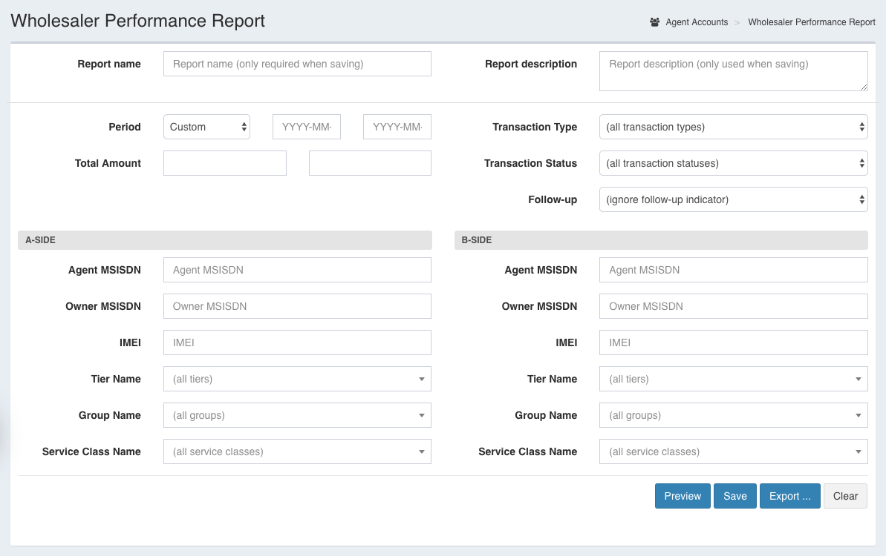

The main difference between the Wholesaler Performance Report and the
Retailer Performance Report Filter Criteria is that both the A and B
party criteria may be filtered. The following filter criteria may be
selected to create a new report filter:

<table>
<colgroup>
<col style="width: 50%" />
<col style="width: 50%" />
</colgroup>
<tbody>
<tr class="odd">
<td>
<strong>Filter</strong>
</td>
<td>
<strong>Description</strong>
</td>
</tr>
<tr class="even">
<td>
Report name (only required when saving)
</td>
<td>
This is the Name you want to give to the Report - This is ONLY required if you intend to Save the Report. Reports Cannot be Saved without a Report Name.
</td>
</tr>
<tr class="odd">
<td>
Report description (only used when saving)
</td>
<td>
This is the Description you want to give to the Report - This is ONLY required if you intend to Save the Report.
</td>
</tr>
<tr class="even">
<td>
Period
</td>
<td>
Select the relative time period for the report from: Last 30days, Last Week, Last Month, Last Year, This Month, This Week, This Year, Today, Yesterday OR Custom fixed dates
</td>
</tr>
<tr class="odd">
<td>
Total Amount
</td>
<td>
Filter for Transaction Amount range (from - to)
</td>
</tr>
<tr class="even">
<td>
Transaction Type
</td>
<td>
Filter for various types of Transactions, such as Transfers, Reversals, Adjustments
</td>
</tr>
<tr class="odd">
<td>
Transaction Status
</td>
<td>
Filter for final transaction status, which could be success of failure
</td>
</tr>
<tr class="even">
<td>
Follow-up
</td>
<td>
Filter specifically for transactions requiring follow up action and Adjudication. See <a href="#_Adjudicatin_of_a_transaction_marked_for_follow_up_">???</a>
</td>
</tr>
<tr class="odd">
<td>
A-SIDE: Agent MSISDN
</td>
<td>
Mobile Number of the donor Agent to filter by
</td>
</tr>
<tr class="even">
<td>
A-SIDE: Owner MSISDN
</td>
<td>
Mobile Number of the donor Owner to filter by, this will then include all Agents which have the same common Owner
</td>
</tr>
<tr class="odd">
<td>
A-SIDE: IMEI
</td>
<td>
Insert to filter reports for specific devices being used by the donor agent, identified by IMEI
</td>
</tr>
<tr class="even">
<td>
A-SIDE: Tier Name
</td>
<td>
Filter for donor agent Tier
</td>
</tr>
<tr class="odd">
<td>
A-SIDE: Group Name
</td>
<td>
Filter for donor agent Group
</td>
</tr>
<tr class="even">
<td>
A-SIDE: Service Class Name
</td>
<td>
Filter for donor agent Service Class
</td>
</tr>
<tr class="odd">
<td>
B-SIDE: Agent MSISDN
</td>
<td>
Mobile Number of the recipient Agent to filter by
</td>
</tr>
<tr class="even">
<td>
B-SIDE: Owner MSISDN
</td>
<td>
Mobile Number of the recipient Owner to filter by, this will then include all Agents which have the same common Owner
</td>
</tr>
<tr class="odd">
<td>
B-SIDE: IMEI
</td>
<td>
Insert to filter reports for specific devices being used by the recipient agent, identified by IMEI
</td>
</tr>
<tr class="even">
<td>
B-SIDE: Tier Name
</td>
<td>
Filter for recipient agent Tier
</td>
</tr>
<tr class="odd">
<td>
B-SIDE: Group Name
</td>
<td>
Filter for recipient agent Group
</td>
</tr>
<tr class="even">
<td>
B-SIDE: Service Class Name
</td>
<td>
Filter for recipient agent Service Class
</td>
</tr>
</tbody>
</table>

Once all Filter Criteria has been selected, click on
,
you will be presented with a report preview similar to the following:

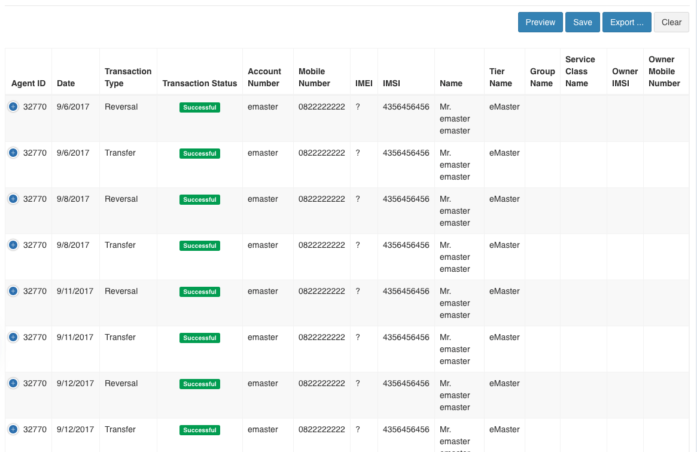

It is possible to drill down and see more information pertaining to each
transaction, by clicking on the

to the left of the transaction and you will see a drop down with more
information similar to the following:

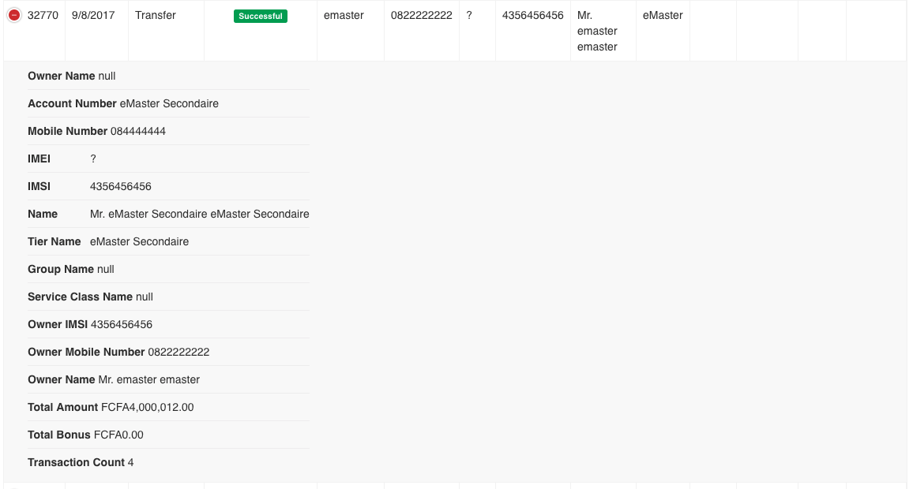

If you would like to export your results for further analysis (with or
without saving the report), click on

and a CSV export will be created and downloaded to your computer.

> **Note**
>
> Depending on the size of the result set, the Report Export may take
> several minutes to complete. Do not click the
> 
> button again, as this will start a second export.

To clear all Filter Criteria and start again, click on
.

Once you are happy with the Report Filter Criteria, and you have
provided a Report Name and Report Description at the top of the Filter
Criteria Screen, click on

button to save the Report.  
The report will now display in the Report List Screen, where you can
setup a Schedule for the report. See [???](#_Report_Scheduling_)

> **Tip**
>
> You cannot save a report without specifying a Report Name.

### Deleting an Existing Report

To delete an existing report, select the

on the Report List Screen, next to the report you wish to delete. You
will be presented with a Delete Confirmation Pop-Up similar to the
following:

Click on

to confirm the deletion of the Report indicated in the confirmation
dialogue or click

to discard your changes.

Daily Sales Summary Report
--------------------------

The Daily Sales Summary Report provides summary sales information, such
as cumulative sales for the day, total agents transacting etc. This
information can be sent to the recipients as SMS or Email. To change the
SMS or Email message format, please see
[???](#_Sales_Summary_report_config_).

To view the list of scheduled Daily Sales Summary Reports click on

in the Reports Sub Menu on the left hand Menu Bar.  
The Report List Screen will appear as follows:

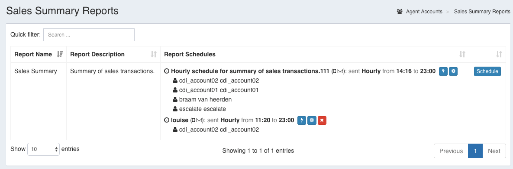

From here it is possible to Create, update or delete report schedules
for the Daily Summary Report.

> **Note**
>
> There are no filter criteria for the Daily Sales Summary report. This
> report contain cumulative sales performance indicators. The format of
> the Report is configured in [???](#_Sales_Summary_report_config_). To
> modify Schedules, see [???](#_Report_Scheduling_).

Daily Group Sales Report xxxxxx
-------------------------------

The Daily Group Sales provides summary sales information at Group level,
including count and amount of airtime sales per group of agents. To view
the list of available Daily Group Sales Reports click on

in the Reports Sub Menu on the left hand Menu Bar.  
The Report List Screen will appear as follows:

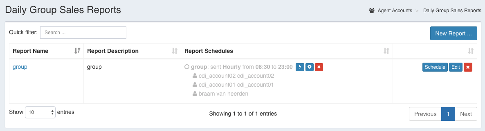

### Creating or Editing an existing Daily Group Sales Report

To create a New Daily Group Sales Report, select the

in the top right of the Report List Screen, or alternatively, if you
wish to Edit an existing report, select the

button next to the report you wish to change.

Both Create and Edit present the same filter criteria screen as follows
for you to create or change the filter criteria for the report:

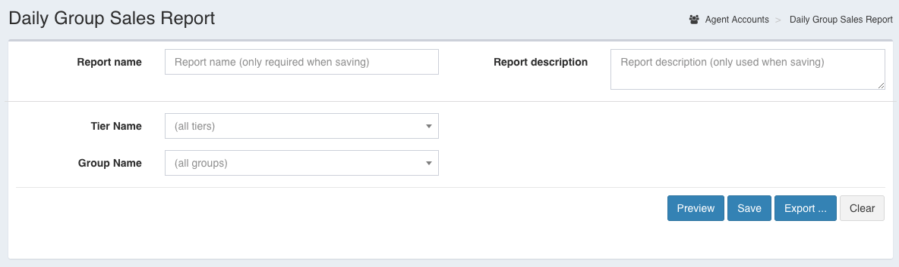

From this screen, the following filter criteria may be selected to
create a new report filter:

<table>
<colgroup>
<col style="width: 50%" />
<col style="width: 50%" />
</colgroup>
<tbody>
<tr class="odd">
<td>
<strong>Filter</strong>
</td>
<td>
<strong>Description</strong>
</td>
</tr>
<tr class="even">
<td>
Report name (only required when saving)
</td>
<td>
This is the Name you want to give to the Report - This is ONLY required if you intend to Save the Report. Reports Cannot be Saved without a Report Name.
</td>
</tr>
<tr class="odd">
<td>
Report description (only used when saving)
</td>
<td>
This is the Description you want to give to the Report - This is ONLY required if you intend to Save the Report.
</td>
</tr>
<tr class="even">
<td>
Tier Name
</td>
<td>
Filter for Tier
</td>
</tr>
<tr class="odd">
<td>
Group Name
</td>
<td>
Filter for Group
</td>
</tr>
</tbody>
</table>

Once all Filter Criteria has been selected, click on
,
you will be presented with a report preview similar to the following:

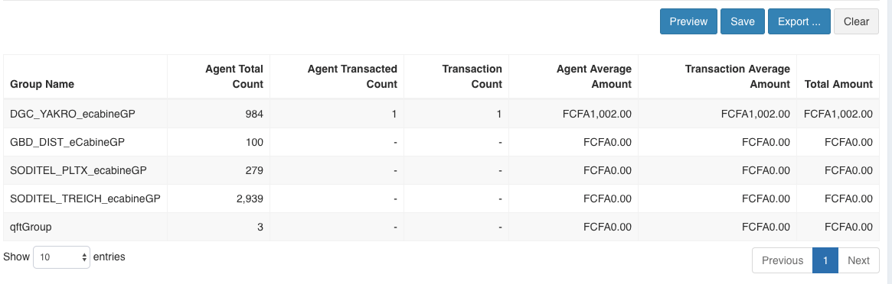

If you would like to export your results for further analysis (with or
without saving the report), click on

and a CSV export will be created and downloaded to your computer.

> **Note**
>
> The report is a Daily summary and shows cumulative sales performance
> indicators for all agents belonging to the selected Tier or Group
> which has been filtered.

To clear all Filter Criteria and start again, click on
.

Once you are happy with the Report Filter Criteria, and you have
provided a Report Name and Report Description at the top of the Filter
Criteria Screen, click on

button to save the Report.  
The report will now display in the Report List Screen, where you can
setup a Schedule for the report. See [???](#_Report_Scheduling_)

> **Tip**
>
> You cannot save a report without specifying a Report Name.

### Deleting an Existing Report

To delete an existing report, select the

on the Report List Screen, next to the report you wish to delete. You
will be presented with a Delete Confirmation Pop-Up similar to the
following:

Click on

to confirm the deletion of the Report indicated in the confirmation
dialogue or click

to discard your changes.

Monthly Sales Summary Report
----------------------------

The Monthly Sales Summary provides sales information at Agent level
showing value amount of sales or other transaction types per agent. To
view the list of available Monthly Sales Summary reports click on

in the Reports Sub Menu on the left hand Menu Bar.  
The Report List Screen will appear as follows:

### Creating or Editing an existing Monthly Sales Summary Report

To create a New Monthly Sales Summary Report, select the

in the top right of the Report List Screen, or alternatively, if you
wish to Edit an existing report, select the

button next to the report you wish to change.

Both Create and Edit present the same filter criteria screen as follows
for you to create or change the filter criteria for the report:

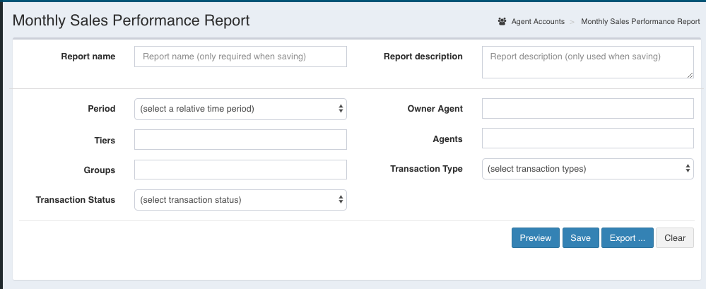

From this screen, the following filter criteria may be selected to
create a new report filter:

<table>
<colgroup>
<col style="width: 50%" />
<col style="width: 50%" />
</colgroup>
<tbody>
<tr class="odd">
<td>
<strong>Filter</strong>
</td>
<td>
<strong>Description</strong>
</td>
</tr>
<tr class="even">
<td>
Report name (only required when saving)
</td>
<td>
This is the Name you want to give to the Report - This is ONLY required if you intend to Save the Report. Reports Cannot be Saved without a Report Name.
</td>
</tr>
<tr class="odd">
<td>
Report description (only used when saving)
</td>
<td>
This is the Description you want to give to the Report - This is ONLY required if you intend to Save the Report.
</td>
</tr>
<tr class="even">
<td>
Period
</td>
<td>
This allows you to select the previous month or current month. Note that current month is a month to date summary.
</td>
</tr>
<tr class="odd">
<td>
Tier Name
</td>
<td>
Filter for Tier
</td>
</tr>
<tr class="even">
<td>
Group Name
</td>
<td>
Filter for Group
</td>
</tr>
<tr class="odd">
<td>
Transaction Status
</td>
<td>
From here select to see successful or failed transactions for the period.
</td>
</tr>
<tr class="even">
<td>
Owner Agent
</td>
<td>
Add an owner Agent if you wish to filter report to a single Owner (Distributer).
</td>
</tr>
<tr class="odd">
<td>
Agents
</td>
<td>
Add one or more agents to filter the results to a specific list of Agents.
</td>
</tr>
<tr class="even">
<td>
Transaction Type
</td>
<td>
Select the required transaction type, see table of transaction types below for descriptions.
</td>
</tr>
</tbody>
</table>

Transaction Types:

<table>
<colgroup>
<col style="width: 50%" />
<col style="width: 50%" />
</colgroup>
<tbody>
<tr class="odd">
<td>
<strong>Transaction type</strong>
</td>
<td>
<strong>Description</strong>
</td>
</tr>
<tr class="even">
<td>
Airtime Sales only
</td>
<td>
Filters for Airtime sales type transactions
</td>
</tr>
<tr class="odd">
<td>
Bundle Sales
</td>
<td>
Filters for Bundle sales transactions
</td>
</tr>
<tr class="even">
<td>
Net sales
</td>
<td>
Filters for all sales after taking into account any related partial or full reversals against those sales, thus giving a net sales amounts
</td>
</tr>
<tr class="odd">
<td>
Reversals only
</td>
<td>
Filters for reversals only for each agent
</td>
</tr>
<tr class="even">
<td>
Sales
</td>
<td>
Includes Airtime Sales and Bundle Sales and Self Topup transactions
</td>
</tr>
<tr class="odd">
<td>
Self Topup
</td>
<td>
Filters for Self Topups only
</td>
</tr>
</tbody>
</table>

Once all Filter Criteria has been selected, click on
,
you will be presented with a report preview similar to the following:

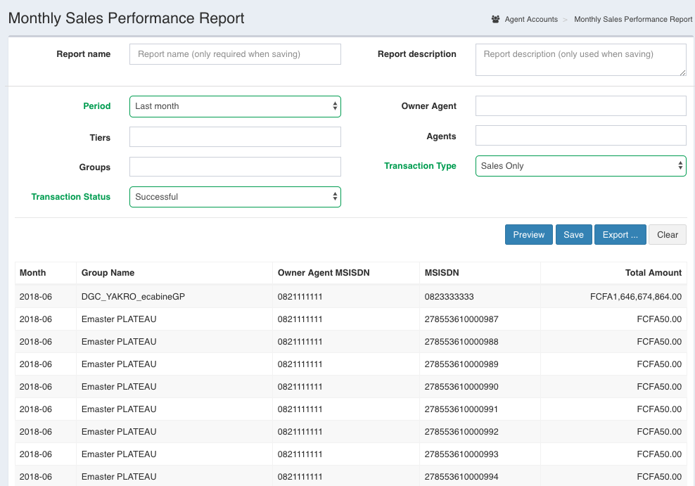

If you would like to export your results for further analysis (with or
without saving the report), click on

and a CSV export will be created and downloaded to your computer.

> **Note**
>
> The report is a Monthly Summary report and shows cumulative sales
> performance indicators for all agents belonging to the Tier or Group
> which has been filtered.

To clear all Filter Criteria and start again, click on
.

Once you are happy with the Report Filter Criteria, and you have
provided a Report Name and Report Description at the top of the Filter
Criteria Screen, click on

button to save the Report.  
The report will now display in the Report List Screen, where you can
setup a Schedule for the report. See [???](#_Report_Scheduling_)

> **Tip**
>
> You cannot save a report without specifying a Report Name.

### Deleting an Existing Report

To delete an existing report, select the

on the Report List Screen, next to the report you wish to delete. You
will be presented with a Delete Confirmation Pop-Up similar to the
following:

Click on

to confirm the deletion of the Report indicated in the confirmation
dialogue or click

to discard your changes.

Account Balance Summary Report
------------------------------

The Account Balance Summary report financial balances for all selected
Agent Accounts. To view the list of available Retailer Performance
Reports click on

in the Reports Sub Menu on the left hand Menu Bar.  
The Report List Screen will appear as follows:

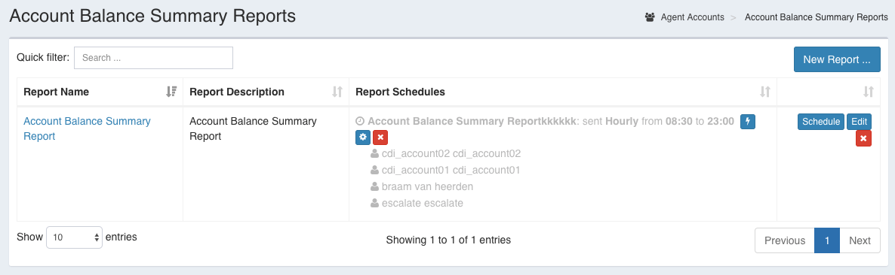

### Creating or Editing an existing Account Balance Summary Report

To create a New Account Balance Summary Report, select the

in the top right of the Report List Screen, or alternatively, if you
wish to Edit an existing report, select the

button next to the report you wish to change.

Both Create and Edit present the same filter criteria screen as follows
for you to create or change the filter criteria for the report:

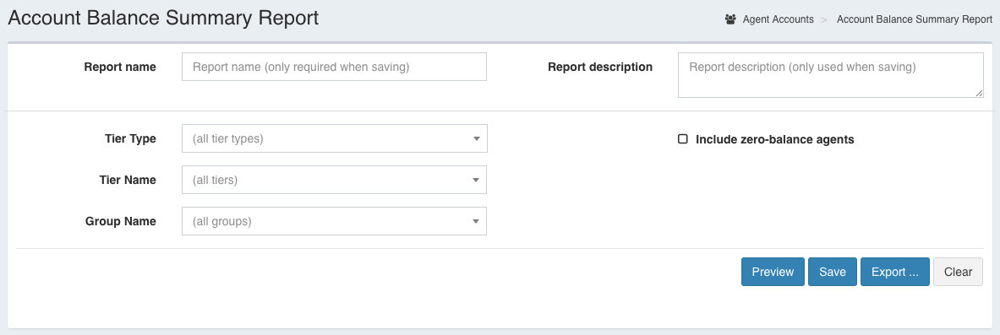

From this screen, the following filter criteria may be selected to
create a new report filter:

<table>
<colgroup>
<col style="width: 50%" />
<col style="width: 50%" />
</colgroup>
<tbody>
<tr class="odd">
<td>
<strong>Filter</strong>
</td>
<td>
<strong>Description</strong>
</td>
</tr>
<tr class="even">
<td>
Report name (only required when saving)
</td>
<td>
This is the Name you want to give to the Report - This is ONLY required if you intend to Save the Report. Reports Cannot be Saved without a Report Name.
</td>
</tr>
<tr class="odd">
<td>
Report description (only used when saving)
</td>
<td>
This is the Description you want to give to the Report - This is ONLY required if you intend to Save the Report.
</td>
</tr>
<tr class="even">
<td>
Tier Type
</td>
<td>
Select the Tier type, for example, ROOT, for the main Operator Master Store, Store, Wholesaler or Retailer Tier type
</td>
</tr>
<tr class="odd">
<td>
Tier Name
</td>
<td>
Filter for Tier
</td>
</tr>
<tr class="even">
<td>
Group Name
</td>
<td>
Filter for Group
</td>
</tr>
<tr class="odd">
<td>
Include Zero Balance Agents
</td>
<td>
Select whether to include accounts with zero (0.00) balance in the result set
</td>
</tr>
</tbody>
</table>

Once all Filter Criteria has been selected, click on
,
you will be presented with a report preview similar to the following:

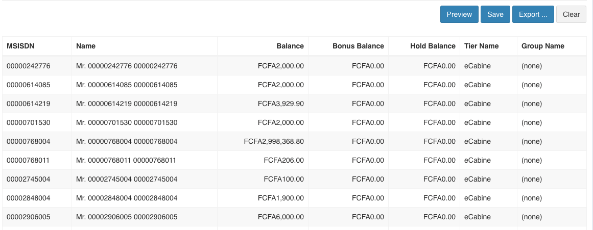

If you would like to export your results for further analysis (with or
without saving the report), click on

and a CSV export will be created and downloaded to your computer.

> **Note**
>
> Depending on the size of the result set, the Report Export may take
> several minutes to complete. Do not click the
> 
> button again, as this will start a second export.

To clear all Filter Criteria and start again, click on
.

Once you are happy with the Report Filter Criteria, and you have
provided a Report Name and Report Description at the top of the Filter
Criteria Screen, click on

button to save the Report.  
The report will now display in the Report List Screen, where you can
setup a Schedule for the report. See [???](#_Report_Scheduling_)

> **Note**
>
> The Account Balance Summary Report is a "SNAPSHOT" report and will
> show the account balances as at the time when the report is executed.

### Deleting an Existing Report

To delete an existing report, select the

on the Report List Screen, next to the report you wish to delete. You
will be presented with a Delete Confirmation Pop-Up similar to the
following:

Click on

to confirm the deletion of the Report indicated in the confirmation
dialogue or click

to discard your changes.

Audit Log
=========

ECDS records all changes to Master Data Records and Transaction
Configurations in an Audit Log, This log can be scrutinised using the
Web Application.

Viewing and Searching Audit Log Summary
---------------------------------------

To view the Audit Log summary, click

on in the menu bar at the left of the page. The Audit Log page appears:

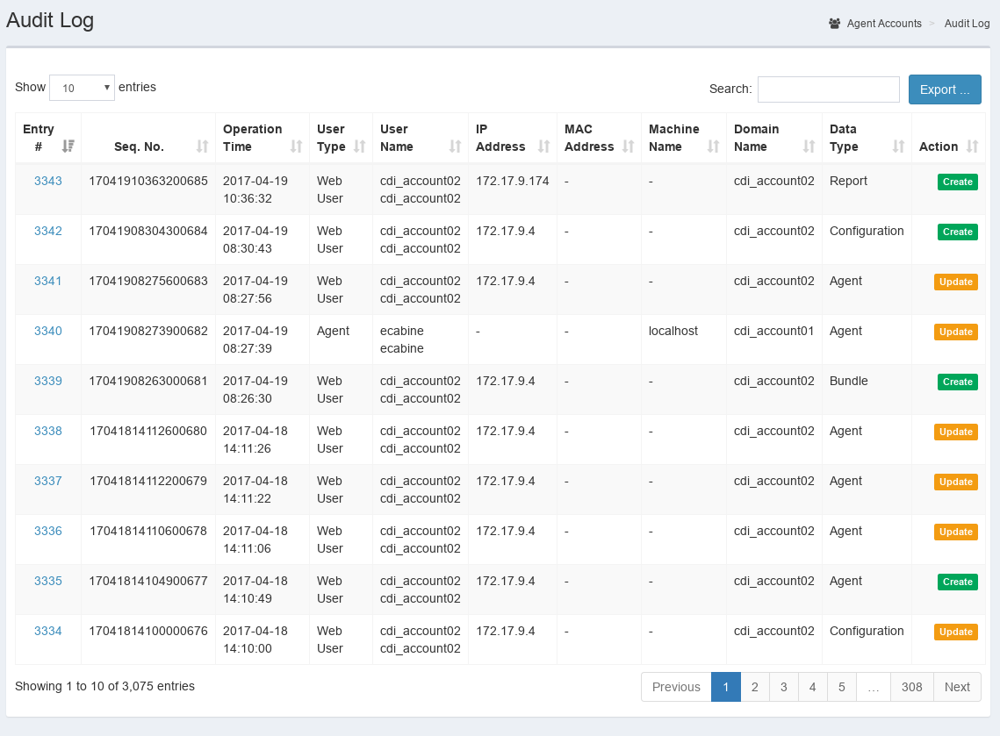

For every recorded transaction in the Audit Log the following is shown:

<table>
<colgroup>
<col style="width: 50%" />
<col style="width: 50%" />
</colgroup>
<tbody>
<tr class="odd">
<td>
<strong>Field</strong>
</td>
<td>
<strong>Description</strong>
</td>
</tr>
<tr class="even">
<td>
Entry #
</td>
<td>
Sequentially numbered record number
</td>
</tr>
<tr class="odd">
<td>
Seq No
</td>
<td>
Unique Audit Log Sequence Number to detect tampering
</td>
</tr>
<tr class="even">
<td>
Operation Time
</td>
<td>
The Time at which the update occurred
</td>
</tr>
<tr class="odd">
<td>
User Type
</td>
<td>
Web User, API
</td>
</tr>
<tr class="even">
<td>
User Name
</td>
<td>
The ID of the Web-User who performed the Master Data Update
</td>
</tr>
<tr class="odd">
<td>
IP Address
</td>
<td>
The IP address from which the change was made
</td>
</tr>
<tr class="even">
<td>
MAC Address
</td>
<td>
The MAC address of the network controller from which the change was made
</td>
</tr>
<tr class="odd">
<td>
Machine Name
</td>
<td>
The name of the computer from which the change was made
</td>
</tr>
<tr class="even">
<td>
Domain Account
</td>
<td>
The Name of the Domain account which was responsible for the change
</td>
</tr>
<tr class="odd">
<td>
Data Type
</td>
<td>
The type of Master Data, e.g. Permissions, Web-Users, Promotions etc. or Transaction Type, e.g. Adjustments, Transfers etc.
</td>
</tr>
<tr class="even">
<td>
Action
</td>
<td>
The Action performed, i.e. update, delete or create.
</td>
</tr>
</tbody>
</table>

The sequence in which the Audit Log entries are listed may be changed by
clicking on any column heading. This will cause the Audit Log entries to
be sorted based on the content of the selected column in either
ascending or descending order, indicated by

(ascending) or

(descending) icons next to the column header.

Should there be more than one page of Audit Log entries, the

buttons will allow you to navigate to the previous, next or specific
page.

It is possible to change the number of Audit Log entries displayed on a
page by selecting a different value from the drop-down list displayed
when clicking on

near the left top corner of the Audit Log page.

Entering any text in the

text box shown at the top right of the page will result in only showing
those Audit Log entries containing the entered text in any field of the
Audit Log entry, including in numerical fields.

Advanced search of Audit Log Detail
-----------------------------------

ECDS allows searching of the Audit Log to be more specific than a
general search for a text string. To make use of the advanced search
facility, click on

to the right of
.
The Audit Log Search pop-up window appears:

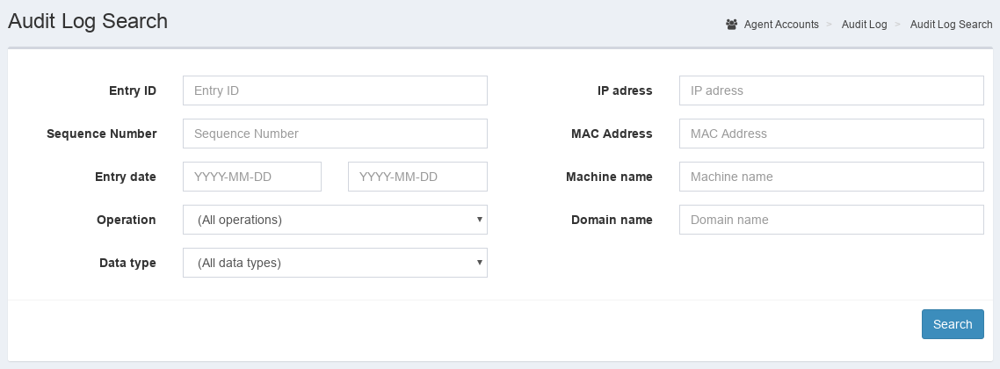

This allows you to enter values for specific attributes of audit log
entries in order to narrow down the search. You may search using a
single attribute or a combination of more. The more attributes used, the
narrower the search and the less matching results will be found.
Attributes that can be matched for searching purposes are:

-   Entry ID

-   Sequence No

-   Entry date, either as a specific date or a date range

-   Operation - Create, Update or Delete

-   Element type - Agent, Audit Entry, Batch, Company, Configuration,
    Group, Permission, Role, Service Class, Tier, Transfer Rule or Web
    User.

-   IP Address

-   MAC address

-   Machine Name

-   Domain Name

For example, a search for Configuration elements from 2017-04-18 and
2017-04-20 specified as follows:

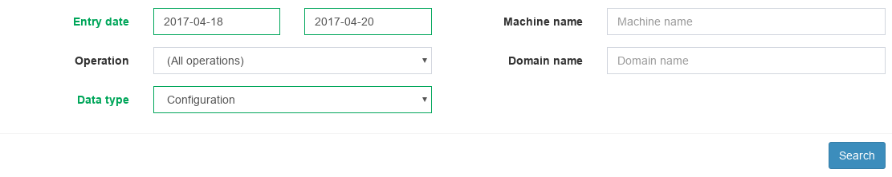

results in the following being displayed (with example data):

Inspecting an Audit Entry
-------------------------

Details of an entry in the Audit Log could be inspected by clicking on
the *entry number* in the

column of the line line displaying the entry of interest. This will
result in a different display for each Data Type (Agent, Audit Entry,
Batch, Company, Configuration, Group, Permission, Role, Service Class,
Tier, Transfer Rule or Web User). The information displayed for the
Audit Entry for a Role update operation is shown below:

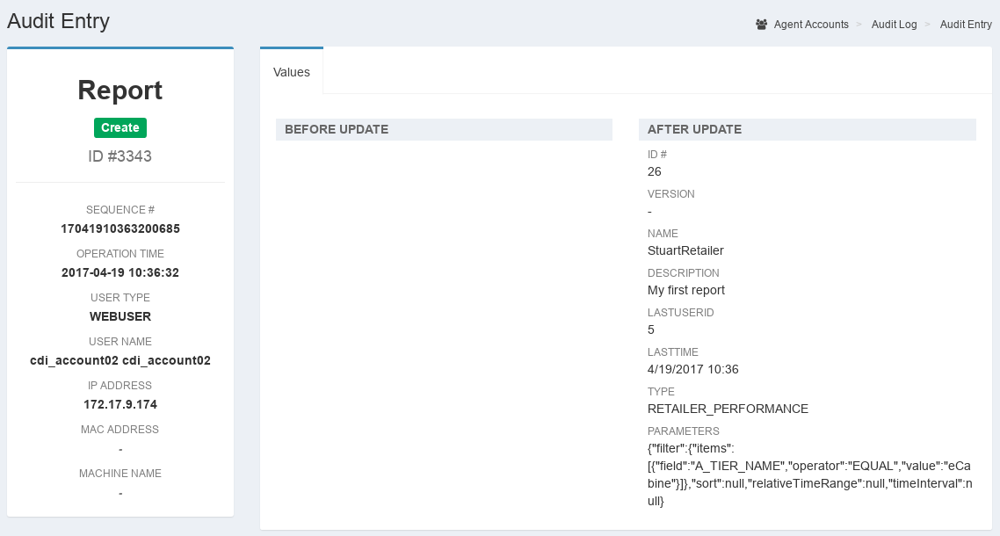

For all Data Types, the display contains three distinct areas:

-   A block on the left identifying the entry by ID and sequence number,
    identifying the originator of the transaction by User Type and User
    Name and showing the date and time the transaction took place.

-   The values in the record for this specific Data Type before the
    transaction took place. For a Create operation, this will be empty.

-   The values in the record for this specific Data Type after the
    transaction took place. For a Delete operation this will be empty.

User Access
===========

The User Access Menu has three sub menu options, which pertain to the
creation and management of Web Users, their Departments and the Roles
and Permissions which can be assigned to the Web Users.

Web users
---------

Web Users are individuals who are allowed to log into the ECDS Web
Application and perform business processes associated with their
Roles.  

> **Note**
>
> Although Agents may be allowed to transact using a Web Portal and
> their personal PIN, they are not Web Users and should not be
> registered as such.  

There are two predefined permanent Web Users, namely ‘Administrator’
which is linked to the ‘Administrator’ Role and ‘Supplier’ which is
linked to the ‘Supplier’ Role.  

Web Users linked to the ‘Administrator’ role may View, Create, Amend,
Deactivate and Reactivate non-permanent Web Users.  

Each Web User is linked to one and only one Role.

### Adding a Web User

To add a new Web User, first click on

in the ECDS menu bar displayed on the left of the page and then on
.
The Web Users page appears:

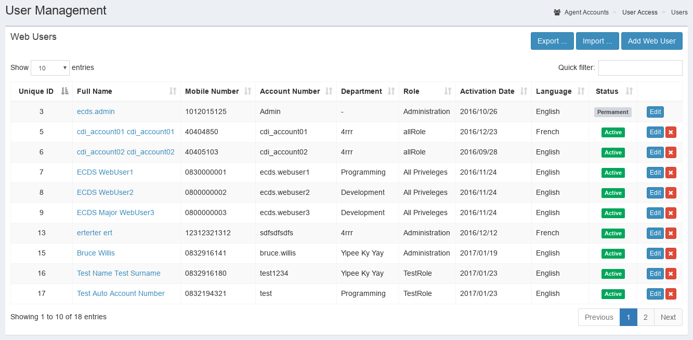

Click the

button near the top right of the page. The Add New Web User pop-up
window appears:

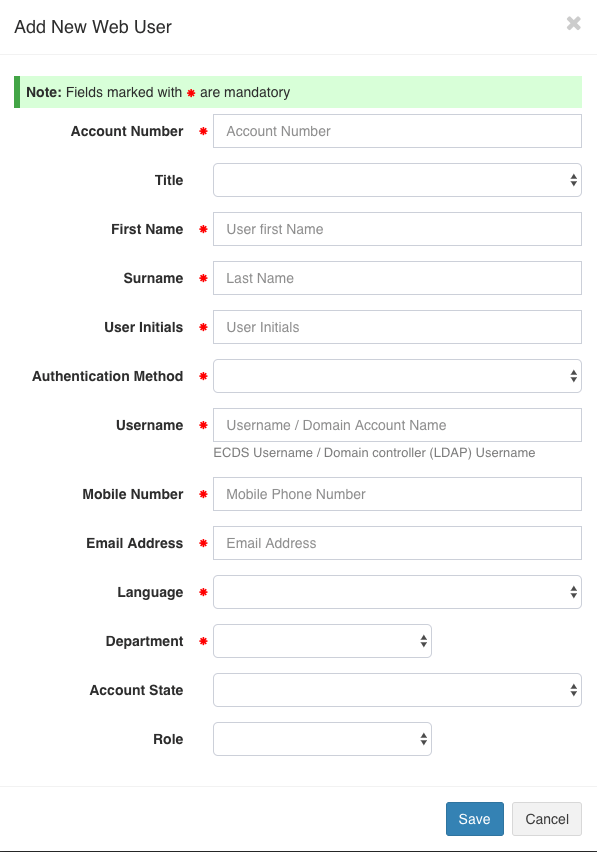

Information to be supplied to create a new Web User is as follows:

<table>
<colgroup>
<col style="width: 25%" />
<col style="width: 25%" />
<col style="width: 25%" />
<col style="width: 25%" />
</colgroup>
<tbody>
<tr class="odd">
<td>
<strong>Field</strong>
</td>
<td>
<strong>Definition</strong>
</td>
<td>
<strong>Constraints</strong>
</td>
<td>
<strong>Required</strong>
</td>
</tr>
<tr class="even">
<td>
Account Number
</td>
<td>
A unique Account Number, which can be assigned to the user, this may correlate to a username in CRM or other external reference e.g. Personnel Number.
</td>
<td>
Not more than 20 characters
</td>
<td>
Yes
</td>
</tr>
<tr class="odd">
<td>
Title
</td>
<td>
Title of Web User, e.g. ‘Professor’, selected from a drop-down list
</td>
<td>
Not more than 20 characters
</td>
<td>
Yes
</td>
</tr>
<tr class="even">
<td>
First Name
</td>
<td>
First name of the Web User
</td>
<td>
Not More than 30 characters
</td>
<td>
Yes
</td>
</tr>
<tr class="odd">
<td>
Surname
</td>
<td>
Surname of the Web User
</td>
<td>
Not more than 30 characters
</td>
<td>
Yes
</td>
</tr>
<tr class="even">
<td>
Initials
</td>
<td>
Initials of the Web User
</td>
<td>
Not more than 10 characters
</td>
<td>
Yes
</td>
</tr>
<tr class="odd">
<td>
Authentication Method
</td>
<td>
This can be Domain Account or Password. Use Domain Account where User exists on internal LDAP, or Username for ECDS Authentication
</td>
<td>
Select from drop down list
</td>
<td>
Yes
</td>
</tr>
<tr class="even">
<td>
UserName
</td>
<td>
This is the ECDS User name or Domain Account Name of the Account Holder, depending on the authentication method selected
</td>
<td>
Not more than 40 characters
</td>
<td>
Yes
</td>
</tr>
<tr class="odd">
<td>
Mobile phone number
</td>
<td>
Mobile Number in National or International format.
</td>
<td>
Not more than 30 characters
</td>
<td>
Yes
</td>
</tr>
<tr class="even">
<td>
Email
</td>
<td>
Email Address
</td>
<td>
Not more than 60 characters
</td>
<td>
No
</td>
</tr>
<tr class="odd">
<td>
Language
</td>
<td>
Language Preference selected from a drop-down list
</td>
<td>
i.e FR or EN
</td>
<td>
Yes
</td>
</tr>
<tr class="even">
<td>
Department
</td>
<td>
The Department the Web User belongs to.
</td>
<td>
Select from Dropdown list (See <a href="#Departments">???</a> )
</td>
<td>
Yes
</td>
</tr>
<tr class="odd">
<td>
Status
</td>
<td>
The Status of the Web User, e.g. Active - selected from a drop-down list.
</td>
<td>
Active or Inactive
</td>
<td>
Yes
</td>
</tr>
<tr class="even">
<td>
Role
</td>
<td>
The Role the Web User has, e.g. ‘Sales-Exec’ selected from a drop-down list
</td>
<td>
One and only one
</td>
<td>
Yes
</td>
</tr>
</tbody>
</table>

Once all information required to define the new Web User has been
entered, click

to create the new Web User, or click

to abandon the process. If all fields are valid, the pop-up window
disappears, the new Web User is saved and the Web Users page is
displayed showing the newly created Web User.

### Viewing and Searching Web Users

For each defined Web User, the Web Users page shows the following in a
single row:

-   Unique ID

-   Full Name

-   Mobile Number

-   Account Number

-   Department

-   Role

-   Activation Date

-   Language

-   Status

The sequence in which the Web Users are listed may be changed by
clicking on any column heading. This will cause the Web Users to be
sorted based on the content of the selected column in either ascending
or descending order, indicated by

(ascending) or

(descending) icons next to the column header.

Should there be more than one page of Web Users, the

buttons will allow you to navigate to the previous, next or specific
page.

It is possible to change the number of Web Users displayed on a page by
selecting a different value from the drop-down list displayed when
clicking on

near the left top corner of the Web Users page.

Entering any text in the

text box shown at the top right of the page will result in only showing
those Web Users containing the entered text in any field defining the
Web User, including in numerical fields.

Clicking on a Web User Name results in all detail for that Web User to
be shown as below:

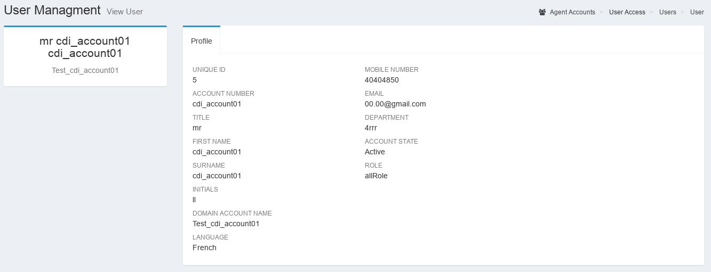

### Editing a Web User

To change any detail of an existing Web User, first locate the Web User
as described in [Viewing and Searching Web
Users](#_viewing_and_searching_web_users) above. Once the Web User is
visible on the Web Users page, click the

button in the row in which the Web User to be edited is displayed. The
Edit Web User pop-up window appears:

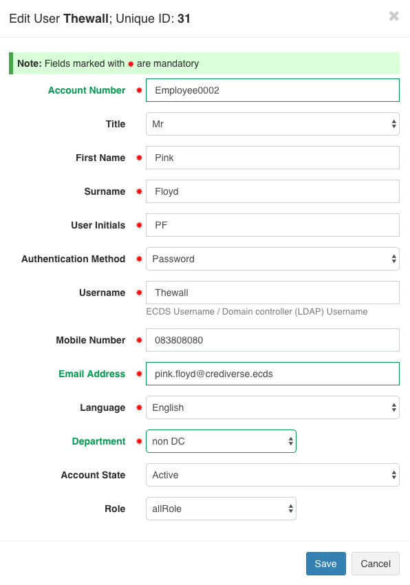

This pop-up window contains all the information detailed in [Adding a
Web User](#_adding_a_web_user) above and any field may be changed. When
all changes have been entered, click

to store the changed Web User or click

to abandon the process.

### Deleting a Web User

To delete an existing Web User, first locate the Web User as described
in [Viewing and Searching Web Users](#_viewing_and_searching_web_users)
above. Once the Web User is visible on the Web Users page, click the

button in the row in which the Web User to be deleted is displayed. A
deletion confirmation window pops up:

Click

to permanently delete the selected Web User or click

to retain the Web User.

### Importing Web Users

It is possible to define Web Users in a batch file and import these
predefined Web Users in a batch instead of entering each one
individually using the Web Application. Clicking the

button near the top right of the Web Users Management page will initiate
this process which is fully described in the [Batch
Processing](#_batch_import) section.

### Exporting Web Users

ECDS offers the facility to export Web Users’ detail to a CSV file in
the identical format and using the naming convention as described in the
[Batch Processing](#_batch_import) section below, but with the Verb set
to “verify” The file will be exported to the download location defined
in the settings of the web browser you are using. To accomplish the
export, click on the

button and inspect the configured download location.

Departments
-----------

A Department is a division within a large organisation which deals with
a specific function, for example, Call Centre or Support etc. The
Departments are used to group certain Web Users together.

### Adding a Department

To add a new Department, first click on

in the ECDS menu bar displayed on the left of the page and the on
.
The Department page appears:

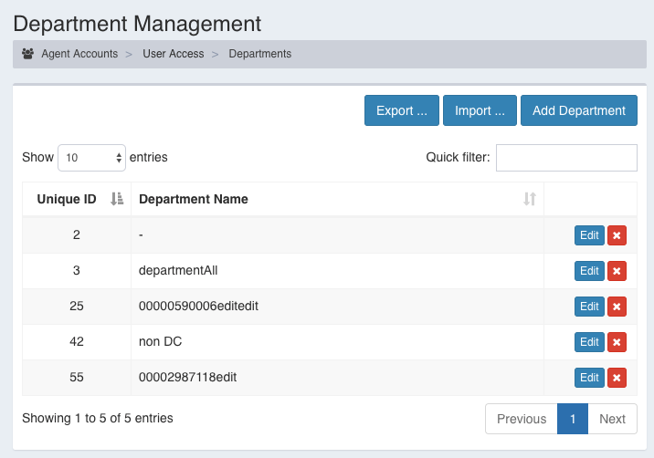

Click the

button near the top right of the page. The Add New Department pop-up
window appears:

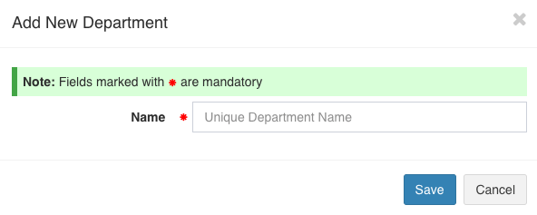

Information to be supplied to create a new Department is as follows:

<table>
<colgroup>
<col style="width: 25%" />
<col style="width: 25%" />
<col style="width: 25%" />
<col style="width: 25%" />
</colgroup>
<tbody>
<tr class="odd">
<td>
<strong>Field</strong>
</td>
<td>
<strong>Definition</strong>
</td>
<td>
<strong>Constraints</strong>
</td>
<td>
<strong>Required</strong>
</td>
</tr>
<tr class="even">
<td>
Department Name
</td>
<td>
The name of this Department, eg. Call Centre
</td>
<td>
Not more than 20 characters
</td>
<td>
Yes
</td>
</tr>
</tbody>
</table>

Once the information required to define the new Department has been
entered, click

to create the new Department, or click

to abandon the process. If all fields have been entered, the pop-up
window disappears, the new Role is saved and the Department page is
displayed showing the newly created Department.

### Viewing and Searching Departments \[\[*viewing\_and\_searching\_departments*\]\]

For each defined Department, the Department page shows the following in
a single row:

-   Unique Id

-   Department name

The sequence in which the Departments are listed may be changed by
clicking on any column heading. This will cause the Departments to be
sorted based on the content of the selected column in either ascending
or descending order, indicated by

(ascending) or

(descending) icons next to the column header.

Should there be more than one page of Departments, the

buttons will allow you to navigate to the previous, next or specific
page.

It is possible to change the number of Departments displayed on a page
by selecting a different value from the drop-down list displayed when
clicking on

near the left top corner of the Departments page.

Entering any text in the

text box shown at the top right of the page will result in only showing
those Departments containing the entered text.

### Editing a Department Name

To change any detail of an existing Department, first locate the Role as
described in [???](#_viewing_and_searching_departments_) above. Once the
Department is visible on the Departments page, click the

button in the row in which the Department to be edited is displayed. The
Edit Department pop-up window appears:

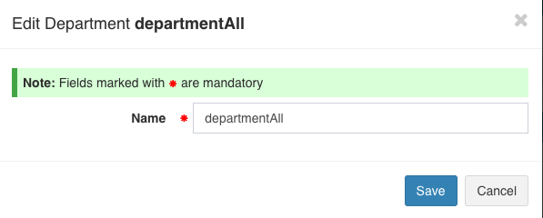

This window allows you to change the Department name. Once the change(s)
have been entered, click

to retain the changes or else click

to abandon the changes.

### Deleting a Department

To delete an existing Department, first locate the Department as
described in [???](#_viewing_and_searching_departments_) above. Once the
Department is visible on the Department page, click the

button in the row in which the Role to be deleted is displayed. A
deletion confirmation window pops up:

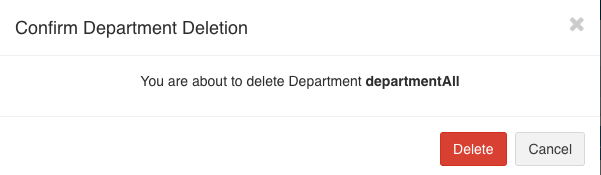

Click

to permanently delete the selected Department or click

to retain the Department.

### Importing Departments

It is possible to define Departments in a batch file and import these
predefined Departments in a batch instead of entering each one
individually using the Web Application. Clicking the

button near the top right of the Department Management page will
initiate this process which is fully described in the [Batch
Processing](#_batch_import) section below.

### Exporting Departments

ECDS offers the facility to export Departments detail to a CSV file in
the identical format and using the naming convention as described in the
[Batch Processing](#_batch_import) section below, but with the Verb set
to “verify” The file will be exported to the download location defined
in the settings of the web browser you are using. To accomplish the
export, click on the

button and inspect the configured download location.

Roles
-----

A Role is associated with each Web User, Agent or Agent User. Permission
to perform certain actions are granted to each defined role. This
determines what actions a User may perform using the Web Application.

> **Note**
>
> Agents and Agent User roles/Permissions are for the Agent Portal use
> and Web Users are for the Admin Portal Use

### Adding a Role

To add a new Role, first click on

in the ECDS menu bar displayed on the left of the page and the on
.
The Roles page appears:

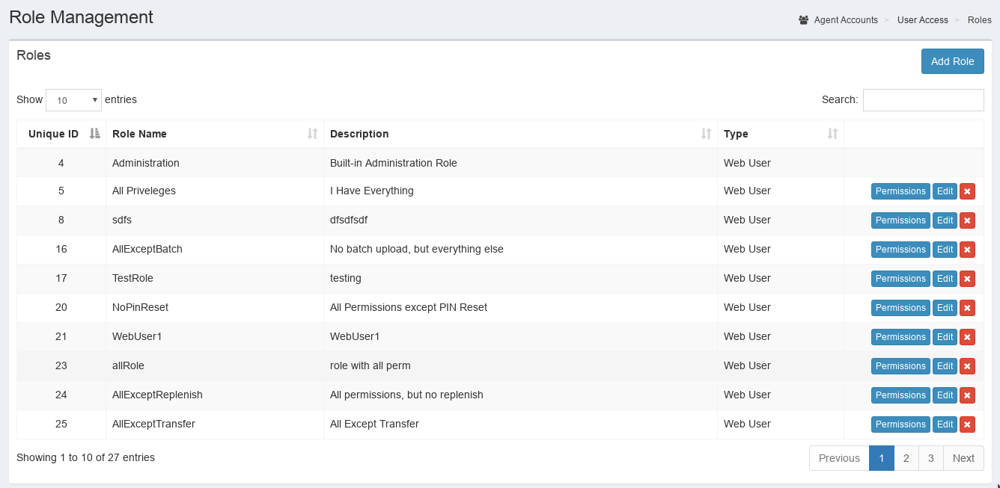

Click the

button near the top right of the page. The Add New Role pop-up window
appears:

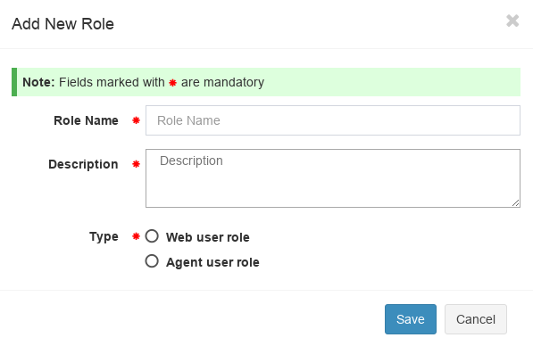

> **Note**
>
> Roles may be created for Web Users or Agents, including Agent Users.
> To differentiate the role, select the correct Type in the Role Edit
> screen.

Information to be supplied to create a new Role is as follows:

<table>
<colgroup>
<col style="width: 25%" />
<col style="width: 25%" />
<col style="width: 25%" />
<col style="width: 25%" />
</colgroup>
<tbody>
<tr class="odd">
<td>
<strong>Field</strong>
</td>
<td>
<strong>Definition</strong>
</td>
<td>
<strong>Constraints</strong>
</td>
<td>
<strong>Required</strong>
</td>
</tr>
<tr class="even">
<td>
Role Name
</td>
<td>
The name of this Role, eg. Sales Executive
</td>
<td>
Not more than 20 characters
</td>
<td>
Yes
</td>
</tr>
<tr class="odd">
<td>
Description
</td>
<td>
A description of the Role, e.g. “Responsible for making sales of credit to top-tier wholesalers”
</td>
<td>
Not More than 30 characters
</td>
<td>
Yes
</td>
</tr>
<tr class="even">
<td>
Type
</td>
<td>
Type of Web User
</td>
<td>
Either a Web User or an Agent/Agent User
</td>
<td>
Yes
</td>
</tr>
</tbody>
</table>

Once all information required to define the new Role has been entered,
click

to create the new Role, or click

to abandon the process. If all fields have been entered, the pop-up
window disappears, the new Role is saved and the Roles page is displayed
showing the newly created Role.

### Viewing and Searching Roles

For each defined Role, the Roles Management page shows the following in
a single row:

-   Role Name

-   Description

-   Type

The sequence in which the Roles are listed may be changed by clicking on
any column heading. This will cause the Roles to be sorted based on the
content of the selected column in either ascending or descending order,
indicated by

(ascending) or

(descending) icons next to the column header.

Should there be more than one page of Roles, the

buttons will allow you to navigate to the previous, next or specific
page.

It is possible to change the number of Roles displayed on a page by
selecting a different value from the drop-down list displayed when
clicking on

near the left top corner of the Roles page.

Entering any text in the

text box shown at the top right of the page will result in only showing
those Roles containing the entered text in any field defining the Role,
including in numerical fields.

### Associating Permissions With a Role \[\[*Associating\_Permissions\_with\_A\_Role*\]\]

To grant Permission to perform certain actions to a Role, first locate
the Role as described in [Viewing and Searching
Roles](#_viewing_and_searching_roles) above. Once the Role is visible on
the Web Users page, click the

button in the row in which the Role to be edited is displayed. The
Modify Role pop-up window appears:

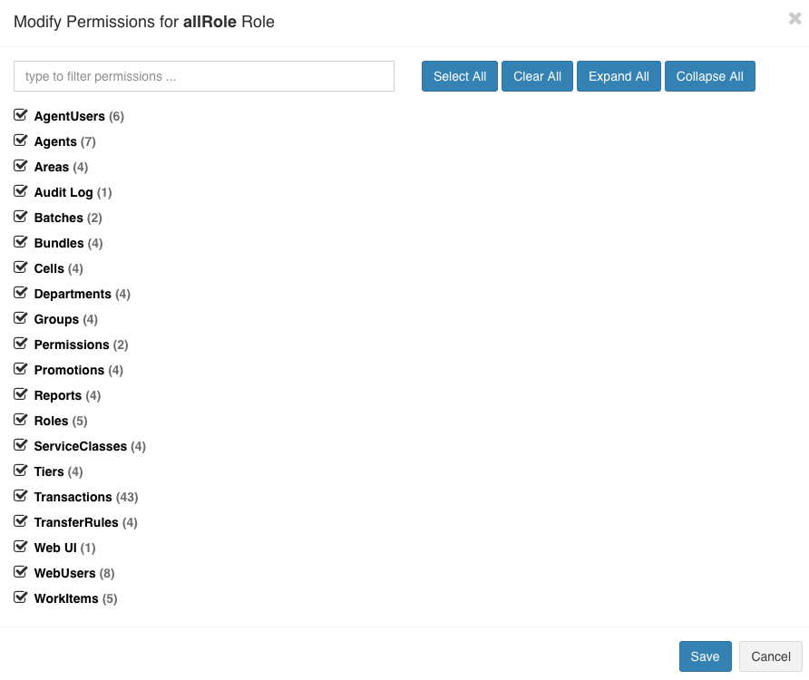

This window displays groups of all possible actions that a Web User or
Agent/Agent User could perform using the Web Application (Admin portal
for Web Users and Agent Portal for Agents or Agent Users).  

To expand a group to see what permissions may be granted, click on the
group name, for example to expand Agent group, click on Agent to see the
following:

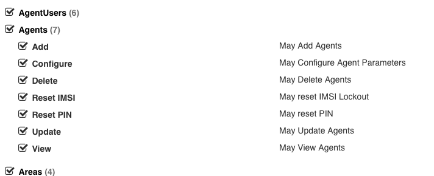

To enable a permission for the Role, click on the checkbox to the left
of the permission. until it displays a check mark
.
To take Permission for an action away from the Role, click the checkbox
until it is empty
.

Each individual permission can then be selected by clicking on the item.
Where a tick
()
is shown, this permission is granted for the role.  
Where a group does not have any permissions selected, a blank box
appears, for example:
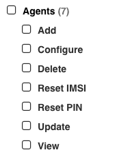
Whereas when some permissions are granted, a dash is shown in the box:
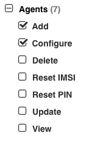  
and where all items are selected the Group item has a tick:

Bulk changes can be made, by selecting one of the buttons on the top
right
.  

With these buttons one can: \* Select All - Select all groups and
Permissions \* Clear All - Unselect all groups and permissions \* Expand
All - Visually expand all groups to show the sub Permissions \* Collapse
All - Visually collapse all groups to only show the list of groups

Entering any text in the

text box will display only those permission that contain the entered
text in either the Group or Description columns.

When all desired Permission have been allocated to the Role, click

to store the changed Permissions for the Role or click

to abandon the process.

### Editing a Role

To change any detail of an existing Role, first locate the Role as
described in [Viewing and Searching
Roles](#_viewing_and_searching_roles) above. Once the Role is visible on
the Roles page, click the

button in the row in which the Role to be edited is displayed. The Edit
Role pop-up window appears:

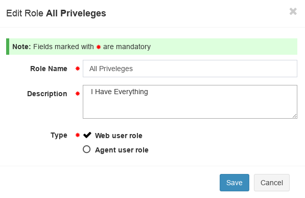

This window allows you to change the Role name and/or Description and/or
Type. Once the change(s) have been entered, click

to retain the changes or else click

to abandon the changes.

### Deleting a Role

To delete an existing Role, first locate the Role as described in
[Viewing and Searching Roles](#_viewing_and_searching_roles) above. Once
the Role is visible on the Roles page, click the

button in the row in which the Role to be deleted is displayed. A
deletion confirmation window pops up:

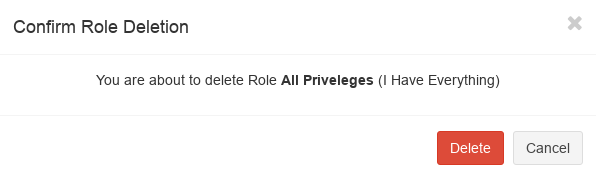

Click

to permanently delete the selected Role or click

to retain the Role.

### Importing Roles

It is possible to define Roles in a batch file and import these
predefined Roles in a batch instead of entering each one individually
using the Web Application. Clicking the

button near the top right of the Role Management page will initiate this
process which is fully described in the [Batch
Processing](#_batch_import) section below.

### Exporting Roles

ECDS offers the facility to export Roles’ detail to a CSV file in the
identical format and using the naming convention as described in the
[Batch Processing](#_batch_import) section below, but with the Verb set
to “verify” The file will be exported to the download location defined
in the settings of the web browser you are using. To accomplish the
export, click on the

button and inspect the configured download location.

Configuration
=============

ECDS allows the content of notification messages, the USSD and SMS
commands to be used, the location of certain files, the length of PINs
and various other items to be configured.

Configure Adjudication Notifications
------------------------------------

In the ECDS menu bar on the left of the page click on

and then on
.
The Adjustment Configuration page is displayed:

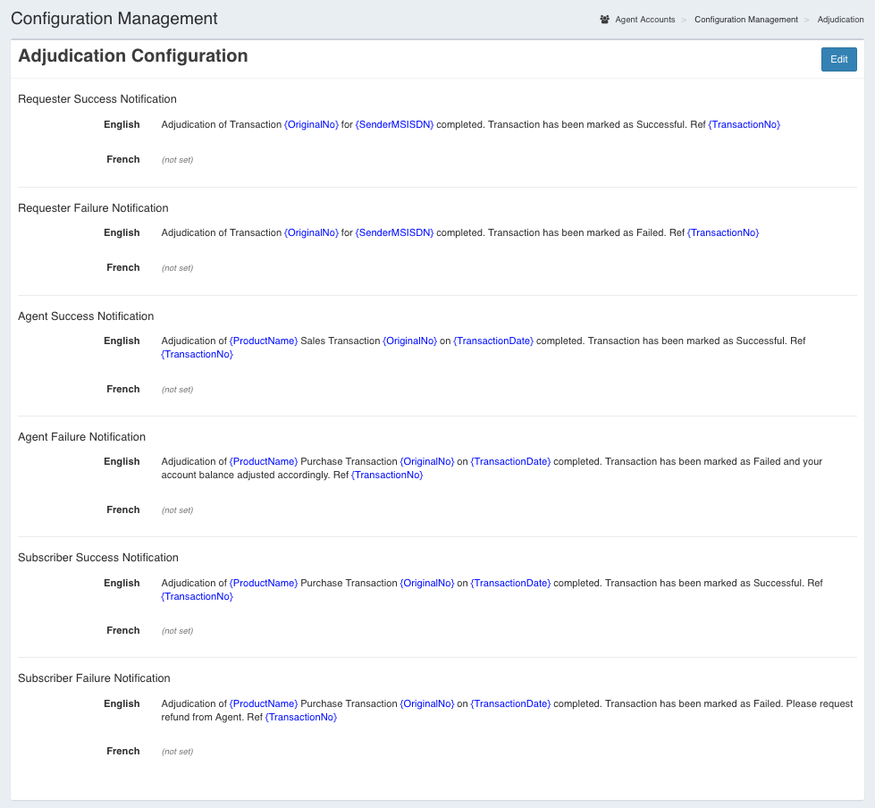

This page shows the message that the person Requesting an adjudication
will receive in the Notification block, while the Agent Notification
block shows the messages that an agent will receive when their
transaction has been adjudicated as either successful or failure, i.e.
rolled back. Similarly, the notifications which will be sent to the
subscriber regarding the final outcome of their transaction, may be
configured here too.  

ECDS provides for notifications in both English and French and a User
will receive the notification in the language preference entered when
the Agent was defined (see [Creating a New Agent
Account](#_creating_a_new_agent_account) above).  
Sections of the message enclosed in curly braces {} represent variables
and will be replaced in the message with the actual value of that
variable.  
Variables available for inclusion in the Adjudication Notifications are:

-   -   -   -   -   -   -   -   

To create or change the Adjudication notification messages click on

near the top right of the page. The Update Adjudication Configuration
pop-up window displays:

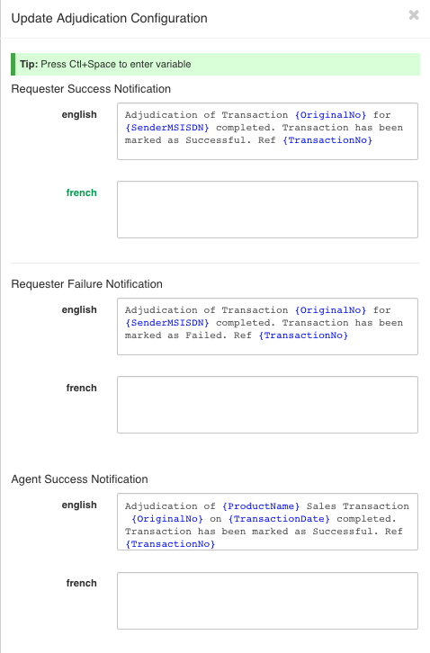

Enter the wording of the Adjudication notifications in both English and
French. Should you wish to show the contents of an available variable in
the notification message, press the Ctrl key and the space bar
simultaneously. This will result in a drop-down list showing the
variables that can be displayed to appear. Click on the variable you
wish to display - this will be inserted into the notification at the
current cursor position.  

Once the notification messages have been entered or modified, click

to accept the notifications as displayed or else click

to retain the notifications without change. The pop-up window disappears
and the Adjudication Configuration page reappears, showing the
notifications as they are configured.

Configure Adjustment Notifications
----------------------------------

In the ECDS menu bar on the left of the page click on

and then on
.
The Adjustment Configuration page is displayed:

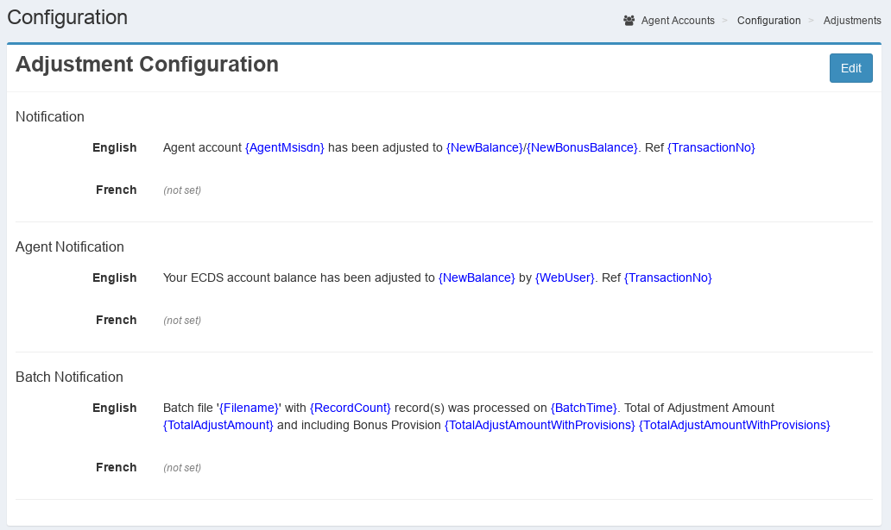

This page shows the message that the person initiating an adjustment
will receive in the Notification block, while the Agent Notification
block shows the message that an agent whose balance has been adjusted
will receive. ECDS provides for notifications in both English and French
and a User will receive the notification in the language preference
entered when the User was defined (see [Creating a New Agent
Account](#_creating_a_new_agent_account) above).  
Sections of the message enclosed in curly braces {} represent variables
and will be replaced in the message with the actual value of that
variable.  
Variables available for inclusion in the Adjustment Notifications are:

-   -   -   -   -   

To create or change the Adjustment notification messages click on

near the top right of the page. The Update Adjustments Configuration
pop-up window displays:

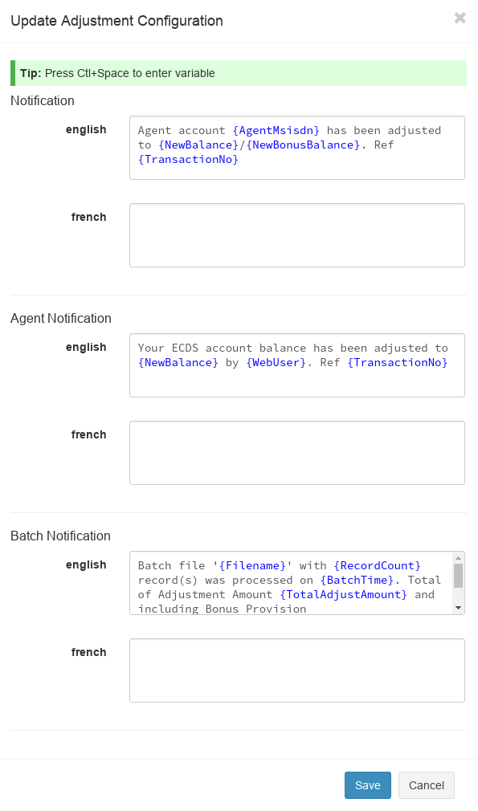

Enter the wording of the Adjustment notifications in both English and
French. Should you wish to show the contents of an available variable in
the notification message, press the Ctrl key and the space bar
simultaneously. This will result in a drop-down list showing the
variables that can be displayed to appear. Click on the variable you
wish to display - this will be inserted into the notification at the
current cursor position.  

Once the notification messages have been entered or modified, click

to accept the notifications as displayed or else click

to retain the notifications without change. The pop-up window disappears
and the Adjustment Configuration page reappears, showing the
notifications as they are configured.

Configure Agent Settings
------------------------

Configuration settings pertaining to certain Agent information or Agent
transactional behaviour, may be configured under the Agent Settings in
the Configuraiton menu, provided the logged in user has the required
permissions. Settings such as Location retrieval and caching for
Location Based services as well as configuration of Schedule Account
dumps, which may be used for risk control (Revenue Assurance Audits).
Additionally the length of an Agent PIN or Password and the New PIN /
Password Notification message (SMS or Email) may be configured. To
configure or modify any of these, click

in the ECDS menu bar displayed on the left of the page, and then on
.
The Agents Configuration page appears:

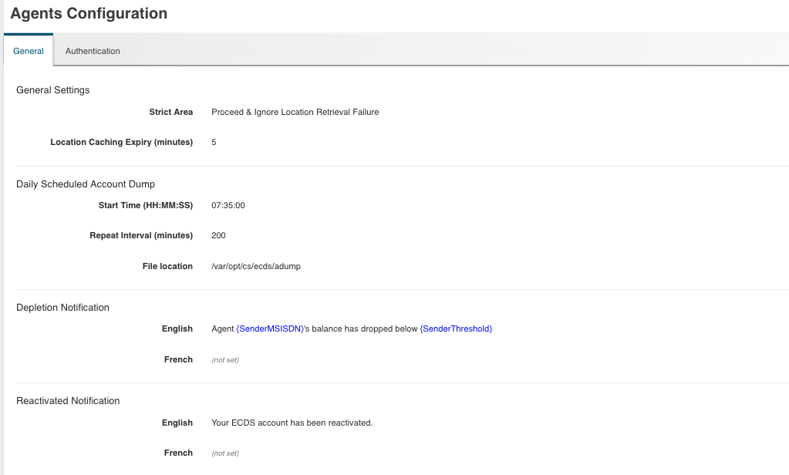

This page contains two tab sheets, once for **General Settings** and one
for **Authentication settings**.  

Under the **General Settings** tab the following information can be
managed:

<table>
<colgroup>
<col style="width: 33%" />
<col style="width: 33%" />
<col style="width: 33%" />
</colgroup>
<tbody>
<tr class="odd">
<td>
<strong>Parameter</strong>
</td>
<td>
<strong>Definition</strong>
</td>
<td>
<strong>Notes</strong>
</td>
</tr>
<tr class="even">
<td>
Strict Area
</td>
<td>
Indicates whether to Proceed with a transaction containing strict Area conditions, when Location cannot be retrieved from HLR
</td>
<td>
Proceed &amp; Ignore Location Retrieval Failure OR Fail Transaction on Location Retrieval Failure
</td>
</tr>
<tr class="odd">
<td>
Location Caching Expiry
</td>
<td>
Indicates the time in minutes, to cache the Agents location. This parameter is used to reduce the network traffic towards HLR to obtain Agent location
</td>
<td>
Time in minutes
</td>
</tr>
<tr class="even">
<td>
Schedule Account Dump start time
</td>
<td>
The time when the schedule account dump file is generated
</td>
<td></td>
</tr>
<tr class="odd">
<td>
Schedule Account Dump Interval
</td>
<td>
The number of minutes, from the Start Time, to generate successive Account Dumps
</td>
<td>
Note that frequency should be limited due to the size of these files and the resources used to generate them
</td>
</tr>
<tr class="even">
<td>
Scheduled Account Dump Directory
</td>
<td>
The directory where account dumps should be written
</td>
<td></td>
</tr>
<tr class="odd">
<td>
Depletion notification message
</td>
<td>
SMS Notification message when Account state changes
</td>
<td>
See list of variables which may be used below.
</td>
</tr>
<tr class="even">
<td>
Reactivation notification
</td>
<td>
SMS Notification message when Account state changes
</td>
<td>
See list of variables which may be used below.
</td>
</tr>
<tr class="odd">
<td>
Deactivation notification
</td>
<td>
SMS Notification message when Account state changes
</td>
<td>
See list of variables which may be used below.
</td>
</tr>
<tr class="even">
<td>
Suspension notification
</td>
<td>
SMS Notification message when Account state changes
</td>
<td>
See list of variables which may be used below.
</td>
</tr>
<tr class="odd">
<td>
Active state
</td>
<td>
Keyword used to define State
</td>
<td></td>
</tr>
<tr class="even">
<td>
Suspended state
</td>
<td>
Keyword used to define State
</td>
<td></td>
</tr>
<tr class="odd">
<td>
Deactivated state
</td>
<td>
Keyword used to define State
</td>
<td></td>
</tr>
<tr class="even">
<td>
Permanent State
</td>
<td>
Keyword used to define State
</td>
<td></td>
</tr>
</tbody>
</table>

Selecting the **Authentication settings** tab sheet, appears as follows:

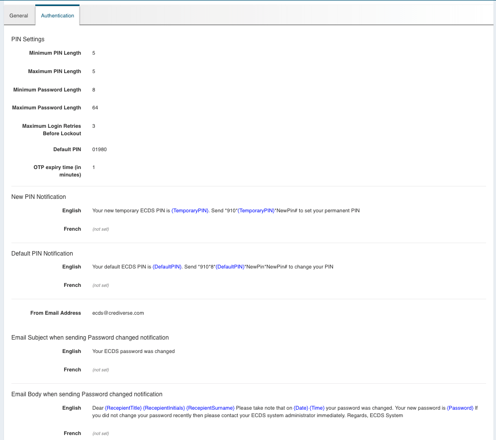

Under the Authentication Settings tab the following information can be
managed:

<table>
<colgroup>
<col style="width: 33%" />
<col style="width: 33%" />
<col style="width: 33%" />
</colgroup>
<tbody>
<tr class="odd">
<td>
<strong>Parameter</strong>
</td>
<td>
<strong>Definition</strong>
</td>
<td>
<strong>Notes</strong>
</td>
</tr>
<tr class="even">
<td>
Minimum PIN length
</td>
<td>
Minimum length for Agent PIN
</td>
<td>
May not exceed Maximum
</td>
</tr>
<tr class="odd">
<td>
Maximum PIN length
</td>
<td>
Maximum length for Agent PIN (May be the same as Minimum)
</td>
<td></td>
</tr>
<tr class="even">
<td>
Minimum Password length
</td>
<td>
Minimum length for Agent Password, for API Users which will access ECDS via API
</td>
<td></td>
</tr>
<tr class="odd">
<td>
Maximum Password length
</td>
<td>
Maximum length for Agent PIN, for API Users which will access ECDS via API
</td>
<td></td>
</tr>
<tr class="even">
<td>
Maximum Login retries before lockout
</td>
<td>
Accounts will be locked after the configured number of failed login attempts
</td>
<td></td>
</tr>
<tr class="odd">
<td>
The default PIN
</td>
<td>
When configured, New Agents and Agents which have had their PIN reset, will receive an SMS with this PIN. Where this is NOT set, the New Agents and Agents with PIN resets, will receive a temporary random PIN and a request to register a new PIN before transacting
</td>
<td></td>
</tr>
<tr class="even">
<td>
One-time PIN validity period
</td>
<td>
The time in minutes for an OTP which is sent to Agent via SMS to expire
</td>
<td></td>
</tr>
<tr class="odd">
<td>
New PIN notification message sent to Agents
</td>
<td>
SMS Notification message when a temporary PIN code is set, requesting the Agent to register a new PIN
</td>
<td>
See list of variables which may be used below.
</td>
</tr>
<tr class="even">
<td>
Default PIN notification message
</td>
<td>
SMS Notification message when the Default PIN code is sent to the Agent/User
</td>
<td>
See list of variables which may be used below.
</td>
</tr>
<tr class="odd">
<td>
Email Subject when sending Password changed notification
</td>
<td>
Email subject for password changes (non PIN users)
</td>
<td></td>
</tr>
<tr class="even">
<td>
Email Body when sending Password changed notification
</td>
<td>
Body of Email for password change
</td>
<td></td>
</tr>
<tr class="odd">
<td>
Email Subject when sending Password reset notification
</td>
<td>
Email subject for password reset
</td>
<td></td>
</tr>
<tr class="even">
<td>
Email Body when sending Password reset notification
</td>
<td>
Email body for password reset
</td>
<td></td>
</tr>
</tbody>
</table>

> **Tip**
>
> To access available Variables to insert into SMS notifications or
> Email Body, use the CNTRL+SPACE key combination on your keyboard.
> Variables may be selected from the list and will insert with curly
> braces {} and will be replaced in the message with the actual value of
> that variable.

Variables available may include:

-   -   -   -   -   

To initially configure or later modify any of the above, click

near the top right of the Agents Configuration page. The Update Agents
Configuration pop-up window appears:

Configure the PIN minimum and maximum length as desired.  
Enter the path to the Account Dump directory as well as the dump
interval in minutes.  
Enter the wording of all Notifications in both English and French.
Should you wish to show the contents of an available variable in the
notification message, press the Ctrl key and the space bar
simultaneously. This will result in a drop-down list showing the
variables that can be displayed to appear. Click on the variable you
wish to display - this will be inserted into the notification at the
current cursor position.  

Once the all desired values have been entered or modified, click

to accept the values as displayed or else click

to retain the prior values without change. The pop-up window disappears
and the Agents Configuration page reappears, showing the settings as
they are configured.

Configure Airtime Sales Settings
--------------------------------

Settings related to the sale of airtime are configured in this section.
Various settings pertaining to de-duplication checks, USSD menus,
identifying error codes from external systems for follow up and OCS
integration settings may be configured here.  

To configure or modify any of these, click

in the ECDS menu bar displayed on the left of the page, and then on
.
The Sales Configuration page appears:

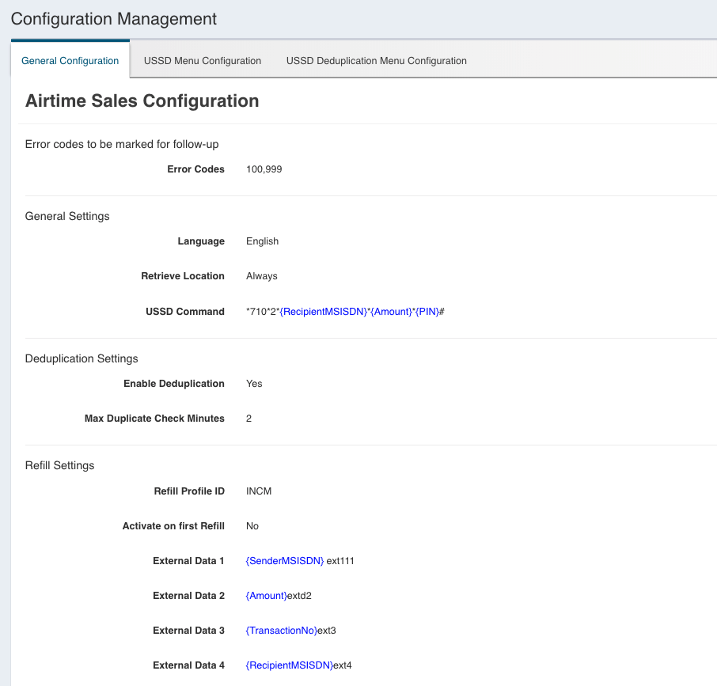

This page contains three tab sheets, one for **General Settings**, one
for **USSD Confirmation Menu** and one for **USSD Deduplication
Confirmation Menu**.  

### General Settings

Under the **General Settings** tab the following information can be
managed:

<table>
<colgroup>
<col style="width: 50%" />
<col style="width: 50%" />
</colgroup>
<tbody>
<tr class="odd">
<td>
<strong>Parameter</strong>
</td>
<td>
<strong>Definition</strong>
</td>
</tr>
<tr class="even">
<td>
Error Codes to be marked for follow-up
</td>
<td>
Error codes from external OCS, which are not a clear success or failure, can be listed here and will result in transactions being marked for follow-up, when received from OCS. See <a href="#_Adjudicatin_of_a_transaction_marked_for_follow_up_">???</a>
</td>
</tr>
<tr class="odd">
<td>
Language
</td>
<td>
Default language of SMS to send to Subscribers, where Subscriber has not selected a language on OCS
</td>
</tr>
<tr class="even">
<td>
Retrieve Location
</td>
<td>
Indicate whether to retrieve agent location information on all transactions, or only when it is specifically required, due to some Area constraint on the Agent or Transfer rule.
</td>
</tr>
<tr class="odd">
<td>
USSD Command Syntax
</td>
<td>
The USSD Short code and syntax for Airtime Sales
</td>
</tr>
<tr class="even">
<td>
De-duplication enable/disable
</td>
<td>
Crediverse ECDS can be configured to verify transactions which appear to be duplicates, i.e. where the same amount of airtime is sold to the same subscriber, the system can be configured to confirm the transaction before proceeding.
</td>
</tr>
<tr class="odd">
<td>
Max duplicate check minutes
</td>
<td>
The time window during which to check for potential duplicate transactions.
</td>
</tr>
<tr class="even">
<td>
SMS Command Syntax
</td>
<td>
The SMS Short code and syntax for Airtime Sales
</td>
</tr>
</tbody>
</table>

> **Tip**
>
> For both USSD and SMS commands, words enclosed in curly braces {}
> represent variables in the ECDS system. Any string entered in the
> corresponding position in the command will be used as the value of
> that variable in ECDS.  
> Variables to be supplied in the USSD and SMS commands are:  

The USSD command must start with an asterisk (\*) and end with a hash
sign (\#). Every variable should be separated from the next by an
asterisk. Examples of valid USSD command configurations are:

-   -   

The SMS command must start with the word CREDIT followed by the
variables needed, namely the amount, the PIN and the recipient’s mobile
phone number in any order separated by spaces. The SMS command must end
in the apllication terminating SMS number the command should be sent to,
preceded by ⇒. Examples of valid SMS command configurations are:

-   -   

#### OCS integration Settings

Depending on the Online Charging System (OCS), which ECDS is integrated
with, various settings specific to the OCS may be configured:

<table>
<colgroup>
<col style="width: 50%" />
<col style="width: 50%" />
</colgroup>
<tbody>
<tr class="odd">
<td>
Refill Profile ID
</td>
<td>
The refillProfileID parameter contains a refill profile that will be converted into a segmentation identity by the OCS.
</td>
</tr>
<tr class="even">
<td>
Activate on first Refill
</td>
<td>
Indicates whether OCS should activate an inactive subscriber on first refill
</td>
</tr>
<tr class="odd">
<td>
External Data 1
</td>
<td>
Static text or Various Dynamic variables, including SenderMSISDN, RecipientMSISDN, Amount and TransactionNo may be inserted and this will be passed in the OCS call
</td>
</tr>
<tr class="even">
<td>
External Data 2
</td>
<td>
Static text or Various Dynamic variables, including SenderMSISDN, RecipientMSISDN, Amount and TransactionNo may be inserted and this will be passed in the OCS call
</td>
</tr>
<tr class="odd">
<td>
External Data 3
</td>
<td>
Static text or Various Dynamic variables, including SenderMSISDN, RecipientMSISDN, Amount and TransactionNo may be inserted and this will be passed in the OCS call
</td>
</tr>
<tr class="even">
<td>
External Data 4
</td>
<td>
Static text or Various Dynamic variables, including SenderMSISDN, RecipientMSISDN, Amount and TransactionNo may be inserted and this will be passed in the OCS call
</td>
</tr>
</tbody>
</table>

#### SMS Settings

The following Airtime Sale SMS notifications may also be configured for
Airtime Sales:

<table>
<colgroup>
<col style="width: 50%" />
<col style="width: 50%" />
</colgroup>
<tbody>
<tr class="odd">
<td>
Sender Notification (Success)
</td>
<td>
SMS sent to Sender on completion of successful transaction.
</td>
</tr>
<tr class="even">
<td>
Recipient Notification (Success)
</td>
<td>
SMS sent to Recipient (Subscriber) on completion of successful transaction.
</td>
</tr>
<tr class="odd">
<td>
Sender Notification (Unknown State Transaction)
</td>
<td>
SMS sent to Sender on completion of transaction, where the final state is unknown and the transaction has been marked for follow-up. See <a href="#_Adjudicatin_of_a_transaction_marked_for_follow_up_">???</a>
</td>
</tr>
<tr class="even">
<td>
Recipient Notification (Unknown State Transaction)
</td>
<td>
SMS sent to Recipient (Subscriber) on completion of transaction, where the final state is unknown and the transaction has been marked for follow-up. See <a href="#_Adjudicatin_of_a_transaction_marked_for_follow_up_">???</a>
</td>
</tr>
</tbody>
</table>

> **Note**
>
> For notifications, sections of the notification message enclosed in
> curly braces {} represent variables in ECDS and will be replaced in
> the message with the actual value of that variable.  

**Variables available for display in both the Sender and Recipient
Notifications are:**  

### USSD Menu Confirmation

Selecting the **USSD Menu Confirmation** tab will present a screen
similar to the following:

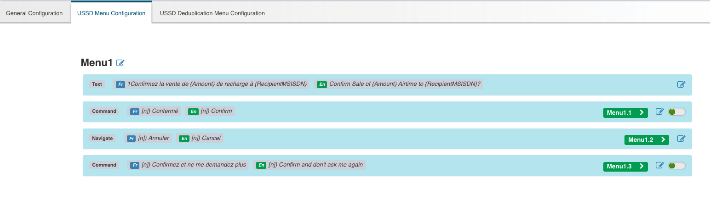

From here, the USSD Menu dialogue and messages can be configured in
multiple languages. To edit the text, simply click on the

and to turn off a USSD menu item, slide the
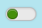
control.

### USSD De-duplication Menu Confirmation

Selecting the **USSD Deduplication Menu Confirmation** tab will present
a screen similar to the following:

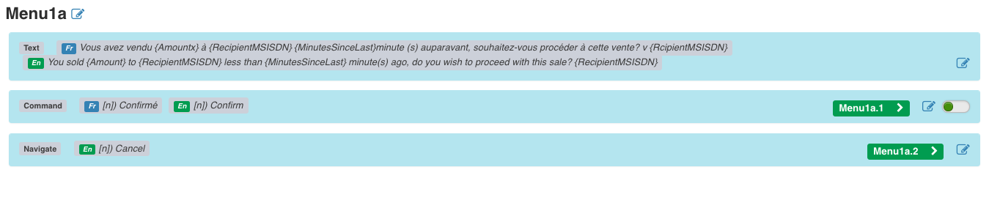

From here, the USSD De-duplication dialogue and messages can be
configured in multiple languages. To edit the text, simply click on the

and to turn off a USSD menu item, slide the

control.

> **Important**
>
> Once the all desired settings for Airtime Sales have been entered or
> modified, click
> 
> to accept the values as displayed or else click
> 
> to retain the prior values without change. The pop-up window
> disappears and the Sales Configuration page reappears, showing the
> settings as they are configured.

Configure Airtime Sales Query Settings
--------------------------------------

Settings related to airtime sales queries are the USSD and SMS query
structure and the content of related notifications.  

To configure or modify any of these, click

in the ECDS menu bar displayed on the left of the page, and then on
.
The Sales Query Configuration page appears:

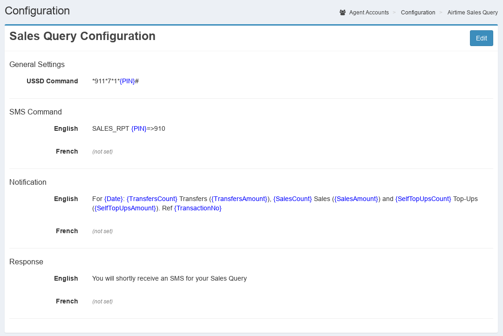

This page shows the current configurations for:

-   The USSD command used to submit an airtime sales query

-   The SMS command used to submit an airtime sales query in both
    English and French

-   The SMS notification sumarising airtime transaction for the day

-   The USSD notification sent in response to a USSD query

For both USSD and SMS commands, words enclosed in curly braces {}
represent variables in the ECDS system. Any string entered in the
corresponding position in the command will be used as the value of that
variable in ECDS.  
Variables to be supplied in the USSD and SMS commands are:

-   

For notifications, sections of the notification message enclosed in
curly braces {} represent variables in ECDS and will be replaced in the
message with the actual value of that variable.  
Variables available for display in the query response are:

-   Concurrent Systems The date for which statistics are given

-   -   -   -   -   -   -   

To initially configure or later modify any of the above, click

near the top right of the Sales Query Configuration page. The Update
Sales Query Configuration pop-up window appears:

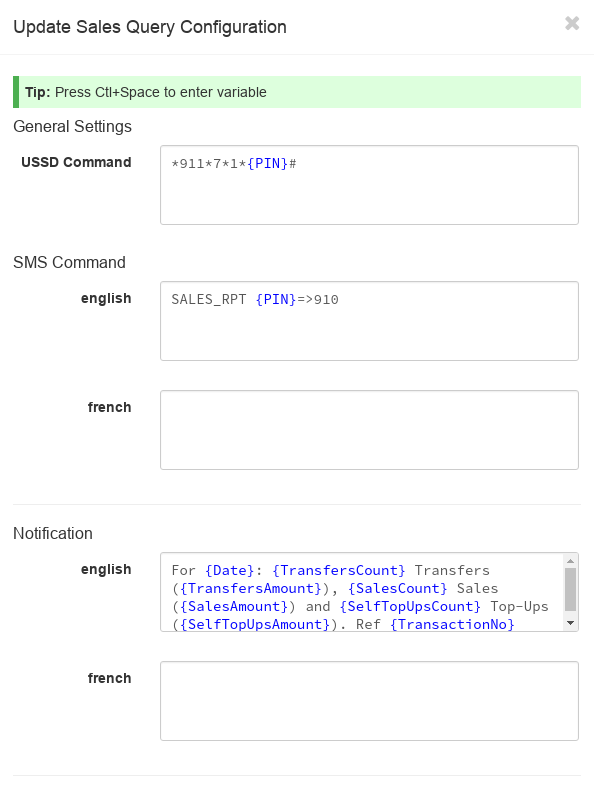

To configure the USSD command used to query daily sales statistics, the
USSD short code as well as a possible sub-code should be specified.
There should also be provision for the PIN to authorise the transaction.
The USSD code and possible sub-code must be specified as the first part
of the command. The USSD command must start with an asterisk (\\\*) and
end with a hash sign (\#). Examples of valid USSD command configurations
are:

-   -   

The SMS command must start with the word SALES\_RPT followed by the PIN
separated by a space. The SMS command must end in the application
terminating SMS number the command should be sent to, preceded by ⇒.
Examples of valid SMS command configurations are:

-   -   

Enter the wording of the SMS Notifications sent in response to the sales
query in both English and French. Should you wish to show the contents
of an available variable in the notification message, press the Ctrl key
and the space bar simultaneously. This will result in a drop-down list
showing the variables that can be displayed to appear. Click on the
variable you wish to display - this will be inserted into the
notification at the current cursor position.  
Enter the wording of the USSD response sent in response to a USSD query.
Include variables as described for the SMS notification. As a USSD
response is limited in length, caution should be exercised not to
include too many variables in the USSD response.  

Once the all desired settings have been entered or modified, click

to accept the values as displayed or else click

to retain the prior values without change. The pop-up window disappears
and the Sales Query Configuration page reappears, showing the settings
as they are configured.

Configure Balance Enquiries Settings
------------------------------------

Settings related to balance enquiries are the USSD and SMS enquiry
structure and the content of the response notifications for own or
sub-agents balance enquiry.  

To configure or modify any of these, click

in the ECDS menu bar displayed on the left of the page, and then on
.
The Balance Enquiries Configuration page appears:

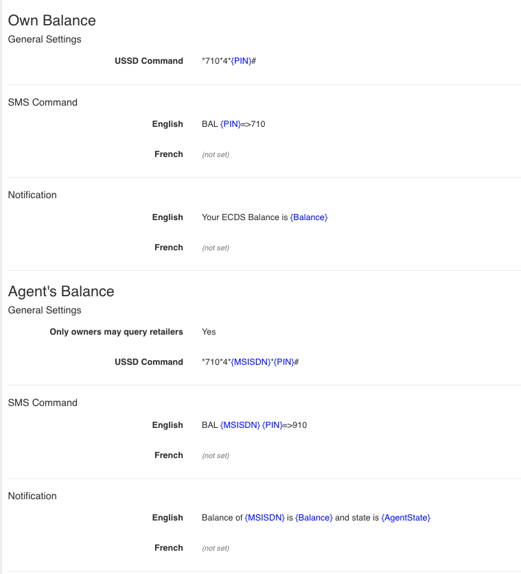

This page shows the current configurations for:

-   The USSD command used by the agent to request their own balance
    enquiry

-   The SMS command used by the agent to request their own balance
    enquiry in both English and French

-   The notification sent back in response to the query

-   The USSD command used by the agent to request the balance of a
    sub-agent, where they are listed as the owner of that agent.

-   The SMS command used by the agent to request the balance of a
    sub-agent, where they are listed as the owner of that agent.

-   The notification sent back in response to the query

For notifications, sections of the notification message enclosed in
curly braces {} represent variables in ECDS and will be replaced in the
message with the actual value of that variable.  
The only variable available for display in the balance enquiry response
is:

-   -   -   -   -   -   

To initially configure or later modify any of the above, click

near the top right of the Balance Enquiries Configuration page. The
Update Balance Enquiries Configuration pop-up window appears:

To configure the USSD command used to submit a balance enquiry, the USSD
short code as well as a possible sub-code should be specified. The USSD
command must start with an asterisk (\*) and end with a hash sign (\#).
Examples of valid USSD command configurations are:

-   \*123\*6\#

-   \*987\#

The SMS command must start with the word BAL. The SMS command must end
in the application terminating SMS number the command should be sent to,
preceded by ⇒. Examples of valid SMS command configurations are:

-   BAL⇒123

-   BAL⇒987

Once the all desired settings have been entered or modified, click

to accept the values as displayed or else click

to retain the prior values without change. The pop-up window disappears
and the Balance Enquiry Configuration page reappears, showing the
settings as they are configured.

Configure Batch Settings
------------------------

Batch Processing refers to the capability to import CSV files to perform
business processes including Master Data Management. These batch files
are encrypted and archived once processed The Batch settings specify the
directory where these batch files are archived.  

To configure or modify this location, click

in the ECDS menu bar displayed on the left of the page, and then on
.
The Batch Configuration page appears:

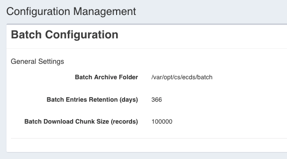

This page shows the current configuration for:

-   The location where batch files are archived

-   The Number of days to keep batch entries - This can be adjusted to
    conserve disk space.

-   The batch download chunk size (records) - This setting can be
    adjusted to optimise downloads. This should be done by a support
    person only.

To initially configure or later modify this location, click

near the top right of the Batch Configuration page. The Update Batch
Configuration pop-up window appears:

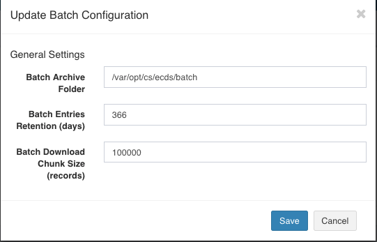

Enter the valid path to the folder where batch files should be archived.
Once entered or modified, click

to accept the values as displayed or else click

to retain the prior values without change. The pop-up window disappears
and the Batch Configuration page reappears, showing the settings as they
are configured.

Configure Bundle Sales Settings
-------------------------------

Settings related to the sale of Bundles are configured in this section.
Various settings pertaining to de-duplication checks, USSD menus and
Location retrieval may be configured here.  

To configure or modify any of these, click

in the ECDS menu bar displayed on the left of the page, and then on
.
The Bundle Sales Configuration page appears:

This page contains three tab sheets, one for **General Settings**, one
for **USSD Confirmation Menu** and one for **USSD De-duplication
Confirmation Menu**.  

### General Settings

Under the **General Settings** tab the following information can be
managed:

<table>
<colgroup>
<col style="width: 50%" />
<col style="width: 50%" />
</colgroup>
<tbody>
<tr class="odd">
<td>
<strong>Parameter</strong>
</td>
<td>
<strong>Definition</strong>
</td>
</tr>
<tr class="even">
<td>
USSD Command Syntax
</td>
<td>
The USSD Short code and syntax for Bundle Sales
</td>
</tr>
<tr class="odd">
<td>
Retrieve Location
</td>
<td>
Indicate whether to retrieve agent location information on all transactions, or only when it is specifically required, due to some Area constraint on the Agent or Transfer rule.
</td>
</tr>
<tr class="even">
<td>
De-duplication enable/disable
</td>
<td>
Crediverse ECDS can be configured to verify transactions which appear to be duplicates, i.e. where the same bundle is sold to the same subscriber, the system can be configured to confirm the transaction before proceeding.
</td>
</tr>
<tr class="odd">
<td>
Max duplicate check minutes
</td>
<td>
The time window during which to check for potential duplicate transactions.
</td>
</tr>
<tr class="even">
<td>
SMS Command Syntax
</td>
<td>
The SMS Short code and syntax for Bundle Sales
</td>
</tr>
</tbody>
</table>

> **Tip**
>
> For both USSD and SMS commands, words enclosed in curly braces {}
> represent variables in the ECDS system. Any string entered in the
> corresponding position in the command will be used as the value of
> that variable in ECDS.  

**Variables to be supplied in the USSD and SMS commands are:**  

The USSD command must start with an asterisk (\*) and end with a hash
sign (\#). Every variable should be separated from the next by an
asterisk. Examples of valid USSD command configurations are:

-   -   

The SMS command must start with the word BUNDLE followed by the
variables needed, namely the SMS Keyword to denote the bundle, the PIN
and the recipient’s mobile phone number in any order separated by
spaces. The SMS command must end in the application terminating SMS
number the command should be sent to, preceded by ⇒. Examples of valid
SMS command configurations are:

-   -   

#### SMS Settings

The following Bundle Sale SMS notifications may also be configured:

<table>
<colgroup>
<col style="width: 50%" />
<col style="width: 50%" />
</colgroup>
<tbody>
<tr class="odd">
<td>
Sender Notification (Success)
</td>
<td>
SMS sent to Sender on completion of successful transaction.
</td>
</tr>
<tr class="even">
<td>
Recipient Notification (Success)
</td>
<td>
SMS sent to Recipient (Subscriber) on completion of successful transaction.
</td>
</tr>
<tr class="odd">
<td>
Sender Notification (Unknown State Transaction)
</td>
<td>
SMS sent to Sender on completion of transaction, where the final state is unknown and the transaction has been marked for follow-up. See <a href="#_Adjudicatin_of_a_transaction_marked_for_follow_up_">???</a>
</td>
</tr>
<tr class="even">
<td>
Recipient Notification (Unknown State Transaction)
</td>
<td>
SMS sent to Recipient (Subscriber) on completion of transaction, where the final state is unknown and the transaction has been marked for follow-up. See <a href="#_Adjudicatin_of_a_transaction_marked_for_follow_up_">???</a>
</td>
</tr>
<tr class="odd">
<td>
Sender Notification (Failure)
</td>
<td>
SMS sent to Sender on completion of Failed transaction.
</td>
</tr>
<tr class="even">
<td>
Recipient Notification (Failure)
</td>
<td>
SMS sent to Recipient (Subscriber) on completion of Failed transaction.
</td>
</tr>
</tbody>
</table>

> **Note**
>
> For notifications, sections of the notification message enclosed in
> curly braces {} represent variables in ECDS and will be replaced in
> the message with the actual value of that variable.  

**Variables available for display in both the Sender and Recipient
Notifications are:**  

### USSD Menu Confirmation

Selecting the **USSD Menu Confirmation** tab will present a screen
similar to the following:

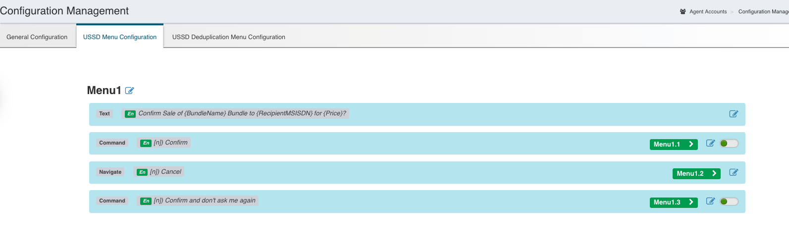

From here, the USSD Menu dialogue and messages can be configured in
multiple languages. To edit the text, simply click on the

and to turn off a USSD menu item, slide the

control.

### USSD De-duplication Menu Confirmation

Selecting the **USSD Deduplication Menu Confirmation** tab will present
a screen similar to the following:

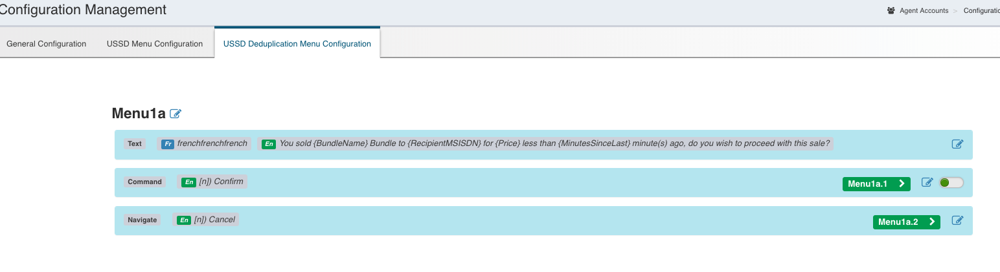

From here, the USSD De-duplication dialogue and messages can be
configured in multiple languages. To edit the text, simply click on the

and to turn off a USSD menu item, slide the

control.

> **Important**
>
> Once the all desired settings for Bundle Sales have been entered or
> modified, click
> 
> to accept the values as displayed or else click
> 
> to retain the prior values without change. The pop-up window
> disappears and the Bundle Configuration page reappears, showing the
> settings as they are configured.

Configure Change PIN Settings
-----------------------------

Settings related to PIN changes are the USSD and SMS query structure and
the content of the related notification.  
To configure or modify any of these, click

in the ECDS menu bar displayed on the left of the page, and then on
.
The Change PIN Configuration page appears:

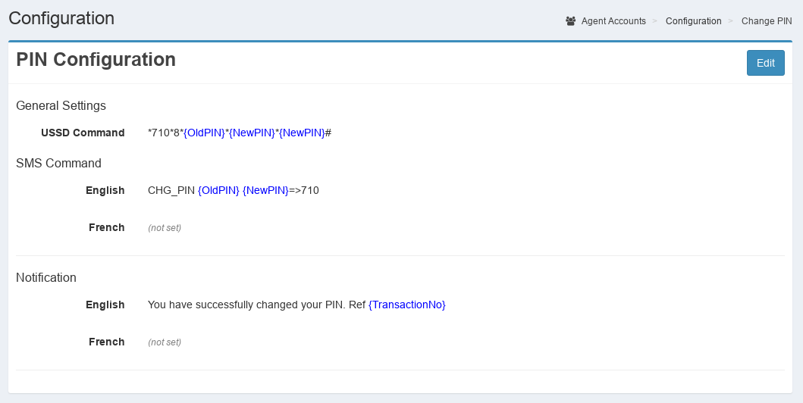

This page shows the current configurations for:

-   The USSD command used to change a PIN

-   The SMS command used to change a PIN in both English and French

-   The notification sent in response to a PIN change

For both USSD and SMS commands, words enclosed in curly braces {}
represent variables in the ECDS system. Any string entered in the
corresponding position in the command will be used as the value of that
variable in ECDS.  
Variables to be supplied in the USSD and SMS commands are:

-   -   

For notifications, sections of the notification message enclosed in
curly braces {} represent variables in ECDS and will be replaced in the
message with the actual value of that variable.  
The only variable available for display in the query response is:

-   

To initially configure or later modify any of the above, click

near the top right of the Change PIN Configuration page. The Update
Change PIN Configuration pop-up window appears:

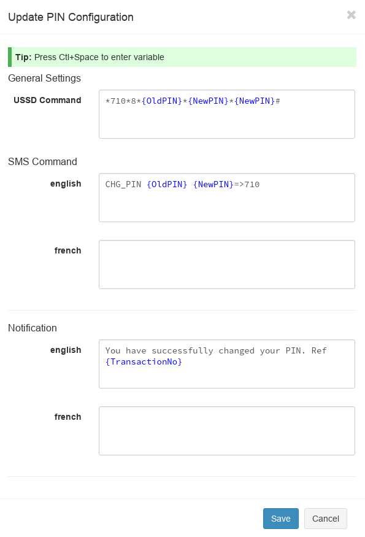

To configure the USSD command used to change a PIN, the USSD short code
as well as an optional sub-code should be specified. There should also
be provision for both the old PIN as well as the new PIN. The USSD code
and optional sub-code must be specified as the first part of the
command. The USSD command must start with an asterisk (\*) and end with
a hash sign (\#). Variables should be separated from each other and the
USSD short code by asterisks (\*). Examples of valid USSD command
configurations are:

-   -   

The SMS command must start with the word CHG\_PIN followed by the old
and new PIN variables separated by a spaces. The SMS command must end in
the application terminating SMS number the command should be sent to,
preceded by ⇒. Examples of valid SMS command configurations are:

-   -   

Enter the wording of the SMS Notification sent in response to the PIN
change in both English and French. Should you wish to show the contents
of an available variable in the notification message, press the Ctrl key
and the space bar simultaneously. This will result in a drop-down list
showing the variables that can be displayed to appear. Click on the
variable you wish to display - this will be inserted into the
notification at the current cursor position.  
Once the all desired settings have been entered or modified, click

to accept the values as displayed or else click

to retain the prior values without change. The pop-up window disappears
and the Change PIN Configuration page reappears, showing the settings as
they are configured.

Configure Deposit Query Settings
--------------------------------

Settings related to Deposit Queries are the USSD and SMS query structure
and, the content of the related USSD notification and the content of the
SMS notification.  
To configure or modify any of these, click

in the ECDS menu bar displayed on the left of the page, and then on
.
The Deposit Query Configuration page appears:

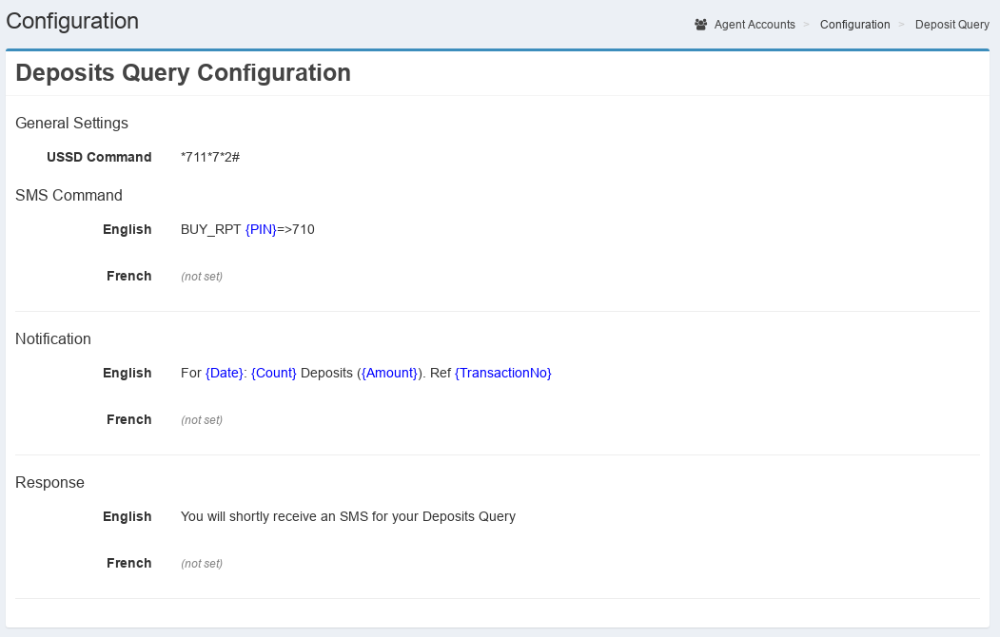

This page shows the current configurations for:

-   The USSD command used to enquire about deposits made

-   The SMS command used to enquire about deposits made in both English
    and French

-   The USSD notification sent in response to such a query

-   The SMS notification send with deposit statistics

For both USSD and SMS commands, words enclosed in curly braces {}
represent variables in the ECDS system. Any string entered in the
corresponding position in the command will be used as the value of that
variable in ECDS.  
The only variable to be supplied in the USSD and SMS commands is:

-   

For notifications, sections of the notification message enclosed in
curly braces {} represent variables in ECDS and will be replaced in the
message with the actual value of that variable.  
The variables available for display in the deposit query response are:

-   Concurrent Systems Today’s date

-   -   -   

To initially configure or later modify any of the above, click

near the top right of the Deposit Query Configuration page. The Update
Deposits Query Configuration pop-up window appears:

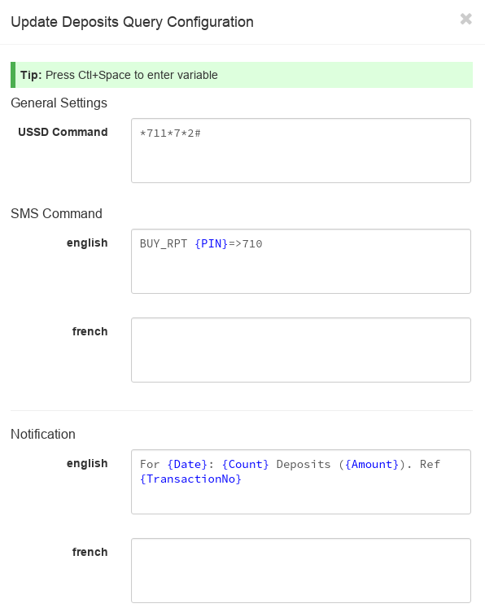

To configure the USSD command used to submit a deposit query,, the USSD
short code as well as an optional sub-code should be specified. There
should also be provision for the requestor’s PIN. The USSD code and
optional sub-code must be specified as the first part of the command.
The USSD command must start with an asterisk (\*) and end with a hash
sign (\#). Variables should be separated from each other and the USSD
short code by asterisks (\*). Examples of valid USSD command
configurations are:

-   -   

The SMS command must start with the word BUY\_RPT followed by PIN
variable separated by a space. The SMS command must end in the
application terminating SMS number the command should be sent to,
preceded by ⇒. Examples of valid SMS command configurations are:

-   -   

Enter the wording of the SMS Notification sent in response to the
Deposit Query in both English and French. Should you wish to show the
contents of an available variable in the notification message, press the
Ctrl key and the space bar simultaneously. This will result in a
drop-down list showing the variables that can be displayed to appear.
Click on the variable you wish to display - this will be inserted into
the notification at the current cursor position.  
Once the all desired settings have been entered or modified, click

to accept the values as displayed or else click

to retain the prior values without change. The pop-up window disappears
and the Deposit Query Configuration page reappears, showing the settings
as they are configured.

Configure Last Transaction Enquiries Settings
---------------------------------------------

Settings related to Last Transaction Enquiries are the USSD and SMS
query structure and, the content of the related response notification.  
To configure or modify any of these, click

in the ECDS menu bar displayed on the left of the page, and then on
.
The Last Transaction Enquiries Configuration page appears:

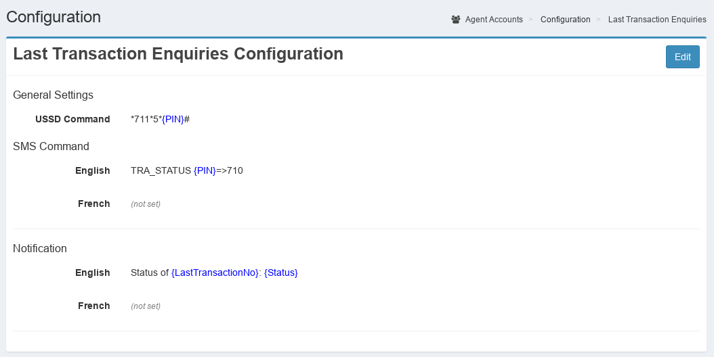

This page shows the current configurations for:

-   The USSD command used to enquire about the last transaction

-   The SMS command used to enquire about the last transaction in both
    English and French

-   The notification sent in response to such a query

For both USSD and SMS commands, words enclosed in curly braces {}
represent variables in the ECDS system. Any string entered in the
corresponding position in the command will be used as the value of that
variable in ECDS.  
The only variable to be supplied in the USSD and SMS commands is:

-   

For notifications, sections of the notification message enclosed in
curly braces {} represent variables in ECDS and will be replaced in the
message with the actual value of that variable.  
The variables available for display in the deposit query response are:

-   -   

To initially configure or later modify any of the above, click

near the top right of the Last Transaction Enquiries Configuration page.
The Update Last Transaction Enquiries Configuration pop-up window
appears:

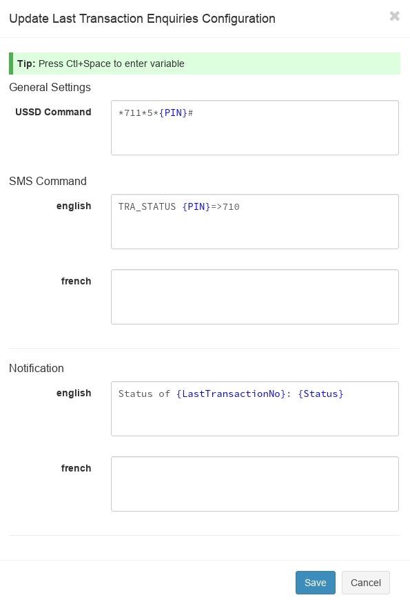

To configure the USSD command used to submit a Last Transaction Enquiry,
the USSD short code as well as an optional sub-code should be specified.
There must also be provision for the requestor’s PIN. The USSD code and
optional sub-code must be specified as the first part of the command.
The USSD command must start with an asterisk (\*) and end with a hash
sign (\#). Variables should be separated from each other and the USSD
short code by asterisks (\*). Examples of valid USSD command
configurations are:

-   -   

The SMS command must start with the word TRA\_STATUS followed by the PIN
variable separated by a space. The SMS command must end in the
application terminating SMS number the command should be sent to,
preceded by ⇒. Examples of valid SMS command configurations are:

-   -   

Enter the wording of the SMS Notification sent in response to the Last
Transaction Enquiry in both English and French. Should you wish to show
the contents of an available variable in the notification message, press
the Ctrl key and the space bar simultaneously. This will result in a
drop-down list showing the variables that can be displayed to appear.
Click on the variable you wish to display - this will be inserted into
the notification at the current cursor position.  
Once the all desired settings have been entered or modified, click

to accept the values as displayed or else click

to retain the prior values without change. The pop-up window disappears
and the Last Transaction Enquiries Configuration page reappears, showing
the settings as they are configured.

Configure Logging Settings
--------------------------

It is possible to change certain settings related to the GUI logging.  

> **Note**
>
> This is unrelated to the ECDS Logging, which is configured in the C4U
> Administrative interface.

Settings related to GUI Logging are the Logging Level, Log and Rotation
file locations, Log sizes and history configuration.  
To configure or modify any of these, click

in the ECDS menu bar displayed on the left of the page, and then on
.
The Logging Settings Configuration page appears:

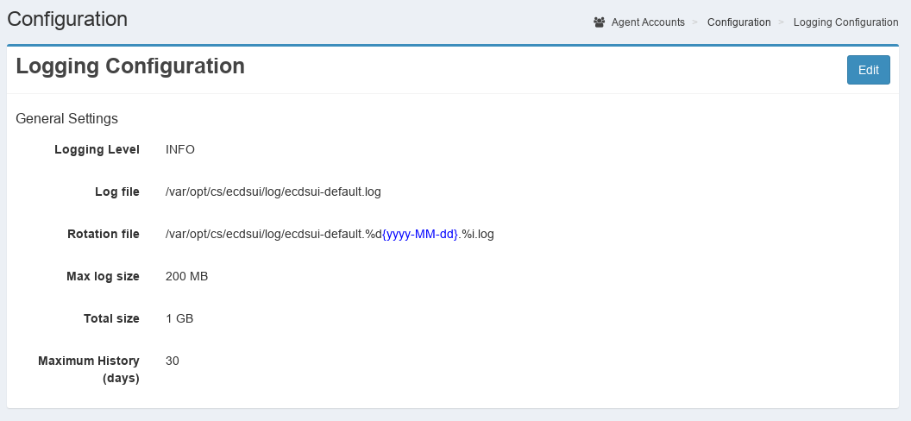

This page shows the current configurations for:

-   The Logging Level

-   The Log file location

-   The Rotated Log file location

-   Maximum single log file size

-   Maximum cumulative size for all log files

-   Maximum history (in days) of logs to retain

To initially configure or later modify any of the above, click

near the top right of the Last Logging Settings Configuration page. The
Update Logging Configuration pop-up window appears:

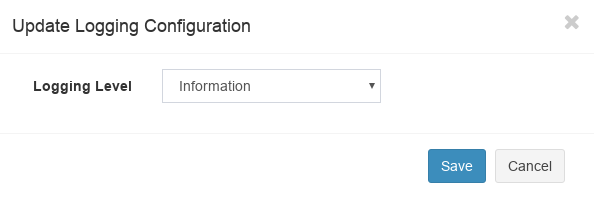

At present only the log level is configurable. Choose the logging level
for wish the logs will be recorded.  
Once the all desired settings have been entered or modified, click

to accept the values as displayed or else click

to retain the prior values without change. The pop-up window disappears
and the Logging Configuration page reappears, showing the settings as
they are configured.

Configure Promotions and Rewards Settings
-----------------------------------------

It is possible to change certain settings related to Promotions and
Rewards. These include the frequency to check and issue rewards as well
as SMS sending windows for Reward notification.  

To configure or modify any of these, click

in the ECDS menu bar displayed on the left of the page, and then on
.
The Promotions and Rewards Configuration page appears:

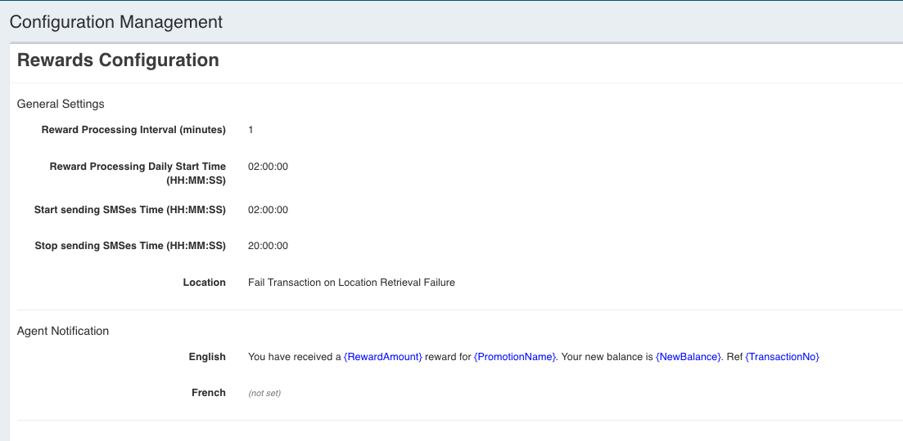

This page shows the current configurations for:

-   The Reward Processing interval - This is the interval between ECDS
    checking transaction history for Agents which qualify for rewards

-   Reward Processing Daily Start Time - The time at which Reward
    Processing in ECDS starts for the day

-   Start Sending SMS Time - The start of Reward SMS sending. This is to
    avoid sending SMS at off peak times

-   Stop Sending SMS Time - The end of Reward SMS sending. This is to
    avoid sending SMS at off peak times

-   Location - Indicates whether the transaction should proceed or fail
    when Location cannot be retrieved for the Agent

-   Agent Notification - This is the SMS message sent to an Agent when
    they reach target and receive a reward

To initially configure or later modify any of the above, click

near the top right of the Last Logging Settings Configuration page. The
Update Promotions and Rewards pop-up window appears:

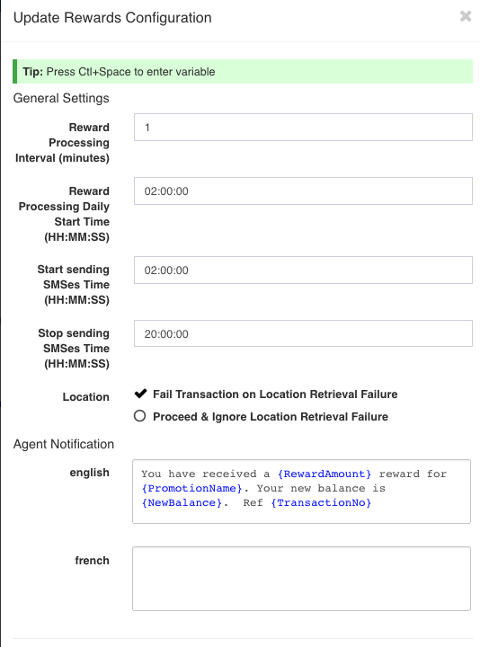

Indicate the Reward Processing start time, after considering any other
batch processing windows which may be required.  
The smaller the window between processing, the larger the processing
impact on the hardware servers. A balance is to be found between
frequency of reward processing versus system utilisation. It is
recommended to not run at intervals of less than 30 minutes.  
Location retrieval settings can be configured as well as the Reward SMS
notifications.  
Once the all desired settings have been entered or modified, click

to accept the values as displayed or else click

to retain the prior values without change. The pop-up window disappears
and the Promotions and Rewards Configuration page reappears, showing the
settings as they are configured.

Configure Register PIN Settings
-------------------------------

Where no Default PIN is configured for an Agent, then upon the creation
of a new Agent, ECDS shall send a random One-Time PIN to the Agent’s
registered mobile number, requesting him to do a PIN registration.
Settings related to Pin Registration are the USSD and SMS registration
message structure and, the content of the related response
notification.  

> **Note**
>
> Where a Default PIN is configured, there is no PIN Registration. New
> Agents or Agents whose PIN is reset will receive an SMS with the
> Default PIN.

To configure or modify any of these, click

in the ECDS menu bar displayed on the left of the page, and then on
.
The Register PIN Configuration page appears:

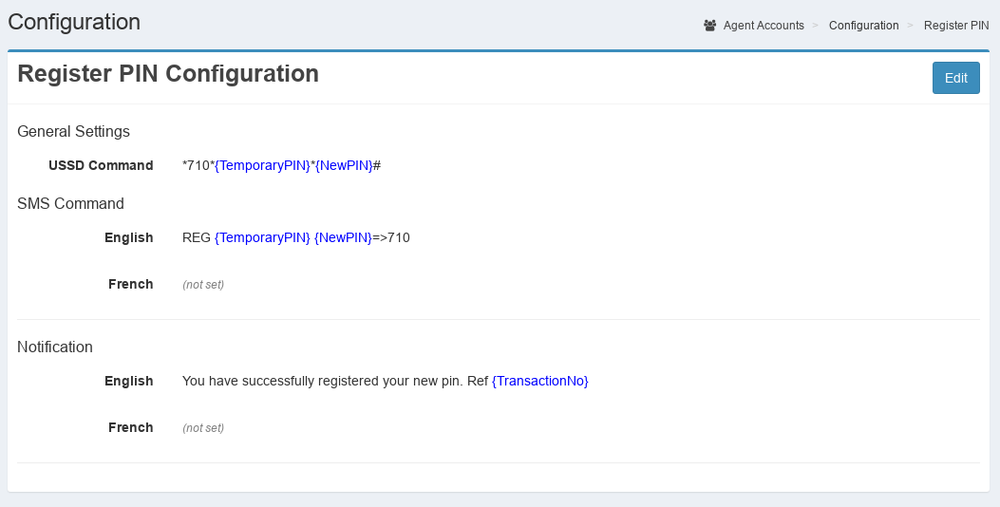

This page shows the current configurations for:

-   The USSD command used to register a PIN

-   The SMS command used to register a PIN in both English and French

-   The notification sent in response to the registration

For both USSD and SMS commands, words enclosed in curly braces {}
represent variables in the ECDS system. Any string entered in the
corresponding position in the command will be used as the value of that
variable in ECDS.  
The variables that must be supplied in the USSD and SMS commands are:

-   -   

For notifications, sections of the notification message enclosed in
curly braces {} represent variables in ECDS and will be replaced in the
message with the actual value of that variable.  
The only variable available for display in the Register PIN response is:

-   

To initially configure or later modify any of the above, click

near the top right of the Register PIN Configuration page. The Update
Register PIN Configuration pop-up window appears:

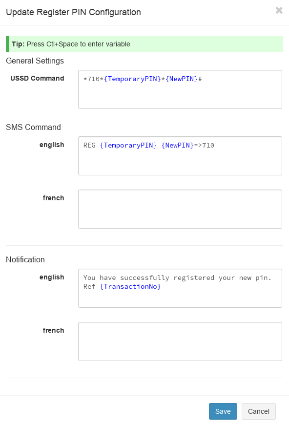

To configure the USSD command used to register the PIN, the USSD short
code as well as an optional sub-code should be specified. There must
also be provision for the requestor’s temporary PIN to authorise the
transaction as well as the new PIN the Agent wishes to use in future.
The USSD code and optional sub-code must be specified as the first part
of the command. The USSD command must start with an asterisk (\*) and
end with a hash sign (\#). Variables should be separated from each other
and the USSD short code by asterisks (\*). Examples of valid USSD
command configurations are:

-   -   

The SMS command must start with the word REG followed by the temporary
and new PIN variables in any sequence separated by spaces. The SMS
command must end in the application terminating SMS number the command
should be sent to, preceded by ⇒. Examples of valid SMS command
configurations are:

-   -   

Enter the wording of the notification sent in response to the PIN
registration in both English and French. Should you wish to show the
contents of an available variable in the notification message, press the
Ctrl key and the space bar simultaneously. This will result in a
drop-down list showing the variables that can be displayed to appear.
Click on the variable you wish to display - this will be inserted into
the notification at the current cursor position.  
Once the all desired settings have been entered or modified, click

to accept the values as displayed or else click

to retain the prior values without change. The pop-up window disappears
and the Register PIN Configuration page reappears, showing the settings
as they are configured.

Configure the Replenish SMS
---------------------------

Replenish Transactions are used to credit the Root account with credit.
ECDS shall, upon successful replenishment notify the Root account holder
via a SMS of the transaction details.  
To configure the SMS sent to the Root account holder or modify it, click

in the ECDS menu bar displayed on the left of the page, and then on
.
The Replenish Configuration page appears:

This page shows the current configuration for:

-   The SMS notification sent in to the Root account holder upon
    successful replenishment

Sections of the notification message enclosed in curly braces {}
represent variables in ECDS and will be replaced in the message with the
actual value of that variable.  
The variables available for display in the SMS to the Root account
holder are:

-   -   -   -   -   

To initially configure or later modify the replenish SMS, click

near the top right of the Replenish Configuration page. The Update
Replenish Configuration pop-up window appears:

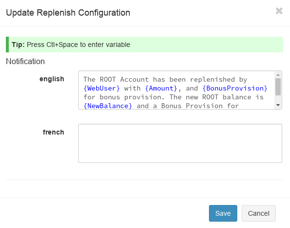

Enter the wording of the notification sent in response to replenishment
in both English and French. Should you wish to show the contents of an
available variable in the notification message, press the Ctrl key and
the space bar simultaneously. This will result in a drop-down list
showing the variables that can be displayed to appear. Click on the
variable you wish to display - this will be inserted into the
notification at the current cursor position.  
Once the all desired settings have been entered or modified, click

to accept the values as displayed or else click

to retain the prior values without change. The pop-up window disappears
and the Replenish Configuration page reappears, showing the settings as
they are configured.

Configure Analytics \[\[*Analytics\_configuration*\]\]
------------------------------------------------------

Certain Analytics parameters may be configured in the Admin GUI,
including whether to enable or disable Analytics updates and the time
when data will be rolled up for the day, to keep a running hisotry of
Analytics data.  

To configure the Analytics settings or to modify them, click

in the ECDS menu bar displayed on the left of the page. The Analytics
Configuration page appears:

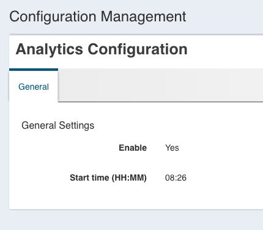

This page contains only one tab sheets, **General**  

Under the General Tab, the following parameters may be managed:

<table>
<colgroup>
<col style="width: 50%" />
<col style="width: 50%" />
</colgroup>
<tbody>
<tr class="odd">
<td>
<strong>Parameter</strong>
</td>
<td>
<strong>Definition</strong>
</td>
</tr>
<tr class="even">
<td>
Enable
</td>
<td>
This setting is to either enable or disable the Analytics function, which rolls up data for analytics on a daily basis for the reported periods.
</td>
</tr>
<tr class="odd">
<td>
Start Time
</td>
<td>
This setting is to indicate at what time of the day, the data for the previous day should be rolled up.
</td>
</tr>
</tbody>
</table>

> **Tip**
>
> Set the Start Time for Analytics rollup to occurr at a quiet low
> traffic time in the morning.

Configure Reporting \[\[*Report\_configuration*\]\]
---------------------------------------------------

Certain Reporting parameters may be configured in the Admin GUI,
including the Sales Summary Report SMS notification message, Email
Headers and Body for Emailing of reports, Compression parameters, for
the zipping of reports before they are emailed and Agent report schedule
limits.  

To configure the Report settings or to modify them, click

in the ECDS menu bar displayed on the left of the page, and then on
.
The Reporting Configuration page appears:

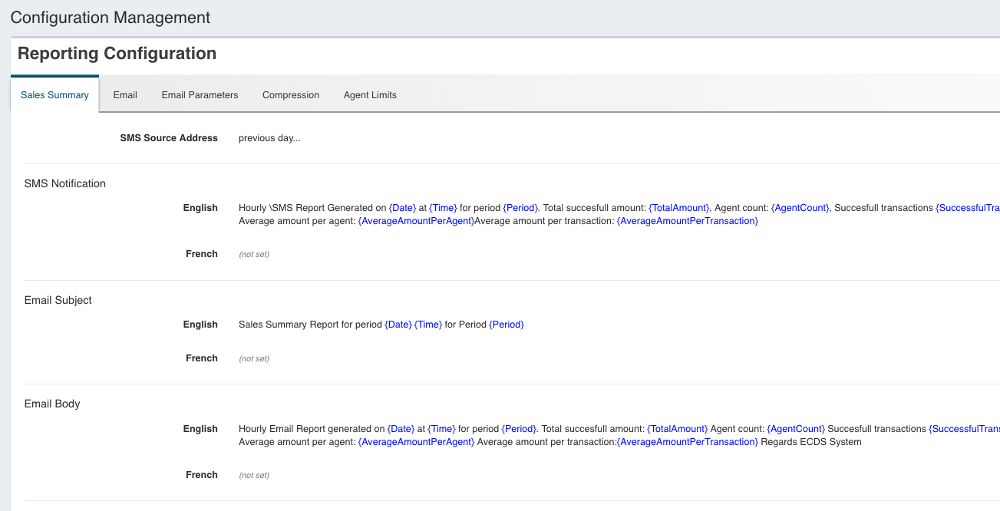

This page contains three tab sheets, **Sales Summary**, **Email**,
**Email Parameters**, **Compression** and **Agent Limits**. Each of
these tab sheets are explained below  

### Reporting - Sales Summary Settings \[\[*Sales\_Summary\_report\_config*\]\]

Under the **Sales Summary** tab the following information can be
managed:

<table>
<colgroup>
<col style="width: 50%" />
<col style="width: 50%" />
</colgroup>
<tbody>
<tr class="odd">
<td>
<strong>Parameter</strong>
</td>
<td>
<strong>Definition</strong>
</td>
</tr>
<tr class="even">
<td>
SMS Notification
</td>
<td>
The SMS notification message and variables to send to the recipients, denoting regular sales data through the day.
</td>
</tr>
<tr class="odd">
<td>
Email Subject
</td>
<td>
The Subject to be inserted into the Daily Sales Summary Email when sent to recipients.
</td>
</tr>
<tr class="even">
<td>
Email Body
</td>
<td>
The body of the Email for the Daily Sales Summary when sent to recipients.
</td>
</tr>
</tbody>
</table>

> **Tip**
>
> For both SMS and Email Body, words enclosed in curly braces {}
> represent variables in the ECDS system. Any string entered in the
> corresponding position in the command will be used as the value of
> that variable in ECDS.  

**Variables which may be inserted in the SMS and Email notifications
include:**  
\* Concurrent Systems - Current Date  

### Email

Selecting the **Email** tab will present a screen similar to the
following:

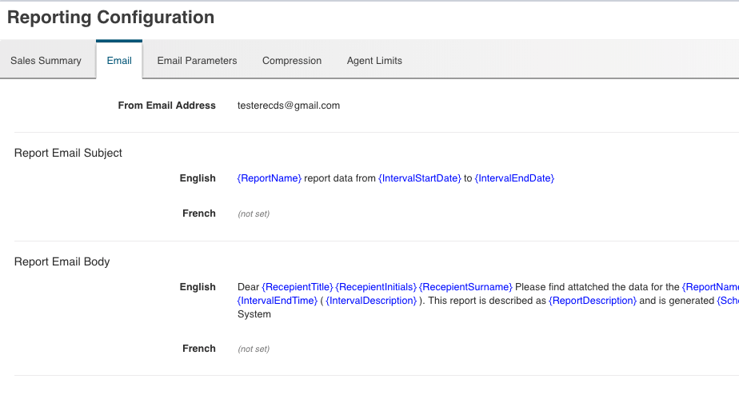

From here, the following can be configured:

<table>
<colgroup>
<col style="width: 50%" />
<col style="width: 50%" />
</colgroup>
<tbody>
<tr class="odd">
<td>
<strong>Parameter</strong>
</td>
<td>
<strong>Definition</strong>
</td>
</tr>
<tr class="even">
<td>
Email Subject
</td>
<td>
The Subject to be inserted into scheduled reports which are Emailed to recipients.
</td>
</tr>
<tr class="odd">
<td>
Email Body
</td>
<td>
The body of the Email all scheduled reports.
</td>
</tr>
</tbody>
</table>

> **Tip**
>
> For Email Body, words enclosed in curly braces {} represent variables
> in the ECDS system. Any string entered in the corresponding position
> in the command will be used as the value of that variable in ECDS.  

**Variables which may be inserted in the Email are:**  
\* Concurrent Systems - Date when the Email is generated  

### Email Parameters

Selecting the **Email Parameters** tab will present a screen similar to
the following:

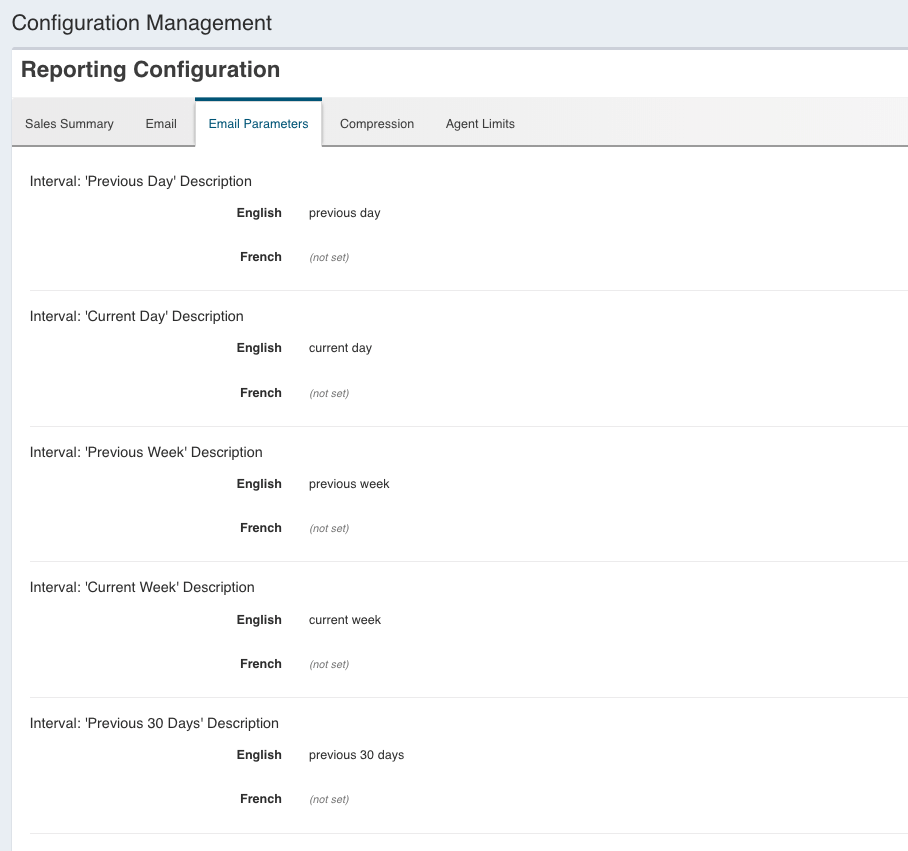

The Email Parameters screen contains key words and phrases which are
used in SMS and Emails. This screen allows the user to change how
phrases are stated in the SMS and Emails sent to recipients.

The following words and Phrases may be configured:

<table>
<colgroup>
<col style="width: 50%" />
<col style="width: 50%" />
</colgroup>
<tbody>
<tr class="odd">
<td>
<strong>Field</strong>
</td>
<td>
<strong>Examples</strong>
</td>
</tr>
<tr class="even">
<td>
Interval: <em>Previous Day</em> Description
</td>
<td>
previous day, yesterday
</td>
</tr>
<tr class="odd">
<td>
Interval: <em>Current Day</em> Description
</td>
<td>
current day, today
</td>
</tr>
<tr class="even">
<td>
Interval: <em>Previous Week</em> Description
</td>
<td>
previous week, Last week
</td>
</tr>
<tr class="odd">
<td>
Interval: <em>Current Week</em> Description
</td>
<td>
current week, This week
</td>
</tr>
<tr class="even">
<td>
Interval: <em>Previous 30 Days</em> Description
</td>
<td>
previous 30 days, The last 30 days
</td>
</tr>
<tr class="odd">
<td>
Interval: <em>Previous Month</em> Description
</td>
<td>
previous month, Last Month
</td>
</tr>
<tr class="even">
<td>
Interval: <em>Current Month</em> Description
</td>
<td>
current month, This month
</td>
</tr>
<tr class="odd">
<td>
Interval: <em>Previous Year</em> Description
</td>
<td>
previous year, last year
</td>
</tr>
<tr class="even">
<td>
Interval: <em>Current Year</em> Description
</td>
<td>
current year, This year
</td>
</tr>
<tr class="odd">
<td>
Interval: <em>Previous Hour</em> Description
</td>
<td>
previous hour, An hour ago
</td>
</tr>
<tr class="even">
<td>
Interval: <em>Current Hour</em> Description
</td>
<td>
current hour, Now
</td>
</tr>
<tr class="odd">
<td>
Interval: <em>Custom</em> Description
</td>
<td>
fixed interval, Custom date selection
</td>
</tr>
<tr class="even">
<td>
Schedule Period: <em>Hour</em> Description
</td>
<td>
hourly
</td>
</tr>
<tr class="odd">
<td>
Schedule Period: <em>Day</em> Description
</td>
<td>
daily
</td>
</tr>
<tr class="even">
<td>
Schedule Period: <em>Week</em> Description
</td>
<td>
weekly
</td>
</tr>
<tr class="odd">
<td>
Schedule Period: <em>Month</em> Description
</td>
<td>
monthly
</td>
</tr>
<tr class="even">
<td>
Schedule Period: <em>Minute</em> Description
</td>
<td>
minute by minute
</td>
</tr>
</tbody>
</table>

### Compression

Selecting the **Compression** tab will present a screen similar to the
following:

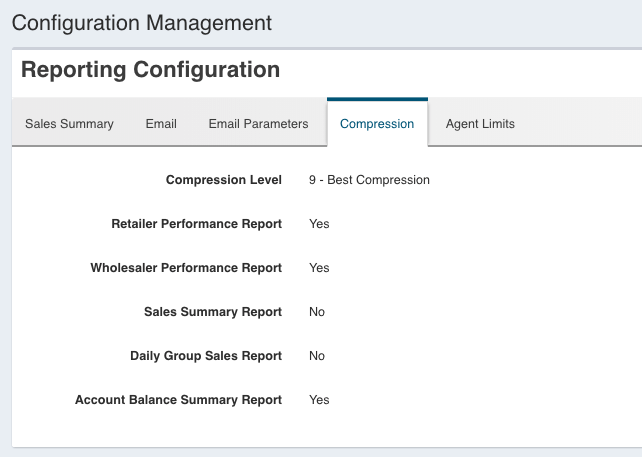

The Compression tab sheet, allows the user to select the level of
compression and which reports to compress before emailing to recipients.

> **Note**
>
> The higher the compression, the longer it takes to compress data and
> to open the compressed file from email.

> **Tip**
>
> Check what your Email Server Attachment size limits are and use this
> as a guide to ensure appropriate compression is used.

To initially configure or later modify the compression settings for each
report, click

near the top right of the Compression tab sheet. The Update Reporting
configuration screen appears and selecting the compression tab will
display the following pop-up window:

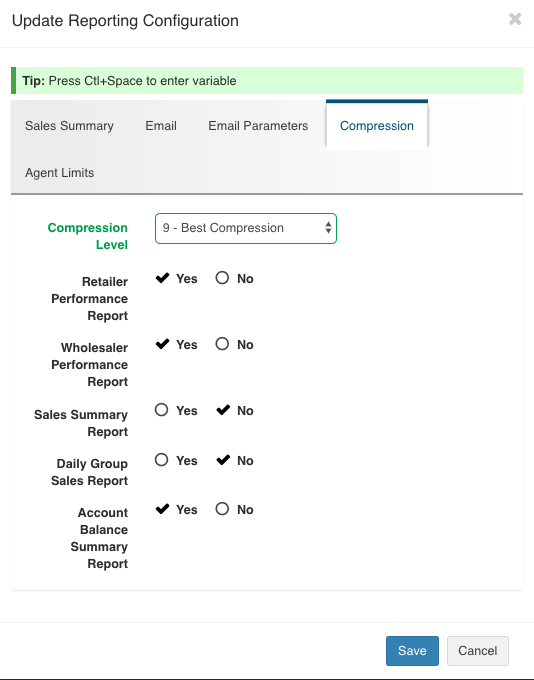

Select the whether or not to compress each report as well as the
compression type for those that will be compressed. Once the all desired
settings have been entered or modified, click

to accept the values as displayed or else click

to retain the prior values without change. The pop-up window disappears
and the Report Configuration page reappears, showing the settings as
they are configured.

### Agent Limits

Selecting the **Agent Limits** tab will present a screen similar to the
following:

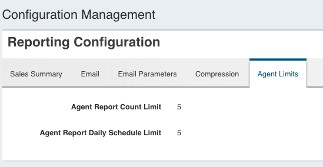

The Agent Limits are intended to limit the number of reports and
scheduled reports for Agents Using the Agent Portal to avoid certain
agents from overloading the system with many reports running at high
frequency.

> **Note**
>
> For certain Agents, the Limit assigned here, may be overridden in the
> Edit Agent Screen. See [???](#_Editing_An_Agent_)

The following limits may be set globally for all Agents using the Agent
Portal:

<table>
<colgroup>
<col style="width: 50%" />
<col style="width: 50%" />
</colgroup>
<tbody>
<tr class="odd">
<td>
<strong>Field</strong>
</td>
<td>
<strong>Examples</strong>
</td>
</tr>
<tr class="even">
<td>
Agent Report Count Limit
</td>
<td>
This limit applies to the total number of reports any agent may create and save. Once the limit is reached, the agent must delete one report before another can be created.
</td>
</tr>
<tr class="odd">
<td>
Agent Report Daily Schedule Limit
</td>
<td>
This limit applies to the total number of reports which any agent may schedule to execute in a calendar day.
</td>
</tr>
</tbody>
</table>

Configure Reversal Notifications and External Data
--------------------------------------------------

Reversal Transactions are used to reverse incorrect Transfer, Sales or
Bundle Sales transactions. Both the sender of credit as well as the
recipient will receive SMS notifications to inform them of the
reversal.  
To configure the SMS sent to both parties or to modify it, click

in the ECDS menu bar displayed on the left of the page, and then on
.
The Reversal Configuration page appears:

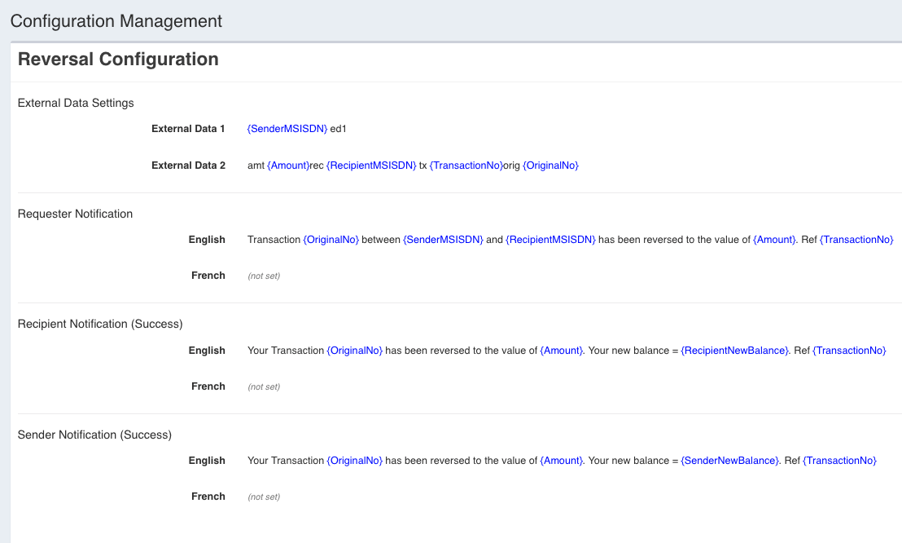

This page shows the current configuration for:

-   External Data to be sent with OCS request to assist with transaction
    tracking in OCS

-   The SMS notification sent to the recipient of credit after the
    transaction has been reversed

-   The SMS notification sent to the sender of credit after the
    transaction has been reversed  

Sections of the **external data** parameter enclosed in curly braces {}
represent variables in ECDS and will be replaced in the parameter with
the actual value of that variable.  
The variables available for insertion into external data are:

-   -   -   -   -   

Sections of the **notification message** enclosed in curly braces {}
represent variables in ECDS and will be replaced in the message with the
actual value of that variable.  
The variables available for display in the SMS to the Root account
holder are:

-   -   -   -   -   -   -   

To initially configure or later modify the reversal SMSs, click

near the top right of the Reversal Configuration page. The Update
Reversal Configuration pop-up window appears:

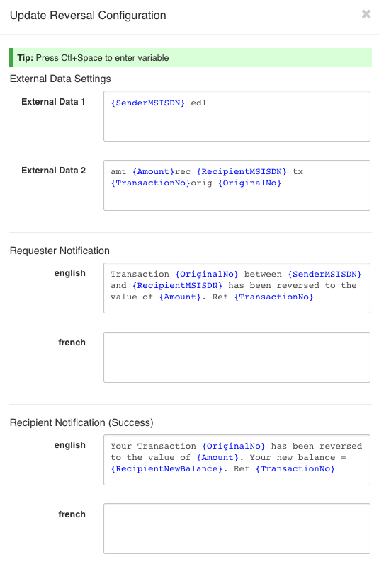

Enter the wording of the external data and notifications sent in
response to reversals in both English and French. Should you wish to
show the content of an available variable in the notification message,
press the Ctrl key and the space bar simultaneously. This will result in
a drop-down list showing the variables that can be displayed to appear.
Click on the variable you wish to display - this will be inserted into
the notification at the current cursor position.  
Once the all desired settings have been entered or modified, click

to accept the values as displayed or else click

to retain the prior values without change. The pop-up window disappears
and the Reversal Configuration page reappears, showing the settings as
they are configured.

Configure Self Top-Up Settings
------------------------------

ECDS allows Agents to perform Self-Top-Up transactions to transfer
credit from their ECDS account to their Charging System Main Account,
i.e. use their ECDS balance to create airtime for their mobile phone.
Settings related to Self Top-Up are Refill ID, the USSD and SMS commands
to perform a Self Top-Up and, the content of the related response
notification.  
To configure or modify any of these, click

in the ECDS menu bar displayed on the left of the page, and then on
.
The Self Top-Up Configuration page appears:

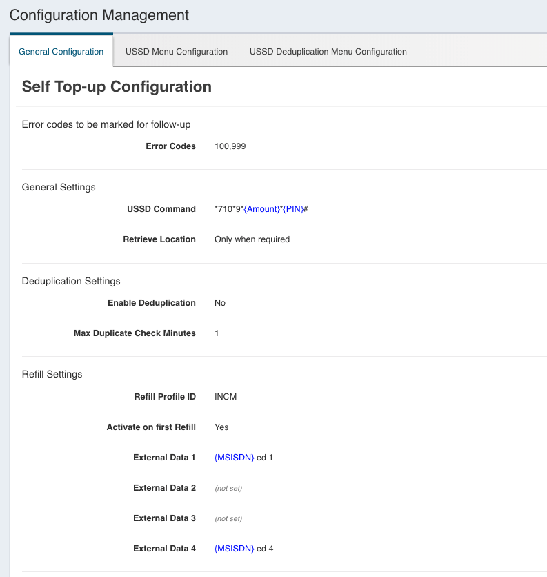

This page contains three tab sheets, one for **General Settings**, one
for **USSD Confirmation Menu** and one for **USSD Deduplication
Confirmation Menu**.  

### General Settings

Under the **General Settings** tab the following information can be
managed:

<table>
<colgroup>
<col style="width: 50%" />
<col style="width: 50%" />
</colgroup>
<tbody>
<tr class="odd">
<td>
<strong>Parameter</strong>
</td>
<td>
<strong>Definition</strong>
</td>
</tr>
<tr class="even">
<td>
Error Codes to be marked for follow-up
</td>
<td>
Error codes from external OCS, which are not a clear success or failure, can be listed here and will result in transactions being marked for follow-up, when received from OCS. See <a href="#_Adjudicatin_of_a_transaction_marked_for_follow_up_">???</a>
</td>
</tr>
<tr class="odd">
<td>
Retrieve Location
</td>
<td>
Indicate whether to retrieve agent location information on all transactions, or only when it is specifically required, due to some Area constraint on the Agent or Transfer rule.
</td>
</tr>
<tr class="even">
<td>
USSD Command Syntax
</td>
<td>
The USSD Short code and syntax for Self Top-up
</td>
</tr>
<tr class="odd">
<td>
De-duplication enable/disable
</td>
<td>
Crediverse ECDS can be configured to verify transactions which appear to be duplicates, i.e. where the same amount of airtime is topped up, the system can be configured to confirm the transaction before proceeding.
</td>
</tr>
<tr class="even">
<td>
Max duplicate check minutes
</td>
<td>
The time window during which to check for potential duplicate transactions.
</td>
</tr>
<tr class="odd">
<td>
SMS Command Syntax
</td>
<td>
The SMS Short code and syntax for Self Top-up
</td>
</tr>
</tbody>
</table>

For both USSD and SMS commands, words enclosed in curly braces {}
represent variables in the ECDS system. Any string entered in the
corresponding position in the command will be used as the value of that
variable in ECDS.  
The variables that must be supplied in the USSD and SMS commands are:

-   -   

To configure the USSD command used to perform a Self Top-Up, the USSD
short code as well as an optional sub-code should be specified. There
must also be provision for the requestor’s PIN variable to authorise the
transaction as well as the amount to be transferred from ECDS to the
Charging System variable in any sequence. The USSD code and optional
sub-code must be specified as the first part of the command. The USSD
command must start with an asterisk (\*) and end with a hash sign (\#).
Variables should be separated from each other and the USSD short code by
asterisks (\*). Examples of valid USSD command configurations are:

-   -   

The SMS command must start with the word TOP followed by the PIN and
amount variables in any sequence separated by spaces. The SMS command
must end in the application terminating SMS number the command should be
sent to, preceded by ⇒. Examples of valid SMS command configurations
are:

-   -   

Enter the wording of the notification sent in response to the Self
Top-Up in both English and French. Should you wish to show the contents
of an available variable in the notification message, press the Ctrl key
and the space bar simultaneously. This will result in a drop-down list
showing the variables that can be displayed to appear. Click on the
variable you wish to display - this will be inserted into the
notification at the current cursor position.  
Once the all desired settings have been entered or modified, click

to accept the values as displayed or else click

to retain the prior values without change. The pop-up window disappears
and the Self Top-Up Configuration page reappears, showing the settings
as they are configured.

#### OCS integration Settings

Depending on the Online Charging System (OCS), which ECDS is integrated
with, various settings specific to the OCS may be configured:

<table>
<colgroup>
<col style="width: 50%" />
<col style="width: 50%" />
</colgroup>
<tbody>
<tr class="odd">
<td>
Refill Profile ID
</td>
<td>
The refillProfileID parameter contains a refill profile that will be converted into a segmentation identity by the OCS.
</td>
</tr>
<tr class="even">
<td>
Activate on first Refill
</td>
<td>
Indicates whether OCS should activate an inactive subscriber on first refill
</td>
</tr>
<tr class="odd">
<td>
External Data 1
</td>
<td>
Static text or Various Dynamic variables, including MSISDN (Own), NewECDSBalance, Amount and TransactionNo may be inserted and this will be passed in the OCS call
</td>
</tr>
<tr class="even">
<td>
External Data 2
</td>
<td>
Static text or Various Dynamic variables, including MSISDN (Own), NewECDSBalance, Amount and TransactionNo may be inserted and this will be passed in the OCS call
</td>
</tr>
<tr class="odd">
<td>
External Data 3
</td>
<td>
Static text or Various Dynamic variables, including MSISDN (Own), NewECDSBalance, Amount and TransactionNo may be inserted and this will be passed in the OCS call
</td>
</tr>
<tr class="even">
<td>
External Data 4
</td>
<td>
Static text or Various Dynamic variables, including MSISDN (Own), NewECDSBalance, Amount and TransactionNo may be inserted and this will be passed in the OCS call
</td>
</tr>
</tbody>
</table>

#### SMS Settings

The following Self Top-up SMS notifications may also be configured:

<table>
<colgroup>
<col style="width: 50%" />
<col style="width: 50%" />
</colgroup>
<tbody>
<tr class="odd">
<td>
Sender Notification (Success)
</td>
<td>
SMS sent to Sender on completion of successful transaction.
</td>
</tr>
<tr class="even">
<td>
Sender Notification (Unknown State Transaction)
</td>
<td>
SMS sent to Sender on completion of transaction, where the final state is unknown and the transaction has been marked for follow-up. See <a href="#_Adjudicatin_of_a_transaction_marked_for_follow_up_">???</a>
</td>
</tr>
</tbody>
</table>

For notifications, sections of the notification message enclosed in
curly braces {} represent variables in ECDS and will be replaced in the
message with the actual value of that variable.  
The variables available for display in the Self Top-Up response are:

-   -   -   -   

To initially configure or later modify any of the above, click

near the top right of the Register PIN Configuration page. The Update
Self Top-Ups Configuration pop-up window appears:

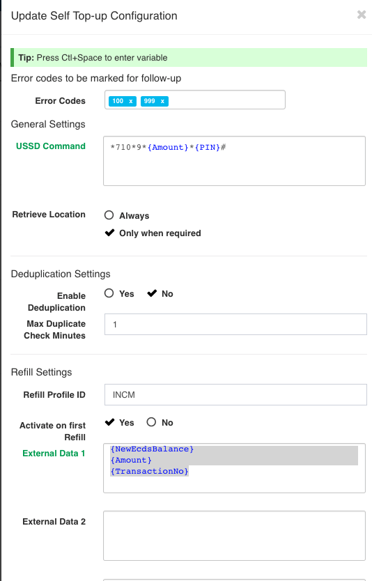

### USSD Menu Confirmation

Selecting the **USSD Menu Confirmation** tab will present a screen
similar to the following:

From here, the USSD Menu dialogue and messages can be configured in
multiple languages. To edit the text, simply click on the

and to turn off a USSD menu item, slide the

control.

### USSD De-duplication Menu Confirmation

Selecting the **USSD De-duplication Menu Confirmation** tab will present
a screen similar to the following:

From here, the USSD De-duplication dialogue and messages can be
configured in multiple languages. To edit the text, simply click on the

and to turn off a USSD menu item, slide the

control.

> **Important**
>
> Once the all desired settings for Self Top-up have been entered or
> modified, click
> 
> to accept the values as displayed or else click
> 
> to retain the prior values without change. The pop-up window
> disappears and the Self Top-up Configuration page reappears, showing
> the settings as they are configured.

Configure Transaction Settings
------------------------------

ECDS allows Users to configure various parameters related to
transactions. Any action which results in a response is considered a
transaction, for example, an Airtime Sale or a Self Top-up, A Transfer
and a Reversal. In the Transaction configuration screen, the user can
set the IMSI lockout rules, to apply when an Agent IMSI changes, IMEI
refresh rates, various Transaction Data Record (TDR) parameters and
retention period for the online transaction database (OLTP) as well as
the Online Analytical processing database (OLAP) which is used for
reporting.  
To configure or modify any of these, click

in the ECDS menu bar displayed on the left of the page, and then on
.
The Transaction Configuration page appears:

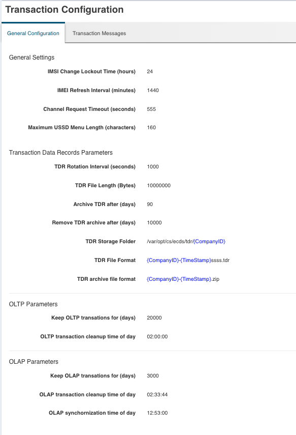

This page contains two tab sheets, one for **General Configuration** and
one for **Transaction Messages**  

### General Configuration

In the General configuration tab sheet the following may be changed:

**General Settings**

This section shows the current setting for:

<table>
<colgroup>
<col style="width: 50%" />
<col style="width: 50%" />
</colgroup>
<tbody>
<tr class="odd">
<td>
Parameter
</td>
<td>
Description
</td>
</tr>
<tr class="even">
<td>
IMSI Change Lockout Time (hours)
</td>
<td>
This indicates how long in hours to lock out the Agent Account after an IMSI change. Setting to Zero will never lock an Agent out if the IMSI changes. This is a security feature to avoid SIM SWAP fraud.
</td>
</tr>
<tr class="odd">
<td>
IMEI Refresh Interval (minutes)
</td>
<td>
The IMSI is queried from an external third party system and can be cached for the agent and refreshed periodically. This setting indicates the interval between refreshing the IMEI data for transacting Agents.
</td>
</tr>
<tr class="even">
<td>
Channel request timeout
</td>
<td>
The timeout period for USSD bearer channel. If no response is returned to the USSD channel within this timeout period, the transaction cancels
</td>
</tr>
<tr class="odd">
<td>
Maximum USSD Menu Length
</td>
<td>
This sets the maximum length of the USSD message to send to the handset, before applying pagination, i.e. the point at which the subscriber is asked to skip to the next page. This setting has been implemented to accommodate for differences between different HLRs.
</td>
</tr>
</tbody>
</table>

**Transaction Data Records Parameters**

This section shows the current setting for:

<table>
<colgroup>
<col style="width: 50%" />
<col style="width: 50%" />
</colgroup>
<tbody>
<tr class="odd">
<td>
Parameter
</td>
<td>
Description
</td>
</tr>
<tr class="even">
<td>
TDR Rotation Interval (seconds)
</td>
<td>
Indicates the period in seconds to rotate the TDR files
</td>
</tr>
<tr class="odd">
<td>
TDR File Length (Bytes)
</td>
<td>
Indicates the maximum file size for TDR at which point to rotate, this is a failsafe for when files grow faster than expected due to transaction volumes
</td>
</tr>
<tr class="even">
<td>
Archive TDR after (days)
</td>
<td>
Number of days after which TDR files are compressed and archived
</td>
</tr>
<tr class="odd">
<td>
Remove TDR archive after (days)
</td>
<td>
Number of days to retain compressed and archived TDR files before deleting from the system
</td>
</tr>
<tr class="even">
<td>
TDR Storage Folder
</td>
<td>
Folder where TDR files are stored
</td>
</tr>
<tr class="odd">
<td>
TDR File Format
</td>
<td></td>
</tr>
<tr class="even">
<td>
TDR archive file format
</td>
<td></td>
</tr>
</tbody>
</table>

**OLTP Parameters**

This section shows the current setting for:

<table>
<colgroup>
<col style="width: 50%" />
<col style="width: 50%" />
</colgroup>
<tbody>
<tr class="odd">
<td>
Parameter
</td>
<td>
Description
</td>
</tr>
<tr class="even">
<td>
Keep OLTP transactions for (days)
</td>
<td>
Indicates the number of days history to keen in the Online Transaction Processing Database. This setting is to be adjusted according to available disk space
</td>
</tr>
<tr class="odd">
<td>
OLTP Transaction cleanup time of day
</td>
<td>
Indicates the time of day, when older records will be removed from OLTP (Production) database
</td>
</tr>
</tbody>
</table>

**OLTP Parameters**

This section shows the current setting for:

<table>
<colgroup>
<col style="width: 50%" />
<col style="width: 50%" />
</colgroup>
<tbody>
<tr class="odd">
<td>
Parameter
</td>
<td>
Description
</td>
</tr>
<tr class="even">
<td>
Keep OLAP transactions for (days)
</td>
<td>
Indicates the number of days history to keen in the Online Analytics Processing Database. This setting is to be adjusted according to available disk space
</td>
</tr>
<tr class="odd">
<td>
OLAP transaction cleanup time of day
</td>
<td>
Indicates the time of day, when older records will be removed from OLAP database
</td>
</tr>
<tr class="even">
<td>
OLAP synchornization time of day
</td>
<td>
Indicates the time of day when data is synchronized between OLTP and OLAP database
</td>
</tr>
</tbody>
</table>

> **Note**
>
> It is recommended to set OLTP and OLAP database cleanup times to a low
> traffic period

To initially configure or later modify any of the above parameters,
click

near the top right of the Transactions Configuration page. The Update
Transaction Warnings Configuration pop-up window appears (only part of
which is shown):

Enter the desired parameters. Once entered or modified, click

to accept the values as displayed or else click

to retain the prior values without change. The pop-up window disappears
and the Transaction Warning Configuration page reappears, showing the
settings as they are configured.

### Transaction Messages

In the Transaction Messages tab sheet, all standard messages for
success, failure and other transaction results are configured:  
The Messages described in the table below may be configured:

<table>
<colgroup>
<col style="width: 50%" />
<col style="width: 50%" />
</colgroup>
<tbody>
<tr class="odd">
<td>
Message
</td>
<td>
Description
</td>
</tr>
<tr class="even">
<td>
Invalid PIN
</td>
<td>
Invalid PIN.
</td>
</tr>
<tr class="odd">
<td>
Co-authorize details invalid
</td>
<td>
Indicates when a workflow item has an Invalid co-signatory
</td>
</tr>
<tr class="even">
<td>
Self transaction error
</td>
<td>
Message sent when agent cannot transact with themselves
</td>
</tr>
<tr class="odd">
<td>
Success message
</td>
<td>
Transaction Success.
</td>
</tr>
<tr class="even">
<td>
Transaction forbidden
</td>
<td>
Indicates You are not allowed perform this action.
</td>
</tr>
<tr class="odd">
<td>
No transfer rule
</td>
<td>
Indicates that You cannot transfer to this Agent as no valid transfer rule exists between the transferring agents
</td>
</tr>
<tr class="even">
<td>
Intra-tier transfer not allowed
</td>
<td>
Message return when a transfer is attempted within the same tier and the tier is not configured to allow this.
</td>
</tr>
<tr class="odd">
<td>
No location
</td>
<td>
Indicates that location cannot be verified.
</td>
</tr>
<tr class="even">
<td>
Wrong location
</td>
<td>
Indicates that you are not able to transact in this location, due to area constraints in the agent profile or transfer rule
</td>
</tr>
<tr class="odd">
<td>
Transaction invalid
</td>
<td>
Indicates that agent is not allowed to transact using this channel (USSD SMS etc)
</td>
</tr>
<tr class="even">
<td>
Monthly amount error
</td>
<td>
Indicates that agent has reached the maximum monthly limit for total transaction amounts.
</td>
</tr>
<tr class="odd">
<td>
Invalid amount
</td>
<td>
Message returned where the amount entered does not fall within limits specified at Tier, Group, Agent or Transfer rule level
</td>
</tr>
<tr class="even">
<td>
Daily amount limit exceeded
</td>
<td>
Indicates that agent has reached maximum daily limit for total transaction amounts as stipulated under AML Anti Money Laundering Limits
</td>
</tr>
<tr class="odd">
<td>
Daily transaction count exceeded
</td>
<td>
Indicates that agent has reached the limit of transactions you can perform in one day (AML Limits)
</td>
</tr>
<tr class="even">
<td>
General error
</td>
<td>
Indicates that some technical error has occurred. The Agent is encouraged to try again
</td>
</tr>
<tr class="odd">
<td>
Insufficient balance
</td>
<td>
Indicates that the Agent has insufficient funds to perform the transaction.
</td>
</tr>
<tr class="even">
<td>
Insufficient bonus provision balance
</td>
<td>
Indicates that the Agent has insufficient bonus balance to perform the transaction.
</td>
</tr>
<tr class="odd">
<td>
Invalid agent
</td>
<td>
Indicates that the B Party Agent specified is invalid
</td>
</tr>
<tr class="even">
<td>
Not registered error
</td>
<td>
Indicates that Agent must register a PIN first
</td>
</tr>
<tr class="odd">
<td>
IMSI lockout
</td>
<td>
Indicates that Agent is locked out due to an IMSI change. This can be reset in the Agent Management screen.
</td>
</tr>
<tr class="even">
<td>
Monthly transaction count exceeded
</td>
<td>
Indicates that the Monthly AML limit has been reached
</td>
</tr>
<tr class="odd">
<td>
Invalid state error
</td>
<td>
Indicates that the account is not active
</td>
</tr>
<tr class="even">
<td>
Transaction not found
</td>
<td>
Indicates that the requested Transaction is not found.
</td>
</tr>
<tr class="odd">
<td>
Already registered
</td>
<td>
Returned when an Agent which is already registered tries to register again
</td>
</tr>
<tr class="even">
<td>
Co-authorize details invalid
</td>
<td>
Indicates that the co-auth details provided are invalid or co-auth is invalid and does not have permissions
</td>
</tr>
<tr class="odd">
<td>
Pin lockout
</td>
<td>
Indicates the Agent is Locked out. Too many PIN attempts
</td>
</tr>
<tr class="even">
<td>
Max amount limit
</td>
<td>
Agent has exceeded the maximum allowed Amount
</td>
</tr>
<tr class="odd">
<td>
Invalid transaction type
</td>
<td>
Transaction Type is invalid
</td>
</tr>
<tr class="even">
<td>
Transaction already reversed
</td>
<td>
Transactions has been reversed and second reversal request is not permitted
</td>
</tr>
<tr class="odd">
<td>
Not Eligible
</td>
<td>
Subscriber not Eligible
</td>
</tr>
<tr class="even">
<td>
Invalid Bundle
</td>
<td>
Bundle specified in the Sell Bundle request is Invalid
</td>
</tr>
<tr class="odd">
<td>
Session Expired
</td>
<td>
Your session has expired
</td>
</tr>
<tr class="even">
<td>
Timed Out
</td>
<td>
A Transaction request timed out towards an external system
</td>
</tr>
<tr class="odd">
<td>
Invalid Recipient
</td>
<td>
Recipient specified in Airtime Sale or Bundle Sale is invalid
</td>
</tr>
<tr class="even">
<td>
Invalid amount
</td>
<td>
Some value in the request is invalid
</td>
</tr>
<tr class="odd">
<td>
Amount too small
</td>
<td>
Amount in Sale or Transfer request is smaller than minimum amount specified in transfer rule
</td>
</tr>
<tr class="even">
<td>
Amount too large
</td>
<td>
Amount in Sale or Transfer request is larger than minimum amount specified in transfer rule
</td>
</tr>
<tr class="odd">
<td>
Pin too long
</td>
<td>
The pin code supplied exceeds the specified pin length in agent settings
</td>
</tr>
<tr class="even">
<td>
Pin too short
</td>
<td>
The pin code supplied does not meet the specified pin length in agent settings
</td>
</tr>
<tr class="odd">
<td>
Unspecified Error
</td>
<td>
Other Error, unspecified.
</td>
</tr>
<tr class="even">
<td>
Account barred from refill
</td>
<td>
Account on OCS is barred from accepting refills
</td>
</tr>
<tr class="odd">
<td>
Account temporary blocked
</td>
<td>
Account on OCS is temporary blocked; no refills are allowed.
</td>
</tr>
<tr class="even">
<td>
Refill not accepted
</td>
<td>
Refill request towards OCS is not accepted
</td>
</tr>
<tr class="odd">
<td>
Refill not accepted, please contact your call centre.
</td>
<td>
Refill denied
</td>
</tr>
<tr class="even">
<td>
Refill request to OCS has been rejected or denied
</td>
<td>
No IMSI
</td>
</tr>
<tr class="odd">
<td>
No IMSI has been specified
</td>
<td>
Invalid username and/or password
</td>
</tr>
<tr class="even">
<td>
Invalid credentials have been entered
</td>
<td>
Locked out. Too many failed login attempts
</td>
</tr>
<tr class="odd">
<td>
Agent account locked out due to too many Password attempts.
</td>
<td>
Locked out. Too many failed login attempts
</td>
</tr>
</tbody>
</table>

Configure Transaction Status Enquiry Settings
---------------------------------------------

Agents use this function to enquire about the status of a historic
Transfer, Sales, Bundle Sales or Self-Top-Up Transaction. Settings
related to Transaction Status Enquiries are the USSD and SMS commands to
perform a Self Top-Up and the content of the related response
notification.  
To configure or modify any of these, click

in the ECDS menu bar displayed on the left of the page, and then on
.
The Transaction Status Enquiries Configuration page appears:

This page shows the current configurations for:  

-   The USSD command used to perform a Transaction Status Enquiry.

-   The SMS command used to perform a Transaction Status Enquiry in both
    English and French.

-   The notification sent in response to the Transaction Status
    Enquiry.  

For both USSD and SMS commands, words enclosed in curly braces {}
represent variables in the ECDS system. Any string entered in the
corresponding position in the command will be used as the value of that
variable in ECDS.  
The variables that must be supplied in the USSD and SMS commands are:  

-   -   

For notifications, sections of the notification message enclosed in
curly braces {} represent variables in ECDS and will be replaced in the
message with the actual value of that variable.  
The variables available for display in the Transaction Status Enquiry
response are:  

-   -   

To initially configure or later modify any of the above, click

near the top right of the Transaction Status Enquiries Configuration
page. The Update Transaction Status Enquiries Configuration pop-up
window appears:

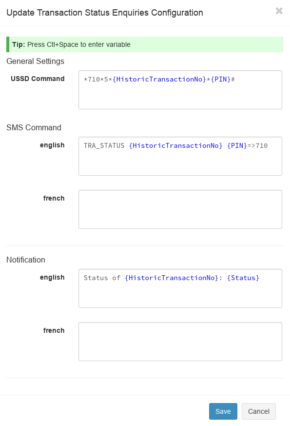

To configure the USSD command used to perform Transaction Status
Enquiries, the USSD short code as well as an optional sub-code should be
specified. There must also be provision for the requestor’s PIN variable
to authorise the transaction as well as the transaction number of the
transaction being queried variable in any sequence. The USSD code and
optional sub-code must be specified as the first part of the command.
The USSD command must start with an asterisk (\*) and end with a hash
sign (\#). Variables should be separated from each other and the USSD
short code by asterisks (\*). Examples of valid USSD command
configurations are:

-   -   

The SMS command must start with the word TRA\_STATUS followed by the PIN
and historic transaction number variables in any sequence separated by
spaces. The SMS command must end in the application terminating SMS
number the command should be sent to, preceded by ⇒. Examples of valid
SMS command configurations are:

-   -   

Enter the wording of the notification sent in response to the
Transaction Status Enquiry in both English and French. Should you wish
to show the content of an available variable in the notification
message, press the Ctrl key and the space bar simultaneously. This will
result in a drop-down list showing the variables that can be displayed
to appear. Click on the variable you wish to display - this will be
inserted into the notification at the current cursor position.  
Once the all desired settings have been entered or modified, click

to accept the values as displayed or else click

to retain the prior values without change. The pop-up window disappears
and the Transaction Status Enquiries Configuration page reappears,
showing the settings as they are configured.

Configure Transfers Settings
----------------------------

Transfer Transactions are used to transfer credit from the Root Account
to Wholesaler accounts and from one Wholesaler account to another
subject to Transfer Rules. Both USSD and SMS commands to effect a
Transfer as well as notifications related to Transfers can be
configured.  
To configure or modify any of these, click

in the ECDS menu bar displayed on the left of the page, and then on
.
The Transfers Configuration page appears:

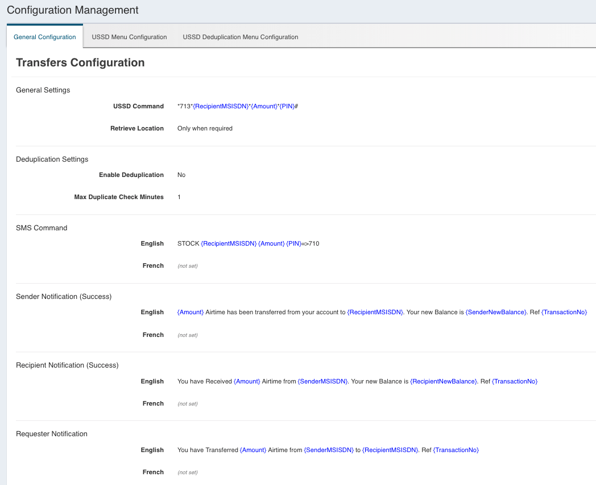

This page contains three tab sheets, one for **General Settings**, one
for **USSD Confirmation Menu** and one for **USSD Deduplication
Confirmation Menu**.  

### General Settings

Under the **General Settings** tab the following information can be
managed:

<table>
<colgroup>
<col style="width: 50%" />
<col style="width: 50%" />
</colgroup>
<tbody>
<tr class="odd">
<td>
<strong>Parameter</strong>
</td>
<td>
<strong>Definition</strong>
</td>
</tr>
<tr class="even">
<td>
USSD Command Syntax
</td>
<td>
The USSD Short code and syntax for Transfers
</td>
</tr>
<tr class="odd">
<td>
Retrieve Location
</td>
<td>
Indicate whether to retrieve agent location information on all transactions, or only when it is specifically required, due to some Area constraint on the Agent or Transfer rule.
</td>
</tr>
<tr class="even">
<td>
De-duplication enable/disable
</td>
<td>
Crediverse ECDS can be configured to verify transactions which appear to be duplicates, i.e. where the same amount of Airtime was Transferred to the same Agent within a defined time window, the system can be configured to confirm the transaction before proceeding.
</td>
</tr>
<tr class="odd">
<td>
Max duplicate check minutes
</td>
<td>
The time window during which to check for potential duplicate transactions.
</td>
</tr>
<tr class="even">
<td>
SMS Command Syntax
</td>
<td>
The SMS Short code and syntax for Transfers
</td>
</tr>
<tr class="odd">
<td>
Sender Notification (Success)
</td>
<td>
SMS sent to Sender on completion of successful transaction.
</td>
</tr>
<tr class="even">
<td>
Recipient Notification (Success)
</td>
<td>
SMS sent to Recipient (Subscriber) on completion of successful transaction.
</td>
</tr>
<tr class="odd">
<td>
Requester Notification
</td>
<td>
SMS sent to the Requester, when the Requester is not the Sender. For example, where the Transfer is performed from the Agent Portal or the Admin Portal on behalf of an Agent.
</td>
</tr>
</tbody>
</table>

> **Tip**
>
> For both USSD and SMS commands, words enclosed in curly braces {}
> represent variables in the ECDS system. Any string entered in the
> corresponding position in the command will be used as the value of
> that variable in ECDS.  

**Variables to be supplied in the USSD and SMS commands are:**  

-   -   -   

The USSD command must start with an asterisk (\*) and end with a hash
sign (\#). Every variable should be separated from the next by an
asterisk. Examples of valid USSD command configurations are:

-   -   

The SMS command must start with the word STOCK followed by the variables
needed, namely the amount, the PIN and the recipient’s mobile phone
number in any order separated by spaces. The SMS command must end in the
application terminating SMS number the command should be sent to,
preceded by ⇒. Examples of valid SMS command configurations are:

-   -   

> **Note**
>
> For notifications, sections of the notification message enclosed in
> curly braces {} represent variables in ECDS and will be replaced in
> the message with the actual value of that variable.  

**Variables available for display in both the Sender and Recipient
Notifications are:**  

-   -   -   -   -   -   

To initially configure or later modify any of the above, click

near the top right of the Transfers Configuration page. The Update
Transfers Configuration pop-up window appears:

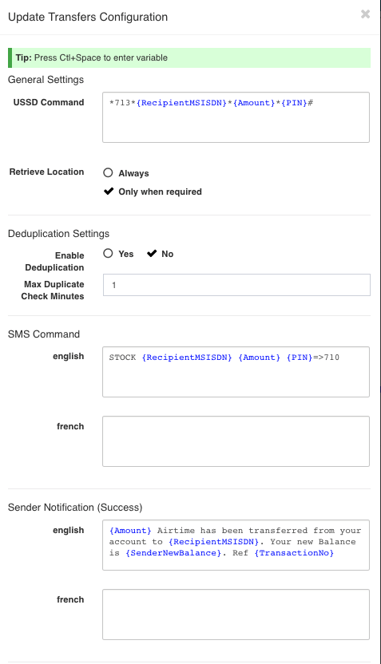

> **Important**
>
> Once the all desired settings for Transfers have been entered or
> modified, click
> 
> to accept the values as displayed or else click
> 
> to retain the prior values without change. The pop-up window
> disappears and the Transfers Configuration page reappears, showing the
> settings as they are configured.

### USSD Menu Confirmation

Selecting the **USSD Menu Confirmation** tab will present a screen
similar to the following:

From here, the USSD Menu dialogue and messages can be configured in
multiple languages. To edit the text, simply click on the

and to turn off a USSD menu item, slide the

control.

### USSD De-duplication Menu Confirmation

Selecting the **USSD De-duplication Menu Confirmation** tab will present
a screen similar to the following:

From here, the USSD De-duplication dialogue and messages can be
configured in multiple languages. To edit the text, simply click on the

and to turn off a USSD menu item, slide the

control.

Configure USSD Menu
-------------------

Crediverse ECDS has a comprehensive USSD Menu which encompasses all
actions which may be performed with Single Shot USSD short codes, but
within an interactive USSD menu dialogue.

The following actions are supported in the Crediverse ECDS Menu:  

-   Perform Bundle Sales

-   Perform PIN registration

-   Perform Airtime Sales

-   Perform Transfer

-   Perform Balance Enquiry

-   Perform Self Topup

-   Perform Transaction query

-   Perform Sales Query

-   Perform Last Transaction query

-   Perform Deposits query

-   Perform PIN change

To configure or modify the USSD Menu text, menu items or USSD dialogue,
click

in the ECDS menu bar displayed on the left of the page, and then on
.
The USSD Menu Configuration page appears:

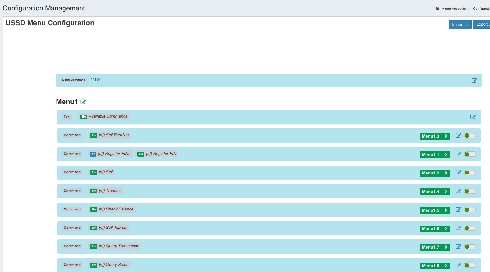

From here, the short code which is used to access the USSD Menu may be
configured as well as each of the USSD sub Menu dialogues and
messages.  
To edit a menu item, simply click on the

and to turn off a USSD menu item, such that it will not be presented in
the USSD dialogue, slide the

control.  
To follow a USSD Sub Menu dialogue, click on the sub menu button, for
example:
,
this will take you to the next screen of the dialogue, which will
appears similar to the following:

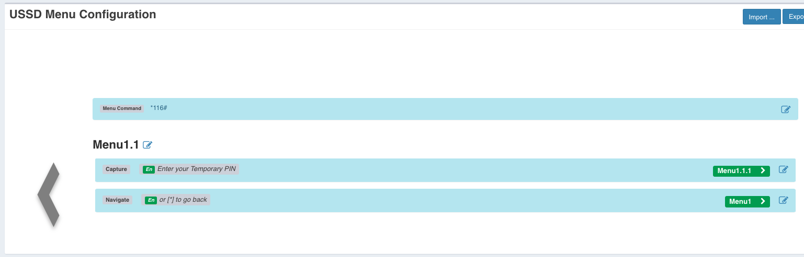

To move back again, click on the left Arrow
,
and you will be presented with the preceding screen.  

To re-order a Menu item, simple click on the menu item and drag it into
position

Configure Web Users Settings
----------------------------

The length restrictions on a Web User’s PIN or Password and the
notification a new Web User receives to inform them of their PIN upon
registration or when a PIN code is changed, can be configured under the
Web User Configuration settings.  
To configure or modify these settings, click

in the ECDS menu bar displayed on the left of the page, and then on
.
The Web Users Configuration page appears:  

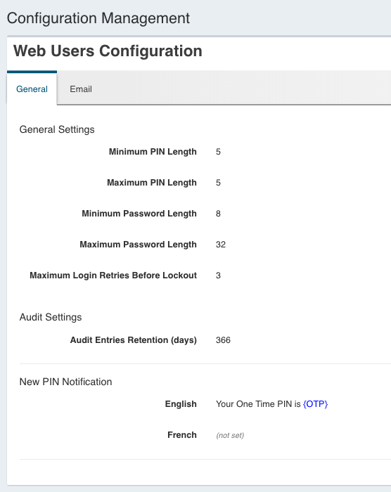

To initially configure or later modify these settings, click

near the top right of the Web User Configuration page. The Update Web
User Configuration pop-up window appears:

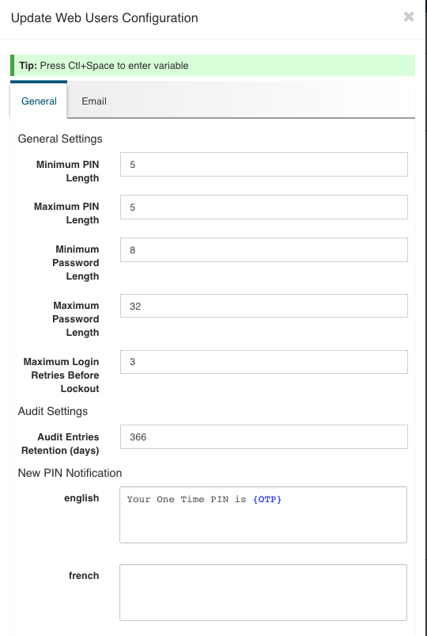

The following parameters may be adjusted here:

-   The minimum and maximum lengths allowed for Web User PIN.  

-   The minimum and maximum lengths allowed for Web User Password.  

-   The Maximum number of failed login attempts before the Wed User is
    locked out  

-   The Number of days to retain audit entries for web Users  

-   The PIN notification SMS message sent to new web users or web users
    which have changed or reset their PIN/Password.  

The variables available for display in the new PIN notification are:

-   -   

Once entered or modified, click

to accept the values as displayed or else click

to retain the prior values without change. The pop-up window disappears
and the Web Users Configuration page reappears, showing the settings as
they are configured.

Configure Workflows Settings
----------------------------

Workflow Tasks are used for offline transaction approvals for
transactions requiring co-authorisation from another web user with
suitable permissions. (See [Tasks](#_tasks_) for more information)  
In this Screen, parameters related to task retention, notifications and
several variable strings which are inserted into notifications may be
configured.  
To configure or modify workflow settings, click

in the ECDS menu bar displayed on the left of the page, and then on
.
The Workflow Configuration page appears:  

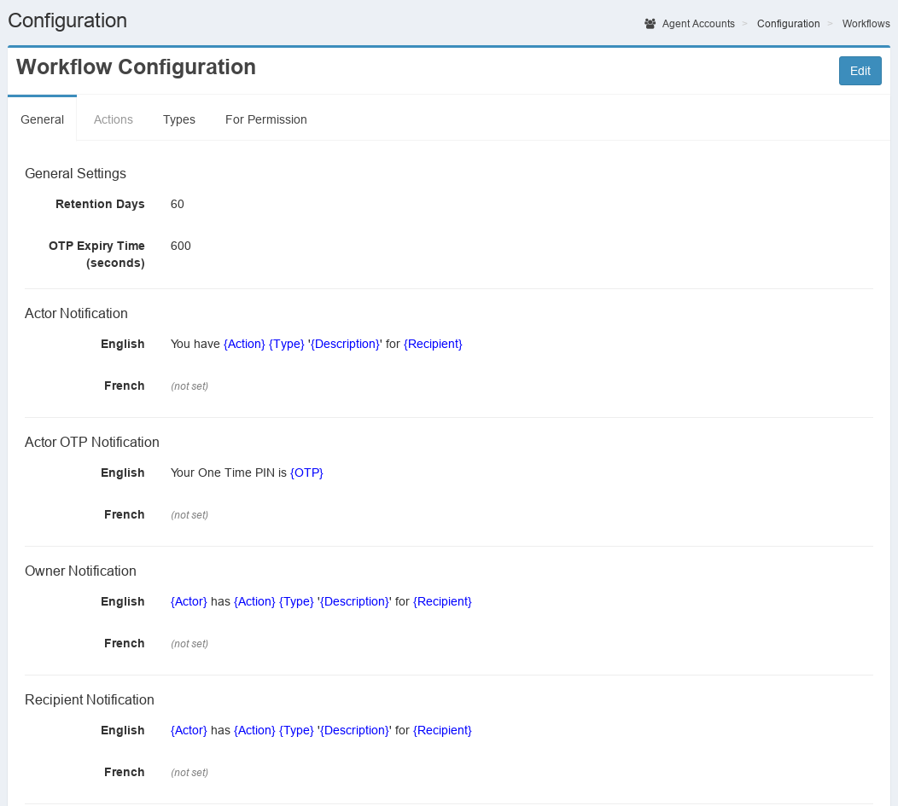

This page contains four tab sheets, one for **General Settings**, one
for **Actions**, **Types** and one for **Recipients**.  
The latter three tab sheets are for variables text which is substituted
in Notifications when Workflow Tasks are created or Actioned.

To initially configure or later modify these settings, click

near the top right of the Workflow Configuration page. The Update
Workflow Configuration pop-up window appears:

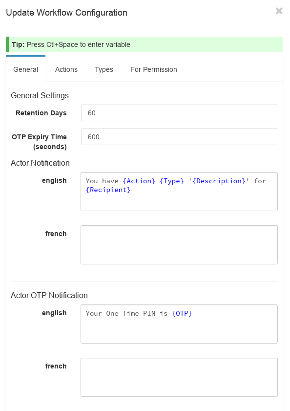

### General Settings

Under the **General Settings** tab the following information can be
managed:

<table>
<colgroup>
<col style="width: 50%" />
<col style="width: 50%" />
</colgroup>
<tbody>
<tr class="odd">
<td>
<strong>Parameter</strong>
</td>
<td>
<strong>Definition</strong>
</td>
</tr>
<tr class="even">
<td>
Retention Days
</td>
<td>
The number of days which a Workflow Tasks will remain active before being deleted by the system
</td>
</tr>
<tr class="odd">
<td>
OTP Expiry Time
</td>
<td>
The time in seconds for the OTP which is sent to the co-authoriser to remain validity
</td>
</tr>
<tr class="even">
<td>
Actor Notification
</td>
<td>
The Actor is the person or persons which are expected to Act on the Workflow Tasks request
</td>
</tr>
<tr class="odd">
<td>
Actor OTP Notification
</td>
<td>
This is the OTP message sent to the Actor which is in the process of authorising the Workflow Task
</td>
</tr>
<tr class="even">
<td>
Owner Notification
</td>
<td>
The Owner is the initiator of the Workflow Task and this represents the notification which will be sent to the owner
</td>
</tr>
<tr class="odd">
<td>
Recipient Notification
</td>
<td>
The Recipient is the Agent on which the Workflow Task or Action was performed, for example, where a Transaction is Reversed, the Recipient is the Agent whose transaction was reversed
</td>
</tr>
</tbody>
</table>

> **Note**
>
> For notifications, sections of the notification message enclosed in
> curly braces {} represent variables in ECDS and will be replaced in
> the message with the actual value of that variable.  

**Variables available for display in both the Sender and Recipient
Notifications are:**  

-   -   -   -   -   

### Actions

Under the **Actions** tab the following key words which are inserted
into notifications for workflow items may be defined:

-   Declined Indicates that the Workflow Task has been declined

-   Failed Indicates that the Workflow Task has failed to complete

-   Completed Indicates that the Workflow Task has been completed

-   Created Indicates that the Workflow Task has been created

-   Placed on Hold Indicates that the Workflow Task has been placed on
    hold, pending some further action

-   Cancelled Indicates that the Workflow Task has been cancelled by the
    requestor

-   In Progress Indicates that the Workflow Task is in progress

### Types

Under the **Types** tab the following key words which are inserted into
notifications for workflow items may be defined:

-   Transaction Indicates that the Workflow Task is a Transaction

-   Approval Indicates that the Workflow Task is an Approval

-   Scheduled Report Indicates that the Workflow Task is a Scheduled
    Report

-   Reversal Indicates that the Workflow Task is a Reversal request

### Recipients

Under the **Recipients** tab the following key words which are inserted
into notifications for workflow items may be defined:

-   Recipients Indicates the target audience for the Workflow Task
    request, for example, "Web Users with the required permissions"

> **Note**
>
> The variables defined in *Actions*, *Types* and *Recipients* are
> replaced into the Notifications configured under the *General Section*
> at the time of the transaction.  

> **Important**
>
> Once the all desired settings for Workflow have been entered or
> modified, click
> 
> to accept the values as displayed or else click
> 
> to retain the prior values without change. The pop-up window
> disappears and the Workflow Configuration page reappears, showing the
> settings as they are configured.
