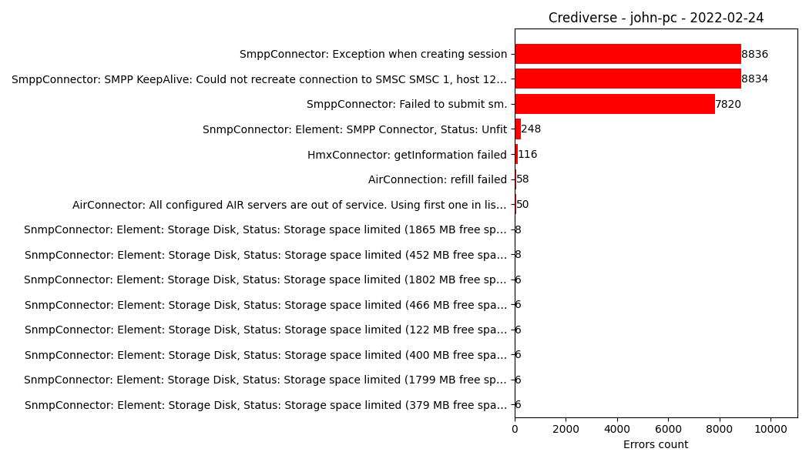

## Description
`crediverse_errors_report.py` is a Python script which parse all files 
with errors for a particular day (by default yesterday) and counts 
errors and generates report. The report consists of two files:
 - crediverse_\<hostname\>_\<yesterday\>.log_report.gz
 - crediverse_\<hostname\>_\<yesterday\>.log_report.png

Report then is sent to defined email addresses. See [Configuration](#configuration).



## Installation
The script is packaged as Docker image. To use it you must include the 
following lines to your docker-compose.yml:

```
chart_filecrediverse-errors-report:
  image: "registry.gitlab.com/csys/products/ecds/crediverse-errors-report:1"
  restart: unless-stopped
  container_name: crediverse-errors-report
  hostname: crediverse-errors-report
  volumes:
    - /srv/logs/ecds-ts-server/errors_report_properties.yml:/usr/src/app/errors_report_properties.yml:ro
    - /srv/logs/ecds-ts-server:/var/opt/cs/c4u/log
    - /etc/localtime:/etc/localtime:ro
    - /etc/hostname:/etc/hostname:ro
```

Where:
 - `errors_report_properties.yml` is the script configuration file.
 - `/var/opt/cs/c4u/log` is the directory with Crediverse logs.

## Configuration
Here is an example `errors_report_properties.yml` file:
```
log_dir: "/var/opt/cs/c4u/log"
run_at: "03:00"
sender_email: "trayan.momkov@concurrent.systems"
smtp_server: "localhost"
smtp_port: 25
recipients:
  - trayan.momkov@concurrent.systems
  - christene.wessels@concurrent.systems
```
Where:
 - `log_dir` is the directory containing Crediverse errors log files.
 - `run_at` is the time when the script will run every day.
 - `sender_email` is the email from which the report will be sent.
 - `smtp_server` is the SMTP server.
 - `smtp_port` is the SMTP port.
 - `recipients` is a list with email addresses to which the report will 
   be sent.

The script reads the configuration file every time it runs.
This means that if you make a change it will be automatically in force.
The only exception is the `run_at`. If you change that value you have to
restart the Docker container.

_Be aware that Docker uses inode on files mapping and if you delete the 
file and create it again changes will not take effect in the container
until restart._